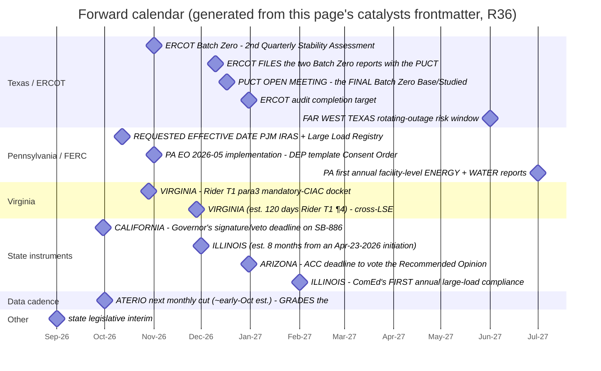
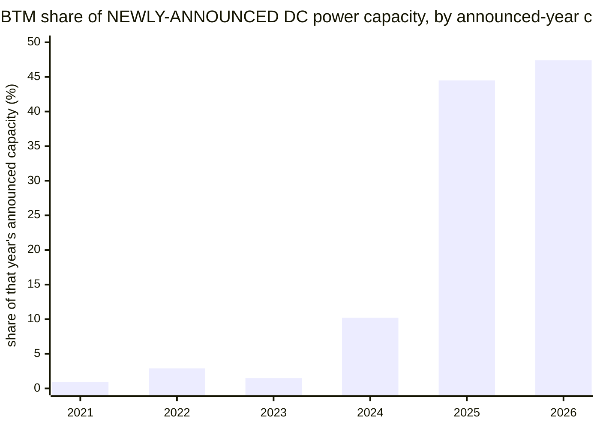
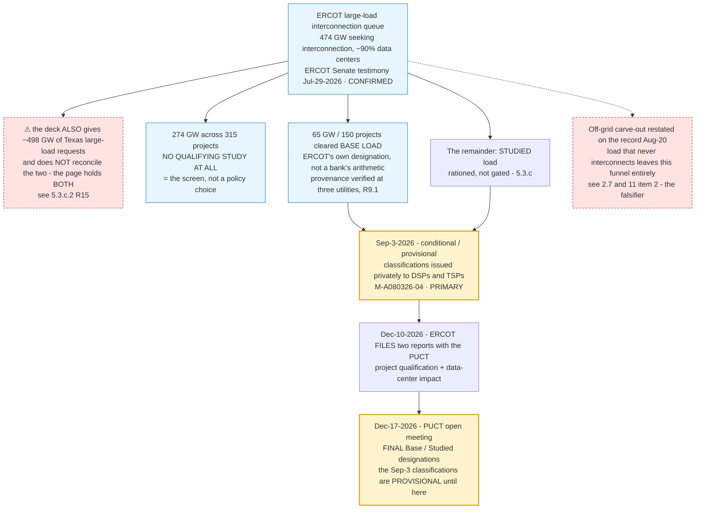

# 美国数据中心建设：地理、容量与政策

学习手册 · 报告 v2.18 · 2026-09-14

本课程含 5 章、27 节、20 个术语。先按章节学习，再使用地图、州专题与原文章节查证。功率示例默认 100 MW × 1 小时 = 100 MWh，时长范围 1–24 小时。

本课不记录学习笔记或答题进度，刷新后教学示例与答案恢复默认；网址中的章节定位保留。源报告是固定快照，不能当作实时政策状态。

## 第 1 章 · 从一座机房开始：容量究竟在说什么

读这份报告，不需要先懂电力市场。先想象一座装满服务器的建筑：它要完成计算任务，就必须持续获得电力，并把设备产生的热量带走。报告追踪的，正是这些建筑与配套设施从计划走向实际运行的过程。

读完这一章，你能解释 MW、GW 和三个建设阶段，也能完整读出一个容量数字的含义。

### 1.1 为什么研究数据中心，却一直在讲电力？

数据中心不是一块可以随处放置的芯片，而是一套共同工作的设施：服务器进行计算，网络传输数据，供电系统保证设备运行，冷却系统把热量排出去。买到服务器，只解决了其中一部分问题。项目还需要合适的场地、接电条件和相关许可，才能真正提供计算服务。

想象一家企业要新建一座大型机房。企业可以很早就宣布计划，但当地电力系统能否承受这项新增需求、什么时候能够接电、配套设施由谁支付，未必已经确定。因此，这份报告把“哪里有人想建”与“哪里已经建成”分开，也把电力与政策放在同一张研究地图里。

这份报告主要回答三件事：建设集中在哪里，项目走到了哪一步，以及当地制度怎样影响建设与成本。它并不直接计算每座机房能训练多大的模型。先理解这个研究范围，就知道后面的数字应该用来回答什么问题。

依据：§2.1、§5.0。

### 1.2 先认识单位：MW、GW 与电量

吉瓦（GW）和兆瓦（MW）都是功率单位，1 GW 等于 1,000 MW。这里的功率描述用电需求或供电能力的规模，可以先把它理解为设备运行时对电力系统提出的“同时用电要求”。它不同于累计用了多少电。

电量还需要乘上时间。一个纯教学例子：如果设施以 100 MW 的恒定功率运行 1 小时，就消耗 100 MWh 的电量；同样功率运行 10 小时，是 1,000 MWh。下面可以改变时长，看功率不变时电量如何变化。

容量不是实际用电记录。写着“100 MW 容量”，不表示设施已经运行，也不表示它每小时都恰好使用 100 MW。读到数字时，先找清楚：它描述规划、建设还是运行，衡量的是数据中心负荷还是发电设备。

依据：§2.1、§6。

### 1.3 一项建设计划，会经过哪些状态？

公告（Pipeline）表示项目计划已经对外披露。在这个阶段，可以知道有人想在某地建设多大规模的设施，但不能仅凭公告判断土地、客户、电力和融资是否都已落实。

在建（Under construction）表示建设已经推进到施工阶段。与公告相比，它更接近实际设施，但距离投运仍可能有剩余工程、调试或接电环节。运行（Active）则是报告对已经建成并运行容量的描述。

这些状态帮助我们区分承诺程度，但不是保证每个项目都会依次通过的流水线。有些项目会延期、调整规模或撤回；不同数据库对边界也可能有不同定义。因此，比较数字时，应尽量使用同一来源和同一日期。

依据：§2.1。

### 1.4 把全国三个数字读成完整句子

报告在 2026 年 9 月 4 日的截面列出：公告容量 391.5 GW，在建容量 71.7 GW，运行容量 52.4 GW。更完整的读法是：“在 Aterio 这一次数据截面中，被归入公告状态的项目，总容量为 391.5 GW。”来源、日期、阶段和单位，都属于这句话。

下图让你比较三个状态的规模。长的公告柱表明计划规模大；较短的在建与运行柱提醒我们，从建设意向到真实供给之间还有过程。它没有告诉你某一批公告最终有多少能够兑现。

依据：§2.0、§2.1。

### 1.5 为什么不能直接用这张图计算兑现率？

可以用学校作类比：今年在校生人数与今年新报名人数，来自不同届的学生。拿两者相除，并不能得到今年报名者的毕业率。同样，今天运行的机房，可能多年前就已公告；今天新公告的项目，则尚未经历完整建设周期。

如果要计算某批项目的兑现情况，需要先固定一组项目，例如“2023 年公告的全部项目”，再跟踪它们之后的状态变化。这叫追踪同一批次。报告中的三根柱是同一时点不同项目的状态存量，分子与分母并非同一批项目的前后状态。

到这里，你已经可以带着四个问题读数字：谁统计的、截至哪一天、属于哪个阶段、单位是什么。下一章保持这四个条件不变，把全国数字拆到州，看看建设的地理分布。

依据：§2.1、§2.4。

**理解练习**：某条新闻说“一家公司计划建设 2 GW 数据中心”。你目前最有把握知道什么？

1. 这些机房已经消耗 2 GW 电力
2. 公司披露了建设规模，还需确认建设与接电状态
3. 未来运行容量必然增加 2 GW

答案：2。公告提供建设意向和规模。是否开工、何时接电、实际负荷是多少，需要其他证据；不能从“计划”直接跳到“已经运行”。

## 第 2 章 · 把容量放回地图：为什么是这些州

上一章区分了公告、在建和运行。这一章把同样的三个状态放到地图上。我们先学会读排名，再讨论报告为什么把 Virginia、Texas 和内陆州连成一条主线。

读完这一章，你能区分既有集群与新增计划，知道州界和电网边界不是一回事，并能独立使用容量地图。

### 2.1 选址是一组条件的组合

一座数据中心落在某地，意味着计算设备、场地、电力和建设条件要在那里同时成立。已有机房集群可能已经形成供电、网络和服务配套；新的大型项目则需要找到能承接新增需求的场地与基础设施。一个地方适合过去的建设，不代表它对下一轮增量同样宽裕。

从研究角度，可以先把选址理解为几个问题：在哪里能建设足够大的设施，什么时候能获得所需电力，客户与网络服务是否合适，以及地方政府和社区是否接受。报告没有为每个州计算统一的选址评分，所以不要把容量排名读成“综合吸引力排名”。

地图首先告诉你结果分布：项目集中在哪里。至于为何集中，还需要结合发起方、电网和政策证据。把观察到的分布与对原因的解释分开，是理解这份报告的重要习惯。

依据：§2.2、§5.1、§5.2。

### 2.2 同一个国家，为什么需要三张地图？

运行容量的地图描述已形成的基础：哪些州今天拥有较多已经运行的数据中心。在建地图更接近正在落实的建设活动。公告地图则展示未来意向的分布，其中还包含较多不确定性。

报告的同一截面里，Virginia 的运行容量为 12.6 GW，约占全国运行容量的 24%；Texas 的在建容量为 16.8 GW，约占全国在建容量的 23%；Texas 的公告容量为 108.4 GW，约占全国公告容量的 28%。这些百分比的分母随阶段变化。

这组差异是“既有重心”和“增量意向”不完全相同的证据。它不是说 Virginia 的机房在搬到 Texas，也不是说运行、在建、公告三张地图是同一批设施的连续照片。

依据：§2.2、§5.2。

### 2.3 怎样理解“向内陆扩展”？

报告在公告榜单中看到 Utah 排名第三、West Virginia 排名第六。这让读者注意到，新的规划不只围绕传统的运行容量大州出现。这里的“扩展”，描述的是建设意向的地理范围与重心。

但一个州的名次，也可能被少数超大项目显著影响。报告在 Utah 案例里讨论开发商大型园区与落地条件，就是为了防止读者把很高的公告排名直接理解成同等规模的成熟产业基础。

因此，看到一个新州进入榜单后，可以继续追问：是很多项目共同增长，还是少数项目把总量抬高？这些项目处在什么阶段，谁在推动？这会自然引出下一章的项目落地问题。

依据：§2.2、§2.4、§5.3.b。

### 2.4 两张排名不同的地图，也可能都正确

源报告新增的 Epoch AI 样本，帮助我们再认识一个概念：统计范围。Aterio 的运行容量覆盖较广泛的数据中心；Epoch 则挑选前沿 AI 集群。两者即使都用 GW，也不代表它们在数同一组设施。

在报告采用的 2026 年 9 月 11 日 Epoch 截面中，美国样本有 75 个站点，当前功率合计约 12.1 GW。按能够解析出州的位置记录排名，Ohio 领先；Aterio 的 9 月 4 日全部运行容量榜单，则是 Virginia 领先。这里的差别来自样本与口径，不能把其中一个排名当作另一个排名出错。

Epoch 还给记录标注 confident、ungraded 等置信标签。可以把它理解为来源对记录把握程度的说明；标签没有评级，不等于项目不存在。比较两个数字前，现在除了阶段、日期和单位，还要加问一句：“它们统计的是哪些对象？”

依据：§3、§3.1、§3.2、§6。

### 2.5 州是行政地图，电网是另一张地图

报告会从州名切换到 ERCOT、PJM 等名称。它们属于电网运行与协调的视角，而不是另一组州名。一个项目在哪个州，和它连接哪个电力系统，是两个相关但不同的问题。

这种区分在 Texas 特别重要。报告中的 El Paso Electric 费率属于非 ERCOT 服务区。如果只看到“Texas 有两项获批费率”，就把条款套到整个 ERCOT，会把制度适用范围扩大。

初学时不需要背下所有电网区域。遇到某个项目或政策，只要记得补问：“这由哪家电力公司服务，哪个机构处理接网，规则适用于哪类客户？”州百科可以提供研究入口，具体适用性仍要回到条款。

依据：§2.3、§4.8。

### 2.6 带着一个明确任务打开地图

现在可以打开容量地图，先选择“运行”，找到 Virginia；再选择“公告”，找到 Texas 和 Utah。注意两件事：每次切换，比较的是不同阶段；全国总量也随之改变。

地图只收录报告列出的各阶段前十名。灰色表示本版没有该州这一阶段的数值，不表示那里没有数据中心。颜色分档在三个阶段保持一致，具体值则由排名表和选中州的详情给出。

完成这个观察后，试着用一句话描述你看到的变化，并把推断单独放在第二句话里。例如：“运行容量由 Virginia 领先，在建与公告由 Texas 领先”是数据观察；“建设重心正在扩展”是报告基于这些结构差异形成的解释。

依据：§2.2。

**理解练习**：Utah 的公告排名很高，能直接推出什么？

1. 它已经拥有同样高排名的运行容量
2. 该截面里，Utah 的已公告项目总容量排名靠前
3. 这些项目最终全部能够建成

答案：2。排名描述特定阶段的总量。要判断成熟程度与未来供给，还需要看项目构成、建设状态和实际进展。

## 第 3 章 · 从计划到投运：逐步判断项目能否落地

地图告诉我们计划在哪里，接下来要问计划有多实在。这里不是给每个项目随意打一个分，而是建立证据顺序：先识别阶段，再找需求与执行主体，最后核对电力和建设进展。

读完这一章，你能分清项目发起方、客户、模型估计与实际状态，知道还缺什么证据。

### 3.1 谁在建设，谁会使用，谁来供电？

同一个项目里，宣布建设的人、拥有设施的人、实际使用算力的人，以及提供电力的人，可能是不同主体。初读报告时，如果把这些角色当成同一个“数据中心公司”，就容易高估一条公告提供的信息。

超大规模云服务商可能为自己的业务建设机房。托管商则向客户提供空间、电力和相关设施服务。开发商可能先规划园区，再寻找客户或合作方。角色差异能提示需要核查的问题，但不能替代逐项目判断。

例如，一家开发商公布一个大型园区，至少还要问客户是谁、需求承诺到哪一步、资金与建设由谁负责。即使企业名称很熟悉，也还要区分它是在表达意向、签署协议，还是已经开始运营。

依据：§2.4。

### 3.2 把一个大数字拆成三组问题

第一组是阶段证据：已经公告、已经开工、已经获准送电，还是已经实际用电？这些措辞互相不能替换。“研究通过”可能离实际投运还隔着建设和调试。

第二组是需求与执行证据：有没有明确租户或自用需求，发起方是谁，承诺是规划还是已签约安排？报告引用的发起方构成比较，正是提醒我们公告样本和运行样本的组成并不相同。

第三组是交付条件：项目需要哪些电网研究，配套输电或供电能否按时到位，许可与场地还有什么条件？这些环节共同影响项目从纸面走向实际运行的速度。下列顺序是阅读清单，不是可以直接乘算的概率模型。

依据：§2.4、§5.3.c。

### 3.3 用 Utah 理解“大公告”与“已落地”的距离

报告在 Utah 的讨论中，把州总量与开发商园区联系起来：在较早的 2026 年 7 月 31 日数据里，O’Leary Ventures 与 Joule Capital Partners 的大型公告是重要组成。这些具体项目帮助读者从抽象的州排名，走到发起方和执行条件。

这个案例要教会的不是“开发商项目都不可信”，而是“州排名背后的项目构成值得检查”。如果大部分公告集中在少数超大园区，那么项目规模调整、用水、接网或客户落实情况，都可能对州总量产生较大影响。

这里特意保留案例的历史日期：它用于解释研究方法，不能把 7 月的项目份额直接套到 9 月的州总量上。看案例时，问它帮助理解了哪种机制；看当前快照时，再使用对应日期的数据。

依据：§2.4、§5.3.b。

### 3.4 “可信建设”“有研究资格”“正在用电”是三个问题

报告引用了一项卖方概率模型，用它估计一组项目里哪些更可能建设。模型把阶段、租户、发起方和州因素纳入判断。模型结果提供一个分析视角，但仍然包含研究者的假设，不是已经发生的建设量。

电网运营机构的研究资格，则是另一种证据：它描述项目有没有满足特定程序或技术材料要求。实际用电数据更靠近运行状态，但又有自己的统计范围和时点。三者分别回答“我们怎样估计”“项目通过了哪些条件”“目前发生了什么”。

所以，报告里的 33% 可信建设、约 13% 研究资格与历史约 2.7% 实际用电，不能放进同一个平均数。这些数字只有带着样本、时间和定义，才具有可解释性。

依据：§2.4、§5.1.a。

### 3.5 用缺失的问题，而不是一个分数，完成判断

假设你看到三个消息：A 园区宣布规划 200 MW；B 园区已开始建设 200 MW；C 园区的 200 MW 设施已运行。这是虚构的教学例子。它们数字相同，却提供了不同的证据强度。

对 A，优先问客户与建设、电力安排；对 B，继续问剩余工程和接电时点；对 C，则可以进一步查实际使用情况及后续扩建。你不需要假装知道每个项目的兑现概率，也已经能做出更有价值的区分。

读到这里，地理排名已经变成一组可以追踪的项目。下一章加入另一组参与者：监管机构、电力公司和当地居民，理解为什么建设需求越大，成本由谁承担就越重要。

依据：§2.4。

**理解练习**：某项目“研究资格已满足”，但没有开工或用电记录。最稳妥的表述是？

1. 项目已经投运
2. 已满足报告所述研究条件，后续建设与送电仍需确认
3. 可以按全部公告容量计入当前实际用电

答案：2。研究资格是一项具体进展，不是所有后续环节的代名词。明确已经发生什么、还不知道什么，比跳到投运结论更有用。

## 第 4 章 · 跟着一笔基础设施费用，理解政策

前面一直在看“谁想建、能不能建成”。现在换一个视角：如果一个大型用户需要扩建电力设施，这笔钱由谁承担？从这个问题出发，费率、担保、长期合同和政策摩擦就能连在一起。

读完这一章，你能解释成本分摊的动机，区分准入与付费规则，并知道如何读一条具体政策。

### 4.1 为什么居民会关心一座新机房？

先用一个简化场景理解：某项目需要新增供电能力，电力公司为服务它投资设施。如果项目按计划长期使用，设施成本就有机会通过服务收入回收；如果项目迟迟不来、使用规模不足或提前退出，成本仍可能已经发生。

这就引出分配问题：由提出新增需求的大客户承担，还是可能通过某些安排转到其他用户？报告把这一问题称为成本分摊或用户保护的重要动机。这里的重点是成本归属，不是认定每个项目都会推高居民电价。

报告也讨论用水、噪声、土地与地方接受度。对投资者来说可能只是一个项目，对附近居民来说却是持续使用本地资源的设施。理解这些不同参与者，才容易理解为什么同一项目会获得建设支持，也同时面临附加条件。

依据：§4.5、§4.6、§4.8。

### 4.2 最低账单、担保和建设费用分别解决什么？

最低账单让客户即使用量较低，也可能按照合同或费率规定承担一定账单。它试图降低“设施已经按需求建好，客户却没有使用到预期规模”的收入风险。具体基数可能涉及计费需求等条款，不能把一个百分比直接当成全部电费的统一算法。

担保或保证金更关注支付和履约风险：在需要客户承担义务时，是否有足够的财务保障。建设费用分担则把部分基础设施费用直接交由客户承担。长期合约和提前终止条款，进一步处理设施投资期与客户使用期不一致的问题。

这些工具可以同时存在，但各自承担不同作用。读 电力费率与服务条款时，不要只找一个电价数字；还要看最低付费义务、合约期限、退出条件和适用门槛。

依据：§4.7、§4.8。

### 4.3 允许建设，与要求自己付费，可以同时成立

如果某地暂停许可或限制选址，它直接影响项目能在哪里、什么时候推进。如果某地要求大客户支付其新增需求引起的成本，它改变的是项目的义务与经济条件。这两类措施都可能产生摩擦，但不是同一个政策动作。

报告的核心判断是：在所研究的案例里，很多制度更像是在调整成本责任，而不是一概停止建设。理解这一点后，看到“限制性法案”标签时，就不会立刻把它翻译成“全州禁止数据中心”。

例如，报告中的 Georgia 既有未通过的州级暂停法案，也有大负荷合同审查机制。把前者的政治标签和后者的实际制度分开，才能理解项目面对的真实问题。

依据：§4.1、§4.2、§4.8、§5.1。

### 4.4 州支持建设，为什么县市仍可能叫停？

一个项目不仅位于某个州，也位于具体的县市和地块。州级支持回答不了所有地方问题：用地是否允许、是否需要额外审批，以及当地是否暂停某类项目，都可能影响现场能否开工。新源报告的 §4.9 把这些原先分散的地方措施集中到了一起。

例如，报告中的 Texas 在州级层面支持建设，但还记载 Hill County 暂停措施，以及 Fort Worth 的临时暂停与审批条例。Virginia 的 Loudoun 和 Prince William 则被描述为要求特殊用途许可：项目需要经过酌情审批，不能只依据原有用地许可条件直接推进。

这不是看到一个县的限制，就把整个州涂成“禁止”；也不是看到州级支持，就忽略项目所在地。正确的查阅顺序是：州级框架 → 电力服务区域 → 县市及地块条件。新章节把已证实的地方案例和全国调查分开，案例表并不代表已经普查每一个地方。

依据：§4.9、§4.0。

### 4.5 用四个字段读懂一条政策

第一，谁制定和执行？可能是州议会、监管委员会、电网运营机构，也可能是某家电力公司的服务规则。第二，约束谁？要看服务区域、客户类别和规模门槛，不要默认全州每个项目都适用。

第三，处在什么状态？提出、通过、获批与生效是不同事件。报告中的 Dominion GS-5 已获批，但注明 2027 年 1 月生效，就是为什么状态与日期要一起看。第四，具体要求是什么？最低账单、担保、建设费用与信息披露，不能用一枚“有政策”的标记代替。

报告使用的 DELTa 登记库提供查找线索，但数据库未列出，不等于现实中不存在。Louisiana 是报告举出的覆盖缺口案例。这说明查数据库时，既要读有记录的内容，也要知道它能覆盖哪些类型的制度。

依据：§4.8。

### 4.6 用 Texas 理解“推进速度”也可以被分配

Texas 的 Batch Zero 不是只给每个项目一个“通过 / 不通过”答案。按报告的解释，Base Load 可以依各自条件推进；Studied Load 则依赖批量研究完成，并可能获得少于原请求规模的负荷分配。

这意味着研究结论还可能改变项目的节奏与规模：某个项目并非完全被禁止，却不能立刻按照最初请求推进全部容量。报告因此强调“容量分配”这个视角，而不是简单地把行政暂停当成永久禁令。

到这里，政策与建设就连起来了：一项制度可能改变选址、成本、时点或可推进规模。下一章会问，如果项目换一种供能和连接方式，这些规则还能覆盖到哪里。

依据：§5.3.c。

**理解练习**：一个州鼓励建设，同时要求大客户提供担保。这两件事冲突吗？

1. 必然冲突，鼓励建设就不能附加条件
2. 不必然冲突，建设支持与成本、履约责任可以并存
3. 提供担保等同于全州禁建

答案：2。支持项目建设不意味着由其他用户承担全部风险。识别制度具体调整了什么，才能区分准入限制与成本责任。

## 第 5 章 · 加入另一条供电路径：怎样检验自己的判断

上一章解释了大客户怎样通过电力服务条款承担成本。现在把“必须通过同一种方式获得电力”这个隐含前提拿出来检查：如果设施配置表后电源，甚至完全不接公共电网，原来的分析需要怎样调整？

读完这一章，你能解释 BTM 与完全离网的区别，正确读出 47.4%，并写出一条可被证据修正的研究结论。

### 5.1 BTM 先描述供能位置，不自动证明已经离网

表后供能（Behind the meter）让我们把目光从公共电网移到用户侧的供能安排。对这份报告而言，重要问题是数据中心获得电力的路径是否发生变化，以及这种变化会影响哪些制度。

表后供能与完全离网不能直接画等号。一个项目可能仍需要备用电力、外送连接或其他电网服务。仅看到 BTM 标签，还不足以确定它与电力公司的全部关系；必须继续核对连接与服务安排。

即使设施不从公共电网取电，也不意味着建设不再有约束。报告提示，燃料、设备与许可等条件仍然重要。改变供能路径，只改变某些问题的作用方式，不会自动让所有建设条件消失。

依据：§2.7。

### 5.2 47.4% 的完整句子应该怎么说？

报告把公告容量按公告年份分组，再计算其中的 BTM 占比。2026 年这一组，在 9 月 4 日截面里的占比是 47.4%。正确的完整句子是：“这次数据截面中，2026 年公告的数据中心容量，约有 47.4% 被归入 BTM。”

下面的变化显示，近年的新增公告更频繁地包含表后供能安排。但它不是美国全部在运机房的供电结构，也不是 2026 年完整年度的最终统计。把年份批次与建设状态说出来，才能避免把计划说成事实。

依据：§2.7。

### 5.3 West Virginia 为什么是一个有用的案例？

报告在 West Virginia 同时观察到两条制度路径：连接电力系统的大客户面对相应费率安排；符合条件的项目还可以通过微电网区域制度获得另一种供能路径。理解这个案例，不需要假设所有项目都会选择同一条路。

同一个州可以一边要求接网客户承担成本，一边允许符合要求的项目采用不同供能安排。对研究者来说，问题就从“这个州有没有费率”推进到“哪些项目连接哪里，因而适用什么规则”。

这也是州地图之外还需要机制阅读的原因。一个颜色无法同时表达项目的供能方式、服务区域、法律条件和建设状态；地图提供入口，正文负责把这些关系解释清楚。

依据：§4.8、§2.7。

### 5.4 把结论写成可以检验的判断

报告认为费率与成本责任是影响建设的重要制度。这不是说它们永远对每个项目都同样重要，而是一个需要持续检查适用范围的判断。反证条件就是预先说明：看到什么证据时，我们应该重新审视它。

在这里，如果越来越多项目不仅公告采用 BTM，而且真正建成、完全不接公共电网，那么某些电网费率能覆盖的新增负荷范围就可能改变。但只有公告占比增长，还没有证明这条变化已经完成。

因此，需要继续跟踪项目是否建成、实际怎样连接、是否使用电网服务及哪些条款仍适用。研究不是不断寻找支持原结论的新闻，而是同时寻找可能改变结论的证据。

依据：§2.7、§11。

### 5.5 把五章连成一次完整的阅读

现在重新看一条“某州新增大型数据中心”的新闻。你可以先检查容量和阶段，再把项目放到州与电网区域里，接着识别发起方、客户及交付条件，然后查看成本与准入制度，最后核对供能和连接路径。每一步都解决前一步没有回答的问题。

读完后，一个完整判断可以包含三句话：目前确认了什么；这对建设地点、成本或进度可能意味着什么；还需要什么证据才能进一步确认。这样既能形成理解，也不会把缺失信息藏在一个看似精确的结论里。

接下来可以按兴趣进入州百科，或直接打开报告正文。中文讲解负责铺好理解路径，原文保留更细的证据、不同数据口径和修订记录。遇到不懂的概念，可以回到本章目录或搜索对应段落，不必重新读整份报告。

依据：§5.0、§6、§11。

**理解练习**：要检验“接网费率对新增建设很重要”，哪项证据比 BTM 公告数量更直接？

1. 更多项目使用了 BTM 这个标签
2. 已建成项目的实际接网方式，以及仍适用哪些电网服务条款
3. 把所有公告都视为已离网运行

答案：2。论点涉及实际制度覆盖范围。建成状态、连接方式与适用条款，比单独的公告标签更接近需要检验的机制。

## 术语速查

### 公告容量 · Pipeline

本报告用来指已公告的项目容量。它表示建设计划，不保证投产，也不是运行容量。

边界：不能把公告数直接写成未来确定供给。

来源：§2.1

### 运行容量 · Active

已建成并运行的数据中心容量，是报告对既有供给的阶段描述。

边界：与公告存量相比，不能直接得到同一批项目的兑现率。

来源：§2.1

### 在建容量 · Under construction

正在建设阶段的项目容量，比公告更接近实物建设，但仍不等于已经送电运行。

边界：在建也是状态存量，不是当期新增投资流量。

来源：§2.1

### 吉瓦 · GW

功率单位；1 GW = 1,000 MW。本报告用它衡量容量规模。

边界：GW 是功率，GWh 是电量；数据中心负荷容量与发电铭牌容量也要分开。

来源：§6

### 有功功率 / 视在功率 · MW / MVA

MW 与 MVA 不是同一指标。报告中特别强调 Utah 的制度门槛是 50 MVA。

边界：没有功率因数等必要信息时，不应直接把 MVA 改写为 MW。

来源：§4.8

### 得州主要电网的运营机构 · ERCOT

报告用它讨论 Texas 大负荷接网、研究与容量分配。

边界：Texas 并非所有地区都由 ERCOT 覆盖；El Paso Electric 的两项费率属于非 ERCOT 区域。

来源：§5.3.c

### 跨州区域电网运营机构 · PJM

报告涉及 Virginia 与中大西洋地区建设时的重要电网视角，也涉及 Pennsylvania 的大负荷监管程序。

边界：电网区域和州边界不是同一层级。

来源：§2.3

### 区域输电组织 / 独立系统运营机构 · RTO / ISO

以电网区域组织电力系统运行与相关市场。报告用这一层观察接网与需求。

边界：不同 RTO 表格可能使用不同年份和分母，不能直接相加。

来源：§2.3

### 超大规模云服务商 · Hyperscaler

报告中的一类项目运营或发起方，包括主要云平台企业。

边界：发起方类别提供研究线索，不保证每个项目都会建成。

来源：§2.4

### 托管数据中心 · Colocation

向客户提供机房空间、电力及相关设施服务的运营模式，是报告的运营商分类之一。

边界：托管商在运行容量中占比高，不代表所有新增项目都无取消风险。

来源：§2.4

### 项目实际落地 · Materialization

计划逐步转为实际建设、送电与运行的过程。要同时核对阶段、发起方、租户和电力条件。

边界：模型中的可信度、研究资格和实际用电比例不是同一统计量。

来源：§2.4

### 电力费率与服务条款 · Tariff

这里指电力公司向适用客户提供服务的价格和条件，不是进口关税。

边界：必须核对电力公司、客户门槛、批准日与生效日。

来源：§4.8

### 最低账单 · Minimum bill

即使实际用量较低，客户也可能按合同或费率规则承担一定账单，以覆盖承诺的设施和服务成本。

边界：最低账单的基数和比例随条款而变，不能套一个统一百分比。

来源：§4.8

### 建设费用分担 · CIAC

Contributions in Aid of Construction，客户为服务其需求的基础设施建设分担费用的安排。

边界：它与最低账单、保证金和长期合约有关联，但不是同一件事。

来源：§4.7

### ERCOT 批量接网研究安排 · Batch Zero

报告描述的重点是分类与容量分配：Base Load 按项目条件推进，Studied Load 依赖批量研究。

边界：不是简单的“全部放行 / 全部禁止”；获配负荷可能低于请求值。

来源：§5.3.c

### 表后供能 · BTM

Behind the meter。报告讨论为数据中心安排的表后电源，并按公告年份观察其容量占比。

边界：表后不自动等于完全离网；仍可能涉及备用、外送和许可。

来源：§2.7

### 发电铭牌容量 · Nameplate

发电设备额定的功率规模。报告 BTM 州表使用供给侧铭牌容量。

边界：不能直接除以数据中心负荷侧的管线容量，得到所谓 BTM 占比。

来源：§2.7

### 大负荷电力费率登记库 · DELTa

报告用它整理电力公司费率及服务规则，并核对最低账单、担保和合约等字段。

边界：不是州法律清单；未收录或字段空白，不能证明制度不存在。

来源：§4.8

### 暂停或禁令 · Moratorium

暂时停止某类许可、建设或程序的措施。需要核对具体暂停对象、地域和法律状态。

边界：提出暂停法案不等于已实施；地方暂停也不等于全州禁止。

来源：§4.1

### 能推翻或削弱论点的条件 · Falsifier

研究中预先说明哪些观察结果会让一个判断需要修改。报告把不接网的负荷增长作为费率论点的边界。

边界：观察到 BTM 公告增长，不等于反证已经成立；还要检查建设与连接方式。

来源：§11

---

## 完整报告原文（保持原文）

---
title: US Data-Center Buildout Map — Geography, Capacity & State Policy
aliases:
  - US Data Center Buildout Map
  - US Data Center Geography
  - Data Centers by State
  - Data Center Moratoriums
  - Data Center State Policy Map
  - Where AI Data Centers Are Built
type: concept
status: living
version: v2.18
next_catalyst_date: 2026-09-30
tags:
  - data-center
  - ai-infrastructure
  - geography
  - buildout
  - pipeline
  - capacity
  - moratorium
  - nimby
  - state-policy
  - cost-allocation
  - regulation
  - hyperscaler
  - ercot
  - pjm
  - texas
  - virginia
  - utah
  - map
  - tracker
date: 2026-07-20
catalysts:
  - "2026-09+ — state legislative interim → 2027 sessions (esp. TX Gov. Abbott's DC agenda) (est.)"
  - "2026-09-30 — ★ CALIFORNIA: Governor's signature/veto deadline on SB-886 + AB-2383 (both passed Aug-31). Would require the CPUC to create a dedicated data-center tariff class → §4.2 R8"
  - "2026-10+ — ★ ATERIO next monthly cut (~early-Oct, est.): GRADES the R32 pre-registration — does the announced-GW run rate still read ~1%/mo after back-fill, or did Aug/Sep revise up as §6 n8 (c) predicts? → §2.5"
  - "2026-10-12 — ★ REQUESTED EFFECTIVE DATE, PJM IRAS + Large Load Registry (FERC ER26-3515-000). THE dated test — PA EO 2026-05 ¶3 is contingent on FERC accepting it. ER26-3380-000 runs alongside → §5.3.d.2"
  - "2026-10-29 — ★ VIRGINIA (est., 90 days from the Rider T1 Final Order ¶3, Case PUR-2026-00056): the separate docket for an amended line-extension policy carrying a MANDATORY CIAC on 'direct connect' transmission → §4.7"
  - "2026-11+ — PA EO 2026-05 implementation: DEP template Consent Order + public permitting map · DOR sales-tax guideline · DCED zoning/CBA practices — all undated in the EO → §5.3.d"
  - "2026-11-01 — ERCOT Batch Zero: 2nd Quarterly Stability Assessment — the venue for conditionally-included loads targeting 1Q27 energization → §5.3.c R9"
  - "2026-11-28 — VIRGINIA (est., 120 days, Rider T1 ¶4): cross-LSE symmetrical cost-assignment status with ODEC / the DOM-Zone EDCs via the FERC-filed MOAs → §4.7"
  - "2026-12 — ★ ILLINOIS (est., 8 months from an Apr-23-2026 initiation): the ICC's LDPAC investigation reports — its lead question is whether large loads warrant a SEPARATE TARIFF STRUCTURE, i.e. whether ComEd's deposit-only regime gains a minimum bill → §4.8 R31 (3)"
  - "2026-12-10 — ERCOT FILES the two Batch Zero reports with the PUCT (project qualification + data-center impact analysis) → §5.3.c R9"
  - "2026-12-17 — ★ PUCT OPEN MEETING: the FINAL Batch Zero Base/Studied designations. The Sep-3 conditional classifications are PROVISIONAL until then → §5.3.c"
  - "2026-12-31 — ★ ARIZONA: ACC deadline to vote the Recommended Opinion and Order in the APS rate case (E-01345A-25-0105), which carries the proposed XHLF modifications → §4.8 R31 (5)"
  - "2026-12-31 — ERCOT audit completion target (a stated plan, not a filed deadline — now superseded in precision by the Dec-10 / Dec-17 rows above) → §5.3.c"
  - "2027-02-01 — ILLINOIS: ComEd's FIRST annual large-load compliance report (all new-customer studies through CY2026), annually thereafter — a future PRIMARY dataset → §4.8 R31 (3)"
  - "2027-06-01 — ★ FAR WEST TEXAS rotating-outage risk window (est., 'as early as next summer') — Citi, off the Aug-19 Texas House hearing → §5.3.c.1"
  - "2027-07-01 — PA first annual facility-level ENERGY + WATER reports (Fiscal Code §1813-B, 12 fields incl. on-site generation MWh by source) — a future PRIMARY dataset → §5.3.d"
---

# US Data-Center Buildout Map — Geography, Capacity & State Policy — Concept Wiki

> **What this is —** the vault's **WHERE + WHO-CAN-BUILD** layer for the US data-center buildout: by state, (a) **capacity** — where the announced pipeline sits across three stages *(the GW figure is §2.0's and is not restated here)*, (b) the **named marquee AI clusters**, (c) the **regulatory posture** governing where capacity is *allowed*, and (d) **which states actually have a large-load cost-allocation instrument in force.** Siblings: [[Data Center Power Solutions]] (*how to power it*) · [[Data Center Energy Policy — Cost-Allocation, Off-Grid Mandates & Permitting]] (*who pays*). *→ §1.0 the call · §2 exposure · §4 regulatory · §5 synthesis (**start at §5.0**).*
> **Bottom line —** the buildout is **migrating VA → TX → inland** and **friction follows saturation** — but the sharper claim is what the friction *is*: **a distributional lever, not a supply brake.** On the only published attempt to price it, state policy is the **smallest** of four project-kill factors (§5.1.a). **The instrument that matters is the tariff, not the moratorium** (§11 #2): **7 of the top-10 pipeline states have one in force**, and every one of the ten ⛔ *restrictive-bills* states runs a cost-allocation regime while **none has a statewide construction ban** — the only live statewide pause, **NY EO-62**, sits in a different bin (§4.1 · §6 n7a). Texas is **safe harbor *and* #1 watch**: the Aug-3 pause is **rationing, not a ban** (§5.3.c). ⚠⚠ **And the claim now carries a stated falsifier — a tariff cannot bind a load that never interconnects:** BTM is **44.5% / 47.4%** of 2025 / 2026 newly-announced capacity and West Virginia has legislated the off-grid route outright (§2.7 · §4.3). **Not withdrawn** — Texas is 45% of national BTM while running the most developed regime. **Net effect = friction + geographic redistribution + a who-pays repricing — not a halt.** *Every conclusion pointed at its owner → §5.0.*
> **Status —** **v2.18** · R1–R44 · Sep 14 2026. **Standing invariant:** this page has **never re-binned a posture, re-cut a capacity figure or re-rated a node.** **Where it stands:** §4.1's bins are a **CLOSED Jul-10-2026 snapshot of a RETIRED feed** (§6 n7); the **live** axis is **§4.8 — the instrument register**, the 14 states holding the top-10 of under-construction ∪ pipeline GW on the **Sep-04-2026** roster, every cell sourced to **DELTa at the primary**, with the ✅ now **unpacked into DELTa's own fields** (§4.8 R37). ⚠ **DELTa carries TARIFFS, not statutes — never netted — and it UNDERSTATES in three proven ways** (coverage gap · status error · vintage floor), so a cell is evidence **FOR** an instrument, never against (§6 n7b). **§2 and §4.8 are DERIVED, not restated** (`us_dc_map_aterio_derive.py` · `us_dc_map_delta_derive.py`). *History is NOT kept here: §12 is the one-line index, full rows at [[US Data-Center Buildout Map — Source & Round Ledger]].*
> **Next catalyst:** **Sep 30 — CALIFORNIA, the Governor's signature/veto deadline on SB-886 + AB-2383** (§4.2). ⟳ **R38 — the rest of the calendar is not listed here:** all sixteen dated items, grouped by owner and with **December's five-event pile-up** visible, are at **§1.2**, drawn from the `catalysts:` frontmatter. *One date here, the shape there, the full wording in frontmatter — three surfaces, one source.*
> **Cross-vault:** [[Data Center Power Solutions]] · [[Data Center Energy Policy — Cost-Allocation, Off-Grid Mandates & Permitting]] · [[Hyperscaler Capex & Depreciation Monitor]] · [[AI Buildout — Demand Inflection & Pull-Forward Risk]] · [[Bloom Energy]] · [[Nebius Group (NBIS)]] · [[IREN]] · [[Vault Thesis & Assumption Register]] · [[2026 US Midterm Elections — AI-Sector Policy Risk]]

---

## §1. Executive summary

### §1.0 The bottom line — what this map concludes

*Present-tense conclusions only. **Every correction, superseded figure and round stamp that used to sit in these items is at §12 → the Ledger**; each claim below points at the section that owns its evidence.*

**1. The buildout is migrating VA → TX → inland, and the three stages read as a time-lapse of it.** *Active* (built and running) is **Virginia-dominated — 24% · 12.6 GW**, the legacy "Data Center Alley." *Under construction* (committed) is **Texas-led — 23% · 16.8 GW**. *Pipeline* (announced) is **Texas + inland — 28% · 108.4 GW**, with **Utah #3**, and **West Virginia re-entering at #6 on 21.2 GW**. The centre of gravity is leaving the coastal/PJM core for the ERCOT/inland frontier. → **§2.0 · §2.2**

**2. Regulatory friction follows saturation — it bites the established hubs, not the frontier.** Of the top-5 pipeline states, **Virginia and Georgia sit in the ⛔ bin — which measures *restrictive bills FILED*, not instruments in force**; Arizona is there too, at #9. Meanwhile the #1 destination and the risers — **Texas, Utah and West Virginia — are ✅ favorable**, and the frontier sits in the contested middle. ⚠ **The bin is not a ban count: all ten ⛔ states run a cost-allocation regime and none has a documented statewide construction ban**, and Georgia's statewide bills **FAILED**. → **§4.1 · §5.1**

**3. The regulatory action bifurcates — and which stream *passes* is the tell.** **Moratoriums are loud and mostly die**; the **only live statewide pause is New York's EO-62**. **Cost-allocation / ratepayer-protection laws quietly pass** — Oklahoma, California, **Arizona** and New Jersey signed, with California's SB-886 + AB-2383 at the Governor's desk. The durable lever is *make-them-pay*, not *ban*. → **§4.2 · §4.3**

**4. Net effect on the buildout: friction + redistribution, not a halt.** The **not-proceeding stock is 49.1 GW — 12.5% of pipeline** — and it grew **faster than the build stock** on the latest cut (+6.1 GW vs construction's +3.6), a signal **flagged and deliberately not priced**. The sized backlash brake is **~\$286B delayed-or-cancelled** against a **1–3bp GDP-growth ceiling**: *delay, not destruction*. → **§2.1 · §5.5**

**5. Texas is the safe harbor *and* the #1 watch.** At **28% of pipeline** it is where the marginal build concentrates, and it carries the highest stakes if friction escalates: **S.B. 6 in force**, **PUCT §25.194 at adoption**, Abbott's 2027 tax-exemption agenda, and one county moratorium. **The Aug-3-2026 interconnection pause is a RATIONING mechanism with a denial backstop — not a ban**, and it has held that classification for fourteen rounds. **The dated test ahead is Dec-17, when the PUCT issues the FINAL Batch Zero designations.** The buildout can route around New York; it cannot route around Texas. → **§5.3.c**

**6. ⚠⚠ The page's own central claim carries a stated falsifier — and it is measurable.** §11 #2 says the tariff is what binds. **But a tariff cannot bind a load that never interconnects**, and **BTM is 44.5% of 2025- and 47.4% of 2026-announced capacity**, up from ~1.5% in 2023 — with **West Virginia legislating the off-grid route outright** (§4.3's 12th class). **The claim is NOT withdrawn:** announced ≠ built, BTM skews to the worst-converting sponsor tier, and **Texas is 45% of national BTM while running the most developed large-load regime** — which cuts against a simple route-around reading. → **§2.7 · §11 #2**

**7. Own-vs-watch read.** *Confirms exposure for:* hyperscalers concentrating in the favorable frontier ([[Hyperscaler Capex & Depreciation Monitor]]), the **on-site-power** beneficiaries the migration + BTM shift favors ([[Bloom Energy]], gas/fuel-cell), and the ERCOT/inland grid names. *Flags watch items:* the Virginia/Georgia/Arizona restriction on *legacy* capacity; the **cost-allocation wave** compressing DC returns broadly, not just in ban states; and the **non-demand supply constraint** this represents — the regulatory/social-licence brake the [[Vault Thesis & Assumption Register]] carries as **A16**. → **§5.5**

### §1.1 The story in numbers

*The **live** cut only. ⚠ **Prior vintages are NOT reproduced here** — the frozen Jun-9-2026 Bernstein baseline and the Jul-31 Aterio cut are carried, dated and side-by-side, at **§2.1 and §2.2**, and are never netted against these figures (§6 n8).*

| Metric | Figure — **Aterio cut Sep-04-2026** | Owner |
|---|---|---|
| **Pipeline** (announced) | **391.5 GW** · 4,077 facilities | §2.0 · §2.1 |
| **Under construction** | **71.7 GW** · 814 | §2.1 |
| **Active** (operating) | **52.4 GW** · 2,086 | §2.1 |
| **Not-proceeding stock** | **49.1 GW = 12.5% of pipeline** — grew **+6.1 GW** vs construction's +3.6; ⚠ flagged, **not priced** | §2.1 |
| **Pipeline top states** | **TX 28% / 108.4 · VA 9% / 37.2 · UT 7% / 26.9 · GA 7% / 26.0 · PA 6% / 24.5 · WV 5% / 21.2** | §2.2 |
| **Under-construction top states** | **TX 23% / 16.8 · VA 13% / 9.0 · OH 6% / 4.5 · GA 6% / 4.2 · LA 4% / 3.2** | §2.2 |
| **Active top states** | **VA 24% / 12.6 · TX 12% / 6.3 · OR 8% / 4.1** | §2.2 |
| **Behind-the-meter share** | **44.5% (2025) · 47.4% (2026)** of newly-announced DC capacity — a *cohort-flow* basis, never chained to the frozen Apr-2026 stage-stock figure | §2.7 |
| **Dollar leg** — construction put in place | **\$75.2B SAAR**, +6.2% m/m, **+57% y/y** — accelerating, and it *disagrees* with the announcement series | §2.6 |
| **Named frontier AI clusters** (US) | **64 sites · 10.2 GW current · \$388B** | §3 *(a different universe from the pipeline — §6 n1)* |
| **Instrument register** | **14 states** holding the top-10 of UC ∪ pipeline GW; **7 of the top-10 pipeline states** have an instrument in force | §4.8 · §5.1 |
| **State posture — BILLS basis** *(closed Jul-10-2026 snapshot; feed RETIRED)* | **10 restrictive-bills · 8 advancing · 16 under discussion · 4 none · 8 incentive** | §4.1 · §6 n7 |
| **Public sentiment** | **71% oppose** a nearby data centre (24%→55% "strongly") | §4.5 |
| **Sized backlash brake + ceiling** | **~\$286B** delayed/cancelled (Data Center Watch) vs a **1–3bp** GDP-growth drag | §5.5 · §6 n6 |
| **Pipeline vs. built** | developers + undisclosed = **~63% of pipeline, ~2% of active**; hyperscalers + colos = **90% of active, ~25% of pipeline** | §2.4 |

### §1.2 ★ The forward calendar at a glance *(NEW R36 — the page's first diagram)*

*Sixteen dated catalysts run Sep-2026 → Jul-2027 and the `catalysts:` list is flat, so its **shape** is invisible: **December is a five-event pile-up** — ERCOT files its two Batch Zero reports (Dec-10), the PUCT issues the FINAL Base/Studied designations (Dec-17), and Arizona's ACC vote plus the §25.194 statutory deadline both land Dec-31. Grouped by the section that owns each item.*

> ⚠⚠ **THIS CHART IS GENERATED, NOT TYPED.** Every row is emitted from this page's own `catalysts:` frontmatter at round time — **the chart cannot disagree with the list it is drawn from**, and regenerating it is how it stays true. **A figure inside a diagram is invisible to the gate battery** (the battery reads prose and tables), which is precisely why this page's first diagram is derived rather than hand-drawn. *Dates, owners and the full wording live in `catalysts:` and at each §; nothing here is a new claim.* ⚠ *One label is hand-finished: the Oct-29 Virginia row, whose auto-extracted text truncated to a bare "VIRGINIA" — re-check it on any regeneration.*

### §1.c Contents at a glance

- **§2 — Exposure:** where the capacity is, by state, across three stages (the migration spine) + by RTO + the materialization / cancellation lens (§2.4). **⟳ R36: start at ★ §2.0 — the LIVE Sep-04 cut, ahead of §2.2's two frozen vintages.** **R7: + the monthly momentum series (§2.5) + the Census dollar leg (§2.6). ⟳ R32: + ★ the BEHIND-THE-METER layer (§2.7) — the source of §11 #2's stated falsifier, and absent from this list until R33.**
- **§3 — The named-cluster roster:** the marquee AI data centers (Epoch), by state and owner; the frontier-vs-legacy lens.
- **§4 — Regulatory:** the 50-state posture map + the 114-bill instrument taxonomy + the NY card + sentiment + the MS stakeholder typology (§4.6).
- **§4 — ★ NEW §4.9 (R43): THE LOCAL LAYER** — the county/municipal bans that actually bind, assembled by state; the layer §4.1's bills bins structurally cannot see.
- **§4 — the instrument layer beneath the buckets (§4.7, R16) and ★ §4.8 — THE INSTRUMENT REGISTER (R26): the 14 states carrying the top-10 of UC ∪ pipeline GW, every cell sourced at the DELTa primary** *(⟳ **R33** — two different "10 of 10" tallies were running together in this sentence and are now separated: **§4.1 R17 + the R19.2 P5 scan** finished at **10 of 10 ⛔ states carrying a cost-allocation instrument and NONE a statewide ban** (R20 relabelled the bins to say so); **§4.8's own 10-of-10** is a different claim — the top-10 *pipeline* states carrying ≥1 approved DELTa tariff.)*
- **§5 — Synthesis:** ⟳ **start at §5.0 (R18) — the section's conclusions in one table, with every claim pointed at its owner.** Then: exposure × policy — the inverse correlation, "restriction follows saturation," the TX pivot (+ the rural-greenfield refinement, §5.1), the **Utah friction card (§5.3.b, R3)**, and the sized non-demand brake with its ceiling (§5.5).
- **§6 — Caveats · §7 — Sources · §8 — Cross-references · §11 — META · §12 — Audit index** *(the full R-round trail lives at [[US Data-Center Buildout Map — Source & Round Ledger]], split out at R22)*.

---

## §2. The exposure map — where the capacity is

*The analytical spine. **R7 (Sep-3-2026): the spine now runs on Aterio's free-tier monthly workbook (Jul-31-2026 cut, `_Staging_Raw/202604_AI DC/DataCenter_Aug2026/`) + the Census C30 data-center line; every R7 figure below is derived by `_scripts/us_dc_map_aterio_derive.py` — re-run it on the next cut and diff, never retype. The Bernstein/Aterio June-2026 tracker (Jun-9 cut, dated 9 Jul) is the frozen baseline column.** The national funnel is [[Data Center Power Solutions]]'s canonical home (BTM / lever / operator detail lives there); this page owns the **by-state** cut.*

### §2.0 ★ Where §2 stands — the LIVE cut, before the vintages *(NEW R36)*

> **Why this head exists.** §2.2 opens by calling its first table *"the single most important table on the page"* — and **that table is the frozen Jun-9-2026 baseline.** The live Sep-04 cut is the **third** table, forty-five lines further down. A reader who stops at the first one leaves with **TX 24% / 75 GW** against a live **TX 28% / 108.4 GW** — a 33 GW error, and the wrong rank for Utah, Georgia, Pennsylvania and West Virginia. The vintage tables are **correct and deliberately frozen** (House Rules §3); what was wrong is the **order** a reader meets them in. This head fixes the order without touching the record.

| Stage — **live cut Sep-04-2026** | GW (facilities) | Top 3 | Frozen vintages also on this page |
|---|---|---|---|
| **Pipeline** (announced) | **391.5** (4,077) | **TX 28% · 108.4** · VA 9% · UT 7% | Jun-9 · Jul-31 (both §2.2) |
| **Under construction** | **71.7** (814) | **TX 23% · 16.8** · VA 13% · OH 6% | same |
| **Active** (operating) | **52.4** (2,086) | **VA 24% · 12.6** · TX 12% · OR 8% | membership unchanged 4 cuts running |
| **Not Approved / Withdrawn** | **39.6** (710) | — | ★ grew **+6.1 GW** vs construction's +3.6 (§2.1) |

| The other six lenses in §2 | Headline | Owned at |
|---|---|---|
| **RTO** — ⚠ three cuts, three denominators, never netted | PJM 29% *(pipeline)* · 16.2% *(intensity)* · ~35% *(2030 demand)* | §2.3 |
| **Materialization** — three brackets, never averaged | 33% credible *(model)* · ~13% study-qualified *(ERCOT)* · ~2.7% energizing *(retired)* | §2.4 |
| **Momentum** — announced-date basis, revises UP | +1.4% (Aug) → +0.2% (Sep, part) — **pre-registered, NOT adopted** | §2.5 |
| **Dollars** — the counter-series that disagrees | **\$75.2B SAAR, +6.2% m/m, +57% y/y — accelerating** | §2.6 |
| **BTM** — the falsifier | **47.4%** of 2026-announced capacity; **TX = 45% of national BTM** | §2.7 |

*All figures derived by `_scripts/us_dc_map_aterio_derive.py` from the Sep-04-2026 workbook — restated here, owned there. **No new claim; this head originates nothing.***

### §2.1 The national funnel (context)

| Stage | GW (Jun-9-26, Bernstein) | GW (Jul-31-26, Aterio free tier — R7) | Note |
|---|---|---|---|
| **Pipeline** (announced) | **337.9** | **357.6** (3,905 facilities; 30-d roster diff **+41.5**) | Jun: +4% M/M · +179% Y/Y · = 25% of US '25 power demand · Jul: +2.6% M/M on the announced-date series, +88% Y/Y (§2.5) |
| **Under construction** | **63.2** | **68.1** (807; 30-d **+5.5**) | Jun: flat M/M · +172% Y/Y · Jul: +81% Y/Y; the momentum series' UC stock was FLAT Apr–Jun (§2.5) |
| **Active** (operating) | **50.7** | **50.3** (2,050; 30-d **+1.2**) | hyperscalers 52% + colos 40% = 90%+ (Jun) · the Jun→Jul "decline" is a level difference between two bases, not a loss (§6 n8) |
| **Stranded** (cancelled/delayed/not-approved) | **38.2** | **45.2** not-proceeding stock (Not Approved/Withdrawn 33.5 · Delayed 8.9 · Land Bank 2.4 · Cancelled 0.4; 30-d **+4.6**) | Jun: **11% of pipeline · NIMBY-driven** · +4 GW M/M · ⚠ Jul: a DIFFERENT construct — a status stock whose Cancelled rows are PURGED (19 → 7 in 30 days), so it understates kills (§2.4 R7) |

**★★ R32 — the funnel at Sep-04-2026 (ROSTER; 7,785 rows, +294 on Jul-31).** *Five weeks, and the notable line is the last one.*

| Stage | Jul-31-26 | **Sep-04-26** | Δ |
|---|---|---|---|
| **Pipeline** (announced) | 357.6 (3,905) | **391.5** (4,077) | **+33.9 GW (+9.5%)** |
| **Under construction** | 68.1 (807) | **71.7** (814) | +3.6 |
| **Active** (operating) | 50.3 (2,050) | **52.4** (2,086) | +2.1 |
| **Not Approved / Withdrawn** | 33.5 (630) | **39.6** (710) | **+6.1 GW / +80 facilities** |
| Delayed | 8.9 (92) | 8.7 (88) | −0.2 |
| Cancelled | 0.4 (7) | 0.8 (10) | +0.4 |
| **Not-proceeding stock** | 42.8 (729) | **49.1** (808) | **+6.3** |

**★ The read: the REJECTION stock grew faster than the BUILD stock.** *Not Approved/Withdrawn* added **+6.1 GW** against construction's **+3.6 GW** — the first cut on this page where that is true. ⚠ **Flagged, not priced.** Three things it could be and this roster cannot separate: genuine refusals · a vendor re-classification sweep · the natural ageing of a pipeline that grew 9.5% in the same window. **No cancellation rate is computed and no GW is netted against any thesis** — the honest statement is that the stock moved and the cause is unread. Routed as a watch-item to [[AI Buildout — Demand Inflection & Pull-Forward Risk]], which owns the demand-inflection call; **this page does not make it.**

**~12 years to clear the pipeline** at the trailing build rate (Jan→Jun 2026: 11.9 → 12.6 → 11.3 → 10.2 → 10.1 → **11.8**). The binding constraint is throughput/permitting, not announcements. *(R7: Bernstein's years-to-clear gauge is NOT reproducible from the free tier — its "build rate" construct is undocumented — so the June reading is frozen. The free tier's own throughput read: activations +10.7 GW TTM to Jun-26 against 353.9 GW announced; §2.5.)* *(Full funnel, BTM, and cancellation detail: [[Data Center Power Solutions]] "DC Capacity Tracker".)*

### §2.2 ★ By state, three stages — the migration spine

The single most important table on the page. Read **left-to-right as a time-lapse**: *active* = what's built (the past), *under construction* = what's committed (the present), *pipeline* = what's announced (the future).

| Rank | **Active** (built, running) | **Under Construction** (committed) | **Pipeline** (announced) |
|---|---|---|---|
| 1 | **VA — 23% · 11.4 GW** | **TX — 22% · 14 GW** | **TX — 24% · 75 GW** |
| 2 | TX — 12% · 5.9 | VA — 14% · 9 | VA — 10% · 33 |
| 3 | OR — 8% · 3.9 | OH — 6% · 4 | **UT — 9% · 27** ★ |
| 4 | OH — 8% · 3.8 | GA — 6% · 4 | GA — 7% · 23 |
| 5 | AZ — 6% · 2.9 | **LA — 4% · 3** | OH — 6% · 19 |
| 6 | GA — 4% · 2.2 | MO — 4% · 2 | PA — 5% · 16 |
| 7 | IA — 4% · 2.0 | NV — 4% · 2 | IL — 4% · 13 |
| 8 | IL — 4% · 1.8 | AZ — 3% · 2 | AZ — 4% · 12 |
| 9 | CA — 3% · 1.7 | PA — 3% · 2 | NY — 3% · 9 |
| 10 | TN — 3% · 1.3 | MS — 3% · 2 | **WV — 3% · 9** ★ |

**The migration, in one read:** Virginia leads *active* (the legacy alley) but slips to #2 in construction and pipeline; **Texas leads both construction and pipeline** and is still the fastest riser (+2.8 GW in June); **Utah vaults to #3 in the pipeline** (from 5% to 9% in two months); and the newest capacity is landing even further inland — the biggest *June additions* were **TX 2.8 · KS 2.1 · MO 1.8 · UT 1.8 · GA 1.4 GW** (Indiana 1.3 is #6), with new *construction* starts largest in **MO / NC / GA / IL**. States that appear in construction but *not* the pipeline top-10 (LA, MO, NV, MS) are single-mega-campus states — e.g., **Louisiana = Meta Hyperion + Amazon**, a big project ≠ a structural hub (§3).

**★ R7 — the same table at Jul-31-2026 (Aterio free-tier roster; share of stage GW · GW).** *The June table above is the frozen Jun-9 Bernstein baseline (House Rules §3 — vintage rows never rewritten); read the two as a seven-week diff.*

| Rank | **Active** (built, running) | **Under Construction** (committed) | **Pipeline** (announced) |
|---|---|---|---|
| 1 | **VA — 23% · 11.7 GW** | **TX — 22% · 14.7 GW** | **TX — 26% · 93.9 GW** |
| 2 | TX — 12% · 6.0 | VA — 13% · 9.2 | VA — 10% · 36.8 |
| 3 | OR — 8% · 3.9 | OH — 7% · 4.6 | **GA — 7% · 26.8** ▲ |
| 4 | OH — 8% · 3.8 | GA — 6% · 4.4 | **UT — 7% · 25.9** ▼ |
| 5 | AZ — 6% · 2.9 | **PA — 4% · 3.1** ▲ | OH — 6% · 21.2 |
| 6 | GA — 4% · 2.3 | LA — 4% · 2.8 | PA — 5% · 18.0 |
| 7 | IA — 4% · 2.1 | MO — 3% · 2.4 | IL — 4% · 13.8 |
| 8 | IL — 3% · 1.8 | **IN — 3% · 2.3** ▲ | AZ — 4% · 12.6 |
| 9 | CA — 3% · 1.7 | NV — 3% · 2.2 | NY — 3% · 9.4 |
| 10 | TN — 3% · 1.3 | MS — 3% · 2.1 | **IN — 3% · 9.2** ▲ (WV out) |

**What moved in seven weeks (Jun-9 → Jul-31):** *Active* is unchanged to the percentage point — the same ten states in the same order — which is also the proof that the free tier is the tracker's own universe. *Under construction:* **Pennsylvania enters at #5 (3.1 GW)** and **Indiana at #8**, **Arizona drops out of the top-10**, and the single-mega-campus states (LA / MO / NV / MS) slide a rank each; Texas holds 22%. *Pipeline:* **Texas 24% → 26% (75 → 93.9 GW)** — the ERCOT hub is still the fastest absolute riser; **Utah drops from #3 to #4 because Georgia grew past it** (GA +4.1 GW in July on the announced-date series; Utah itself slipped ~1 GW, 27.0 → 25.9), so the R3 "Utah vault" is holding, not reversing; **Indiana replaces West Virginia at #10.** July's record-date roster adds by state: **TX 17.6 · GA 4.5 · KY 3.0 · VA 2.6 · PA 2.3 GW** (348 announcement rows touched, 36.5 GW) — June's inland-frontier read (KS / MO / UT) has rotated to **TX / GA / KY / PA**.

**★★ R32 — the same table at Sep-04-2026 (Aterio free-tier roster, 7,785 rows).** *The two tables above are frozen at their vintages (House Rules §3). Read all three as a **five-month** time-lapse: Jun-9 → Jul-31 → Sep-04.*

| Rank | **Active** (built, running) | **Under Construction** (committed) | **Pipeline** (announced) |
|---|---|---|---|
| 1 | **VA — 24% · 12.6 GW** | **TX — 23% · 16.8 GW** | **TX — 28% · 108.4 GW** |
| 2 | TX — 12% · 6.3 | VA — 13% · 9.0 | VA — 9% · 37.2 |
| 3 | OR — 8% · 4.1 | OH — 6% · 4.5 | UT — 7% · 26.9 |
| 4 | OH — 7% · 3.8 | GA — 6% · 4.2 | GA — 7% · 26.0 |
| 5 | AZ — 6% · 2.9 | **LA — 4% · 3.2** ▲ | **PA — 6% · 24.5** ▲ |
| 6 | GA — 4% · 2.3 | **IN — 4% · 2.8** ▲ | **WV — 5% · 21.2** ★★ *(re-entrant)* |
| 7 | IA — 4% · 2.1 | PA — 4% · 2.6 ▼ | OH — 4% · 17.4 ▼ |
| 8 | IL — 4% · 1.8 | MO — 3% · 2.4 | IL — 3% · 13.6 |
| 9 | CA — 3% · 1.7 | **AZ — 3% · 2.1** ▲ | AZ — 3% · 10.3 ▼ |
| 10 | TN — 3% · 1.3 | NV — 3% · 2.0 | NY — 2% · 9.7 *(IN out)* |

**What moved in five weeks (Jul-31 → Sep-04) — and two of the moves are DOWN, which this table has not shown before.**
- **★★ WEST VIRGINIA is the story: out of the top-10 at Jul-31, back at #6 with 21.2 GW.** Not a new entrant — a **re-entrant at more than double its Jun-9 level** (~9 GW, #10). §4.8 R32 examines it: the state legislated **microgrid districts** (HB 2014) and holds **12.9% of national BTM nameplate on four projects** (§2.7). **The pipeline arrived with its own power supply.**
- **⚠ OHIO −3.8 GW (21.2 → 17.4) and ARIZONA −2.3 GW (12.6 → 10.3) both FELL.** Announced pipeline is a *stock*, so a decline means records left the Announcement stage — to construction, or to *Not Approved/Withdrawn*, which grew **+6.1 GW** in the same window (§2.1). **Not attributed here** — the roster does not carry a reason code, and inferring one would be invention.
- **Texas +14.5 GW to 108.4** — the pipeline's first triple-digit state, and its share rises 26% → **28%**.
- **Pennsylvania +6.5 GW** into #5; **Indiana drops out** of the pipeline top-10 (NY takes #10) while *rising* to #6 in construction — the two stages disagree about Indiana.
- *Active* is again unchanged in membership and order — the fourth consecutive cut in which it is, which keeps confirming the free tier is the tracker's own universe.

### §2.3 By RTO — the grid-queue lens

**ERCOT (Texas) and PJM (Virginia/Mid-Atlantic) dominate.** Of the 222 GW of RTO-allocated pipeline, **PJM ≈ 29% and ERCOT ≈ 24%**; of capacity *under construction*, **ERCOT (14 GW) + PJM (17 GW) ≈ 50%**; of *active* capacity, **PJM ≈ 40%** (Virginia's legacy weight). Texas's grid-side pull runs even ahead of its 24% pipeline share — ERCOT's large-load interconnection queue is separately reported by ERCOT as among the nation's largest — though this Bernstein/Aterio tracker sizes *tracked pipeline*, not the raw queue. *(The grid / interconnection-speed / time-to-power detail is [[Data Center Power Solutions]]'s domain; the RTO cut here is the geographic proxy.)*

**R7 — a second RTO cut, from the free tier (Aterio "ISO vs Data Centers", Jul-31): active-stage DC capacity as a share of each ISO's average demand, both in MW as Aterio publishes them.** **PJM 18.1 GW / 107.5 GW = 16.9%** · CISO 7.2% · SPP 6.8% · **ERCOT 4.6 / 70.9 = 6.5%** · MISO 5.3% · NYISO 1.7% · ISO-NE 1.7%. *Stage inferred from magnitude (PJM's 18.1 GW ≈ the "PJM ≈ 40% of active" share above), not labelled by the source; the sheet's sub-zone rows carry the demand column on a different unit and are unusable. The read: PJM's active DC load is already ~17% of its average demand — 2.6× ERCOT's — which is the saturation the regulatory friction follows (§5.1).*

**★★ R9.3 — a THIRD RTO cut, and the only FORWARD one: GS's 2030 share of US data-center POWER DEMAND. MISO overtakes ERCOT for #2.** Carly Davenport (GS Americas Utilities), GS Communacopia **"Data Centers & Power" panel, Sep-10-2026** (room recording, reconciled; `_Staging_Raw/202609_GS_Communacopia/Transcript/20260910_…DataCentersPower_Singer_Davenport.txt`) — the forecast itself is the model behind the live **3.5% US power-demand CAGR** at [[Data Center Power Solutions]] §E.1 "Now" (R2.44).

| RTO | Today | **2030E** | The reasoning, in her words |
|---|---|---|---|
| **PJM** (Mid-Atlantic) | **~35%** | **~35% — holds** | *"the one piece that we don't think is changing."* **Merchant nuclear** data-centre buyers like, a **high-voltage transmission backbone**, and existing clusters. Two states carry it: **Virginia**, and **Ohio "emerging as a high-growth data center state."** |
| **MISO** (Minnesota→Louisiana) | *(4th–5th)* | **~16% — #2** | **The re-rank.** *"What's interesting about MISO is you have a lot of **regulated utilities that are actually building the power generation capacity** for these data centers **versus a developer doing it**, as you would see in a PJM or an ERCOT market."* Named states: **Wisconsin, Louisiana, Iowa.** |
| **ERCOT** (Texas) | **#2** | **~14% — #3** | Drops a place but *"we're still bullish on the growth opportunity there"* — **both front-of-the-meter and behind-the-meter**. |

**The causal claim is the valuable part, not the percentages.** Davenport's reason MISO wins is a **market-structure** argument the map has not carried: in a regulated market the utility is a **one-stop shop** — *"They have the relationships with the regulators. They have the relationships with the community. They can give you everything from the power plant to the transmission to the distribution. And you're working with **one counterparty**."* In a deregulated market the customer must transact twice (developer for generation, utility for interconnection). And the **affordability** lever only exists on the regulated side: *"the regulators have full control over what is being charged to customers at every point of the value chain. You don't have supply-demand dynamics necessarily driving pricing."* **If that holds, the binding variable for siting is shifting from *queue position* to *counterparty structure* — which is a different question from the one §2.3's first two cuts measure.**

> ⚠⚠ **THREE CUTS, THREE DENOMINATORS — DO NOT NET ANY PAIR OF THEM.**
> - **Bernstein (above): PJM ≈29% / ERCOT ≈24%** = share of the **222 GW RTO-allocated PIPELINE**, i.e. **announced capacity, today**.
> - **Aterio (R7): PJM 16.9% / ERCOT 6.5%** = active DC capacity as a share of **each ISO's own average demand** — a *within-ISO intensity* ratio, not a national share at all.
> - **GS (this cut): PJM 35% / MISO 16% / ERCOT 14%** = share of **US data-center POWER DEMAND, forecast to 2030**.
> **A pipeline share, an intensity ratio and a forward demand share are three different measurements. PJM reading 29% / 16.9% / 35% across them is not drift and not disagreement — it is three questions.** The apparent ERCOT collapse (24% → 6.5% → 14%) is the same artefact. *(Same discipline as the revenue-per-GW vs capex-per-GW split at [[AI Terminal Value — GMF Model Cross-Read & Rebuild Plan]] §6.9.g.)*
>
> ⚠ **The MISO re-rank is NOT corroborated here.** It is one desk's forecast, spoken, single-source. What would test it: MISO's own large-load queue disclosures, and whether the Wisconsin/Louisiana/Iowa regulated utilities' capex plans carry the generation MW the thesis requires. **The map's own §5.3.c ERCOT Batch-Zero series is the ERCOT-side control.** Logged as a forward claim, not folded into any capacity figure on this page.
>
> **⟳ R17 (2026-09-12) — THE FIRST NAMED TEST IS MET, AND IT SPLITS: the MECHANISM is corroborated at the primary, the SHARE is not.** The caveat above named two tests. The first — *"MISO's own large-load queue disclosures"* — is now answered twice over, and by the parties themselves:
> - **MISO's own resource-adequacy informational report** (FERC accession **20260720-5204**, canonical at [[Data Center Energy Policy — §206 Docket & Audit Ledger]] §10.A R3.8): a **4.7 GW shortfall by 2028** if planned retirements proceed — the stated premise of its **Expedited Resource Addition Study**, which has carried **40 projects / 19 GW** to final or near-final interconnection agreements and **filled all 50 LSE and 10 IPP slots**. MISO also proposes a **Large Load Parallel Study Process** for load **≥250 MW**, running load and generation studies **concurrently within 120 days** with generation nameplate capped at 150% of identified load need. ⇒ **MISO screens large load at 250 MW against SPP's 50 MW — a 5× threshold spread between neighbouring RTOs**, which is itself a siting variable this map had nowhere.
> - **★★ The Organization of MISO States** — the regional body of the state commissions, i.e. *the very institution Davenport's "regulated utilities" argument is about* — filed on that report (**accession 20260814-5198**, Aug-14-2026, **read in full**) and describes the mechanism in its own words: states *"remain primarily responsible for determining resource adequacy needs through utility oversight, resource planning, and retail regulatory processes, while MISO provides the regional planning, market rules, and capacity auction framework necessary to support those state decisions"*, and across the footprint commissions are *"implementing retail tariffs, **approving special contracts**, requiring resource adequacy demonstrations, establishing interruptible service requirements, and adopting statutory protections that prevent cost shifting from new large loads to existing customers."* It frames unprecedented large-load growth as a coordination challenge that **"do[es] not indicate a failure"** of the existing construct.
>
> **What this does and does not settle.** ✅ **The CAUSAL claim** — that a regulated, single-counterparty path to new load exists in MISO and its operators consider it durable — is **corroborated at the primary**, and *"approving special contracts"* is the exact instrument §4.7 R16's **Kentucky** row demonstrates (a 482 MW six-year take-or-pay cleared at the KY PSC with no statewide tariff). ❌ **The 16% 2030 share is NOT corroborated** — nothing here is a demand forecast, and OMS is an advocate for state authority, not a neutral scorer. **The flag is NARROWED, not cleared**, and the second named test (Wisconsin/Louisiana/Iowa utility generation capex) stays open. **No percentage, rank or capacity figure moves.**

### §2.4 ★ The materialization lens — who is in the pipeline vs. who actually builds

*The full Bernstein tracker (the R1 baseline built from screenshots) carries a second story the headline GW hide: the pipeline is dominated by **merchant developers + not-publicly-disclosed sponsors** — a cohort that has barely materialized as operating capacity — and cancellations are accelerating. This turns the "pipeline ≠ built" caveat (§6.4) from a hedge into a sized, sourced point.*

**Who owns the pipeline vs. what is actually running** (Bernstein Ex 18 vs Ex 70):

| Operator type | Share of **pipeline** | Share of **active** |
|---|---|---|
| **Developers** (merchant / spec) | **33%** | **1%** |
| **Not Disclosed** | **30%** | **1%** |
| Hyperscalers | 14% | **52%** |
| Colocation | 11% | 40% |
| Neoclouds | 5% | 2% |
| Crypto | 6% | 3% |

**~63% of the 337.9 GW pipeline is real-estate developers (33%) + not-publicly-disclosed sponsors (30%) — but that same cohort is barely ~2% of the 50.7 GW actually operating** (Ex 18 vs Ex 70). Hyperscalers + colocation, by contrast, are **90%+ of active capacity but only ~25% of the pipeline.** Bernstein defines "Not Disclosed" as projects whose developer *isn't publicly named* (Ex 55) — a disclosure state, not a build-probability verdict — so reading this 63% as lower-conviction supply is *our inference* from the operator mix plus the cancellation data below, not Bernstein's own label. Either way the **materialization gap is real and large**: it is the sharpest single reason the 337.9 GW headline overstates near-term *deliverable* supply, and it sits *underneath* the state distribution in §2.2 (a favorable state's pipeline rank can be inflated by announcements that never energize).

**Cancellations are accelerating** (Bernstein Ex 1 / 54-56): the **monthly cancellation rate jumped from 7% (May) to 29% (June)** — for behind-the-meter projects it hit **164%** (stranded additions exceeded new additions) — and total stranded capacity is **+355% Y/Y** (8.4 → 38.2 GW). By operator (Ex 55), stranded capacity is **Not Disclosed 41% + developers 23% + colocation 19% + hyperscalers 14%.** The revealing cut is *intensity* (stranded share ÷ pipeline share): **colocation is over-represented in cancellations** (19% of stranded vs 11% of pipeline) and **named developers under-represented** (23% vs 33%), with hyperscalers proportional (14% / 14%). So the honest read is **not** that cancellations spare the anchor tenants — colocation is itself an anchor operator (40% of active) and is the *most* cancellation-prone — but that the **not-disclosed + developer tier carries the bulk of stranded capacity** (64%) while named hyperscaler builds are stranded no worse than their share. *(National funnel / BTM detail is [[Data Center Power Solutions]]'s canonical home; this is the by-operator cut.)*

**R3 — the lens now has a NAMED instance: Utah's #3 rank and the Stratos Project are substantially the same story.** Utah's two-month pipeline vault (5% → 9%, ~27 GW) coincides with the **~9 GW Stratos campus** (Box Elder County; O'Leary Ventures-led via Utah's MIDA — the developer tier, not a hyperscaler) entering the announcement pipeline — i.e., **roughly a third of the #3 state's pipeline is one contested, twice-water-withdrawn, ~50%-scaled-back project** (arc → §5.3.b). ⚠ *Inference, flagged: Bernstein/Aterio name no projects in the PDF and the Aterio roster is not local, so the attribution rests on timing + magnitude, not a roster row.* Either way it is the concrete case of the warning above: a favorable state's pipeline rank inflated by an announcement that may never fully energize.

**★ R7 (Sep-3-2026) — the lens re-based on the free tier: what survives, what is retired, and what the roster now NAMES.** *(1) The operator mix survives in one number:* **"Company Not Disclosed" = 97.1 GW = 27.1% of the announced pipeline** at Jul-31 (Bernstein's 30% at Jun-9), and the **named hyperscalers (AWS 24.5 · Google 10.3 · Meta 5.8 · Microsoft 5.7 GW …) = 13.0%** (Bernstein's 14%) — the free tier has no provider-type field, so the "developers 33%" leg needs a hand-built map of the 195 announcement-stage providers (queued, §12). Next in line is the merchant tier the June read warned about: **Tract 17.4 · Joule Capital Partners 10.0 · SoftBank 10.0 · Nscale 8.0 · O'Leary Ventures 7.5 GW.** *(2) The cancellation-rate series is RETIRED at its June vintage.* The public roster is a status **stock**, not a flow: **Not Approved/Withdrawn 630 facilities / 33.5 GW · Delayed 92 / 8.9 · Land Bank 60 / 2.4 · Cancelled 7 / 0.4 = a 45.2 GW not-proceeding stock** (30-day deltas +78 / +8 / +6 / **−12** facilities; +3.6 / +1.7 / 0 / −0.6 GW). **Cancelled FELL from 19 to 7 in 30 days** — cancelled rows leave the public roster — so the stock understates kills and no monthly cancellation *rate* can be derived from it; Bernstein's 7% → 29% (Ex 1) stands as a June fact only, and the stock is a *different construct* from Bernstein's 38.2 GW "stranded" even though the magnitudes sit within ~20% (§6 n8). *(3) The R3 Utah inference is now a roster row.* **O'Leary Ventures = 60 "Wonder Valley Utah" buildings × 125 MW = 7.5 GW, all Announcement-stage, all Utah = 29% of Utah's 25.9 GW** — R3's "roughly a third of the #3 state's pipeline is one contested project" is CONFIRMED at the roster (⚠ still carried at 7.5 GW: the roster has NOT applied the ~50% scale-back §5.3.b records — watch whether the August cut does). And the row the page never had: **Joule Capital Partners = 10.0 GW, also Utah = 39% of the state** — Utah's pipeline is *two* developer-tier mega-campuses (68% between them), the materialization-gap thesis of this section in its purest form.

**★★★ R13 (2026-09-12) — the inference this section flagged as *ours* has been PUBLISHED by the same house, with the haircuts sized.** §2.4 has carried a careful fence since R1: reading the 63% developer + not-disclosed cohort as lower-conviction supply *"is **our inference** from the operator mix plus the cancellation data below, not Bernstein's own label."* Five weeks later Bernstein published the label. **"Data Center Pipeline Probabilities — Separating the credible developers from dudes with PowerPoints"** (Rezaei et al., **Jul-17-2026**; PDF read in full from this page's own staging folder) probability-weights **5,324** announced / land-banked / under-construction projects and reports: *"Of the 492GW of capacity currently in our dataset, we anticipate 33% (135GW) are credible builds."*

**The waterfall — and its ORDERING is the finding** (Ex 1, GW, North America): **492** dataset → **−51** operating today → **−31** cancelled → **−146 stage haircut** → **−84 tenant haircut** → **−35 developer/company haircut** → **−11 state haircut** → **135** forward credible pipeline. *(Identity checks: 492 − 51 − 31 − 146 − 84 − 35 − 11 = 134 ≈ 135 as printed.)* Bernstein's own ranking of them is explicit — the stage haircut is *"the most meaningful"*, the tenant haircut *"the next most pronounced"*, the sponsor haircut *"meaningful, though less so than the prior two"* — and state policy is last by a wide margin.

**What it discharges and what it does not.** It **discharges the attribution fence**: the stage and sponsor haircuts are now Bernstein's own, quantified — announced-only third-party-developer projects start at a **50%** base probability and land-banked ones at **25%**, against **98% / 90%** for a hyperscaler self-build under construction (Ex 4), which is this section's "developers 33% of pipeline vs 1% of active" gap expressed as a probability rather than a share. It does **not** retire the §2.4 tables: those are stage- and operator-*share* cuts on the Jul-31 free tier, a different construct from a Jun-vintage probability model. ⚠ **And it is a sell-side model, not a measurement** — every multiplier in it is a Bernstein judgement (the tenant scorecard runs from Google/AWS/Microsoft **1.00** down to BluSky AI **0.15**, with **OpenAI at 0.50**), so it is a second opinion on materialization, not evidence about it.

**★ One roster cross-check, and it cuts against the free tier.** Bernstein names the developer-tier case directly — *"Most notorious example = 15GW from O'Leary Ventures"* — and scores the company **0.35** (bottom-10). The Jul-31 free-tier roster R7 read carries **O'Leary Ventures at 7.5 GW**, all Utah, all announcement-stage. **The two differ by half**, on the single project R3 built its Utah inference on. Neither is retired here: the roster is a public-disclosure stock and Bernstein's is a paid dataset with land-bank rows the free tier omits (§6 n8) — but the §2.4 Utah thread should be read as **7.5 GW disclosed / up to ~15 GW claimed**, not one number.

**★★★ R15 (2026-09-12) — this lens now has an OPERATOR-RUN instance, and two of them, at different points on the funnel.** §2.4 measures materialization by *who sponsors* the pipeline. ERCOT measures it by *what survives its own evidentiary tests*, and the vault now holds both cuts:

1. **Study-qualification (Jul-28-2026, ERCOT's Senate testimony — CONFIRMED, §5.3.c.2 R15):** of ~498 GW of Texas large-load requests, **274 GW across 315 projects had no qualifying study at all**, 20 GW more was removed for a missing dynamic model, and only **65 GW / 150 projects** reached **base load**. **~13% of requested capacity is at advanced project maturity** on the operator's own test.
2. **Energisation (Jun-19-2026, ERCOT's monthly *Large Load Interconnection Status Update* — canonical at [[Data Center Power Solutions]] §4.10):** **8,927 MW approved to energize · 3,675 MW simultaneous monthly peak against ~140,000 MW of requests ≈ 2.7% actually drawing power** — and *falling* (9,042 / 3,801 at the Mar-13 instance). ⚠ **Folded as a frozen-vintage pointer, NOT a live series:** DCPS records it **RETIRED** (a census of the LLIS queue, which ERCOT closed Jul-10-2026; the successor instruments are Batch Zero classification + the Verification RFI). The number is not restated or updated here, and nothing is netted against §2.2.

**The two are not the same statistic and must not be averaged:** 13% is *"has a credible study,"* 2.7% is *"is consuming power today,"* and the gap between them is the build queue. Together they bracket this section's thesis from the one source that has no incentive to flatter the pipeline — **the grid operator's own filing cabinet** — and they sit either side of Bernstein's **33% credible** (§2.4 R13), which is a *model* of the same question on a national dataset.

### §2.5 ★ The momentum series — announced vs under construction vs active, monthly since 2021 (NEW R7)

*Aterio's free tier carries what the Bernstein PDF only charted: a 67-month × 51-state series of announced, under-construction and activated MW (`US Const Announced Momentum`). **Announced-date basis** — a project is credited to the month it was announced, so the trailing one to three months **revise UP** as late records arrive (July's +2.6% is not July's final number). National totals below; state cuts print from the §2 script.*

| Month | Announced GW (m/m) | Under construction GW | Active GW |
|---|---|---|---|
| 2021-01 | 5.1 | 3.4 | 19.4 |
| 2022-01 | 9.6 | 4.9 | 22.1 |
| 2023-01 | 19.3 | 6.7 | 25.6 |
| 2024-01 | 42.3 | 11.5 | 29.5 |
| 2025-01 | 105.8 | 26.8 | 35.9 |
| 2025-07 | 187.9 (+5.3%) | 40.1 | 40.4 |
| 2025-10 | 233.4 (+6.2%) | 51.4 | 42.8 |
| 2026-01 | 282.1 (+6.7%) | 60.8 | 44.4 |
| 2026-02 | 307.1 (+8.8%) | 64.5 | 45.4 |
| 2026-03 | 314.9 (+2.5%) | 68.7 | 46.1 |
| 2026-04 | 321.6 (+2.1%) | 71.3 | 46.6 |
| 2026-05 | 328.5 (+2.2%) | 72.4 | 48.3 |
| 2026-06 | 345.0 (+5.0%) | 71.4 | 50.1 |
| **2026-07** | **353.9 (+2.6%)** | **72.6** | *(not yet populated)* |

**Three reads.** *(1) The announcement froth has a run-rate, and it is ~3%/mo, not 4.* The page's "+4% M/M" (§1.1) was Bernstein's June print; on the announced-date series the monthly step ran **+2.1–2.6% in Mar / Apr / May / Jul with one +5.0% June** — TTM **+88%** (187.9 → 353.9 GW). Announcements still outpace physical builds, but the *acceleration* phase was Aug-25 → Feb-26 (four prints of +6–12%). *(2) Under construction stalled for a quarter.* 71.3 (Apr) → 72.4 → **71.4 (Jun)** → 72.6 (Jul): the UC stock was flat-to-down for three months while announcements added ~25 GW — the first flat quarter in the series (TTM still +81%). This is the physical-throughput read the delay narrative is really about, and it sits beside the §2.6 dollar series, which shows no such pause. *(3) Activations run ~11 GW/yr.* Active 39.4 → 50.1 GW (Jun-25 → Jun-26) = **+10.7 GW TTM**, against 353.9 GW announced — the free tier's own "years to clear" arithmetic (~33 years at this activation rate on the raw announced stock; Bernstein's ~12 uses an undocumented build-rate construct, §2.1). *By state at Jul-31 (announced-date):* announced **TX 93.1 · VA 35.6 · GA 27.0 · UT 27.0 · OH 19.9**; under construction **TX 15.1 · VA 10.9 · OH 5.2 · GA 4.2 · PA 3.1** — the two bases (§2.2 roster vs this series) differ by ~1–4% per state, which is the revision lag, not a discrepancy.

**★★ R32 (Sep-04 cut) — the announced-GW run rate has DECELERATED for three straight months, and the UC stock printed its first DECLINE.** On the momentum (announced-date) basis: **+5.9% (Jun) → +3.2% (Jul) → +1.4% (Aug) → +0.2% (Sep, part-month)**; under-construction stock **75.9 → 72.9 GW**. TTM is still strong — announced 234.5 → 385.4 GW (**+64%**), UC 48.5 → 72.9 (**+50%**).
- ⚠⚠ **DO NOT PRICE THIS, AND THE REASON IS IN THE SERIES' OWN DEFINITION.** This basis is **announced-date** and **back-fills as late records arrive**, so §6 n8 (c) has said since R7 that **the trailing 1–3 months REVISE UP.** August and September are exactly those months. A deceleration measured on the two most-revisable points is the one reading the series is *least* able to support.
- **What would make it real:** the same months still reading ~1% after two further cuts. **Pre-registered here so the next cut GRADES it rather than re-discovering it** — and recorded as a test, not a finding.
- ⚠ **And the dollar leg disagrees** (§2.6): Census C30 has data-centre construction put-in-place at **+6.2% m/m and +57% y/y**, accelerating. **Two series, opposite directions, different things measured** — announcements vs. concrete poured. Not netted.

### §2.6 ★ The dollar leg — Census C30 "Data center" construction put in place (NEW R7)

*The vault's first government-primary, monthly, free instrument for the buildout's PHYSICAL spend — the Census Bureau's Value of Construction Put in Place, private "Data center" line (a standalone category under Office). Owners of sampled projects report the value of work done each month (the CPRS survey). **Dollars, not GW** — keep it on its own basis; it cannot be netted against §2.1–§2.5. Released around the 1st of each month for the month two back; next release **Oct-1** (August data). Derived from `privsa.xlsx` / `privtime.xlsx` by the §2 script.*

| Series, \$M SAAR | Jul 2026p | Jun 2026r | May 2026r | Apr 2026 | Mar 2026 | Jul 2025 | % m/m | % y/y |
|---|---|---|---|---|---|---|---|---|
| **Data center** | **75,166** | 70,755 | 65,688 | 61,859 | 58,121 | 47,810 | **+6.2** | **+57.2** |
| Office (incl. DC) | 123,318 | 119,328 | 115,159 | 111,220 | 107,164 | 101,666 | +3.3 | +21.3 |
| Private nonresidential | 755,169 | 752,375 | 749,441 | 745,266 | 745,125 | 781,119 | +0.4 | −3.3 |
| Total private | 1,614,171 | 1,622,949 | 1,624,146 | 1,627,358 | 1,663,330 | 1,708,210 | −0.5 | −5.5 |

**Reads.** *(1) Physical spend is still ACCELERATING, not pausing:* \$75.2B SAAR in July, **+6.2% m/m on top of +7.7% in June**, +57% y/y; the not-seasonally-adjusted monthly value has risen **every month since February** (4,466 → 6,551 \$M), with y/y climbing from +18% (Apr) to **+59% (Jul)**. *(2) Data centers are now 61% of all private office construction and 10% of private non-residential* — against a private non-residential total that is −3.3% y/y and a total-private figure −5.5%: the data-center line is growing inside a shrinking private construction economy, which is where the "construction recession outside data centers" shows up in the same table. *(3) Held against §2.5:* the GW under-construction stock was flat Apr → Jul (71.3 → 72.6) while dollars put in place rose ~22% over the same months — consistent with **cost per MW rising and/or spend concentrating in fewer, larger sites**, not with a slowdown in work done. This is the cleanest available counter to the "half of 2026 is cancelled" headline (the claim SemiAnalysis rebutted from satellite data, Jun-18), and it is the instrument [[AI Buildout — Demand Inflection & Pull-Forward Risk]] §4.4's *delays-are-power-binding-not-demand-softening* claim should be graded on from here.

NSA monthly (\$M, y/y): Jul-25 4,133 · Aug 4,312 · Sep 4,430 · Oct 4,573 · Nov 4,326 · Dec 4,488 · Jan-26 4,477 (+25%) · Feb 4,466 (+26%) · Mar 4,781 (+26%) · Apr 5,198 (+18%) · May 5,627 (+37%) · Jun 6,122 (+53%) · **Jul 6,551 (+59%)**.

### §2.7 ★★★ R32 — THE BEHIND-THE-METER LAYER: the route around the instrument *(NEW — first available in the Sep-04-2026 cut)*

> **What this is and why it is here.** The Sep-04 workbook adds **eight sheets that did not exist in any prior cut**, all behind-the-meter. §7 has recorded BTM flags since R7 as paid-tier, *"out of reach"* — ⟳ **that is now corrected: the BTM layer arrived in the FREE tier, as AGGREGATES, not as per-project flags** (the roster gained **zero** new columns and lost two cosmetic ones). **This page takes only the BY-STATE geography** — its own franchise. **The mechanism layer — energy-source mix, developer economics, adoption drivers — routes to [[Data Center Power Solutions]]**, which §7 names as BTM's golden source, and is NOT built here (user call, R32).
> ⚠⚠ **TWO BASES, AND THEY MUST NEVER BE DIVIDED INTO EACH OTHER.** The state table is **GENERATION nameplate MW** (supply side); the cohort table is **data-centre power capacity MW** (load side). A state's BTM nameplate set against its pipeline GW mixes the two and is the MVA/MW trap in another costume (§4.8 R31 (8)). **Only the cohort share is a clean ratio** — one basis on both sides. *Share-vs-share across the two series is legitimate; GW-vs-GW is not.* **All figures derived: `_scripts/us_dc_map_aterio_derive.py` §2.7.**

**★★★ (1) BTM as a share of NEWLY-ANNOUNCED data-centre power capacity — the step change.**

| Announced year | 2021 | 2022 | 2023 | **2024** | **2025** | **2026** |
|---|---|---|---|---|---|---|
| **BTM share of announced capacity** | 0.9% | 2.9% | 1.5% | **10.2%** | **44.5%** | **47.4%** |
| *facilities BTM / total* | 1 / 100 | 5 / 160 | 4 / 341 | 89 / 1,058 | 700 / 2,390 | 427 / 1,462 |

**From ~1.5% to ~47% in three years.** On the 2026 cohort, **nearly half of newly-announced US data-centre capacity is being planned behind the meter.**

**★★★ (2) ⚠ THIS IS THE STRONGEST LIVE TENSION WITH §11 #2, AND IT IS RECORDED, NOT PRICED.** The page's sharpest claim is *"the instrument that matters is the tariff, not the moratorium"* — and R26–R31 built the §4.8 register on it. **But a tariff binds a customer who takes utility service. It cannot reach a load that never interconnects.** If the cohort share holds, **the instrument register governs a shrinking share of new capacity** — not because the instruments weakened, but because the load is routing around them.
- **What this does NOT do.** It does not refute §11 #2, and **no instrument verdict, bin or GW figure moves on it.** Announced ≠ built (the whole §2.4 materialization argument applies to BTM projects *more* strongly, not less — they are disproportionately **developer-sponsored**, the tier with the worst conversion). And a BTM project still needs gas, turbines, interconnection for export, and permits.
- **What it does do:** it names a **measurable** mechanism by which the page's central claim could decay, and gives it a series to watch. **§11 #2 stands; it now carries a stated falsifier.**

**★ R36 — the cohort series as a chart.** *Same numbers as the table above; the step-change is the point.*

> ⚠ **One basis, both sides** — this is the cohort sheet's `R_BTM_BY_POWER_CAPACITY`, the only clean ratio in the BTM layer (DC capacity in both numerator and denominator). **It is NOT the Apr-2026 "39% of pipeline" stage-stock share**, which is frozen at its vintage and must never be chained to this series (§1.1 · [[Data Center Power Solutions]] §1.6.b).

**(3) The geography — and it is concentrated, and OVERWEIGHT relative to pipeline share.**

| State | BTM projects | BTM nameplate GW | Share of national BTM | *vs its share of announced pipeline* |
|---|---|---|---|---|
| **TX** | 49 | 82.06 | **45.0%** | 28% |
| **UT** | 10 | 24.23 | **13.3%** | 7% |
| **WV** | **4** | 23.57 | **12.9%** | 5% |
| **NM** | 4 | 13.35 | 7.3% | *(not top-10)* |
| **OH** | 10 | 9.63 | 5.3% | 4% |
| WY | 2 | 4.28 | 2.4% | *(not top-10)* |

*National total **182.5 GW** of BTM nameplate across 28 states. The right-hand column is a **share-vs-share** comparison — the only legitimate cross between these two series.*
- **★★ Utah and West Virginia are the two standouts, and both explain a puzzle this page already had.** **Utah** holds 7% of the pipeline but **13.3%** of national BTM — and §4.8 records Utah as having the **THINNEST instrument layer of the register** (a line-extension rule, no large-load rate schedule). **West Virginia** holds 5% of the pipeline but **12.9%** of BTM **on four projects** — and it is the one state that **legislated the off-grid route** (HB 2014 microgrid districts, §4.8 R32). ⇒ **The two states least bound by a utility tariff are the two most BTM-overweight.** ⚠ **Association, on n=2, from one vendor's dataset — a hypothesis with a mechanism, NOT a finding.** The falsifier is cheap and pre-registered: if BTM share keeps rising fastest in states that are *adding* instruments (TX is already 45% of BTM *and* has SB 6 + §25.194), the "route-around" reading is wrong and BTM is simply following cheap gas and speed-to-power.
- **⚠ Texas is that counter-case already, and it is 45% of the total** — the single largest BTM state is also the one with the most developed large-load statutory regime. **Which is why this section reports a tension and does not resolve it.**

---

## §3. The named-cluster roster — the marquee AI data centers

*Source: **Epoch AI, "AI Data Centers"** (CC-BY) — a curated roster of frontier AI clusters. ⟳⟳ **R39 — RE-BASED to the Sep-11-2026 cut and DERIVED.** **86 sites worldwide · 75 US · 12.1 GW** current US power (~\$459B capital cost · 13.0M H100-equivalents), against the **72 / 64 / 10.2 GW** this section carried from a **Jul-2026** retrieval for thirty-eight rounds. Emitted by `_scripts/us_dc_map_epoch_derive.py` — re-run on each Epoch update and diff. ★ **Epoch is the first DIRECTLY-FETCHABLE source on this page** (stable CC-BY CSV URLs, verified HTTP 200; Aterio is behind a bot wall and DELTa is a manual quarterly download), so `--fetch` genuinely works.*

> ⚠⚠ **A DIFFERENT UNIVERSE FROM §2 — never summed, netted or ranked against it.** Epoch curates **frontier AI clusters**; Aterio counts the **entire announced US pipeline, all types**. They corroborate *direction* ("moving inland"), never *magnitude* (§6 n1).
> ⚠ **And Epoch GRADES ITS OWN ROWS — a field this section never carried until R39.** US rows: **confident 64 · ungraded 9 · likely 1 · speculative 1**. A speculative row is not the same evidence as a confident one, and the roster below prints the grade.

### §3.1 Top US frontier clusters (by current power)

**★★ R39 — the LIVE cut (Epoch, Sep-11-2026), derived.** *Ranked on `Current power (MW)`. The `State` column is parsed from Epoch's free-text address; the `Epoch grade` column is Epoch's own confidence tag, surfaced rather than dropped.*

| # | Site | State | Current power | Owner | ~Capex (2025 \$B) | Epoch grade |
|---|---|---|---|---|---|---|
| 1 | Colossus 2 | TN | **946 MW** | SpaceXAI | 36 | confident |
| 2 | Anthropic-Amazon New Carlisle | IN | **910 MW** | Amazon | 34 | confident |
| 3 | Microsoft Fairwater Atlanta | GA | **636 MW** | Microsoft | 24 | confident |
| 4 | Meta Prometheus | OH | **562 MW** | Meta | 21 | confident |
| 5 | Google New Albany | OH | **453 MW** | Google | 17 | confident |
| 6 | OpenAI Stargate Abilene | TX | **421 MW** | Oracle | 16 | confident |
| 7 | Microsoft Fairwater Wisconsin | WI | **369 MW** | Microsoft | 14 | confident |
| 8 | Google Pryor (North) | OK | **368 MW** | Google | 14 | confident |
| 9 | Colossus 1 | TN | **340 MW** | SpaceXAI | 13 | confident |
| 10 | Google Columbus | OH | **303 MW** | Google | 11 | confident |
| 11 | Amazon Madison Mega Site | MS | **284 MW** | Amazon | 11 | confident |
| 12 | CoreWeave Denton TX | TX | **262 MW** | CoreWeave | 10 | confident |
| 13 | QTS Richmond 1 | VA | **238 MW** |  | 9 | ungraded ? |
| 14 | Google Bristow | VA | **238 MW** | Google | 9 | ungraded ? |
| 15 | Google Council Bluffs (East) | IA | **237 MW** | Google | 9 | confident |
| 16 | Google Omaha | NE | **237 MW** | Google | 9 | confident |
| 17 | Google Papillion | NE | **237 MW** | Google | 9 | confident |
| 18 | Amazon Ridgeland | MS | **228 MW** | Amazon | 9 | confident |

**What moved against the Jul-2026 roster — and one of them is a DOWNWARD revision, which a hand-typed table cannot notice.**
- **Meta Prometheus 631 → 562 MW** — Epoch revised it **down**. The page had printed 631 as a current fact since R1.
- **Google New Albany 339 → 453 MW**, overtaking Stargate Abilene; **Google Pryor (North) 53 → 368 MW**, a 7× move straight into the top 10 — and it is in **Oklahoma**, a state this section's roster did not previously reach.
- **Google Bristow (VA, 238 MW)** is new to the top 14; **Fluidstack Lake Mariner** has left the dataset entirely.
- ⚠ **Two top-14 rows are `ungraded` by Epoch** (QTS Richmond 1 · Google Bristow) — carried, but not at the same evidence grade as the rest.

*(⊘ The Jul-2026 table this section carried from R1 is superseded and not reproduced — it was a snapshot of the same curated roster, and its figures are in the Ledger's R39 row. Unlike §2.2's vintages, it is not a separate measurement basis worth freezing side-by-side.)*

### §3.2 The frontier-cluster lens vs the legacy lens

**★★ R39 — derived, Sep-11-2026 cut.**

> ⚠ **Coverage, stated rather than implied:** 55 of 60 power-carrying US sites have a parseable state in Epoch's free-text `Address`; **5 do not and are EXCLUDED below** (~0.7 GW). The ranking is of what parses, not of the whole roster.

| State | Frontier current power | Sites |
|---|---|---|
| **OH** | **1.46 GW** | 4 |
| **TN** | **1.37 GW** | 3 |
| **TX** | **1.30 GW** | 9 |
| **IN** | **1.09 GW** | 2 |
| **VA** | **1.04 GW** | 7 |
| **NE** | **0.69 GW** | 4 |
| **GA** | **0.68 GW** | 3 |
| **MS** | **0.51 GW** | 2 |
| **IA** | **0.43 GW** | 2 |
| **WI** | **0.37 GW** | 1 |
| **OK** | **0.37 GW** | 1 |
| **OR** | **0.33 GW** | 2 |

**The read, and it is the same conclusion on better data.** The newest AI-native clusters concentrate in **Ohio, Tennessee, Texas and Indiana** — *not* legacy Virginia. That is the **opposite order** from Aterio's *active* capacity, where Virginia is #1 (§2.2), and the divergence is the point: **the legacy cloud footprint is in Virginia; the frontier-AI buildout is inland.** Two independent datasets, two lenses, one direction — measured at the aggregate (Aterio) and named-cluster (Epoch) levels. ⟳ **R39 refinement: Virginia has closed some of the gap** (0.8 → **1.04 GW** on this basis, 7 sites) — it is no longer far behind the inland leaders on frontier power, though it remains behind them.

### §3.3 By owner

**★★★ R39 — derived, and it splits a claim this section had been making with one metric.**

| Owner | Current power | Sites | Share of US frontier |
|---|---|---|---|
| **Google** | 3.21 GW | 16 | 27% |
| **Meta** | 2.38 GW | 14 | 20% |
| **Amazon** | 1.74 GW | 5 | 14% |
| **Microsoft** | 1.52 GW | 6 | 13% |
| **SpaceXAI** | 1.30 GW | 3 | 11% |
| **—** | 0.74 GW | 6 | 6% |
| **CoreWeave** | 0.64 GW | 6 | 5% |
| **Oracle** | 0.42 GW | 1 | 3% |
| **Core42** | 0.06 GW | 1 | 0% |
| **Nebius** | 0.05 GW | 1 | 0% |
| **AI XPV Platform** | 0.04 GW | 1 | 0% |

⚠⚠ **READ THE TWO METRICS SEPARATELY — they answer different questions and they DISAGREE.**
- **Who has BUILT the most frontier capacity?** **Google — 3.21 GW across 16 sites, 27% of the US frontier** (Epoch, current power). Meta is second at 2.38 GW / 14 sites.
- **Who is building the most?** **Amazon** — *44% of the hyperscaler pipeline* and the largest LTM adder (Bernstein, **pipeline** basis), while holding only **1.74 GW / 14%** of current frontier power across **5** sites.
- ⇒ **This is not a contradiction and neither figure corrects the other** — it is *built* vs *announced*, the same distinction §2.4's materialization lens draws for the whole pipeline. **Google's lead is in concrete; Amazon's is in commitments.** Stated as one number, either would mislead.

**The rest of the roster, unchanged in substance:** Meta runs the titan clusters (Prometheus OH, Hyperion LA, Rosemount MN); Microsoft runs the "Fairwater" line (GA / WI / AZ); xAI/SpaceX = Colossus (TN, 1.30 GW / 3 sites); Oracle/OpenAI = Stargate; neoclouds led by **Nscale (45%) + Crusoe (15%)**; crypto-miners hold **~30 GW of planned power** (IREN 5.8, HUT/WULF ~3.8 GW — [[IREN]]), ~20% contracted to AI. *(Per-owner capex/financing is [[Hyperscaler Capex & Depreciation Monitor]]'s domain; this page owns the site-level geography.)*

---

## §4. The regulatory map — who can build

*Source: **DataCenterBans.com** (posture map, Jul-10 2026) + its **/legislation** tracker (**379 AI bills, 114 data-center-specific, 48 states, via LegiScan**). The posture buckets are the site's own classification — **directional, not literal** (§6.3).*

### §4.0 ★ Where §4 stands — the regulatory map in one place *(NEW R40)*

*§4 is the page's second-largest section (~25%) across eight subsections. This head carries **what §4 concludes** and where each claim is owned. **It restates no parameter and originates no number.***

| The claim | Status | Owned at |
|---|---|---|
| **"Restrictive bills" ≠ "ban"** | **All ten ⛔ states run a cost-allocation regime and NONE has a documented statewide construction ban.** The bins measure *bills filed* | §4.1 · §6 n7a |
| **The bins are a CLOSED snapshot** | frozen **Jul-10-2026**; the feed was **RETIRED at R24** on an 8-state test it failed **7-of-8**. Kept because §5.1 / §5.1.a cross against them | §4.1 · §6 n7 |
| **Which stream passes** | **moratoriums mostly die** (the only live statewide pause is NY EO-62); **cost-allocation quietly passes** — 5 states signed, 24 with ≥1 approved tariff | §4.2 · §4.4 |
| **The instrument taxonomy** | **12 classes**, the last two added R31/R33 — the **MIRROR OBLIGATION** (a duty to a utility the regulator cannot reach) and **OFF-GRID ENABLEMENT** (making *not connecting* lawful) | §4.3 |
| **Sentiment** | three polls, three different questions — **never merged**; opposition is **proximity-INDEPENDENT**, only salience is not | §4.5 · §4.6 |
| **The bucket and the instrument disagree** | four states where the posture bin and the instrument in force point opposite ways — incl. **Kentucky**, which the register does not reach | §4.7 |
| **★★ The LOCAL layer** | the bans that actually bind are **county-level** — eleven states with named local instruments, assembled at R43 from ~18 fragments; **anti-correlated with the state posture bin** | §4.9 |
| **★ The live axis** | **§4.8 — the instrument register**: 14 states, Sep-04 basis, every cell sourced to DELTa at the primary, the ✅ unpacked into its own fields | §4.8 |

### §4.1 ★ The 50-state posture map

| **BILLS posture** — restrictive **bills FILED**, *not* instruments in force *(DataCenterBans, **CLOSED Jul-10-2026 snapshot — the feed was RETIRED at R24 after failing an 8-state primary test 7-of-8**; ⚠ read §6 n7 before citing a bin)* | # | States |
|---|---|---|
| **⛔ Restrictive bills filed** | **10** | **Arizona, Florida, Georgia ⚠R12 (**the statewide bills FAILED**; what is in force is ~8 **LOCAL** bans, exemption intact to 2032 — §5.1 R12), Indiana, Maryland, Michigan, Minnesota, New Jersey, Oklahoma, Virginia** |
| **⚠ Bills advancing** | **8** | Connecticut, Illinois, New Hampshire, **New York**, Pennsylvania, South Carolina, Washington, Wisconsin |
| **◐ Bills under discussion** | **16** | **California ⚠R8 (SB-886 + AB-2383 **PASSED Aug-31** → the Governor's desk to Sep-30 — **this cell is STALE**, §4.2 R8)**, Colorado, Delaware, Iowa, Kansas, Kentucky, **Louisiana**, Maine, Massachusetts, Missouri, North Carolina, North Dakota, **Ohio, Oregon, Tennessee**, Vermont |
| **○ No bills** | **8** | Alaska, Hawaii, Idaho, Montana, Nebraska, New Mexico, Rhode Island, **Wyoming** |
| **✅ Incentive bills / favorable** | **8** | Alabama, Arkansas, **Mississippi, Nevada, South Dakota, **Texas ⚠R4 (Aug-3 conditional interconnection PAUSE — an *interconnection* condition, not a bill; §5.3.c)**, Utah, West Virginia** |

**The load-bearing reads** *(⟳ R20 — read every "bucket" below as a count of **bills filed**, not of instruments in force)*: (1) the **restrictive-bills bucket contains the big established hubs** — **Virginia** (#1 active), **Georgia** (**#3** pipeline ▲ R12 — and its bin is the contested one, §5.1 R12), **Arizona**, and emerging-hub **Indiana** — **⚠ but see the R17 + P5 tallies below: all ten are cost-allocation regimes, none is a ban**; (2) the **favorable bucket contains the pipeline's growth engine** — **Texas (#1), Utah (#3)**, plus MS/NV/WV — though both leaders carry nascent friction the buckets don't show (TX §5.3; UT: a statewide Cox EO + county pauses + the contested Stratos flagship, §5.3.b — the buckets are directional, §6.3); (3) the **frontier AI-cluster states sit "under discussion"** — Ohio, Tennessee, Louisiana, Iowa — the contested middle where the next regulatory battles will be fought, because that is where the new clusters are landing.

**★★ ⟳ R17 — THE ⛔ BUCKET IS NOW DOCUMENTED AS MISLABELLED FOR HALF ITS MEMBERS. The bucket is KEPT (it is published as-is at its Jul-10 bills-basis, §6 n7); the evidence beside it is the finding.** Across R12–R17 the vault has read, at primaries or at verbatim-verified canonical homes, five of the ten ⛔ states and found a **cost-allocation regime rather than a ban** in every one:

| ⛔-binned state | What is actually in force | Round |
|---|---|---|
| **Georgia** | Statewide bills **FAILED**; exemption to 2032; ~8 **local** bans; a **Large Load Contract Review Process** with **seven** contracts cleared | R12 |
| **Arizona** | **HB 2756 SIGNED Jun-4-2026** — ACC to set minimum bills, terms, exit, collateral; threshold delegated to the ACC | R14 |
| **Indiana** | **HB 1210** (1% cost-of-savings payment) + **four COUNTY** moratoria + a >70/150 MW tariff | R16 |
| **Minnesota** | **Minn. Stat. §216B.1622** — costs *"assigned to the very large customer class"*, stranded-cost protection for other customers | R17 |
| **Michigan** | MPSC-**approved special contracts** — DTE Case **U-21990** (Dec-18-2025) · Consumers Rate GPD **U-21859** (Feb-7-2025) | R17 |

**⟳⟳ P5 (R19.2) — THE REMAINING FIVE ARE NO LONGER "UNEXAMINED": a systematic 50-state scan closes the set at 10 of 10.**

| ⛔-binned state | What is actually in force | Grade |
|---|---|---|
| **Florida** | **SB 484**, effective **Jul-1-2026** — DCs **≥50 MW pay the full cost-of-service** | DCEP §5 |
| **Maryland** | **Utility RELIEF Act** (HB 1532, **Ch. 353**) — 100 MW + **>80% load factor**; §4-212(d) prescribes min-bill · exit fees · collateral | PRIMARY (legislature, DCEP R3.9) |
| **New Jersey** | **S731** 100 MW+ DC tariff **+ the Data Center Fair Share Act** (50 MW+, **≥85% of projected power costs for ten years**) — the first state to put DCs in their own ratepayer class | §4.2 SIGNED |
| **Oklahoma** | **Customer Protection Act (HB2992)** — signed | §4.2 SIGNED |
| **Virginia** | **Dominion GS-5** (effective Jan-2027) **+ the Rider T1 Final Order** (PUR-2026-00056) + 15 enacted 2026 bills + Loudoun / Prince William special-use permits | PRIMARY (VA SCC, §4.7) |

**⇒ ALL TEN ⛔ states carry a cost-allocation instrument, and NOT ONE is documented as a statewide construction ban** *(Georgia's statewide bills failed; Georgia's and Indiana's bans are county-level; the other eight are tariffs or statutes)*. **The R17 wording — *"mislabelled for half its members"* — UNDER-CLAIMED this page's own evidence.**

**★★★ And the inversion this table exists to state.** The one state running a **live statewide pause** — **New York's EO-62** (Jul-14-2026, ≥50 MW, one year, discretionary permits frozen) — is binned **⚠ Legislation advancing**, because the tracker scores *bills* and New York's instrument is an *executive order* (§4.4 says exactly this; §6.3). **So the bin that ~~was labelled *"Active ban / moratorium"*~~ **is now labelled *"Restrictive bills filed"* (⟳ R20)** contains **ZERO statewide moratoriums**, while the only statewide moratorium in the country sits in a different bin.** The bucket is not *inaccurate* about what it measures — **it measures a different question from the one this page's thesis asks** (§11 #2). **Bucket KEPT; the standing recommendation is at §6 n7.**

~~Remaining unexamined at this grade: Florida, Maryland, New Jersey, Oklahoma, Virginia~~ — and of those, Florida (SB 484, ≥50 MW full cost-of-service), Maryland (the Utility RELIEF Act), New Jersey (S731 / the Fair Share Act) and Virginia (GS-5 + Rider T1) are all *already* carried elsewhere on this page or at DCEP §5 as **cost-allocation instruments**. ⇒ **On present evidence the ⛔ label survives for approximately none of its members as a literal statewide construction ban**, which is §11 #2 in its strongest form and the single most load-bearing caveat on §4.1 and §5.1. **NOT re-binned — the tracker's cell is its own; this table is the reader's warning.**

### §4.2 The instrument bifurcation — moratoriums die, cost-allocation passes

Of the 114 DC bills, **which stream *passes* is the signal:**

**★ R40 — THE BIFURCATION AS A SCOREBOARD.** *§4.2's thesis is a **count** — "moratoriums die, cost-allocation passes" — and the evidence below is delivered as two run-on bullets holding ~20 bills across ~15 states. The table makes the count countable; the prose beneath is unchanged and carries the detail.*

| **Stream A — MORATORIUM** | State | Status |
|---|---|---|
| LD307 | Maine | ⊘ **VETOED** |
| SB1488 · HB877 | Oklahoma · Montana | ⊘ **DEAD** |
| SB1061 · AB1099 · S0205 · HB1059/HB1012 | SD · WI · VT · GA (+MN) | filed, no passage |
| **EO-62** | **New York** | ✅ **the only live statewide pause** |

| **Stream B — COST-ALLOCATION** | State | Date | Status |
|---|---|---|---|
| Customer Protection Act (HB2992) | Oklahoma | — | ✅ **SIGNED** |
| Ratepayer Protection Act (SB57) | California | — | ✅ **SIGNED** |
| **HB 2756** — A.R.S. §40-207, threshold **delegated to the ACC**, sunsets 2033 | **Arizona** | **Jun-4-2026** | ✅ **SIGNED** |
| 100 MW+ DC tariff (S731) | New Jersey | Jul-7 | ✅ **SIGNED** |
| **Data Center Fair Share Act** — 50 MW+, ≥85% of projected power costs / 10 yrs | **New Jersey** | Jul-7 | ✅ **SIGNED — the first DC ratepayer class** |
| SB-886 + AB-2383 | California | Aug-31 | ⏳ **PASSED — Governor's desk to Sep-30** |
| HB1847/SB2128 · HB1063 · SB960/HB897 · H1002 · HB706 | TN · GA · VA · NC · OH (+SD) | — | ⚠ advancing |
| *Aggregate (MS, p.44)* | **24 states** | mid-2026 | ✅ ≥1 approved large-load tariff (+4 pending) |

**Score: one live statewide pause against five signed state instruments and 24 states with a tariff.** ⚠ **The two New Jersey rows are both dated Jul-7 and carry DIFFERENT thresholds (100 MW vs 50 MW)** — almost certainly separate bills in one signing package, **but the relationship is NOT reconciled here. Do not merge them.**

- **Outright moratoriums — loud, mostly dying.** Maine LD307 **vetoed**; Oklahoma SB1488 & Montana HB877 **dead**; SD/WI (SB1061/AB1099)/VT (S0205)/MN/GA (HB1059/HB1012) moratorium bills sit **"filed."** **The only live *statewide* pause is New York's executive order** (§4.4). Blunt bans face the hardest legislative path.
- **Cost-allocation / ratepayer-protection — quiet, and *passing*.** **SIGNED:** Oklahoma **Customer Protection Act** (HB2992), California **Ratepayer Protection Act** (SB57), **Arizona HB 2756** *(⟳ **R14** — moved here from "Advancing"; signed **Jun-4-2026**, ↓)*, New Jersey **100 MW+ DC tariff** (S731, Jul-7) **and — R5 — the New Jersey *Data Center Fair Share Act*** (Bailey/Burzichelli, signed Jul-7 by Gov. Sherrill): **50 MW+** facilities must commit to **≥85% of projected power costs for ten years**, and it makes NJ **the first state to put data centers in their own ratepayer class**, inside a package pitched at ~\$1B/yr of ratepayer relief. ⚠ **S731 and the Fair Share Act are both dated Jul-7 and carry DIFFERENT thresholds (100 MW vs 50 MW) — they are almost certainly separate bills in one signing package (the NJ Sierra Club counts three), but the relationship is NOT reconciled here. Do not merge them.** **⟳ R14 — AZ MOVES TO SIGNED (correction; this list was stale and the SIGNED roster was short a state):** **Arizona HB 2756 was SIGNED by Gov. Hobbs on Jun-4-2026**, not "advancing" — read at the **Arizona Legislature primary** (57th Leg., 2nd Reg. Sess., Senate Engrossed text, *"utilities; high load factor customers"*): it adds **A.R.S. §40-207**, under which electric public service corporations file **semiannual reports** on *"NEW EXTRA HIGH LOAD FACTOR CUSTOMERS, **AS DEFINED BY THE CORPORATION COMMISSION**"* (interconnection requests + completed interconnections), and the ACC **may** set required service characteristics — *"minimum billing requirements"* · *"minimum contract length"* · early exit/termination · *"customer-provided security, guarantees or collateral"* · customer payment for infrastructure improvements, on schedules *"that demonstrate the protection of non-extra high load factor customers from subsidizing extra-high load factor customers."* **★ Arizona is the first state in this map to DELEGATE the threshold** — there is no MW or load-factor number in the statute (contrast Maryland's legislated 100 MW + >80% load factor, Ohio's >25 MW). Exempts member-owned co-ops and utilities ≤40,000 connections; **§40-207 sunsets Dec-31-2033.** *(Signature date + the companion **HB 4168** — the taxation omnibus, Laws 2026 ch. 140, pausing new DC tax-incentive applications **Jul-1-2026 → Jun-30-2029** — are **REPORTED** via Bloomberg Tax / Arizona Capitol Times / AP; the bill text is primary, the chaptered enrolled version is the upgrade path.)* **Still advancing:** TN (pay-full-cost HB1847/SB2128), GA (HB1063), VA (SB960 cost-allocation study, HB897 \$0.011/kWh tax), NC (H1002 Rate Payer Protection Act), SD, OH (HB706). This is the durable lever — *make-them-pay*, not *ban* — and it is the [[Data Center Energy Policy — Cost-Allocation, Off-Grid Mandates & Permitting|DC Energy Policy]] thesis in the wild (mechanism detail is that page's domain). **Morgan Stanley (*Power Struggle* p.44) sizes how far the *passing* lever has spread: as of mid-2026, 24 states had approved at least one large-load tariff (4 more pending), running alongside a tax-incentive *rollback* wave (Exhibit 47) and the White House "Ratepayer Protection Pledge" — a far wider footprint than the OK/CA/NJ signings alone show (the utility-by-utility mechanism is [[Data Center Energy Policy — Cost-Allocation, Off-Grid Mandates & Permitting|DC Energy Policy]]'s domain).**
- **R3 — governor-level direct action is broader than the bill tracker shows** (MS *Power Struggle* p.43, CONFIRMED in-corpus): **DE** Meyer affordability push (Jun) · **LA** Landry EO on DC requirements (Jun) · **ME** Mills EO Data Center Advisory Council (Apr) · **PA** Shapiro GRID Standards (May; House later codified) · **TX** Abbott PUCT/ERCOT directives (Jun — DCs fund their own infrastructure; joint memo due **Jul-17-2026**, residential-transmission-cost action by **Jul-31**) *(→ R4: resolved into the §5.3.c arc — the agencies' Jul-17 letter, released Jul-24, recommended ADDITIONAL LEGISLATIVE AUTHORITY over large computational loads + registration/reporting → Abbott escalated to the Aug-3 audit-pause)* · **★ UT Cox EO (May-29) — statewide guidelines for large DCs focused on natural-resource protection** · 13 PJM governors' backstop-auction push (Jan). **The Cox EO is the map-relevant one: the second statewide *executive* instrument after NY's — guidelines, NOT a pause, so §1.0-pt-3's "only NY's EO is a live statewide pause" stands, with the distinction now explicit** (Utah context → §5.3.b).

**⚠ R4 pressure-test of this section's thesis (Aug-12-2026):** *"loud moratoriums mostly die"* still holds at the **legislative** layer (bills keep failing; cost-allocation keeps passing) — but the **executive** layer has emerged as its own live instrument class: **two statewide executive-branch brakes inside one month, bipartisan** — NY EO-62 (Hochul-D, Jul-14) and the Texas conditional pause (Abbott-R, Aug-3) — with Jones Day counting moratoriums-or-similar *introduced or considered* in **≥15 states**. The bifurcation frame survives; its scope note narrows to bills. → §5.3.c.

**⚠⚠ R5 EXTENSION (Aug-18-2026) — the executive layer is now THREE statewide brakes in five weeks, and Pennsylvania is the most developed of them.** NY EO-62 (Hochul-D, Jul-14) froze *permits*; Texas (Abbott-R, Aug-3) paused the *queue*; **PA EO 2026-05 (Shapiro-D, Aug-18) does neither — it conditions the state permit on LOCAL consent and re-prices the load.** That is a different instrument class again, and it **fuses the two streams §4.2 treats as separate**: it is simultaneously an executive brake *and* a cost-allocation lever (¶3 orders the PUC toward tariffs charging data centers PJM backstop and interconnection costs). **The "moratoriums die, cost-allocation passes" frame still holds — but R5 shows the passing lever can now arrive by executive order rather than by bill, which is faster and does not need the legislature the page has been watching.** → **§5.3.d**.

**★ R5 also sharpens the "Ratepayer Protection Pledge" this section cites via MS.** EO 2026-05 records, as a finding of fact, that ~~**seven of the largest AI companies**~~ **⟳ R18 — 282 SIGNATORIES, and this cell was a month stale in the EO before it was a month stale here:** PJM (Aug-13), citing the **White House July-2026 update**, records **282 utilities, cooperatives, data centers and 23 governors — including 38 data centers** (roster + reconciliation at §5.3.d.2 R5.1: the pledge launched Mar-2026 with the seven and expanded Jul-2026). The *"seven"* is the **pre-expansion** count and is retained only as what the EO itself says. Those signatories have signed it — committing to *"Building, Bringing, or Buying New Power Supply"* and to paying for all new power infrastructure needed to serve them — **and that it is non-binding.** The EO exists to convert exactly that voluntary pledge into an executable Consent Order. **The pledge is the industry's own statement of the standard; the EO is the enforcement.**

**★★ R8 (2026-09-04) — CALIFORNIA PASSES THE WIDEST COST-CAUSATION PACKAGE ON THE BOARD, ON THE LAST DAY OF SESSION.** *(Passage CONFIRMED at the legislature's own record; the substance is a law-firm read — REPORTED.)* On **2026-08-31**, the final day of session, **SB-886** — the *"California Technology Innovation and Ratepayer Protection Act"* (Padilla / McNerney; adds PU Code Ch. 14 §8540 *et seq.* + Art. 14.7 §945 *et seq.*) — was **concurred in by the Senate 28-10**, and **AB-2383** — *"Electricity: data centers"* (Zbur; adds PU Code §§945.1, 945.4, 945.5, 945.6, 945.8) — was **concurred in by the Assembly 67-2**. Both were *"Ordered to engrossing and enrolling"* the same day and **both now sit with the Governor**, whose deadline is **midnight Sep-30** — the same desk, the same day, as California's ~30 AI bills (→ [[2026 US Midterm Elections — AI-Sector Policy Risk|Midterms]] §5.2 #4, which owns that count). **Substance (Pillsbury, Sep-1 — REPORTED; the bill texts are not read here):** the **CPUC must create a dedicated data-center tariff class**; qualifying data centers bear the **interconnection / T&D / generation upgrades their load triggers**, plus **early-termination charges and stranded-cost protections**.

- **★ Why this is the section's largest instance, not just another entry.** §4.2's central claim is that the **quiet** instrument (cost allocation) is the one that passes while the loud one (moratorium) dies. California sat in §4.1's **"◐ Under discussion"** bucket — and just produced **the widest-scope package yet, on a near-unanimous Assembly concurrence (67-2)**. ⇒ **The §4.1 California cell and this section's SIGNED list are both STALE as of Aug-31, pending Newsom.** The cell is flagged in place and **the bin is NOT moved and the SIGNED list is NOT amended** — neither bill is law yet, and **this round takes no posture re-rate; the re-bin is the user's call.**
- ⚠ **Genuinely net-new to the vault, not an update.** `grep "SB 886" / "AB 2383" / "SB886" / "AB2383"` across the whole vault returns **ZERO hits** — the California row has carried only **SB57** (the Ratepayer Protection Act, in the SIGNED list above).
- **What settles it:** signature or veto by **Sep-30**. On signature it becomes a §4.3 *cost-allocation / ratepayer* instrument and a row in [[Data Center Energy Policy — Cost-Allocation, Off-Grid Mandates & Permitting|DC Energy Policy]] §5's rate-class map, which owns the mechanism.

### §4.3 The instrument taxonomy

Beyond the two above, the 114 bills cluster into recurring types:

| Instrument | Examples | Read |
|---|---|---|
| **Moratorium / permit-freeze** | NY EO (live) · GA HB1012 (permits frozen to Mar-2027) · SD/WI/VT/MN | loud; mostly fails |
| **Cost-allocation / ratepayer** | OK·CA·NJ (signed) · TN·AZ·NC·VA·SD·OH · **CA-2026 package (SB-886 + AB-2383, passed Aug-31, UNSIGNED — §4.2 R8)** | **the durable, passing lever** |
| **Water / environmental reporting** | VA HB496/SB553 · OH HB784 · IA HF2690 · IL SB2181/SB4016 · UT · SC · MN · MD | disclosure → future leverage |
| **Siting / setback / zoning** | VA HB153 (500 ft from homes/schools) · NH SB439 · MD SB1000/HB1534 · IL HB4319 (comp. within 1,000 ft) | local-friction codified |
| **Tax-incentive *repeal*** | PA HB2198/HB2061 · GA SB410 · WA SB6231/HB2655 · ME LD713 · **AZ ⟳R14 — no longer merely "paused": HB 4168 (taxation omnibus, Laws 2026 ch. 140) suspends new DC tax-incentive applications Jul-1-2026 → Jun-30-2029; already-approved projects keep theirs — REPORTED** | removing the carrot |
| **Tax-incentive *grant*** (favorable) | KS SB98 (\$250M+ exemption) · IL HB3565 (opportunity zones) · GA SB408/HB559 | still competing for DCs |
| **NDA-transparency ban** | OH HB784 · WI AB1036 · GA SB421 (no NDAs on power/water) | forcing disclosure |
| **Study commission** | OH HB646 (Data Center Study Commission) · MD (vetoed) · MT (dead) | punting to a review |
| **SMR-powered fast-track** (pro-build) | NJ S3639 (expedited permitting for SMR-powered AI DCs) | the pro-nuclear counter-current |
| **★★ MIRROR OBLIGATION** *(NEW R31 — ⟳ **R33: the row §4.8 R31 (4) declared and never built**)* | **AZ HB 2756 (Laws 2026 ch. 111)** — a **two-track** statute. **§40-207** binds *electric public service corporations* (APS, TEP) and carries the rate-design authority: minimum billing · minimum contract length · termination · security/collateral · anti-subsidy schedules. **§30-301** reaches **SRP** — a political subdivision the ACC cannot regulate — with **REPORTING ONLY**, discharged to **SRP's own governing body**, the class defined *"as defined by the public power entity"* itself, and a self-suspension vote. Both sunset **Dec-31-2033** | **a duty written for a utility the regulator cannot reach, discharged to that utility's own board.** Not oversight, and not nothing — the legislature saw the jurisdictional gap and legislated *around* it rather than into it. ⚠ The cost-allocation half never reaches SRP · §4.8 R31 (4) |
| **★★★ OFF-GRID ENABLEMENT** *(NEW R32 — ⟳ **R33: built here at last**)* | **WV HB 2014, the *Power Generation and Consumption Act*** (signed Apr-30-2025, effective Jul-11-2025) — authorises **microgrid districts** powering data centres **off the utility system**: district **≤2,250 acres** · **>70%** of generated electricity consumed by high-impact data centres · **≤10%** sold wholesale | **the register's first COUNTER-instrument.** Every other row makes grid-connected load *pay*; **this one makes NOT CONNECTING lawful** — and it is the mechanism behind §11 #2's stated falsifier (a tariff cannot bind a load that never interconnects). ⚠ A local-pre-emption clause is **REPORTED**, not read at the enrolled text · §4.8 R32 |
| **★★ Oversight PRE-EMPTION** *(NEW R27 · ⟳ R29 read at the enrolled text)* | **MS SB 2001 (2024 2nd Ex. Sess.)** — the **legislature makes the public-convenience-and-necessity finding by statute**, then: no commission approval of the supply agreement · no alteration for its entire term · no imputed revenue requirement · the agreement and *all charges* a **trade secret** · filings *"for informational purposes only"* · pre-permit spend **deemed used and useful** regardless of outcome. **Oversight survives only as a cost-PRUDENCE review** | **the inverse instrument, and the taxonomy had no slot for it.** Every other row above *adds* friction or *grants* incentive; this one **REMOVES regulatory reach.** §4.2 reads "moratoriums die, cost-allocation passes" — **pre-emption passes too**, and it is the quietest of the three |

### §4.4 The New York moratorium — the first statewide pause

**Gov. Hochul's executive order (Jul-14 2026): a one-year moratorium on new data centers ≥50 MW**, halting state discretionary environmental permits while the DEC develops uniform standards (a Generic EIS). **Permitted projects are grandfathered.** Two cost-allocation mechanisms ride alongside — a proposed **Grid Acceleration Fund** (DCs invest in the aging grid + a large-load insurance pool) and the **"Energize NY" proceeding** (DCs pay more or supply their own). ⚠ *NY appears in **"bills advancing"** (§4.1) rather than a ban bin — **⟳ R20: this note is now carried by the column's own label** (the bins were relabelled to say they count *bills filed*, precisely because this mismatch kept being re-explained cell by cell). The buckets track the **legislative** bills (A10141/S09144 statewide-moratorium bills; A11560 "Responsible Data Center Development Act," enrolled), while the live instrument is the **executive order**; don't read the bucket as understating NY (§6.3).* **★ The canonical policy analysis of the NY moratorium — permitting freeze + Grid Fund + Energize NY — belongs at [[Data Center Energy Policy — Cost-Allocation, Off-Grid Mandates & Permitting|DC Energy Policy]] (now folded there at v0.6.6 — the full EO-62 mechanism stack: DPS Case 26-E-0045 + Grid Fund + Energize NY + the ESD Community Investment Framework); this page carries the map datapoint and points there.**

**Primary-source color — Hochul's own framing (Bloomberg *Odd Lots*, Jul-15 2026) reinforces the page's "delay, not destruction" read.** Announcing **Executive Order No. 62** at Brooklyn's Domino Sugar site, the governor was explicit that the pause is **not a prohibition**: *"It is not a ban… step back, take a breath, and get it right"* — with the framework due *inside* the one-year window precisely to give *"certainty for businesses."* Her binding driver is **affordability, not hostility to AI**: a *"flood the zone"* surge of applications against a grid where *"even… fifty megawatts… that's fifty thousand homes"* competing for power (dovetails §4.5 — the public is hostile on *price*, not the mission). A second driver is **rural bargaining power** — small upstate localities *"don't have the planning staff"* to negotiate the community benefits (she cites ~a million dollars per MW) that sophisticated counties extract, so the state supplies a uniform community-investment standard, the EO's official *"Benefits Blueprint to Support Localities."* Tellingly, she reports the **builders themselves** asking *"just tell us the rules… we're okay with that"* — friction as a demand for **regulatory certainty**, not a demand-killer, which is exactly why NY reads as *redistribution*, not *halt* (§5). *(Near-primary — the governor on her own policy; EO facts CONFIRMED via governor.ny.gov EO No. 62 + Axios/CNBC/WaPo, all Jul-14 2026. Canonical mechanism analysis routes to [[Data Center Energy Policy — Cost-Allocation, Off-Grid Mandates & Permitting|DC Energy Policy]].)*

### §4.5 Sentiment — the backlash that feeds the map

**★ R40 — THE THREE POLLS, SIDE BY SIDE.** *§4.5 spends most of its length insisting these measure **different questions** and must never be merged. Column headers enforce that structurally; the prose beneath keeps the reconciliation argument.*

| Poll | Fielded | **The question actually asked** | Headline | Grade |
|---|---|---|---|---|
| **Heatmap Pro / Embold** (Bernstein Ex 57) | Sep-25 → May-26 | a data centre **next door** | **71% opposed**; "strongly" **24 → 55%** | in-corpus |
| **Morning Consult** (MS *Power Struggle*) | 2026 | **ban or halt** them | plurality **opposes a local ban**; **~45%** "stop building" nationally | in-corpus |
| **Marquette / Franklin** (via *Odd Lots*, Aug-21-2026) | Aug-26 | a zip code with **nothing proposed nearby** | **~70–30 opposed**; salience **outside the top 5** issues | ⚠⚠ **second-hand via a journalist**, and Marquette fields **both** a Wisconsin and a national survey — **the source does not say which** |

**⇒ The read the table makes obvious, which the prose takes three paragraphs to reach: opposition is proximity-INDEPENDENT — only *salience* is.** ⚠ **Do not merge the ~70% and the 71%** — they are different questions that happen to land on adjacent numbers, and the near-duplicate **is** the finding. *(The MS local-moratorium count — 300+ since 2023, 127 active, 40 states — belongs OUTSIDE this table: it is an instrument count, not a poll.)*

Public opposition has **surged**: "strongly oppose a nearby DC" ran **24% (Sep-25) → 37% (Feb-26) → 55% (May-26)**, with **71% total opposed** (Bernstein Ex 57, Heatmap Pro / Embold). Morgan Stanley (*Power Struggle*, 2026) counts **300+ local moratoriums since 2023 (127 currently active, restrictions now touching 40 states), the majority at the city/county level** — Michigan, North Carolina and Georgia leading. This is the pressure behind the stranded-capacity rise (§2.1) and the moratorium bills — and the reason it manifests as *geographic redistribution* rather than a national stop. *(The social-license "anti-lever" framing is [[Data Center Power Solutions]] §8's domain; the political-risk / electricity-affordability angle → [[2026 US Midterm Elections — AI-Sector Policy Risk]] §5.2.)*

**A second poll cuts milder — hold it alongside the first, don't reconcile them.** Morgan Stanley's own consumer read (Morning Consult, *Power Struggle* p.7, 16-17) is *less* hostile on the politics: a plurality **opposes an outright local ban** (~50% vs ~39% for) and only ~45% want to "stop building" nationally. MS's net sentiment splits sharply **by dimension — -28 on electricity price, but +22 on US competitiveness, +6 national security, +4 the economy.** This does *not* contradict Bernstein's "71% oppose a nearby DC" — Bernstein asks about a data center *next door* (Heatmap/Embold); MS asks about *banning or halting* them (Morning Consult). Read together: the public is **hostile on price, not on the mission** — exactly why the backlash *redistributes* rather than *halts* (§5.2).

**★ R6.1 (Aug-30) — a THIRD framing, and the near-duplicate number IS the finding. EXTERNAL, second-hand.** Jasmine Sun (*Odd Lots*, Aug-21-2026), reporting a Michigan/Wisconsin field trip and relaying **Charles Franklin's Marquette polling**: in a zip code **with nothing proposed nearby**, opposition still runs *"70-30, you're roughly against data centers"* — while **salience collapses**, with data centers *"not rank[ing] in like the top 5 issues electorally … unless you were literally living in one of those communities."*

**Do not merge this with Bernstein's 71%** *(the same discipline the paragraph above applies to MS-vs-Bernstein)*. The two figures sit within a point of each other and measure **opposite** conditions: Bernstein/Heatmap asks about a data center **next door** (71% opposed); Franklin asks people with **no project near them** (~70% opposed). Held as a pair they say what neither says alone — **opposition is not proximity-driven; only salience is.** That is the missing mechanism under this page's central claim: the map moves *geographically* because salience is local, while the national posture keeps hardening because the opposition is **ambient**. It also bounds the electoral read — ambient opposition that ranks outside the top 5 issues is a **zoning-and-permitting** force, not (yet) a **ballot** force, which is why it shows up as §4.3 instruments rather than as statewide bans (§4.2).

⚠ **Scope + grade, both unresolved:** Marquette fields **both** a Wisconsin poll and a national survey and **the source does not say which this is** — with the trip context being MI/WI, treat the geography as **open**. The figure is also **second-hand via a journalist**, not primary. **Pull the Franklin crosstabs before the 70-30 is cited as a number**; what this round folds is the *structural* claim (proximity-independent opposition, proximity-dependent salience), not the datapoint. Political-economy half (why they oppose, and the pro-side pitch) → [[Data Center Energy Policy — Cost-Allocation, Off-Grid Mandates & Permitting]] §7 R2.20.

**★ The backlash has a marquee scalp.** The **Prince William data-center complex** (the real-world "Digital Gateway" project) — which MS describes as a proposal that would have brought **35+ data centers to the edge of Manassas National Battlefield Park** in Prince William County, VA — was **officially terminated after ~five years of public backlash** (Morgan Stanley p.21). The vault's political coverage dates the abandonment to **Jul-2 2026** and names the sponsor (**Blackstone/QTS**, the ~2,100-acre, ~$100B campus, killed on a permitting-notice technicality after ~3 years of formal litigation — [[2026 US Midterm Elections — AI-Sector Policy Risk|Midterms]] §5.2, homed at [[Data Center Energy Policy — Cost-Allocation, Off-Grid Mandates & Permitting|DC Energy Policy]] §9). It is the proof case that opposition can **stop even a flagship build outright**, not merely delay or redistribute it. *(Vintage note: MS frames it as ~5 years of backlash, the political fold as ~3 years of formal litigation — same project, different clocks.)*

**★★ R7.3 (Sep-4-2026) — the Digital Gateway POST-MORTEM: how a scalp is actually taken, and a failure channel this page's typology does not have.** *(Source: Bloomberg feature, Dawn Lim, published Sep-3-2026, user-staged in `Clippings/` and read in full — CONFIRMED-grade for the on-record quotes; the outcome itself was already folded above, so this round adds MECHANISM, not the event.)*

- **① The exit was NOT the court ruling — the collapse was two-stage.** This page dates the abandonment to **Jul-2** (QTS withdrawing its last VA Supreme Court appeal). The feature puts a prior, larger domino first: **Brookfield/Ontario-Teachers-backed Compass Datacenters pulled out of 800+ acres on Apr-29**, and QTS followed. CEO **Chris Crosby**, on the record: *"Our decision to exit was not purely a financial calculation … The community partnership that is essential to how Compass operates had **suffered irreversible harm**"* — and Compass **ate the tens of millions it had sunk *and* paid the extra taxes landowners owed after the rezoning**. ⇒ **the developer quit on relational grounds while the legal path was still open.** Glenn Davis (ex-head, Virginia Dept of Energy): the failure *"came down to a technicality — but it was significant opposition that used that technicality, and overturned the project."* The technicality was the *instrument*; it was not the cause.
- **★ ② A NEW FAILURE CHANNEL — counterparty-side, and the typology lacks it.** *"the landowners had sued to unwind their deals with QTS."* Every instrument this page tracks is **community-vs-developer** (§4.2 moratoriums · §4.3 · the §4.6 place-based typology). This is **seller-vs-developer**: 1,600+ acres of *willing* sellers — some promised up to **~\$500k/acre by QTS and roughly double that by Compass**, against land that had topped out near \$200k/acre — five years without a payday, suing to get their land back. It raises the carrying cost of the **land-banking** model itself, which is the model both sponsors ran. **Not sized, not a tripwire — logged as a channel §4.6 does not cover.**
- **③ The cost asymmetry that finished it — a partner exit converts SHARED cost into a SOLO burden.** With Compass out, QTS alone would carry **utility upgrades that had been shared costs**, on top of the tens of millions already spent procuring power and paying landowners' taxes; Blackstone executives — more involved in site decisions after the lawsuits — judged it good money after bad. **This generalizes beyond Virginia:** on any multi-sponsor campus, the *first* exit re-prices the project for everyone still in, so sponsor concentration is itself a fragility. A tell to watch on the remaining mega-campuses.
- **④ Federal salience — the President weighed in.** Trump posted on Truth Social (dated *"this week"* in a Sep-3 piece) attacking the opposition and saying communities should ***"let Data Reign"*** if they want to be rich and successful. **REPORTED** — the post is linked by Bloomberg, not read here. Political read-across is owned by [[2026 US Midterm Elections — AI-Sector Policy Risk|Midterms]] §5.2, not restated.
- **★ ⑤ The Q1-2026 quantification — SETTLED AT THE PRIMARY, and basis-labelled three ways.** **Data Center Watch, Q1 2026 report** (`datacenterwatch.org/q1-2026`, read directly): ***"75 data center projects worth approximately \$130 billion were blocked or delayed in a single quarter — roughly matching the scale of all of 2025 in just three months"*** (Jan–Mar 2026); active opposition groups **more than doubled since Q4-2025, now spanning 49 states** (396 → 833 by March — NBC relay of the same report). **⚠ Three basis disciplines, none optional.** **(a)** It is **TOTAL PROJECT VALUE, not "direct investment"** — the vault's own routing note carried *"\$130B direct"*, and that is a **gloss error, corrected here.** **(b)** It is **"blocked OR delayed" combined** — the same delay/cancellation conflation **§6 n6** already flags on the \$286B *(⟳ R33 — read "§5.3 note 6"; §5.3 has no numbered notes)*. **(c)** ★ **It is a single-quarter FLOW, while this page's \$286B (MS *Power Struggle*, itself citing DCW) is a cumulative STOCK.** Do **not** add them, and do **not** read \$130B as a revision of \$286B. They are **arithmetically compatible** — if Q1-26 alone ≈ all of 2025 ≈ \$130B, a cumulative near \$286B by mid-2026 follows — **but that reconciliation is INFERRED, not stated by either source**: MS's verb is *"delayed/canceled"* against DCW's *"blocked or delayed"*, and neither publishes its vintage or cut-off. **Flagged, not banked** (→ §5.3 note 6).
- **⊘ ⑥ REJECTED — the feature's "Texas effective freezes" gloss.** Its one-line national summary reads: *"New York placed a moratorium on data centers and **Texas enacted effective freezes on new developments**."* **This page refuses the Texas half on its own tracking, three ways:** §4.2 finds **the only live *statewide* pause is New York's executive order** (Jul-14, ≥50 MW, one year); §4.1's state table keeps **Texas in the ✅ Favorable/incentives bucket**, caveated only by the **Aug-3 conditional interconnection pause** (§5.3.c) — a large-load *interconnection condition*, **not** a freeze on new development; and headline 5 calls Texas's friction **nascent**. A Tier-1 outlet's compressed state summary is a **restatement hop**, and this page's bill-level, primary-anchored tracking outranks it. **Had the gloss been folded, it would have flipped Texas from safe-harbour to frozen and broken the VA → TX → inland migration thesis (§1) on one unsourced clause.** *The New York half is consistent with §4.2 and needs no correction — the gloss is wrong on one state, not both, which is exactly why it reads as credible.*

### §4.6 The backlash by stakeholder — a place-based typology (MS)

*Morgan Stanley's Exhibit 8 (p.11) reframes the opposition not by legislative **instrument** (§4.3) but by **who objects and why** — a five-tier place-based map that travels cleanly onto this page's geography.*

| Place type | The "moratorium logic" | Typical concern |
|---|---|---|
| **Rural counties / small towns** | *"Pause before greenfield industrialization happens."* | farmland, aquifers, wells, roads, fire service, grid capacity, landscape |
| **Suburbs / semi-rural** | *"Pause before an industrial-scale use lands near homes."* | noise, lighting, property values, diesel backups, traffic |
| **Large cities** | *"Pause before utility, environmental-justice & land-use systems are overwhelmed."* | power demand, water, ratepayer impact, redevelopment priorities |
| **States** | *"Pause or regulate before large-load shifts costs onto the statewide grid."* | electricity planning, utility bills, emissions, water reporting, tax incentives |
| **Federal** | *"Pause or condition the national buildout until safeguards exist"* — vs a competing pro-buildout / speed-to-power posture | AI safety, competitiveness, grid reliability, export controls, whether communities keep approval power |

**Why it matters here:** the tiers are not interchangeable, and they map onto the migration. The **rural/small-town** tier is the newest and it lands on the *frontier* (sharpening the §5.1 nuance below — the frontier draws opposition *because* it is greenfield). The **state** tier *is* the cost-allocation wave (§4.2). The **federal** tier is the China/federalization tail (§5.4). Reading the backlash by tier explains why it manifests as friction-and-redistribution rather than a single national switch.

**★ R8 (2026-09-04) — a MITIGATION-side channel this typology does not have.** Every tier above maps *who objects and why*; none maps *what the developer does back*. On **2026-09-03** — with the New Mexico Supreme Court's stay on Project Jupiter still holding and NMED's Nov-23 statutory clock running — **Oracle (\$250,000) and Bloom Energy (\$150,000)** announced a joint **\$400,000** partnership with the **Roadrunner Food Bank of New Mexico**: a dedicated weekly **Fresh Stop Mobile Market** route serving **seven new locations**, ~**1 million lbs of food/yr**, across **southern Doña Ana County** *(joint release datelined Santa Teresa NM / San Jose CA / Austin TX, Bloom Energy newsroom — **first-party, CONFIRMED**)*. It is the **first JOINT Oracle–Bloom community-benefit action at the site**, it lands **inside a live adjudication**, and it is an implicit reaffirmation by both parties that Santa Teresa is proceeding. ⚠⚠ **It is NOT an order, NOT a MW figure and NOT a schedule datapoint — there is no capacity or thesis implication and none is drawn.** Logged as a *social-licence / community-mitigation* instrument class the five-tier map lacks; canonical detail → [[Bloom Energy]] §8 #3.

---

### §4.7 ★★ R16 — the instrument layer beneath the buckets: four states the posture map cannot see

⟳ **R40 — WHAT §4.7 OWNS THAT §4.8 DOES NOT.** §4.8's register covers **the fourteen states that carry the capacity**; this section covers **states where the BUCKET and the INSTRUMENT point opposite ways**, which is a different question — and **Kentucky is the case that proves it, because the register does not reach Kentucky at all** (it is in neither top-10, yet runs a 482 MW six-year take-or-pay special contract). Read §4.7 for the *divergence*, §4.8 for the *census*.

*§4.1 sorts states by **bills**; §5.1's R14 column asks whether an instrument is actually **in force**. This section carries the four states where those two answers diverge most — three because the bucket understates what exists, and one because a widely-catalogued instrument turns out never to have existed at all. **Parameters stay at their golden source** ([[Data Center Energy Policy — Cost-Allocation, Off-Grid Mandates & Permitting]] §5); what is owned here is the geography read.*

**(1) ★ VIRGINIA — the #2 pipeline state runs the most instrumented regime in the country, and this page's calendar was missing both of its clocks.** §6 n3 has conceded since R1 that Virginia *"is aggressively restrictive via many instruments"* — and named none. They are:
- **Dominion GS-5** (approved Nov-2025, **effective Jan-2027**) — *the original template*, and the rule every later state tariff is measured against.
- **★ The SCC's Rider T1 Final Order — Case PUR-2026-00056, Jul-31-2026** (CONFIRMED, read in full and staged; canonical at DCEP §5). Revenue requirement **uncontested** at **\$1,538,974,037** for the Rate Year from Sep-1-2026. It carries **two dated orders**, and both are now in this page's `catalysts:` block:
  - **¶3 — within 90 days (~Oct-29-2026), in a SEPARATE docket:** an amended line-extension policy with a **mandatory CIAC for "direct connect" transmission facilities** (substations and lines to the bulk system; prospective; but-for cause; **Dominion to propose the definition**), *and* to consider how that CIAC can **offset large-load collateral requirements**. **Higher-order (supplemental / backbone) costs are DEFERRED to this docket**, with three routes named — extend the CIAC policy · a **blended** approach (CIAC on direct connect, supplemental costs to the GS-5 class) · maintain course.
  - **¶4 — within 120 days (~Nov-28-2026):** a status update on a **symmetrical cross-LSE cost-assignment** approach with ODEC and the other DOM-Zone EDCs via the FERC-filed MOAs.
- **And the legislative layer the bin compresses to one word:** **15 data-center bills enacted in 2026** — HB 1393 (cost-shift to 25 MW+ users) · HB 153 (site assessments) · a **\$0.011/kWh** budget tax — plus **Loudoun and Prince William now requiring special-use permits**, i.e. the two largest data-center counties in the world moved the approval from by-right to discretionary. *(Relayed catalog for the bill list, Jul-17 vintage — §5.1.a's fence applies.)*

**(2) INDIANA — the ⛔ is county-level, exactly like Georgia's.** Indiana pairs **HB 1210** (a 1% cost-of-savings payment as a condition of tax-break eligibility) with **four county moratoria** and a large-load tariff (**>70 / 150 MW aggregate**). Same shape as R12's Georgia finding: **local bans plus a state-level price, binned as a statewide ban.** Two of §4.1's ten ⛔ states are now documented as this pattern rather than the one the label implies.

**(3) ★★ KENTUCKY — #3 by July capacity adds, one mention on this page, and the single hardest instrument in the set.** §2.2 R7's July roster reads **TX 17.6 · GA 4.5 · KY 3.0 · VA 2.6 · PA 2.3 GW**, and Kentucky has appeared here only inside §4.1's ◐ list. What the vault holds:
- **Kentucky PSC Case No. 2026-00115, order Aug-21-2026 (CONFIRMED, staged):** Big Rivers / Kenergy's **Retail Electric Service Agreement** with TeraWulf's **Justified DataPower LLC** — **482 MW**, a **15-year** initial term from Construction Completion, a **482 MW take-or-pay for the first six years**, with market pass-through via **MISO**.
- The site is the **ex-Century Aluminum Hawesville smelter** (acquired Feb-2-2026 for \$301.9M; **401 MW leased**), and **Anthropic** is the end tenant — **REPORTED**; the hard instrument binds **TeraWulf, not the lab.** Floor census → [[Contract Floor & Reservation Ledger]] **D5** · site facts → [[Data Center Power Solutions]] §4.10 · cluster → [[AI Capital Web — Anthropic Cluster]].
- **★ The map-level point, and it is the sharpest form of §11 #2 yet.** Kentucky has **no statewide large-load tariff** and sits **◐ "under discussion"** in §4.1 — yet a **six-year 482 MW take-or-pay** cleared its regulator in August, a harder commitment than most of the top-10's tariffs impose. **The instrument does not have to arrive as a statewide rule; it can arrive one contract at a time** — which is precisely how Georgia's programme works (R12), and precisely what a bills-basis tracker is structurally blind to. ⚠ Kentucky is also a **regulated MISO** state, i.e. a named live instance of the market-structure argument §2.3 R9.3 records as uncorroborated.

**(4) ⊘ OHIO — the "Nov-2026 ballot moratorium" DOES NOT EXIST, and it was already dead when it was catalogued.** The Jul-17 sell-side catalog records for Ohio *"a citizen-ballot 25 MW+ moratorium in progress for Nov-2026"*, and a statewide ballot measure in the #5 pipeline state would be a harder-dated instrument than ◐ conveys. **Settled before folding rather than after:** Ohio Residents for Responsible Development had its petition certified by the Secretary of State on **Mar-16-2026** and then until **Jul-1** to gather ~**413,000** valid signatures across at least half of Ohio's counties. **It did not reach the threshold, and the amendment missed the November 2026 ballot** (REPORTED — Ballotpedia; *Ironton Tribune*, Jul-23-2026). ⇒ **No catalyst is added, and none should be.**
- ★ It is a **fourth instance of the pattern DCEP §11 already names** — *the statewide-moratorium channel keeps failing at the LAST GATE: a veto, a signature, a signature count, a Rules committee.* **This one failed at the signature count**, which is the channel's least-reported failure mode because nothing is ever voted on.
- ⚠ **And it is a source-quality finding, not just a state one:** the catalog is dated **Jul-17**, **sixteen days after** the deadline it describes as *"in progress."* That is a second, independent reason for the fence §5.1.a puts on it — the Jul-17 note is not merely *vintage*, it was **stale on arrival** on at least this row. Ohio's other item, **SB 374** (halving the 100% sales-tax exemption, ~\$1.6B/yr), remains **in committee** and is *not* dated here.
**★★★ R25 (2026-09-12) — DELTa PULLED: the replacement route opened at R24, and it sizes the instrument axis nationally for the first time. NO re-rate; no bin, GW, count, rank or catalyst moved.**

SEPA + the NC Clean Energy Technology Center's **DELTa — *Database of Emerging Large-Load Tariffs***, the route R17 surfaced from the OMS filing's own footnotes and R19.1 named as *"the primary for §5.1's R14 instrument column and §4.1's contested bins."*

| DELTa — the instrument axis, nationally | |
|---|---|
| Large-load tariffs **approved or proposed** | **104**, across **37 states** and **>70 utilities** (IOU · public power · cooperative) |
| **APPROVED** — i.e. an instrument IN FORCE | **69** |
| **PROPOSED** — awaiting a regulatory decision | **35** |
| Threshold design | **50% set the large-load threshold at ≥50 MW** *(⟳ **R26 at the primary**: 44 of the 88 rows carrying a numeric threshold; the R25 relay said "45%" on a different denominator — 44/104 = 42%. **Mode 50 MW (19 tariffs)**, then 100 MW (13), 75 MW (10); **median 50 MW**)* |
| States named as having **passed laws** on large-load treatment | **Oregon · Minnesota · Indiana · Texas · Virginia** |
| Vintage | **77 tariffs / 60 utilities at Mar-31-2026 → 104 / 37 states / >70 utilities** at the latest update; **quarterly** refresh, free and public |

**⟳⟳ R35 — THIS BLOCK IS FOLDED.** R25 was the **REPORTED-grade precursor**: it sized the instrument axis from relays while `sepapower.org` was unreachable. **R26 read the file itself and built §4.8**, which supersedes every reading below. **What survives and is kept on-page:** the **national aggregate table above** (still the only whole-country cut this page carries) and **(2)**, the measurement that independently refuted the retired feed. **Everything else — the §11 #2 conversion, the PA model-tariff corroboration, the threshold read, the grade and the per-state hand-off — is carried in full at §4.8 and in the Ledger's v2.3.1 row, and is not restated here.** ⚠ **The SCOPE BOUNDARY that was stated at length in (7) is canonical at §4.8's pre-table warning** — *DELTa tracks utility TARIFFS and SERVICE RULES, never statutes or commission rules; the two columns are different universes and are never netted* — **and at §6 n7b. One home, two pointers, instead of four full renderings.**

**⊘ R25 (1) · (3) · (4) · (5) · (6) · (7) — MOVED to the Ledger §12.3 at R35.** The REPORTED-grade precursor, superseded by R26's primary read and §4.8. **(2) is kept below** — it is a measurement, not a reading. The scope boundary is canonical at §4.8's pre-table warning + §6 n7b.

**(2) ★★★ It independently refutes the retired feed on the exact state the R24 test turned on.** DataCenterBans' Sep-7 update moved **Oregon** into *"Active Bans/Moratoriums."* DELTa records Oregon among the five states that have **passed laws governing how large-load customers are treated by utilities** — a *rate-design* instrument, which is what R24 found at the primary (HB 4084 suspends Enterprise-Zone **tax breaks**; Gov. Kotek says the state *"lacks authority"* for a statewide moratorium). **Two independent surfaces, same answer, opposite to the feed's.** Likewise **Texas · Indiana · Minnesota · Virginia** — four of the five are ⛔-binned on §4.1's bills basis while DELTa records them legislating *rates*.

### §4.8 ★★★ R26 — THE INSTRUMENT REGISTER: the fourteen states that carry the capacity *(NEW R26 — DELTa at the primary, user-staged)*

> **★ Where §4.8 stands — the register's conclusions in one place** *(NEW R40; the model is §5.0 / §2.0)*. **Every cell below is a pointer; this head restates no parameter and originates no number.**
>
> | The claim | Status | Owned at |
> |---|---|---|
> | **The register covers the 14 states holding the top-10 of UC ∪ pipeline GW** | **Sep-04-2026 basis** — West Virginia IN, Mississippi retained as an **unranked exhibit** | the table below · R33 |
> | **Coverage on the tariff axis** | **10 of 10** top-10 pipeline (295.0 GW) · **9 of 10** top-10 UC (46.4 / 49.6 = 93.6%) | R26 (1), re-derived R33 |
> | **The only remaining gap** | **Louisiana** — 3.2 GW UC, and it holds a Commission-approved tariff DELTa has no row for | R26 (2) · R30 |
> | **What the ✅ actually is** | unpacked into DELTa's own fields: **5 states record a concrete 0.80–0.85 min bill · 2 defer it to contract · 4 record none**, and Nevada records none of the three | R37 |
> | **DELTa's three proven defects** | coverage gap · status error · vintage floor — **all UNDERSTATE**, so a cell is evidence **FOR** an instrument, never against | R26 (3) · R31 (5) · §6 n7b |
> | **The legacy-tariff pattern** | **4 instances** of a pre-existing schedule absorbing DC load with no new filing — invisible to a bills count *and* to an emerging-tariff database | R30 · R31 (6) · §11 #8 |
> | **Threshold** | **50 MW is the mode**, and ≥50 MW splits the file **44/44** | R26 (4) |
> | **Open** | ⊘ nothing — the class column was the last open item and was **built at R37** | — |

> **Why fourteen and not fifty.** §6 n7a (ii) asked for a 50-state *instrument in force* column and **refused to build it from vault judgement** — 35 of the 50 cells would have been invented. This register instead takes the **top-10 UNDER CONSTRUCTION** (committed capital) **∪ top-10 PIPELINE** (announced) — **14 distinct states** — and sources **every** cell. ⟳⟳ **R32 — RE-BASED from the Jul-31 roster to the Sep-04-2026 cut** *(derived: `us_dc_map_aterio_derive.py`)*. **The set stays at fourteen and swaps one member: WEST VIRGINIA IN, MISSISSIPPI OUT.** WV re-enters the pipeline top-10 at **#6 with 21.2 GW** — it was #10 at ~9 GW on the Jun-9 baseline and had dropped out entirely by Jul-31, so this is a **re-entry at more than double the capacity**, and it is examined below. **Mississippi is RETAINED as an exhibit rather than deleted** — its SB 2001 established §4.3's 10th class and that finding is not rank-dependent. ⚠ **A re-base is not a re-rate:** no posture moved, nothing was re-binned, and every retained state's instrument cell is carried **verbatim**. It covers **93.6% of top-10 UC GW and 100% of top-10 pipeline GW** *(⟳ R33, re-derived on Sep-04; was 90% on the Jul-31 sums)*. **§4.1 is untouched and stays frozen; this replaces nothing.**

> **⚠⚠ READ THIS BEFORE THE TABLE — the two columns are DIFFERENT UNIVERSES.** **DELTa tracks utility TARIFFS AND SERVICE RULES; it does NOT track STATUTES OR COMMISSION RULES** (§4.7 R25 (7): zero rows mention §25.194 · SB 6 · Executive Order). So **Texas's approved DELTa rows are both El Paso Electric — not in ERCOT** — while Oncor · CenterPoint · AEP Texas have none; **New York's is a 0.3 MW municipal-agency rider, not EO-62.** **Never net the two columns, and never read a DELTa cell as "the state's instrument."**

| # | State | UC GW | Pipe GW | **DELTa** — utility tariffs (appr / prop) · lead instrument · min MW | **State-level instrument** (statute / commission rule) — this page's own |
|---|---|---|---|---|---|
| 1 | **Texas** | **16.8** | **108.4** | **2 / 3** · El Paso Electric Sched **33A** (50 MW) + **33B** (0.6) — ⚠ **both NON-ERCOT**; only TNMP (proposed) is ERCOT | **SB 6 in force; PUCT §25.194 at ADOPTION** — §5.3.c · §5.3.c.2 |
| 2 | **Virginia** | **9.0** | **37.2** | **5 / 3** · Dominion **GS-5** (25 MW) · APCo LPS (100) · Rappahannock LP-DF (25) | **GS-5** approved Nov-2025, **effective Jan-2027** + **Rider T1** Final Order Jul-31-2026 — §4.7 |
| 3 | **Ohio** | **4.5** | **17.4** | **1 / 3** · **AEP Ohio Schedule DCT** (25 MW) · three FirstEnergy DCTs proposed | AEP Ohio PUCO tariff **effective Jul-23-2025** — the template the federal Schiff bill copies |
| 4 | **Georgia** | **4.2** | **26.0** | **2 / 0** · Georgia Power **Rules & Regulations** (100 MW) · CRES-CI (1) | **Large Load Contract Review Process** (2025 PSC Orders) — the 3,210 MW clearance, §5.1 R12 |
| 5 | **Louisiana** | **3.2** | — | **0 / 0 — ⊘ NO DELTa ENTRY** | ⟳⟳ **R29 AT THE PRIMARY — and it OVERTURNS R27: Louisiana HAS an approved large-load TARIFF.** **Rate Schedule LLHLFPS-L — *Large Load, High Load Factor Power Service*** — is, in ELL's own sworn words, *"a **Commission-approved** rate schedule…"* open to any customer meeting the schedule's **≥70 MW firm / ≥80% average monthly load factor** test (Beauchamp direct, Q23). *(⟳ **R31 quote hygiene:** Beauchamp is restating the schedule; the **transcript-grade rendering is the tariff's own §II**, in the R30 table below. Two renderings of one requirement, one of them now a sub-span — this pair had sat RED on `wiki_quote_rendering_check` since R30.)* ⟳ **R30 read at the tariff itself: ≥70 MW firm · ≥80% avg monthly load factor · 69 kV+ · minimum 5-yr contract · a MINIMUM BILL of First+Second Demand Blocks with a 70 MW twelve-month ratchet — and it SUPERSEDES a version effective 10/17/2019, i.e. it predates the AI wave.** **Meta/Richland Parish (2,500 MW) takes service under it** at **Docket U-37425** via a **20-year ESA** layering **Minimum Monthly Charges + minimum energy quantities + a contracted Average Demand** on top, plus a **CIAC Agreement** funding switching stations and transmission — MMCs designed so *"the Customer will pay the **full incremental cost** to serve the Customer"* and costs *"**not be shifted to other customers**"* (Jones direct). Also live: the **LPSC *Large Load Additions Non-Binding Guidelines*** — read at the primary, and **they contain NO MW threshold, no contract term and no percentage of any kind**: a **717-word, 12-section checklist** (need · resource adequacy · transmission · stranded-asset & exit risk · rate design · curtailment · ancillary · fuel · ramp · market · environmental · ongoing oversight) whose footnote reads *"while **non-binding**, failure to adequately address these concerns is a **risk on the utility**."* Substantively it is a full cost-allocation instrument — *"costs caused by the load are **fully assigned to the load**"*, *"**no material transmission costs are shifted** to existing customers"*, *"**avoid cross-subsidization**"*, corporate guarantees against stranded generation — **but case-by-case, not threshold-based.** ⚠ **R27 attributed a "15-yr ESA · ≥50% of infrastructure cost · LED letter · 8-month clock" test to these Guidelines — those terms are NOT in this document**; they belong to the **Dec-17-2025 Coussan directive** (3–2, Lewis dissenting), a separate instrument. Repository docket **X-37921** is *"for **informational purposes only**. **No interventions will be accepted**"* (Bulletin #1375, May-8-2026) — **not the comment proceeding R27 described**. *(⊘ And **Order R-36263 is NOT a large-load instrument** — it is the Minimum Capacity Obligation rulemaking for load-serving entities, decided Jun-19-2024; a mis-targeted pull, recorded so it is not chased twice.)* |
| 6 | **Indiana** | **2.8** | — | **1 / 0** · I&M **Industrial Power (Tariff I.P.)** (70 MW) | large-load tariff, >70 MW / 150 MW aggregate — §5.1 |
| 7 | **Pennsylvania** | **2.6** | **24.5** | **3 / 0** · **PA PUC Model Tariff ≥50 MW** · PPL **LP-6** (50) · PPL LP-5 | **EO 2026-05** (25 MW, two-track permitting) — §5.3.d. The model tariff is *non-binding guidance* |
| 8 | **Missouri** | **2.4** | — | **5 / 0** · Ameren **LLCS** (75) · Evergy Metro + West **LLPS** (75) · **MKT** (100) ×2 | ⟳ **R31 EXAMINED — no statute; the instrument layer is ENTIRELY tariff, and it is the deepest matched set of the fourteen.** Ameren **LLCS** (MoPSC **ET-2025-0184**) and Evergy Metro + West **LLPS** (**EO-2025-0154**) are one template three times over: **12-yr term + up to 5-yr ramp + 80% minimum bill**, collateral + credit rating + change/exit fees; Ameren alone adds a **Cost Stabilization Rider**, Evergy a **Capacity Reduction Fee**. **All 5 approved rows carry BOTH a minimum bill and financial assurance — the only 5-for-5 in the register** *(derived)*. ⚠ **MKT (2023, EO-2023-0022) PREDATES the wave** — a second legacy row, §4.8 R31 (5) |
| 9 | **Arizona** | **2.1** | **10.3** | **1 / 1** · SRP Large **XHLF** (20 MW) · APS XHLF proposed (5) — ⚠⚠ **the "proposed" is WRONG, R31: APS's XHLF has been EFFECTIVE since 2017** | **HB 2756 SIGNED Jun-4-2026, CONFIRMED at the chaptered text** (Laws 2026 **ch. 111**; SoS Jun-5). ⟳⟳ **R31 — IT IS A TWO-TRACK STATUTE and this page carried only one track.** §40-207 (ACC) is the *public-service-corporation* track; **Sec. 1 separately adds A.R.S. Title 30 ch. 2 §30-301 for "a public power entity that serves more than one million connections" — i.e. SRP**, reporting to **its own governing body**. **The two tracks are NOT symmetrical:** the ACC track carries minimum billing · contract length · termination · security · anti-subsidy schedules; **the SRP track carries REPORTING ONLY**, with the class *"as defined by the public power entity"* itself and a self-suspension vote. Both sunset **Dec-31-2033**. §4.8 R31 (4) |
| 10 | **Nevada** | **2.0** | — | **1 / 0** · NV Energy **Clean Transition Tariff** (5 MW) | ⟳⟳ **R31 EXAMINED — and the single row is NOT a cost-allocation instrument at all.** The **CTT (PUCN 24-05023)** is a **clean-energy PROCUREMENT rider** — term *"to match the lifetime of the new clean energy facility,"* **no minimum bill, no financial assurance, no study-cost provision** *(the ONLY approved row in all fourteen states with neither a min bill nor assurance — derived)*. Its actual user is **Google, procuring geothermal in Storey County** (EEI, Aug-28-2026). ⇒ **Nevada is the register's emptiest state on the cost-allocation axis — Utah's case, but one step further.** §4.8 R31 (2). ⚠ the retired feed moved NV to *"Active Bans"* — **a CTT is not a ban** (§6 n7) |
| 11 | **Utah** | — | **26.9** | **1 / 0** · RMP **Line Extensions (Regulation 12)**, **50 MVA** — CRC + EDC, Docket 24-035-04 | ⟳ **R26 CORRECTION — see the note below.** A Cox EO + county pauses; **no large-load rate schedule** |
| 12 | **West Virginia** | — | **21.2** | **2 / 0** · APCo + Wheeling Power **L.C.P.** (100 MW) + **I.P.** (100) — ⚠ both are **REVISIONS to PRE-EXISTING schedules**, eff. **Jan-1-2025** | ⟳⟳ **R32 — NEW ENTRANT, EXAMINED, and it is the register's FIRST COUNTER-INSTRUMENT.** **(a) The tariff track:** WV PSC approved a stipulation **Mar-25-2025** (Docket **24-0611-E-T-PW**, corroborated at EEI) revising APCo + Wheeling Power's **Large Capacity Power (L.C.P.)** and **Industrial Power (I.P.)** schedules — **≥100 MW individual / 150 MW aggregate · 60% load factor · 12-yr term + up to 5-yr ramp · 80% minimum bill** · collateral + credit rating. ⚠ **Revisions to EXISTING tariffs ⇒ a FOURTH legacy-instrument case** (§4.8 R31 (6)). **(b) ★★★ The counter-instrument — HB 2014, the *Power Generation and Consumption Act***, signed **Apr-30-2025**, effective **Jul-11-2025**: it authorises **microgrid districts** to power data centres OFF the utility system — district **≤2,250 acres**, **>70% of generated electricity must be consumed by high-impact data centres**, **≤10% may be sold wholesale** (read at the State's own program page, CONFIRMED). ⇒ **§4.3 gains a 12th class: OFF-GRID ENABLEMENT.** Every other instrument in this register makes grid-connected load pay; **this one makes not connecting lawful.** *(⚠ REPORTED, not yet read at the enrolled text: press reports that the Act also bars counties and municipalities from ordinances that would hinder such districts — the State program page does not carry it.)* **And the two tracks are visibly BOTH live:** WV runs an 80%-min-bill tariff for grid load *and* holds **12.9% of national BTM nameplate on four projects** (§2.7) |
| 13 | **Illinois** | — | **13.6** | **2 / 0** · ComEd **General T&C** (50) + **Rider DE** (50) | ComEd ICC **deposit tariff, Mar-20-2026** (Docket **25-0677/25-0679**) — deposit-only, no min-bill. ⟳ **R31 — BEYOND ComEd: nothing, and the "no min-bill" has a DOCKET AND A CLOCK.** The same March order directs the ICC to open an investigation **by Apr-23-2026**, to complete **within eight months** (⇒ **~Dec-2026**), whose first question is *"whether the unique requirements of LDPACs warrant a **separate tariff structure**"* — so deposit-only is **provisional by the regulator's own design**, not a settled posture. **Ameren Illinois — the state's #2 IOU — has NO large-load tariff in either register and is OUTSIDE the ICC's ComEd-only investigation**; it stated an intent to file (Apr-2026 legislative testimony, **REPORTED**). §4.8 R31 (3) |
| 14 | **New York** | — | **9.7** | **1 / 0** · NY Municipal Power Agency **High Density Load Rider A** (0.3 MW) — ⚠ *a municipal agency, not the state* | **EO No. 62**, Jul-14-2026 — **the only enacted statewide moratorium in the US** (§4.4 · §6 n7) |
| — | **Mississippi** — ⟳ **R32: RETAINED AS AN UNRANKED EXHIBIT.** On the Sep-04 roster MS leaves the UC top-10, so it is no longer in the top-10 ∪ top-10 set. ⟳ **R33 CORRECTION: its Sep-04 figure is 1.62 GW, not the 2.1 printed at R32** — 2.1 was the **Jul-31** value carried over and mislabelled. MS ranks **12th** on the Sep-04 UC list, behind **Wisconsin (1.79)** as well as Arizona (2.15) and Nevada (2.05), so *"displaced by Arizona"* was also wrong: it fell below the cut outright. **The row is KEPT because the finding is not rank-dependent** — SB 2001 established §4.3's **10th class, oversight pre-emption** — and its text below is carried **verbatim**. Basis stated so it is never mistaken for a live ranking. | *1.62*  *(Sep-04, rank 12)* | — | **0 / 0 — ⊘ NO DELTa ENTRY** | ⟳ **R27: EXAMINED — and the instrument runs the OTHER WAY.** **SB 2001 (2024, 2nd Extraordinary Session)** — ⟳⟳ **R29 READ AT THE ENROLLED TEXT. The mechanism is sharper than "curtails oversight": the LEGISLATURE MAKES THE CCN FINDING ITSELF, then removes every other lever except a cost-prudence review.** Verbatim: **§(2)** *"the public convenience and necessity and the public interest **require** a public utility to construct … the electric generation, transmission and distribution facilities … on an **exclusive basis**"*; **§(3)** a large customer supply and service agreement may set *"terms and pricing for electric service **without reference to the rates or other conditions** that may be established or fixed under Title 77" — "**No approval by the commission of such agreement shall be required**"*; **§(3)(b)** it *"**shall not be subject to alteration or any other modification or cancelation by the commission, for the entire term**"*; **§(3)(c)** the commission *"**shall not assign or impute a revenue requirement**"* differing from the agreement; **§(3)(d)** the agreement and *"**all charges for electrical service**"* are a **trade secret** exempt from the Public Records Act; **§(4)** *"**no action shall be required** by a public utility prior to constructing"* — filings go to the commission *"**for informational purposes only**"*; **§(5)–(6)** construction may begin before permits and those costs are *"**deemed used and useful** … **irrespective of whether said permits or requests are granted or approved**."* **What SURVIVES: a prudence review of costs (§8), with an independent audit and a staff consultant, both paid by the utility.** ⇒ **not "no oversight" — oversight NARROWED TO PRUDENCE-ONLY**, with the CCN finding, the contract terms, the pricing and the revenue-requirement allocation all placed beyond the Commission's reach. Sole substantive condition on new generation: it must meet **2 of 3** criteria — grid resiliency · fuel diversity · emissions reduction/capture (**§3(e)**). Passed **Senate 49–1 · House 120–2**, five days after AWS announced the \$10B Madison County campus; signed **Jan-30-2024** Residual: *"The Commission shall rule … on the prudence of costs."* **§4.3 R27 — a NEW instrument class** |

**★★★ R37 — THE CLASS COLUMN, BUILT AS A DERIVED SURFACE (user call: option 1 of three).** §4.8 R31 (7) established that *the register's ✅ is doing two different jobs* and **proposed a class column while explicitly declining to build one** — naming a class per row is vault judgement layered onto a third-party surface, and §4.8's whole value is that every cell is *sourced*. **The option taken instead: unpack the ✅ from DELTa's OWN fields and let the reader classify.** No class is named here and no instrument is ranked.

*Emitted by `_scripts/us_dc_map_delta_derive.py` — re-run on each quarterly cut and diff. The cell shows the state's **best-equipped approved row**, where "best-equipped" ranks **how informative the FIELD is** (a concrete value > a deferral such as *"Individual Customer Contract Terms"* > absent), never the merit of the instrument.*

| State | Best-equipped approved row | Min bill | Financial assurance | Contract term |
|---|---|---|---|---|
| **Texas** | Large Economic Development Rate (Schedule 33A) `50` | **80% (Prior Billing Demand)** | — *not recorded* | 5 Years (Max.) |
| **Virginia** | Large Power Service (Schedule L.P.S.) `100` | **0.8** | Collateral Requirement Credit Rating | 14 Years |
| **Ohio** | Data Center Standard Service (Schedule DCT) `25` | **0.85** | Collateral Requirement Credit Rating | 8 Years |
| **Georgia** | Rules and Regulations `100` | **Individual Customer Contract Terms** | CIAC Performance and Credit Assurance Upfron | 15 Years |
| **Pennsylvania** | Rate Schedule LP-6 `50` | **80%: Years 1-5 50%: Years 6-10** | CIAC Guarantee Letter of Credit | 10 Years |
| **Indiana** | Industrial Power (Tariff I.P.) `70` | **0.8** | Collateral Requirement Credit Rating | 12 Years |
| **Louisiana** | ⊘ no DELTa entry | — | — | — |
| **Missouri** | Large Load Customer Service Rate (Service Clas `75` | **0.8** | Collateral Requirement Cost Stabilization Ri | 12 Years + Up to 5 Year Load Ramp  |
| **Nevada** | Clean Transition Tariff (Schedule No. CTT) `5` | — *not recorded* | — *not recorded* | Term Length to Match Lifetime of N |
| **Mississippi** | ⊘ no DELTa entry | — | — | — |
| **Utah** | Line Extensions (Regulation 12) `50 MVA` | — *not recorded* | Collateral Requirement Credit Rating | 5 Years |
| **Illinois** | General Terms & Conditions `50` | — *not recorded* | Collateral Security Materials Deposit Transm | — *not recorded* |
| **Arizona** | Standard Price Plan for Large Extra High Load  `20` | **0.8** | Optional Reimbursement to Expedite Developme | — *not recorded* |
| **New York** | High Density Load Service (Rider A) `0.3` | — *not recorded* | Bill Deposit Cost of New Facilities | 10 Years (Refund Period) |

> ⚠⚠ **WHAT THIS MEASURES — read before citing a cell.** It reports **what DELTa RECORDS, not what the instrument IS.** *"— not recorded"* means **not specified in this database**, and **never** *absent from the tariff*. That is the same one-directional rule the register itself carries (§6 n7b): DELTa's three proven defects — coverage gap · status error · vintage floor — **all UNDERSTATE**. **Louisiana's cells are empty here while it holds a Commission-approved ≥70 MW / ≥80%-load-factor tariff with a take-or-pay minimum bill** (§4.8 R30) — the clearest possible demonstration that an empty row is a statement about the database.

**What the unpacking shows, stated as the fields and not as a verdict.**
- **Five states record a concrete numeric minimum bill** — VA · OH · IN · MO **0.80–0.85**, AZ **0.80** — alongside collateral and a multi-year term. These are the rows behind the GS-5 / DCT / LLPS / LLCS reading.
- **Two record a deferral instead of a value** — GA and (on its second row) MO defer the minimum bill to *"Individual Customer Contract Terms"*: the instrument exists, the **parameter is contract-by-contract**, which is precisely Georgia's Large Load Contract Review Process working as designed.
- **Four record NO minimum bill at all** — **UT · IL · NY**, and **NV records none of the three**. The ✅ in those rows is carrying a line-extension rule, deposit/security schedules, a 0.3 MW municipal rider and a clean-energy procurement rider respectively.
- ⇒ **The count and the character genuinely diverge, and now the reader can see it without a vault opinion in the way.** *(The §4.8 (1) coverage arithmetic is unchanged — this column re-rates nothing and moves no GW.)*

---

#### §4.8 — THE ROUND LOG *(⟳ R40 — re-ordered CHRONOLOGICALLY: R26 → R30 → R31. It previously ran R37 → R30 → R26 → R31 → R26, so the R26 material sat in three non-adjacent places and a reader met the newest block first. **Nothing was renumbered** — every item keeps its own R-label, so `§4.8 R31 (3)`-style pointers are unaffected.)*

> ⟳⟳ **R41 — PART OF THIS LOG MOVED TO THE LEDGER (§12.4).** Seven round-shaped blocks — the narrative of *how* a finding was reached, as opposed to the finding — were relocated: the **overturned R27 Louisiana reading**, the **contested Mississippi ratepayer evidence**, the **R28 reach-claim correction**, the **R26 Utah correction in full**, the **Meta-ESA/tariff join**, the **withdrawn LPHLF-G name-trap caution**, and the **R31 fetch-defect method note**. ⚠ **The split was by KIND and by PIN, not by round.** A vault-wide sweep found **26 pointers across 10 targets** landing in this log; **R31 (2)–(8), R30's header, R32 and R37 are all pinned**, so none of them moved and **nothing needed repointing**. What stays is the page's **evidence** — the LLHLFPS-L terms table, Arizona's two-track table, the three DELTa defects, the legacy-tariff pattern, the class argument, the coverage arithmetic, the no-entry rule and the threshold finding. *(Full text: Ledger §12.4.)*

**(1) Coverage, stated as GW rather than state-count.** ⟳⟳ **R33 — RE-DERIVED ON THE Sep-04 ROSTER. R32 re-based the table above and left these tallies on the Jul-31 sums; they are corrected here, and they move in the register's favour.** **Top-10 pipeline: 10 of 10 carry ≥1 approved DELTa tariff — 295.0 of 295.0 GW, 100%.** **Top-10 under construction: 9 of 10 — 46.4 of 49.6 GW, 93.6%** *(was 8 of 10 / 42.9 of 47.8 / 90% on Jul-31 — **Mississippi left the UC top-10, so Louisiana is now the only gap**)*. *(⚠ On the UTILITY-TARIFF axis only — see the scope warning above. It is **not** the same statement as "10 of 10 have a large-load cost-allocation regime.")*

**(2) ★★★ THE GAP — CHECKED AT R27, AND THE ANSWER INVERTS THE QUESTION.** ⟳ **R33: on the Sep-04 roster this is ONE state, not two.** **Louisiana** is the **only** state in either top-10 with **no large-load tariff at any stage**, carrying **3.2 GW UNDER CONSTRUCTION** — committed capital, not announcements. *(~~Louisiana and Mississippi … 4.9 GW between them~~ — the Jul-31 pairing. **Mississippi left the UC top-10 at Sep-04** and is retained only as an unranked exhibit, so it can no longer be counted inside a top-10 tally; the finding it carries is unaffected.)* R26 logged them as a research target. **R27 checked them, and the gap was never an absence of INSTRUMENTS — it was an absence of TARIFFS.**
- **⚠ And the two sit at OPPOSITE ENDS of the protective spectrum.** Louisiana's guidelines are substantively protective (15-yr term · ≥50% of infrastructure cost · a net-benefits test) but **non-binding**, adopted 3–2 over a dissent that wanted a real rulemaking. **Mississippi's SB 2001 REMOVES oversight and seals the contract.** ⇒ **"No tariff" spans everything from near-tariff guidance to statutory pre-emption. The blank carries no directional information at all** — which is the strongest argument yet against ever reading a DELTa "—" as a posture.

**(3) ⚠⚠ "NO DELTa ENTRY" MEANS *NOT IN DELTa* — NEVER "NO INSTRUMENT EXISTS." Proven twice, and the second proof is at the primary.** **⟳⟳ R29 — LOUISIANA is the hard case: zero DELTa rows, and an APPROVED ELL large-load tariff (LLHLFPS-L, ≥70 MW / ≥80% LF) read in ELL's own sworn testimony.** That is not a scope mismatch and not a vintage artifact — the schedule is Commission-approved and pre-existing, and DELTa carries approved utility tariffs by design. **It is a straight coverage gap in a database this page had just promoted to CONFIRMED.** The first proof was softer: **New Jersey has ZERO DELTa rows** yet this page carries NJ's **S731 100 MW+ data-centre tariff as SIGNED**, verified at nj.gov (§6 n7). **Maryland also has zero rows.** **13 of the 50 states have no DELTa entry** *(AK · CT · HI · LA · ME · MD · MA · MS · NH · NJ · RI · TN · VT)* and **at least one of them demonstrably has a signed state instrument.** ⇒ Every "—" in this register, and in any 50-state column built from DELTa later, must be rendered **"not in DELTa"**. *(Same rule the vault applies to a failed search: **a negative is a claim about REACH**, and it is the cheapest false claim to produce.)*

**(4) The threshold question, settled at the primary — 50 MW is the MODE, and the distribution splits EXACTLY at it.** 44 of the 88 rows carrying a numeric **MW** threshold are **≥50 MW (50%)** — a 44/44 split; mode **50 MW (19 tariffs)**, then **100 MW (13)** and **75 MW (10)**. *(⟳ **R31 precision, no data change:** the head-line formerly read *"both the MODE and the MEDIAN."* On an 88-value series the median is the mean of the 44th and 45th = **47.5 MW**; what is exactly true — and sharper — is that **≥50 MW splits the file 44/44.** ⚠ And the 88 is **MW rows only: 6 further rows state a threshold in MVA** — apparent power, not real power, not inter-convertible without a power factor — **including Utah's own RMP Regulation 12 at 50 MVA.** A leading-number parse that coerces them to MW inflates the file to 94 rows / 48 ≥50 / mode 23; the R31 derive script excludes them by construction and surfaces them separately.)* ⇒ **PA EO 2026-05's 25 MW is an OUTLIER, not a leading edge** — and Ohio's DCT and Dominion's GS-5 sit at 25 MW with it. *(⚠ Bears on the struck-but-unrewritten *"clustering at 25 MW"* call at [[Data Center Energy Policy — Cost-Allocation, Off-Grid Mandates & Permitting]] §5 — **NOT rewritten here; that is DCEP's round.**)*

**★★★ R30 — LLHLFPS-L READ AT THE TARIFF ITSELF. Louisiana closes, and the instrument turns out to PREDATE the AI wave.**

*Source: `_Staging_Raw/202604_AI DC/Louisiana/ell_elec_llhlfps-l.pdf` (Entergy Louisiana, Schedule LLHLFPS-L, tariff pp. 55.1–55.3) — **CONFIRMED**, read in full.*

| LLHLFPS-L — the terms | |
|---|---|
| **Vintage** | **First Revised, effective 8/30/2024** · Revision #1 · **Authority: LPSC Order U-36959** · **supersedes LLHLFPS-L effective 10/17/2019** |
| **Eligibility (§II)** | *"Customers who contract for **not less than 70 MW of firm load** with facilities operating with at least an **80% average monthly electric load factor**"* — one metering installation, one Point of Delivery |
| **Service (§III)** | transmission only — **69,000 volts or higher** |
| **Demand charge (§IV.A)** | declining block: **\$10.55 / \$7.32 / \$4.36 / \$3.37 per kW** (blocks 1–4) · reactive \$0.41/rkVA above 25% of Maximum Demand |
| **Energy charge** | **\$0.00318 per kWh**, all kWh |
| **Minimum Bill (§IV.B)** | the Demand Charge on current determinants, **"but not less than the sum of the First and Second Demand Blocks"** — **plus a ratchet:** *"if the average of the Maximum Demands during the preceding twelve Months falls below **70 MW**, the Maximum Demand for the current Month shall be adjusted by the amount required to raise that average to 70 MW"* |
| **Average Demand (§IV.D)** | **the greater of 70 MW or the trailing-12-month average Maximum Demand** — or, for a customer with no billing history, **"the amount established per Contract"** ← the hook the Meta ESA's *contracted Average Demand* uses |
| **First Demand Block** | **the greater of 41,000 kW or 50% of Average Demand** (floor: 25% of the lesser of 400,000 kW or Maximum Demand) · **Second Block = 15,000 kW** |
| **Contract period (§VII)** | **minimum five (5) years**, *"and, at Company's option, may be longer **to justify the investment in generation and transmission facilities**"* |
| **Anti-arbitrage (§II)** | service *"shall **not be resold, sub-metered, used for standby, or shared with others**"* |

**(1) ★★ IT IS A TAKE-OR-PAY IN ALL BUT NAME, and the mechanism is the First Demand Block.** Because the Minimum Bill is *"not less than the sum of the First and Second Demand Blocks"* and the First Block is **at least 50% of Average Demand**, **half the contracted demand is billed at the top block rate whether or not it is used.** *[DERIVED, this page]* at the tariff's own 70 MW floor that is **41,000 kW × \$10.55 + 15,000 kW × \$7.32 = \$542,350/month (~\$6.5M/yr)**; on Meta's **2,500 MW** contracted Average Demand it is **~\$13.3M/month ≈ \$160M/yr** — ⚠ **before** fuel (Rate Schedule FA), the FRP adjustment, riders, and **before** the Meta-specific Minimum Monthly Charges, which are additional and redacted. **Not a forecast of Meta's bill; the floor the tariff sets under it.**

**(2) ★★★ THE FINDING THAT MATTERS FOR §4.2: THIS INSTRUMENT DID NOT HAVE TO PASS — IT WAS ALREADY THERE.** LLHLFPS-L's 2024 revision **supersedes a version effective 10/17/2019** — the schedule predates the AI data-centre wave entirely. §4.2's thesis is *"moratoriums die, cost-allocation passes."* **Louisiana is a third case: a legacy heavy-industry tariff, written for smelters and refineries, absorbing data-centre load without a single new bill.** ⇒ **Counting BILLS cannot see it, and counting NEW tariffs cannot see it either** — which is exactly why §4.1's bills basis reads Louisiana as quiet and why DELTa, a database of *emerging* large-load tariffs, has no Louisiana row at all. **The most consequential instruments may be the oldest ones.**

**★★★ R31 — THE LAST FOUR STATES CLOSE, AND THE REGISTER NEEDS A THIRD COLUMN: not *whether* an instrument exists, but *what KIND*.**

*Sources: the staged DELTa workbook re-read at **all 51 columns** (CONFIRMED — §4.8 used 5 of them until this round) · **Arizona Laws 2026 ch. 111** chaptered text, read in full at `azleg.gov` (**CONFIRMED**) · **APS Rate Schedule XHLF, A.C.C. No. 6067 Rev. 3**, read in full at `aps.com` (**CONFIRMED**) · **ICC press release Mar-20-2026**, read in full at `icc.illinois.gov` (**CONFIRMED**) · **EEI, "Large Load Projects and Tariffs," updated Aug-28-2026**, read in full (**CONFIRMED**, a second independent register) · Ameren Illinois's filing intent, **REPORTED**. **NO re-rate: no bin, capacity figure, rank, count or §5.1 cell moved.***

**(2) ★★ NEVADA — the single approved row is not a cost-allocation instrument at all, and the register cannot currently say so.** NV Energy's **Clean Transition Tariff** (Schedule CTT, PUCN **24-05023**, 5 MW) is a **clean-energy procurement rider**: contract term *"to match the lifetime of the new clean energy facility,"* **no minimum bill · no financial assurance · no study-cost provision.** Across all fourteen states it is the **only approved row with neither a minimum bill nor financial assurance** *[derived, `us_dc_map_delta_derive.py`]*. Its real-world use confirms the reading rather than contradicting it — **Google procuring geothermal in Storey County** (EEI Aug-28-2026), alongside Vantage's separate **\$3B / 224 MW** campus in the same county. ⇒ **On the cost-allocation axis Nevada is emptier than Utah** — Utah at least has a line-extension *cost-assignment* rule with a Capacity Reservation Charge; Nevada has a green-power subscription. **2.2 GW under construction sits behind it.**

**(3) ★★ ILLINOIS — "no min-bill *yet*" now has a docket and a clock, and beyond ComEd there is nothing.** The **Mar-20-2026** ICC order approving ComEd's deposit revisions (Docket **25-0677/25-0679** — Rider DE + General Terms & Conditions) simultaneously **directs the Commission to open an investigation by Apr-23-2026 and complete it within eight months (⇒ ~Dec-2026)**, on four questions led by *"**Whether the unique requirements of LDPACs warrant a separate tariff structure**"* and including *"proper cost allocation."* Also ordered: a **ComEd workshop process**, and an **annual compliance report due Feb-1-2027** covering all new-customer studies through CY2026 — **a future PRIMARY dataset**, the same shape as PA's Jul-1-2027 energy/water reports. The scale ComEd itself put on the record: **75 applications in the pipeline whose combined maximum demand surpasses ComEd's all-time system peak.**
- **⇒ The "beyond-ComEd" answer is a NEGATIVE, and it is triangulated rather than asserted.** **Ameren Illinois** — the state's second IOU — appears in **neither** register: no DELTa row (Jun-30) and no entry in **EEI's Illinois section** (Aug-28), whose only Illinois item is ComEd's. **And the ICC's investigation is ComEd-only by its own text** (*"how **ComEd**, the state's largest electric utility, should balance…"*). Three independent surfaces, one answer. What exists is an **intent**: Ameren Illinois's director of economic development testified in **Apr-2026** that a large-load tariff filing was coming, citing *"cost causation"* — **REPORTED, not a filing.**

**(4) ★★★ ARIZONA — HB 2756 IS A TWO-TRACK STATUTE, and the two tracks are deliberately ASYMMETRIC. This page carried only one of them.** §7 and §5.1 have described HB 2756 as adding **A.R.S. §40-207**. It does — *and* **Sec. 1 separately adds an entire new chapter, A.R.S. Title 30 ch. 2, "PUBLIC POWER ENTITIES."** The reason is jurisdictional: the ACC's authority runs to *"public service corporations,"* and **SRP is a political subdivision** (an agricultural improvement district) **outside ACC rate regulation**. Rather than leave it unreached, the legislature wrote it a mirror obligation running to **its own governing body**:

| | **§40-207 — the ACC track** (APS, TEP) | **§30-301 — the public-power track** (SRP) |
|---|---|---|
| **Who** | *"An electric **public service corporation** operating in this state"* | *"A **public power entity** that serves **more than one million connections**"* — SRP serves **~1.2M** |
| **Reports to** | the **Corporation Commission** | **its own governing body** |
| **Who defines the customer class** | *"as defined by the **corporation commission**"* | *"as defined by the **public power entity**"* |
| **Who may suspend the duty** | the Commission, by majority vote | **the entity's own governing body**, by majority vote |
| **★ Rate-design authority** | **YES — §40-207(C):** *"provisions for **minimum billing** requirements" · "**minimum contract length**" · "early exit or **termination**" · "customer-provided **security, guarantees or collateral**" · payments covering infrastructure costs "supported by **schedules** … that demonstrate the **protection of non-extra high load factor customers from subsidizing** extra-high load factor customers"* | **NONE. Reporting only** — the number of interconnection requests and the number of completed interconnections |
| **Exemptions** | member-owned co-ops · ≤**40,000** connections | — |
| **Sunset** | **Dec-31-2033** | **Dec-31-2033** |

- **⇒ The whole cost-allocation half of Arizona's statute applies only to the ACC-jurisdictional utilities.** SRP gets a headcount. *(One symmetry does survive: **Sec. 5** lets **both** the Commission and a public-power governing body request a **cost-of-service study** within 180 days.)*
- **⚠ And the legislature said in the act why it drew the line there** — §6 findings invoke **Art. XV §3 of the Arizona Constitution** and state the act *"does **not** attempt to set or establish any specific rates or charges … or require the corporation commission to set or adopt any specific rates"* — i.e. it is careful **not** to be a ratemaking directive. **A delegation of *characteristics*, not of prices.**
- **⇒ §4.3 gains an 11th instrument class: the MIRROR OBLIGATION** — a duty written for a utility the regulator cannot reach, discharged to that utility's own board. **Not oversight, and not nothing.**

**(5) ★★★ THE THIRD PROVEN DELTa DEFECT — and it is a NEW KIND: a STATUS error, not a coverage gap. Arizona's APS XHLF is carried "Proposed / Pending." The schedule has been IN FORCE since 2017.** Read at the tariff itself: **Rate Schedule XHLF, A.C.C. No. 6067, Revision No. 3, canceling No. 6064 — *Original Effective Date **August 19, 2017***, currently *Effective **March 8, 2024** in **Decision No. 79293***.** Availability: **≥5,000 kW** with a **92% load factor** for nine of the prior twelve months; ESA required; **CIAC option at ≥15,000 kW** financeable at APS's WACC over ≤10 years. **DELTa's row is describing the proposed MODIFICATION** — docket **E-01345A-25-0105**, the June-2025 rate review — **not the schedule's existence.** *(⏳ Still genuinely pending: the ACC vote on the ROO is due **by Dec-31-2026**, now in `catalysts:`.)*
- **⇒ Three DELTa defects are now proven at primaries, and all three run ONE WAY — they UNDERSTATE what is in force.** **(a) COVERAGE GAP** — Louisiana's LPSC-approved LLHLFPS-L with zero rows (R29/R30); NJ and MD likewise. **(b) STATUS ERROR** — Arizona, here. **(c) VINTAGE FLOOR** — see (6). **A DELTa cell is evidence FOR an instrument and never evidence AGAINST one**, in either the "—" or the "proposed" direction. *(⚠ §4.8 (1)'s coverage arithmetic is **unchanged**: SRP's E-67 already made Arizona a ≥1-approved-tariff state, so 10-of-10 and 8-of-10 both stand. What changes is that Arizona has **two** approved instruments, not one.)*

**(6) ★★★ R30's LOUISIANA FINDING WAS NOT A ONE-OFF — the legacy tariff is a PATTERN, and it now has three instances and a measured floor.** R30 found LLHLFPS-L *"supersedes a version effective 10/17/2019 — a legacy heavy-industry tariff absorbing data-centre load without a single new bill."* R31 adds two more: **APS XHLF, original effective date Aug-19-2017** (Arizona), and **Evergy's Schedule MKT, approved 2023** at 100 MW / 85% load factor in both Missouri jurisdictions (**EO-2023-0022**). And the file measures its own floor: of **69 approved rows, just 15 pre-date 2025** *(2018: 2 · 2019: 3 · 2022: 2 · 2023: 3 · 2024: 5)* — **54 of 69 are 2025–26** *[derived]*. ⇒ **A database of *emerging* tariffs is structurally the wrong instrument for finding the old ones**, and the old ones are the ones a bills count cannot see either. **Neither surface the vault uses can find a legacy schedule; only reading the tariff book can.**

**(7) ★★★ WHAT THE FOUR STATES JOINTLY ESTABLISH — the register's ✅ is doing two different jobs, and a SECOND REGISTER puts a number on the gap.** §4.8 (1) can say *"10 of 10 top-10 pipeline states carry ≥1 approved DELTa tariff."* True — and on DELTa's own fields, the approved rows behind that sentence include **a green-power subscription rider (NV CTT)**, **a line-extension cost-assignment rule (UT Reg. 12)**, **a 0.3 MW municipal-agency rider (NY)** and **a pair of deposit/security schedules with no minimum bill at all (IL ComEd)** — none of which is a large-load *rate schedule* of the GS-5 / DCT / LLPS / LLCS class. **The count is right and the impression it creates is wrong**, which is the R26 Utah correction generalised from one state to a column.
- **★★ The reconciliation key, and it is measurable.** **DELTa (Jun-30-2026): 69 approved tariffs across 37 states.** **EEI (Aug-28-2026): *"24 states have approved at least one large load tariff, and another 6 states have pending"*** — and **Morgan Stanley's Jul-2026 figure, already carried at §4.2, is 24 approved + 4 pending.** ⇒ **Two independent registers, on a LATER cut, count 13 fewer states than DELTa.** The gap is not error on either side: **they disagree about what counts as a large-load tariff**, and DELTa's wider net is exactly why its ✅ column needs a class. *(⚠ Not netted, and neither count is adopted over the other. Recorded as the measurement that motivates the class column.)*
- **⚠ What this does NOT do.** It does not re-bin a state, move a GW figure, or change §5.1's "seven of the top-10 in force" — **Missouri and Nevada are not top-10 *pipeline* states at all** (they enter §4.8 on under-construction GW), and Illinois and Arizona were already ✅ and remain so on strictly better evidence. **The class column is PROPOSED here and NOT built** — building it means assigning a class to every cell, which is vault judgement over a third-party surface, and that is the user's call, not this round's.

**(8) The derived surface — §4.8's cells stop being hand-typed.** `_scripts/us_dc_map_delta_derive.py` (**NEW R31**) re-derives the register, the full tariff-terms table, the "teeth" tallies and the threshold distribution **from the workbook itself**, so the next quarterly cut is a **diff, not a re-read**. It **hardcodes no rating and no class** — the reading stays on the page. Two results from its first run, both worth recording: **(a)** it reproduced **all fourteen** of R26's hand-typed appr/prop counts **exactly** — the register had not drifted; **(b)** it caught a defect **in itself** — a leading-number parse silently read **"50 MVA" as "50 MW"**, inflating the threshold file from 88 rows to 94 and the 50 MW mode from 19 to 23. **The page's existing §4.8 (4) figures were the check that caught it**, which is the argument for derived surfaces stated as an event rather than a principle.

### §4.9 ★★★ R43 — THE LOCAL LAYER: where the bans that actually bind are *(NEW R43)*

> **Why this section exists, and why it is overdue.** This page's most-repeated correction is that **the ⛔ bin is a bills count and the real restrictions are COUNTY-LEVEL** — §5.1 R12 found Georgia's statewide bills FAILED while *"~8 LOCAL bans"* were in force; §4.7 (2) found the same shape in Indiana; **seven of the eight states the retired feed mis-binned were mis-binned for exactly this reason** (§6 n7). Yet for a page titled *"Geography … & State Policy"*, **the local layer had never been assembled** — it sat in roughly eighteen fragments across §4.1, §4.5, §4.7, §5.1, §5.3, §5.3.b, §5.3.c, §5.3.d and §6 n7. **Nothing here is new evidence; this is the page's own material, collected.** Every row points at the section that owns it.

| State | The LOCAL instruments this page names | vs the STATE level | Owned at |
|---|---|---|---|
| **Virginia** | **Loudoun** and **Prince William** now require **special-use permits** — *the two largest data-centre counties in the world moved approval from by-right to DISCRETIONARY*; Prince William's "Digital Gateway" is the backlash's marquee scalp | ⛔ bin — and **the most instrumented state regime in the country** (GS-5 · Rider T1 · 15 enacted 2026 bills) | §4.7 (1) · §4.5 |
| **Georgia** | **~8 local bans** in force; **Coweta County** — an 800-acre rezoning fight (Project Sail) | ⛔ bin — **but the statewide bills FAILED** and the sales-tax exemption runs to **2032** | §5.1 R12 |
| **Arkansas** | **six** county/city moratoria — **Pulaski · Independence · Madison · Union · Carroll · Russellville** | state level is only a **NON-BINDING interim resolution** | §6 n7 |
| **Pennsylvania** | **Olyphant's** six-month halt → **180-day moratoria across Lackawanna, Luzerne and Chester**; **Archbald** — six Project-Gravity campuses = **14% of the town's land**, *"council resignations and even violence"* | ⚠ advancing — SB 1345 (18-month municipal moratoriums) cleared Senate Rules **13–4**; EO 2026-05 is a permitting framework, **not a ban** | §5.3.d · §5.1 |
| **Texas** | **Hill County** moratorium; **Fort Worth** — a temporary moratorium **+ a PUCT/ERCOT-approval ordinance** (Aug-12); ⚠ **Hood County REJECTED one** | ✅ favorable-CONDITIONAL — the Aug-3 pause is **rationing, not a ban** | §5.3 · §5.3.c |
| **Indiana** | **four county moratoria** | ⛔ bin — paired with HB 1210 and a >70 / 150 MW tariff | §4.7 (2) |
| **Nevada** | **Reno** moratorium; **Nye County** ban — *one hydrographic basin* | state level is a **2027 DRAFT bill** | §6 n7 |
| **Utah** | **Box Elder County** pauses — and **water rights** are the binding local instrument, a vector the flashpoint list otherwise lacks | ✅ favorable — the **thinnest** instrument layer of the fourteen | §5.3.b |
| **Wyoming** | **Natrona County** — a Prometheus hyperscale flashpoint | *(not in the top-10)* | §5.1 |
| **North Carolina** | moratoriums are **county-level** | SB 730 passed the House; **the Senate never acted** | §6 n7 |
| **Ohio** | ⊘ **the citizen-ballot moratorium DOES NOT EXIST** — the petition failed to reach ~**413,000** signatures by Jul-1 | ◐ under discussion | §4.7 (4) |

**★★ The national census, for scale — and it is a different basis from the rows above.** Morgan Stanley counts **300+ local moratoriums since 2023, 127 currently ACTIVE, restrictions touching 40 states**, the **majority at city/county level**, with **Michigan, North Carolina and Georgia leading**. ⚠ **Never net this against the table:** MS counts *moratoriums*, the table names *the ones this page has evidence for*, and the two are not the same set.

**(1) ★★★ What the assembled layer shows that the fragments did not — the local layer and the state layer are ANTI-CORRELATED in the places that matter.** Virginia and Georgia sit in the ⛔ bin **and** carry the heaviest local restriction — but so do **Texas and Utah, which are ✅ favorable**. Meanwhile **Arkansas and Nevada have essentially no state instrument and six and two local ones respectively.** ⇒ **A state's posture bin predicts almost nothing about whether a given site can actually be built**, which is §11 #2's argument arriving from the opposite direction: the bills axis misses the tariff *and* it misses the county.

**(2) ★★ The two largest data-centre counties in the world both moved to discretionary approval — and that is not in any bin.** Loudoun and Prince William going by-right → special-use permit is, on this page's own materialization logic (§2.4), a larger practical brake on **Virginia's 37.2 GW pipeline** than any statewide bill filed anywhere. **No posture tracker on this page or its retired feed scores it.**

**(3) ⚠ A GAP INSIDE THE GAP, stated rather than papered over.** MS's census puts **Michigan** among the three leading states for local restrictions — and **this page carries no Michigan local detail at all**, in this table or anywhere else. The same is true of most of the other states inside the "40 states" figure. **This table is what the page can evidence, not a census**; the honest count of states with named local instruments here is **eleven**.

**(4) What this section does NOT do.** It moves no posture bin, re-cuts no GW figure and adds no source — **every row is assembled from evidence already on this page**. §4.1's bins stay exactly as they are; this is the layer they cannot see.

---
## §5. Synthesis — exposure × policy

*The page's unique payload: the only place in the vault that crosses the capacity map (§2) with the regulatory map (§4).*

### §5.0 ★ Where §5 stands — the section's conclusions in one place *(NEW R18)*

*§5 is this page's largest section (~40%) and has accreted **fifteen** subsections over eighteen rounds. This head carries **what the section concludes as of Sep-14-2026** and where each claim is owned. **It restates no parameter and originates no number** — every cell is a pointer.*

| The claim | Owned at | Status — Sep-14-2026 |
|---|---|---|
| **"Restriction follows saturation"** — the founding cross | §5.1 | **HOLDS — but ⟳⟳ R33: the "strengthened" is WITHDRAWN, and R32's own re-base is what withdrew it.** R12's re-base to the Jul-31 roster took the top-10 from 3 favorable / 3 ⛔ to **2 / 4**, and that move was the evidence for "strengthened." **On the Sep-04 roster it goes straight back: trading ⛔-binned Indiana OUT for ✅-binned West Virginia IN returns the mix to 3 favorable / 3 ⛔ / 3 advancing / 1 discussion — the Jun-9 split.** The *directional* claim is untouched (friction still concentrates in the saturated hubs); the *count* that was carried as corroboration is not. ⚠ **NOT a re-rate — no state moved bin; the top-10's MEMBERSHIP changed and the tally is derived from it.** |
| …but the **bills axis barely predicts** whether a state actually prices large load | §5.1 (R14 column) | **7 of the top-10 have an instrument IN FORCE**; ⛔-binned Georgia runs the country's most developed programme |
| …and **not one of the ten ⛔ states has a statewide ban** | §4.1 R17 + P5 tables | All ten carry a cost-allocation instrument; the one live statewide pause (**NY EO-62**) sits in a *different* bin. **⟳ R20 relabelled the column** — ⛔ now reads *"Restrictive bills filed"*, which is what it measures |
| **State policy is a supply brake on the buildout** | §5.1.a (R13) | ⚠ **BOUNDED.** On the only published attempt to price it, state policy is the **smallest** of four haircuts — 11 GW vs stage 146 / tenant 84 / sponsor 35 ⇒ **a distributional lens, not a supply brake** |
| **Texas = safe harbor *and* #1 watch** | §5.3 · §5.3.c · §5.3.c.1 · §5.3.c.2 | **Posture unchanged — favorable-CONDITIONAL**, fourteen rounds without a bin move. R15: Batch Zero is a **rationing** mechanism, not pass/fail |
| **Utah = the riser whose friction already arrived** | §5.3.b · §4.8 | ⟳ **R26 RE-CUT at the DELTa primary:** Utah is **not** instrument-free — RMP *Line Extensions (Reg 12)* is approved at 50 MVA — but it has the **THINNEST** layer of the top-10 and **no large-load rate schedule** |
| **Pennsylvania = the executive instrument, fully developed** | §5.3.d · §5.3.d.1 · §5.3.d.2 | Live at FERC; **Oct-12** is the dated test; the §X compensation rate **has no defender** |
| **A17 — adjudicative venues can hold capacity** | §5.3.e | 6 rows; Vineland now shows **two venues moving opposite ways on one asset** (R17) |
| **What would break it · read-throughs** | §5.4 · §5.5 | unchanged |

**⚠ The thing §5 does NOT do, stated so it cannot be inferred:** nothing in this section is netted against a GW figure. **No posture bin has ever been re-binned by this page**, and no capacity number in §2 has been adjusted for policy. The regulatory layer here is evidence about **where** capacity lands and **who pays** — not a deduction from the pipeline.

### §5.1 The cross — "restriction follows saturation"

| Pipeline rank · state *(⟳⟳ **R33 — RE-BASED to the Sep-04-2026 roster**, §2.2 R32; was Jul-31 at R12, Jun-9 before that. **R32 re-based §2.2 and §4.8 and skipped this table — the same condition R12 was written to fix.**)* | Posture — **bills** *(§4.1, Jul-10 bills-basis)* | ★ **Instrument IN FORCE** — the axis §11 #2 says is the right one *(NEW R14; parameters canonical at [[Data Center Energy Policy — Cost-Allocation, Off-Grid Mandates & Permitting]] §5 — nothing restated here)* |
|---|---|---|
| #1 · **Texas** (28% · 108.4 GW) ⟳R33 | ✅ Incentive bills | ◐ **PUCT §25.194 at ADOPTION** (SB6 itself in force) — a security regime, not a min-bill · §5.3.c |
| #2 · **Virginia** (9% · 37.2) ⟳R33 | ⛔ Restrictive bills | ✅ **Dominion GS-5** (approved Nov-2025, **effective Jan-2027**) **+ Rider T1** Final Order Jul-31-2026 — the original template |
| #4 · **Georgia** (7% · 26.0) ▼ *(⟳ R33 — **Utah re-passed Georgia** on the Sep-04 cut)* | ⛔ Restrictive bills — **⚠ and they FAILED, R12** | ✅ **Large Load Contract Review Process** (2025 Orders) — **seven contracts cleared**, the most developed programme in the country · §5.1 R12 |
| #3 · **Utah** (7% · 26.9) ▲ *(⟳ R33)* | ✅ Incentive bills | ~~**— NONE.** the sole top-10 state with no large-load instrument at any stage~~ **⟳ R26 CORRECTED at the DELTa primary: ◐ RMP *Line Extensions (Regulation 12)*, APPROVED, 50 MVA** — a Capacity Reservation Charge + Excess Damage Charge (Docket 24-035-04). **Still the THINNEST layer of the top-10 — a line-extension cost-assignment rule, NOT a large-load rate schedule** — plus a Cox EO + county pauses · §4.8 |
| #7 · Ohio (4% · 17.4) ▼ ⟳R33 | ◐ Bills in discussion | ✅ **AEP Ohio PUCO tariff**, effective **Jul-23-2025** — the template the federal Schiff bill copies |
| #5 · Pennsylvania (6% · 24.5) ▲ ⟳R33 | ⚠ Bills advancing | ◐ **PUC model tariff** (order May-13-2026) — *non-binding guidance*, not a filed tariff · §5.3.d |
| #8 · Illinois (3% · 13.6) ⟳R33 | ⚠ Bills advancing | ✅ **ComEd ICC deposit tariff**, Mar-20-2026 (Docket 25-0677/25-0679) — deposit-only, no min-bill yet. ⟳ **R31: the "yet" now has a clock** — the same order opened an ICC investigation into *whether LDPACs warrant a separate tariff structure*, **due ~Dec-2026**. **Ameren Illinois has no tariff in either register** · §4.8 R31 (3) |
| #9 · Arizona (3% · 10.3) ▼ ⟳R33 | ⛔ Restrictive bills | ✅ **HB 2756 SIGNED Jun-4-2026** ⟳**R14**, CONFIRMED at the chaptered text (Laws 2026 ch. 111) — A.R.S. §40-207; **threshold delegated to the ACC**, sunsets 2033. ⟳⟳ **R31: it is TWO-TRACK** — §40-207 carries the rate-design authority over ACC-jurisdictional utilities; **§30-301 reaches SRP with a REPORTING duty only**, to SRP's own board. Also: **APS's XHLF is in force since 2017**, not "proposed" · §4.8 R31 (4)-(5) |
| #10 · New York (2% · 9.7) ⟳R33 | ⚠ Bills advancing — **but the live instrument is an EO, §4.4** | ✅ **EO No. 62**, signed Jul-14-2026 — moratorium × causer-pays, DPS Case 26-E-0045 · §4.4 |
| #6 · **West Virginia** (5% · 21.2) ★★ *(⟳⟳ **R33 — RE-ENTRANT**, and the row it replaces said the opposite: at Jul-31 this cell read "Indiana ▲ (West Virginia ✅ drops out)." **Indiana is now OUT of the pipeline top-10**; its instrument read is unchanged and carried at §4.8 row 6.)* | ✅ Incentive bills *(§4.1)* | ✅ **APCo + Wheeling Power L.C.P. / I.P.** — 100 MW indiv / 150 agg · 60% LF · 12-yr · **80% min bill**, eff. Jan-1-2025 **+ HB 2014 microgrid districts**, §4.3's 12th class · §4.8 R32 |

**The pattern is "restriction follows saturation," not "growth only in favorable states."** Read honestly: the top-10 is *mixed* (**two** favorable, **four** active-ban, three advancing, one under-discussion — ⟳ **R12**, on the Jul-31 roster; it read 3 / 3 / 3 / 1 on the Jun-9 one) — VA and GA prove restriction *can* land on a big hub. But the **directionality is clear**: the friction concentrates in the **established, saturated hubs** (VA = #1 active and now restrictive; GA; AZ), while the **#1 destination and fastest riser (TX, UT) stay favorable**, and the frontier (OH/TN/LA) is contested. Regulation arrives *after* the crowding does.

**⚠ One refinement from Morgan Stanley — the frontier is not a clean safe harbor.** MS documents a *distinct* rural/greenfield opposition vector rising precisely where the new build is going: flashpoints in **Archbald, PA** (six Project-Gravity campuses = 14% of the town's land; "council resignations and even violence"), **Coweta County, GA** (an 800-acre rezoning for Project Sail), and **Natrona County, WY** (a Prometheus hyperscale project) — none of them saturated hubs (MS p.19, 21). Its stakeholder typology (§4.6) makes "rural counties / small towns" its own tier, whose logic is *"pause before greenfield industrialization happens."* So "restriction follows saturation" is the **dominant** pattern, not the whole one: the frontier draws opposition *because* it is greenfield, not only after it crowds — which means the "route-around" release valve (§5.2) narrows over time rather than staying open.

**★ R8 (2026-09-04) — the same fortnight, the same state, running both ways. Context, not a pattern change.** California is **legislating** new large-load cost causation (SB-886 + AB-2383, passed Aug-31, at the Governor's desk to Sep-30 — §4.2 R8) in the same fortnight that its **largest IOU pulled its build outlook**: **PG&E** opened a **12–18-month strategic review** after California wildfire-liability reform failed, **cut the 2027 capital plan by ~\$2B to \$11.4B**, and **WITHDREW longer-term capex, rate-base and earnings-growth guidance** pending the review *(Sep-2 — **REPORTED**)*. Held together, the two say something "restriction follows saturation" does not: **the who-pays lever can arrive in a state whose utility-side capacity to serve new load is being marked down at the same time** — the two are not sequenced. **Not sized, no posture moved; logged as context.**

**★★ R12 (2026-09-12) — GEORGIA: the cross's #3 row was this map's largest blind spot, and the ⛔ bin describing it is a bills-basis artifact. NO posture re-rate — §4.1's bucket is KEPT as published; what moves is the pipeline VINTAGE and the evidence standing beside the bin.**

**(1) The rank was stale; the table above is re-based.** This cross still ran on the **Jun-9** roster while §2.2 R7 has carried the **Jul-31** one since R7 and the masthead already read *"Utah now #4 behind Georgia."* Re-based: **Texas 24% → 26% (93.9 GW)**; **Georgia passes Utah into #3** (+4.1 GW in July on the announced-date series — and **4.5 GW** on the record-date roster, the month's second-largest state add behind only Texas's 17.6); **Indiana replaces West Virginia at #10.** The mix is the consequence worth stating: trading a ✅ state out for a ⛔ one takes the top-10 from **3 favorable / 3 active-ban to 2 / 4.** *"Restriction follows saturation" did not weaken as the pipeline concentrated — it strengthened.*

**(2) ⚠ But ⛔ on Georgia does not mean what the bucket name says.** The Bernstein state catalog (→ [[Data Center Energy Policy — Cost-Allocation, Off-Grid Mandates & Permitting]] §5 R2.9, Jul-17-2026) records Georgia's **repeal/moratorium bills as FAILED**, the **data-center sales-tax exemption intact through 2032**, and what is actually in force as **~8 LOCAL bans**. That is a *county-level* restriction pattern sitting on a *favorable* state tax posture — not a statewide ban. §4.1's bin is the DataCenterBans **bills-basis** count at its **Jul-10** vintage (§6 n7), which scores *bills introduced*, not *instruments in force*; the cell is KEPT here as-published and flagged, exactly as California's and Texas's are. ⚠ The catalog is an attributed sell-side reading, not an enacted-law pull — it is strong enough to contest the bin, not to re-bin it.

**(3) ★★ The same state cleared the largest utility–data-center contract on this map — §11 #2 happening in one state, in one month.** Georgia Power's **3,210 MW** Effingham County contract with OpenAI was **deemed approved Aug-26-2026** (Staff *"does not object"* — a non-objection, no Commission vote) under the **Large Load Contract Review Process Orders**, with the public contract summary **FILED Sep-8-2026**, Georgia PSC Docket **44280** doc **#228337** — **CONFIRMED at the regulator primary**, and the **seventh** contract reviewed under that process, not a bespoke deal. **None of the mechanism is restated here**: safeguards, the causer-pays economics and the two corrected relays are canonical at [[Data Center Energy Policy — Cost-Allocation, Off-Grid Mandates & Permitting]] §5 (its R3.5); the capital edge is **P013** at [[AI Capital Web — OpenAI Cluster]]; the floor terms are **D8** at [[Contract Floor & Reservation Ledger]]. **What this map owns is the geography read:** the state its posture layer bins as ⛔ is simultaneously the state running the country's most developed *make-them-pay* large-load contracting programme — and it is *because* that programme exists that a 3.2 GW load could be sited there at all. **§11 #2 — *"'moratorium' is the wrong thing to track; cost-allocation is the right one"* — has no cleaner single-state instance in the vault.**

**(4) ⇒ What this does and does not explain about the +4.1 GW.** §2.2 R7 reports Georgia's July jump without a cause. An Aug-26 clearance cannot be the arithmetic cause of a July announced-date add, and **no GW is attributed to the tariff here.** The mechanism claim is narrower and survives that test: **six prior** large-load contracts had already been reviewed under the same process before OpenAI's, so by July Georgia was a jurisdiction where a multi-GW load had a *known, repeatable* route to service — which is what its ⛔ bin conceals and what a bills-basis tracker structurally cannot see. **Logged as mechanism, NOT sized.**

**★★★ R14 (2026-09-12) — the third column, and what it does to this section's premise. NO re-rate; no bucket, rank or capacity figure moved.** §11 #2 has said since R1 that *"'moratorium' is the wrong thing to track; cost-allocation is the right one"* — and yet this cross has run for fourteen rounds on the **bills** axis alone, against a tracker the page itself demoted (*"Generated by Claude"*, no methodology, §6 n7) at a **Jul-10** vintage. The vault has held the other axis, per-state and verbatim-verified, at [[Data Center Energy Policy — Cost-Allocation, Off-Grid Mandates & Permitting]] §5 the whole time. It is now crossed in, as a **derived** column: **status and stage only — no threshold, min-bill, term or rate parameter is restated here**, because that table is the golden source for them.

**(1) The instrument layer is already near-universal across the pipeline.** **Seven of the top-10 pipeline states have a large-load cost-allocation instrument IN FORCE** — ⟳ **R33 on the Sep-04 roster: VA · GA · **WV** · OH · IL · AZ · NY** *(the Jul-31 list read VA·GA·OH·IL·AZ·NY·**IN**; **the count is unchanged at seven because the swap is ✅-for-✅** — West Virginia carries an 80%-min-bill tariff and Indiana carried one too. It is seven of a **different** ten, not eight)*; and ⟳ **R33: TEN of ten have one at least approved or proposed** *(~~nine of ten~~ — the implied tenth-with-nothing was **Utah**, which R26 corrected to an **APPROVED** RMP service rule; the fix was applied at (3) below and missed here)* — TX at rule-adoption, PA as non-binding guidance, UT a line-extension rule. That is the by-state version of the aggregate §4.2 already carried from Morgan Stanley — *24 states with at least one approved large-load tariff, 4 more pending* — and it says the make-them-pay layer is **not a coming wave on this pipeline; it is the existing condition.**

**(2) ★★ The two axes barely agree — which is §11 #2 demonstrated rather than asserted.** ⛔-binned **Georgia** runs the most developed contracting programme in the country (R12). ⛔-binned **Arizona** signed a cost-allocation statute in June that the bills column still reads as a "ban". ✅-binned **Texas** carries a \$50K/MW security rule at adoption plus mandatory ERCOT direct-curtailment. ◐-binned **Ohio** has had a binding tariff in force since **Jul-2025**. **A state's bills bucket predicts almost nothing about whether that state actually prices large load** — so the bucket should be read as a *political-temperature* gauge, and this column as the economic one.

**(3) ★★ The finding that bends the section's own framing — UTAH.** *(⟳⟳ **R26 — THIS FINDING IS WEAKENED BY THE DELTa PRIMARY AND THE CORRECTION IS APPLIED HERE, not appended below.** Utah is **not** instrument-free: RMP's *Line Extensions (Regulation 12)* is **APPROVED at 50 MVA** with a Capacity Reservation Charge. What holds is that Utah's is the **THINNEST** layer of the top-10 — a line-extension cost-assignment rule and **no large-load rate schedule** — so the claim below reads as a difference of **DEGREE, not of KIND**. On the utility-tariff axis the top-10 is **10-of-10**, which makes §11 #2 stronger and this illustration weaker. §4.8.)* The top-10 state with the **thinnest instrument layer** is Utah: ✅ *Favorable* in §4.1, the R3 "vault" riser, and — on this page's own §2.4 R7 reading — the state whose pipeline is **68% two developer-tier mega-campuses** (O'Leary Ventures 7.5 GW + Joule Capital 10.0 GW), i.e. the least-credible large pipeline in the top-10 on Bernstein's own probability model (§5.1.a). **The state with the weakest claim on its announced GW is also the one that has decided least about who pays for it** *(⟳ R26: "the only one that has not yet decided" — struck; it has a line-extension rule, just no rate schedule)*. Read with §5.1.a, that is the sharper form of "restriction follows saturation": the instrument arrives where the load actually *lands*, and Utah's has not landed yet. **Logged as the section's live question, NOT priced** — a missing tariff is not a forecast that one is coming.

**(4) ⚠ What the column deliberately does not do.** It does not rank severity (a deposit-only tariff and a 14-yr 85%-minimum-bill are both "✅ in force" here — the parameters that separate them are DCEP §5's to hold, and the reader is pointed there rather than given a second copy). It does not net against any GW figure. And it is **status as of Sep-12-2026** on a fast-moving layer: Texas's §25.194 could be adopted, and Pennsylvania's guidance could be filed as tariffs, within the quarter.

### §5.1.a ★★★ R13 — the GW price of state posture: what the cross is actually worth (Bernstein Ex 1 + Ex 8, at the primary)

*§5.1 crosses pipeline rank against posture bucket **qualitatively** and calls the result "directional, not a clean correlation." The page's own incumbent tracker has, since Jul-17-2026, published the quantitative version of exactly that cross — a per-state probability multiplier — and it had never been read. It is folded here in full, **including the part that is adverse to this map's emphasis.***

**The multipliers, against this page's own bins** (Bernstein Ex 8, *"Estimated State-Level Haircuts"*; §4.1 posture as published at its Jul-10 bills-basis):

| State | Bernstein multiplier | §4.1 posture bin | Read |
|---|---|---|---|
| **Virginia** | **70%** | ⛔ Restrictive bills | agree — the hardest-hit state in both |
| **New York** | **70%** | ⚠ Bills advancing (live EO) | Bernstein is *harsher* than the bin |
| Texas | 85% | ✅ Incentive bills | Bernstein haircuts the page's safe harbor |
| Ohio | 85% | ◐ Bills in discussion | agree, directionally |
| **Arizona** | 85% | ⛔ Restrictive bills | milder than the bin — and ⟳ **R14** shows why: AZ's bills **became a signed cost-allocation statute**, which is not a ban |
| Illinois | 85% | ⚠ Bills advancing | agree |
| Oregon | 85% | ◐ Bills in discussion | Bernstein is harsher |
| **Indiana** | 90% | ⛔ Restrictive bills | Bernstein is *much* milder |
| **Georgia** | **95%** | ⛔ Restrictive bills | **Bernstein prices GA as near-unrestricted** |
| Washington | 95% | ⚠ Bills advancing | agree, mild |
| **Florida · Maryland · Michigan · Minnesota · New Jersey · Oklahoma** | **100% (no risk)** | **⛔ Restrictive bills ×6** | **the flat disagreement** |

**(1) ★★ Six of §4.1's ten ⛔ states carry NO haircut at all, and a seventh is priced at 95%.** Bernstein applies a haircut only *"for the states that have either enacted or proposed legislation"* that it judges binding; on that test Florida, Maryland, Michigan, Minnesota, New Jersey and Oklahoma are unrestricted, and Indiana is 90%. **This is independent corroboration of R12** — arrived at from a different dataset, a different vintage and a different method, Georgia at **95%** says the same thing the failed-bills record says: §4.1's ⛔ bucket is counting *bills introduced*, not *instruments in force*. The bins are KEPT (§4.1 is published as-is, per §6 n7); what R13 adds is a second, sized opinion sitting beside them.

**(2) ★★★ And the adverse finding, stated at full strength: on this model, state policy is the SMALLEST of the four things that kill a project.** The Ex 1 waterfall (→ §2.4 R13) puts the state haircut at **11 GW** against **146 GW** for construction stage, **84 GW** for tenant quality and **35 GW** for sponsor quality. Bernstein's PM summary says it in terms: *"while there is lots of talk of NIMBYism and legislative hurdles, it is not a big loss for DC builds today (in fairness, we are grandfathering in builds that are already in progress)."* **The grandfathering is the mechanism** — *"Any projects under construction are assumed to be grandfathered in, but announcement-only or land banked projects will be impacted"* — so posture bites only the least-committed GW, which is also the GW most likely to die of §2.4's other three causes anyway.

**(3) What survives, and what this bounds.** It does **not** overturn §5.1: "restriction follows saturation" is a claim about *where* friction lands, not *how much* capacity it kills, and the Bernstein multipliers are themselves ranked by saturation (VA hardest, NY next). Nor does it touch **A16** ([[Vault Thesis & Assumption Register]]), whose mechanism is a *lengthened cycle and redistributed geography over ~12 years* — a 2026 GW haircut is the wrong instrument to test a 2030s cycle claim, and Bernstein's own model has no cycle-length term. **What it bounds is the page's emphasis**: §4 and §5 run to ~40% of this map, and on the only published attempt to price them they are worth **~7.5%** of the pre-state credible pipeline (11 of 146 GW). Read honestly, the regulatory layer here is **a distributional lens, not a supply brake** — and §11's framing should carry that qualifier rather than a louder one. **No section is cut on the strength of a single sell-side model; the qualifier is logged (§11, R13).**

**(4) Concentration + the single most-penalised state.** *"~61% of forward credible pipeline capacity sits in 10 states that we've flagged as risky. Virginia is the single most penalized state, a ~4GW impact. New York carries a similar multiplier (a 30% haircut just for zip code), but has much less active development to be impacted."* So the haircut is *concentrated*, not diffuse: two-thirds of the credible pipeline is in scope, and one state absorbs over a third of the total 11 GW.

**(5) ★ The Georgia case in one line — the two axes disagree on the same project.** Bernstein prices Georgia's *state* risk at **95%** (near-nil) while scoring **OpenAI as a tenant at 0.50** (§2.4 R13) — the lowest band of any named frontier lab. On a model like this, the 3,210 MW Effingham contract's risk is **almost entirely counterparty, almost not at all regulatory** — which is the same conclusion §5.1 R12 reached from the contract's own credit leg (minimum bill · termination payment · performance security, guarantor unnamed) and §11 #2 reached from the instrument mix. Three routes, one answer.

⚠ **Fences.** Attributed sell-side model estimates, **not enacted-law readings and not measurements** — every multiplier is a Bernstein judgement, the state list is *"we don't have perfect information about upcoming legislation"* by its own admission, and the vintage is **Jul-17-2026** (it predates Texas's Aug-3 audit-pause §5.3.c, Pennsylvania's EO §5.3.d, and California's Aug-31 passage §4.2 R8 — three instruments that would each move a cell). **NOT promoted to the §4.1 bins, NOT netted against any GW figure on this page.** Source: `_Staging_Raw/202604_AI DC/Bernstein - Data Center Pipeline Probabilities…pdf`; the sibling summary is [[Data Center Energy Policy — Cost-Allocation, Off-Grid Mandates & Permitting]] §5 R2.9.

### §5.2 The migration *is* the story

The geographic migration (§2.2) and the regulatory map (§4.1) are the **same migration seen twice.** Capacity leaves the crowded/restrictive legacy core (Virginia's grid and communities are full → restriction) for the **favorable frontier release valve** (Texas, Utah — each with nascent friction; §5.3 / §5.3.b) and the **undecided middle** (Ohio, Tennessee, Louisiana, Kansas, Missouri — where the newest clusters and the newest bills are both landing). The buildout is not being *stopped* by the backlash; it is being *steered* by it. That is why the national pipeline keeps growing — ⟳ **R33: +9.5% over the five weeks to Sep-04 (357.6 → 391.5 GW), with the not-proceeding stock at 12.5%** *(~~+4% M/M … 11%~~ were the Jun-9 Bernstein figures, carried here unlabelled)* — even as 71% of the public objects.

### §5.3 Texas = safe harbor + #1 watch (the corrected framing)

Texas is the linchpin. As a **favorable-CONDITIONAL** state *(⟳ R33 — the live posture since R4, §5.3.c; this line said "favorable" unqualified)* *and* the dominant hub (**28% of pipeline** at Sep-04 — ⟳ R33), it is where the marginal build concentrates — the safe harbor. But its friction is **nascent, not decisive**: the **S.B. 6** large-load framework (75 MW+ customers fund interconnection; utilities may disconnect them under grid stress), Gov. Abbott's 2027 agenda (repeal DC sales-tax exemptions, siting/water rules), and one **county** moratorium (Hill County). None is a state-level turn — TX remains classified **favorable-CONDITIONAL** (§5.3.c, since Aug-3-2026) and is still growing fastest. **But it is the #1 watch precisely because it is the biggest hub: the buildout can route around New York; it cannot route around Texas.** *(Earlier drafts of this analysis over-stated TX as "tightening / the pivot"; corrected here — TX is favorable-with-nascent-friction, not turning; §12 R1 note.)*

### §5.3.b Utah = the riser whose friction has already arrived (R3)

**Utah gets the same corrected framing as Texas — favorable-with-nascent-friction — and its friction is further along than Texas's was at R1.** The #3 pipeline state's marquee project is the **Stratos Project** (Box Elder County): a **~9 GW** AI-DC + gas-generation campus, initially **~40,000 acres** ("2.5× Manhattan"), led by **O'Leary Ventures** through Utah's **MIDA** (Military Installation Development Authority) fast-track. Its Apr-May 2026 arc is the page's whole friction mechanism running end-to-end in one county *(REPORTED — local/national press sweep Jul-20; the Cox EO is CONFIRMED in-corpus, MS p.43)*:

| Date (2026) | Event |
|---|---|
| Apr-2 | Box Elder planning commission **postpones** — commissioners blindsided on scope (*"we're brought this in the last hour"*) |
| May-4 | County commission **approves unanimously** despite mass opposition |
| May-5 / May-27 | **Both water-rights applications withdrawn** under near-record protest volumes (the state engineer marks the second canceled) |
| May-8 → May-28 | Citizen **referendum** filed (BEAR) → county attorney rules the approvals administrative — **ballot path blocked** |
| May-26 | *(Separate)* **Iron County bans new DC approvals**; another Utah county pauses Jul-1 |
| **May-29** | **Gov. Cox signs a statewide EO** — guidelines for large DCs, natural-resource protection (MS p.43) |
| early-Jun | Project **scaled back ~50%** (~40,000 → ~20,000 acres); opposition still live mid-Jul (Grow the Flow / MRI press tour) |

**Three reads.** (1) **It confirms the page's thesis rather than challenging it** — approved and alive, scaled not killed, water withdrawn-to-resubmit: *delay-not-destruction* in one county, and Box Elder joins Archbald PA / Coweta GA / Natrona WY as the rural/greenfield vector (§5.1) — with **water rights** as the binding local instrument (a vector the flashpoint list lacked). (2) **It is §2.4's named instance** — the sponsor is the developer-tier cohort (63% of pipeline, ~2% of active), and ~⅓ of Utah's #3 rank is plausibly this single project (inference flagged there). (3) **The posture cell needs the caveat, not a re-bucket**: DataCenterBans still (correctly, on bills) reads Utah "favorable" — but a statewide executive instrument now exists, and friction that took Texas years arrived in Utah inside one quarter. **Watch** *(⟳ **R33 — OWED ROLL**: this was anchored to the *"~Aug-9 Bernstein July tracker"*, a catalyst **RETIRED at R6.3** and superseded at R7 by the Aterio free-tier cut. Re-pointed to the live cadence — **next Aterio cut ~early-Oct**)*: UT stranded-capacity additions / any Stratos reclassification · water-rights resubmission · post-referendum litigation.

### §5.3.c ★ R4 — the Texas conditional pause (Aug-3-2026): the #1 watch goes live

> **⟳ WHERE THIS STANDS — Sep-12-2026** *(R18 navigation head. The round-log that produced it runs below, **oldest first**, from R4. **No claim originates here**; every line points into that log.)*

> ⟳⟳ **R44 — TEN BLOCKS OF THIS LOG MOVED TO THE LEDGER (§12.5).** The **Aug-20-vs-Aug-21 venue litigation** — five rounds (R5.3 → R5.4 → R5.5 → R5.7 → R18) arguing which PUCT meeting happened on which day — is **entirely settled**: Aug-20 happened and granted the GCE, Aug-21 was a special 765-kV meeting with no ERCOT item. **The settled argument moved; the two things it produced stayed** — R5.4's transferable lesson (*a single staged agenda for ONE date is not the calendar for ALL dates*) and the docket numbers. Also moved: two *"what this does NOT change"* audit statements that **say on their face they duplicate the Ledger's v1.4 row**, and R21's note recording a deletion. ⚠ **Nothing pinned moved** — `§5.3.c R9` is cited and its substance is untouched. *(~6.4 KB; full text at Ledger §12.5.)*
> - **The instrument:** a **conditional administrative pause with a denial backstop — not a ban**, and assessed NO on becoming one. Texas's posture on this page stays **favorable-CONDITIONAL**; no bin has moved in fourteen rounds.
> - **★ What it actually does (R15, at ERCOT's own primaries):** Batch Zero is a **rationing** mechanism, not a pass/fail gate. **Studied load** is frozen until the *whole* batch study completes and must then accept an **allocated** demand that may be **less than requested**, with the remainder deferred to the next study (study years 2028–2032). **Base load** proceeds on per-project conditions. ⇒ the *"compliance filter vs multi-month freeze"* binary this section opened with was **the wrong frame**.
> - **The scale, at the primary (R15):** **474 GW** of large-load requests, *"~90% are data centers"*; of ~498 GW, **274 GW across 315 projects had NO qualifying study at all**, and **65 GW / 150 projects** cleared base load — **CONFIRMED as ERCOT's own designation**, not a bank's arithmetic.
> - **The GCE:** filed, **GRANTED** (R9) — closed.
> - **⟳ The reach:** **the PUCT Interchange is OPEN** — it answers a plain GET, positive-controlled at R11 (→ §5.3.c.2 (a)). *(⟳ R21: the two LIVE "403 / walled" assertions below are now struck at their own sites — R5.4's GCE bullet and R6's order note — so the head no longer has to warn readers off them. What remains at R5.5 is past-tense history and is correct.)*
> - **Still open:** scope question **(a)** — Batch-Zero cohort or whole queue — and the **evidence schedule** behind the Verification RFI (R15 (i): not in the staged corpus, and the staged "exhibit list" is a naming template).
> - **Next dated:** **Nov-1** 2nd Quarterly Stability Assessment · **Dec-10** ERCOT files the two Batch Zero reports · **Dec-17** PUCT open meeting, final Base/Studied designations.

**What happened.** On **Aug-3-2026** Gov. Abbott directed PUCT Chair Gleeson + ERCOT CEO Vegas (letter, gov.texas.gov — primary) to run a **"comprehensive verification and audit" of every data center advancing through ERCOT's interconnection process, "before any additional data centers are approved to move forward"** — and any project that fails to comply with PUCT/ERCOT requirements **"must be denied connection"** to the grid. Trigger cited: mass non-compliance with the PUCT's GAA water/power survey (**28 of 377** companies responded). The audit demands, per project: public financial assistance received · grid reliance (annual + peak) and **on-site generation** · water consumption/sourcing + **reuse** + cooling technology (air-cooled/closed-loop) · community mitigation (noise/light/setbacks/traffic/emergency) · **ownership and controlling interests**. **No completion date is set.** *(CONFIRMED — Jones Day Aug-7 + Akin Aug-7 alerts + ERCOT M-A080326-01, all staged in `Clippings/`.)*

**The arc it completes** *(the §4.2 thread, now resolved)*: **S.B. 6** signed Jun-20-2025 (75 MW+ framework) → PUCT approves ERCOT's **Batch Zero** study process Jun-18-2026 (the anti-phantom-load screen: fees, financial commitments, readiness) → Abbott's **Jun-10** ratepayer directive (fund-own-infrastructure) → the agencies' **Jul-17 letter** (released Jul-24: recommended **additional legislative authority** over "large computational loads" + registration/reporting) → **Aug-3 audit-pause**. Mechanically: ERCOT suspended the Batch Zero **classification notifications due Aug-7** (Market Notice M-A080326-01) and sought a **good-cause exception at the PUCT's Aug-20 open meeting** *(⟳ R5.4: ERCOT's own Aug-20 date was **CORRECT** — R5.3 struck it in error; see the status block below)*; the batch study was to begin September (Planning Guide §§5/9). The audit had **not started as of Aug-11** and ERCOT reportedly expects it to take **several months** post-meeting *(REPORTED — S. Mathew/X)*.

> **⟳ R5.3 (Aug-21) — the notice READ AT THE PRIMARY (user-staged: ERCOT Market Notice M-A080326-01, 8/3/26 3:22 PM). Three things resolve, and the page's own caution is what held.**
> **(1) ★ THE ENERGIZATION-FREEZE CLAIM IS RESOLVED — NULL.** §5.3.c had fenced it as *"REPORTED-single-source and NOT in the written notice."* **Correct.** The notice suspends exactly one thing, verbatim: ERCOT *"**will not notify** each Interconnecting Distribution Service Provider and Transmission Service Provider **of how any Large Load is classified in the Batch Zero Interconnection Study by August 7, 2026**."* **A classification-notification suspension — no energization language of any kind.** The single-source claim is **unsupported by the written record** — flagged rather than folded, and the primary says the flag was right.
> **(2) THE GCE IS SINGULAR, AND SCOPED.** ERCOT's own words: it will file *"**a request for a good cause exception** related to the timelines and process for Batch Zero set forth in **ERCOT Planning Guide Sections 5 and 9**."* ⇒ **one request, PG §§5+9** — which **kills the *"three pending GCE requests"* gloss** a search synthesis offered during the Aug-20 sweep and that was refused for want of a quoted source. *(⟳ R21 — the Aug-3 vintage caveat is spent: R9.1 (d) confirms **three reliefs inside one request**, and the request was **GRANTED** Aug-20.)*
> **(3) SCOPE AMBIGUITY (a) IS PARTLY READABLE — broad directive, narrow action.** The notice characterises Abbott's letter as directing *"a verification process before advancing **any data center Large Loads** through the interconnection process"* (queue-wide **language**), while ERCOT's concrete act is **Batch-Zero-specific** (PG §§5, 9). **Not a resolution of (a)** — it is the two readings sitting in one document, and the PUCT filing is what picks between them.

**Scale**: 1,800+ projects against a ~85.5 GW record peak. *(⟳ R21 — the 474 GW request total, the ~90%-data-center share and the eligibility funnel beneath them are owned by the head above and by §5.3.c.2 R15 (f); not restated here.)* **BNEF: ~49.8 GW (~20% of the US pipeline) at delay risk, up to \$15B of cost.**

| In scope (frozen) | Out of scope (continuing) |
|---|---|
| Queue advancement + Batch Zero classifications | The **335+ operating** data centers |
| (⚠ energizations — REPORTED, unconfirmed) | **Behind-the-meter / self-powered builds** — construction proceeding incl. off-grid gas (the Kilby/Amazon-7.65GW pattern) |
| | Non-ERCOT territory (El Paso — Meta's \$14B campus) |

**Ban or moratorium? Neither — a conditional administrative pause with a denial backstop** (Jones Day: *"stops short of ban"*; no statutory clock, rests on directive authority + good-cause mechanics — but harder in practice than NY's EO because it holds the *queue front* of the irreplaceable hub). **Two ambiguities the directive left open (Jones Day):** **(a)** Batch-Zero cohort only, or the whole queue? — **still open.** **(b)** may a project proceed once ITS OWN audit is satisfied, or must all wait for the whole? — ~~*per-project clearance ⇒ a compliance filter with a fast lane (the modal read); whole-audit wait ⇒ a several-month freeze*~~ **⊘ ⟳ R21 APPLIES R15's STRIKE AT ITS SOURCE — the binary was the WRONG FRAME.** Batch Zero **rations**; the answer splits by classification — base load proceeds on its own per-project conditions, studied load is frozen until the whole batch study completes and then takes an *allocated* demand that may be less than requested (§5.3.c.2 R15 (g)). ~~And the ★ pre-registered **Aug-21** test~~ **⊘ Aug-21 was a NON-VENUE (R5.7)** — the test was taken up **Aug-20** and graded at R5.4 / R9.

**Will it become a ban? Assessed NO — it is a compliance-extraction lever, and it worked within a week**: Abbott's five standards (his Aug-5 X post, ~1M views: *"pay their own way, provide their own power, reuse their own water, reduce the cost of electricity, & avoid disturbing neighborhoods"*) → **Meta publicly pledged compliance (Meta newsroom, Aug-10 — CONFIRMED)**, QTS + "several major developers" followed (Abbott, Aug-10/11).

**The politics — and the squeeze runs both ways.** **Rural-revolt containment ahead of Abbott's Nov-2026 re-election** (Houston Chronicle Aug-11 ⚠paywalled; challenger Hinojosa: *"could be for one day"*; donor-skepticism attacks live) — **⟳ R5.6: this is now WSJ-SOURCED and SIZED, and the squeeze runs BOTH ways.** Abbott *"halted approvals of some **1,800** new data centers worth billions"*; **Hinojosa has climbed to within a few percentage points in recent polls** and is running an ad in which a chatbot tells a voter their electric bill is rising **because of data centers Abbott approved**; her line: *"the latest example of a governor who has been doing the bidding of moneyed interests instead of the people of Texas."* Abbott's own framing at a Hidalgo County GOP dinner: *"You see the issue about data centers cropping up all over the state, and they were doing so **without any sense of regulation**."* **★ But the counter-pressure is now PRESIDENTIAL:** Trump defended data centers this week and pushed back on the state pauses — *"If you don't take it, you're going to be left behind"* — so **Abbott is squeezed by his challenger to hold the pause and by his party's leader to lift it.** ⇒ **The pause's DURATION is now a political variable in both directions, not merely an administrative one.**

*(Texas has **500+ data centers, second only to Virginia** — Data Center Map. The national candidate/instrument roster is NOT restated here — it lives at [[2026 US Midterm Elections — AI-Sector Policy Risk|Midterms]] §5.2.b.)* — while Abbott simultaneously courts **Terafab (\$20B, Grimes County)** and Apollo's Austin hub.

**The escalation vectors** are not a ban but: **duration slippage** · **2027 codification** (the agencies' own authority-ask; the DC sales-tax-exemption repeal at Senate Finance — \$14.6M 2014-15 → **\$3.3B projected 2028-29**) · **the local cascade the pause legitimizes** (**Fort Worth enacted a temporary moratorium + a PUCT/ERCOT-approval ordinance on Aug-12** — REPORTED; joins Hill County; Hood County rejected one). **Texas's posture is now favorable-CONDITIONAL: pay-your-own-way + own-power + water-reuse as the entry price.**

**Implications (short-term)**: (1) **delay-not-destruction holds** — the BNEF 49.8 GW sits inside MS's \$286B/1-3bp frame (§5.5), and much of the 474 GW was §2.4's phantom cohort anyway: **Batch Zero was already Texas's own anti-phantom instrument, four days from its first output — the audit stacks a compliance screen on a viability screen**, arguably *improving* queue signal quality; (2) ★ **BTM acceleration** — the pause leaves behind-the-meter the only unblocked lane AND the audit criteria *reward* own-power → structural push into gas/fuel-cell/BESS on-site builds (→ [[Data Center Power Solutions]] §1.8.E; [[AI Supply Chain Bottleneck Map]] §3.16 demand tell); (3) **powered-land scarcity premium** — Bernstein (via The Block, REPORTED): *"a scarcity event"*; incumbents' energized interconnections "cannot be replicated through normal channels"; BTC miners' curtailability fits the criteria (7.5 GW/\$150B AI-mining contracts; **\$6M vs \$3M per planned MW** for AI-contracted vs not); (4) **financing-layer re-underwriting** (Akin: lenders re-examine milestones/termination rights on TX exposure) and a two-sided wobble — grid-scale *generation* developers serving queue-tied DC load face the same timing uncertainty even as BTM accelerates; (5) compliant majors get the fast lane; the freeze burden falls on the speculative developer tier (63% of pipeline, ~2% of active — §2.4).

**⟳⟳ STATUS 2026-08-21 (R5.4) — ★★★ THE CORRECTION IS ITSELF CORRECTED, AND THE ORIGINAL READING WAS RIGHT. THE AUG-20 MEETING HAPPENED.**

>
> **★ The lesson, and it is not the one R5.3 drew.** R5.3's own §5.3.c caution — *"a venue date taken from someone other than the body that owns the calendar"* — is a good rule that was **applied to the wrong fact**. The failure mode here was the opposite: **a single staged agenda for ONE date was treated as the calendar for ALL dates.** A location-change notice for Aug-21 is evidence about Aug-21 and about nothing else; it is not evidence that Aug-20 did not occur. **An absence on one document is not an absence in the world** — the same reach-vs-finding distinction the vault already banks, arriving through a new door.

**★ WHAT THE AUG-20 MEETING ACTUALLY PRODUCED — and it is substantive.** ERCOT briefed the Commission on the audit *(Houston Public Media, same-day, Aug-20 — CONFIRMED)*:
- **★ A DATE: ERCOT plans to COMPLETE the audit by DECEMBER.** Set against ERCOT CEO Vegas's testimony to the Texas House the day before — that **pre-directive, ERCOT expected to finish the Batch Zero study by APRIL**, and that it **has not yet determined the overall delay** — the freeze is now sized at roughly **four months of queue time**, with the slippage-versus-April left open.
- **★ THE SCOPE WIDENS BELOW THE S.B. 6 THRESHOLD.** ERCOT will verify information from the **~250-300 large consumers in Batch Zero**, *and separately* collect **"community impact information"** from **both** Batch Zero loads **and medium-sized loads requesting 25-75 MW** — a tier ERCOT counted at **157** as of April. **The information burden now reaches well below the 75 MW S.B. 6 line, into mid-size colo** — and note it lands on the same 25 MW-ish band PA's EO 2026-05 independently chose (§5.3.d).
- **★ THE OFF-GRID CARVE-OUT IS RESTATED ON THE RECORD** — already-approved projects under construction, **projects using their own generation that do not need a grid connection**, and non-ERCOT Texas are all outside the pause. This is the single most thesis-relevant line for the onsite-power names and it now has a Commission-meeting provenance rather than a law-firm reading. *(→ [[Data Center Power Solutions]] §1.8.E · [[Bloom Energy]] · [[Caterpillar]])*
- ERCOT SVP **Chad Seely**, on the operational load: *"It's a tremendous amount of information that's going to have to come back into ERCOT… as we look at the controls, we're looking from the technology side too [and] how to make this more efficient."*

**★ GRADING THE PRE-REGISTERED TEST — 🟧 PARTIAL, and only one leg moves.** The test pre-registered two branches: *per-project clearance ⇒ a compliance filter with a fast lane* · *whole-audit wait ⇒ a several-month freeze*.
- **The DURATION leg RESOLVES toward the second branch:** a December completion target, against an April counterfactual, is a several-month freeze on its face.
- **The CLEARANCE-MECHANISM leg does NOT resolve.** Nothing in the Aug-20 record states whether a project may proceed once *its own* audit is satisfied. A completion date is a statement about the audit, not about the gate. **Do not collapse the two** — the modal read (per-project clearance) is untouched, and it remains the more consequential half.
- **⚠ AND THE GCE OUTCOME IS UNRESOLVED, NOT NEGATIVE.** ERCOT filed three good-cause exceptions on **Aug-10** (the missed Aug-7 classification deadline; the Aug-1 and Nov-1 Quarterly Stability Assessments; time to process 200+ dynamic-data submissions) and law-firm previews said the Commission was *expected* to consider them Aug-20. **No source reached reports a vote** — `puc.texas.gov`, `ercot.com` and FERC eLibrary were all Cloudflare/Incapsula-blocked from this session's egress IP: a **reach limit, not a finding**, and the same class of trap R5.3's own predecessor fell into. ~~**Record as OPEN.**~~ **⟳ R21 — CLOSED: GRANTED unanimously at that same Aug-20 meeting (R9 (1)), and the Interchange has answered a plain GET since R11.**

**Still open and unchanged:** scope question (a) — Batch-Zero cohort or whole queue — and the clearance-mechanism branch. **NO node re-rate this round; Texas's posture stays favorable-CONDITIONAL.**

**⟳ R5.5 (Aug-21) — THE AUG-20 AGENDA READ AT THE PRIMARY (user-staged), AND THE COUNTER-GATE THE OFF-GRID CARVE-OUT NEEDS.**

**★ THE DOCKET NUMBERS — the thread now has a handle, and it never had one.** The Aug-20 agenda (PUCT, Commissioners' Hearing Room, 1701 N. Congress, 9:30 A.M.) carries:
- **Item 22 — Project No. 59142 — "Review of ERCOT's Interconnection Processes for Large Loads. (Discussion and possible action, *including discussion and possible action on ERCOT request for a good cause exception*)"** — staff: Barksdale English. **This is the GCE item.**
- **Item 21 — Project No. 58481 — "Rulemaking to Implement Large Load Interconnection Standards Under PURA 37.0561."** — staff: Jessie Horn. The adjacent rulemaking.

**★★ THE COUNTER-GATE — the off-grid carve-out is a REGULATORY permission, not an ENGINEERING demonstration.** R5.4 folded ERCOT's carve-out (*projects using their own generation and needing no grid connection sit outside the pause*) as the most thesis-relevant line here for the onsite-power names, and §5.3.c's implication (2) has long read **★ BTM acceleration** — *"the pause leaves behind-the-meter the only unblocked lane AND the audit criteria reward own-power."* **That remains true about the regulator. It has just acquired a counterweight about the equipment.** 

Per Cleanview, there are **four operational US data centers with off-grid or partially-grid-connected power, and three have reported issues** — a confirmed day-long diesel switchover at Vantage VA 2 (July), vendor-contested turbine cracks at Colossus, and reported turbine glitches at Stargate Abilene *(WSJ, Aug-20 — user-staged and read in full)*. **⇒ Texas and Pennsylvania are both steering builders into a lane with a four-site operating record and no operating history**, while Amazon's planned **Pecos County** campus would run gas turbines at **up to 7.65 GW** — the same figure this page already carries, now with its county and its source. **The canonical ledger — incidents by evidence grade, the Solaris consequential-damages cap, the counterparty-quality asymmetry — lives at [[Data Center Power Solutions]] §1.8.F and is NOT restated here.** **NO posture re-rate: Texas stays favorable-CONDITIONAL.** What changes is that implication (2) is now **two-sided**, and the next round should grade BTM acceleration against the reliability record rather than against the regulator alone.

**⊘ R5.7 (Aug-21, 19:12 CDT) — THE AUG-21 VENUE CLOSES AS A NON-EVENT FOR THIS TEST, AND THE REASON IS NOW ON THE RECORD.** The meeting was **a SPECIAL meeting the Commission set specifically to take up Oncor's two 765-kV CCN applications** — **Docket 59029** (Longshore Switch–Drill Hole Switch) and **Docket 59315** (Dinosaur Switch–Longshore Switch) — which is why it was relocated to a conference-centre ballroom and why its agenda carried **no ERCOT / Batch Zero item**. ⇒ **R5.3's agenda read was right about the absence and wrong about the inference; R5.4/R5.5 supplied the reason; this closes it.** **The Batch Zero test was never reachable at this venue — it was taken up on Aug-20.**
**★ But the meeting is NOT irrelevant to this page — it is the decision venue for the 765 kV thread §5.3.c.1 just folded.** Those two CCNs *are* the Permian-area build that Darby wants the 180-day window re-examined on, that AEP warned could lose equipment-delivery slots, and that Citi says is justified by oil-and-gas load *"regardless of data centers."* An **Aug-14 meeting discussed both; Aug-21 was the closest thing to a decision date either docket has had.**

**★★ R6 (WR-08-29) — THE 765-kV DECISION LANDED A WEEK LATER, AND THE OVERHANG WIDENED THE SAME DAY.** First, R5.7's open item resolves: the Aug-21 special meeting **CONSOLIDATED 59029 and 59315 on "need" and approved/denied nothing** (consolidation order via Texas Dispatch Aug-25 — CONFIRMED-class).

**The approval.** On **Fri Aug-28 the PUCT APPROVED BOTH Oncor 765-kV CCNs UNANIMOUSLY** (~400 mi; KWTX · Texas Tribune Aug-28 — **REPORTED** at the time; ⟳ **R11 read both written orders at the Interchange** — issued Aug-28, 59029 item 503 · 59315 item 5819). The same day: **a third line (Howard–Solstice) was TABLED**; **Attorney General Paxton filed an amicus — his own X post, first-party — *"calling for a pause of the 765-kV… buildout pending legislative review"***; **Sen. Campbell** wrote to deny (Aug-26).

**And separately, one week earlier — the SOAH PFD on the NEXT path.** The **SOAH ALJs' Proposal for Decision on Docket 59475 (Import Path 2 — Bell County East/Big Hill; applicants Oncor + LCRA TSC; ~~Aug-21~~ **Aug-20** *(⟳ corrected at the primary: PUCT Interchange Docket 59475 item 6441, filing receipt *"Filed Date - 2026-08-20"*; the Aug-21 was a Texas Dispatch relay date)*) recommends DENIAL "on need"** — three ALJs, the operative finding *"nine words, page 45"*; **61% of the non-oil/gas Permian load rests on corporate letters or nothing, and ~59% of the forecast is mining.**

**⟳ R11 — THE PFD IS NOW READ AT THE PRIMARY** (PUCT Interchange, Docket 59475 item 6441, filed 08/20/2026; SOAH Docket 473-26-16349; ~211 pp across three parts — **CONFIRMED**, tier upgraded from the Texas Dispatch relay). The relayed characterisation holds, and the document carries **two independent adverse findings the relay did not report.**

**(a) ★★★ THE NEED CASE FAILS ON AN ADMITTED EVIDENTIARY HOLE, NOT ON A JUDGMENT CALL.** Verbatim: *"Without evidence of surplus available generation at the source end of the line, Applicants failed to show that Import Path 2 can perform its asserted function as a reliability project… **they also admit that neither Oncor nor ERCOT studies parse out the central Texas region's net generation position under any scenario: current conditions, projected conditions in 2030, or projected conditions in 2030 assuming 50% of queued large load interconnection requests in that region materialize.** Applicants also admit that **'no such determination was made'** of whether central Texas generation is sufficient to serve local data-center load and simultaneously export power westward at the line's design capacity. Applicants concede they are **unaware of any ERCOT study modeling whether central Texas data-center growth would absorb the generation otherwise available for westbound export.**"* ⇒ **the question of whether Texas data-center load eats the generation the transmission is meant to move has not been studied by the RTO or the utility, by their own admission.**

**(b) A SECOND, INDEPENDENT DEFECT — NOTICE.** On Rule 22.52(a)(3): *"The preponderance of the credible evidence shows that Applicants did not use the rolls current as of the date they filed the Application. This deficiency leads the ALJs to find that **Applicants did not carry their burden**."* A procedural defect that does not depend on the need case at all.

**(c) Routing, if the Commission proceeds anyway:** the ALJs recommend **Route 894**. ⚠ **Still a PFD, not an order** — and the docket is live: at Sep-9 it sits at **replies to exceptions**, with no Commission order (→ Ledger §12.1).

**Three reads, against §5.3.c.1's three:** (1) read #1 *held* — the backbone is **decoupled from data-center politics** and cleared on the reliability/oil-and-gas case, a week after the pre-registered test turned out to be a non-venue; (2) but **the NEXT path's need case is adjudicated weak with the mining share explicit** — the Citi/Van't Hof need case at §5.3.c.1 is exactly what the PFD found unproven for Import Path 2 (*the Bloomberg Aug-20 piece is already folded at §5.3.c.1, R5.6 — no re-fold*); (3) **the state's AG is now on the landowners' side**, which turns the §4.5 backlash from a county-hearing phenomenon into a statewide-office position ahead of the 2027 session.

**Instruments:** Interchange 59029 · 59315 *(⟳ **R33 — OWED ROLL**: read *"the written order, ~Sep-15"*; **both orders were issued Aug-28 and READ at R11** — 59029 item 503 · 59315 item 5819. Corrected twice nearby and left live here)* · 59475 (PUCT's final order on the PFD, date open). **Also dated at the federal layer: PJM ER26-3515 comments due 5 pm ET Sep-3 — CONFIRMED via Federal Register 2026-16927 (IRAS + Large Load Registry; proposed effective 10/12/2026)** — the §5.3.d.2 test's comment window now has a date. **NO posture re-rate: Texas stays favorable-CONDITIONAL.**

**★★ R9 (Sep-5) — THE CONDITIONAL CLASSIFICATIONS ISSUED (Sep-3, at the primary), THE GCE RESOLVED, AND THE PRE-REGISTERED CLEARANCE-MECHANISM LEG PARTLY GRADES — per-project, conditional, private. NO posture re-rate.**

> **Sources.** `Clippings/M-A080326-04 Batch Zero Conditional Classification issued to Transmission andor Distribution Service Providers.md` (ERCOT Market Notice, **9/3/26 3:55 PM** — primary, user-staged, **CONFIRMED**) · Octus, *PUCT Approves ERCOT's Batch Zero Deadline Extensions* (Aug-21 — **REPORTED**; the Aug-20 approval + the November/December dates) · Hut 8's own X post, Sep-4 19:15 UTC (**first-party, UNFILED** — no PR, no 8-K) · Morgan Stanley, *Valuation Debates, ERCOT, Power Shortfalls, and Recommended Positioning* (Byrd · Faucette · Infante · Lima · Patkar, Aug-24 04:01 GMT; `_Staging_Raw/202605_DCPS/`, read in full — **EXTERNAL**, and conflicted: MS discloses IB relationships or ≥1% stakes across all seven covered names, and a co-author owns WULF) · Needham (Aug-14 / Aug-31, via Blockspace/Yahoo relays — **REPORTED**) · EDGAR submissions for CIFR · WULF · RIOT · HUT · GLXY · APLD · MARA, checked Sep-5 · Followin OHLCV Aug-19 → Sep-4.

**(1) ★ THE GCE WAS GRANTED — the ⬇ demoted item CLOSES, and it is the dates that matter.** The PUCT **unanimously approved ERCOT's extension requests on Thu Aug-20** (Octus): classification notification **Aug-7 → Aug-31**; the second Quarterly Stability Assessment **Nov-1** (the first ran Aug-1); the two reports — project qualification + data-center impact analysis — **Dec-10**; the public meeting **Dec-17**; the **Apr-9-2027** technical-study completion *"acknowledged as likely unachievable"*, no replacement date. R5.5's read stands (procedural relief that decided neither branch), but the calendar it carried is now this page's Batch Zero calendar — the Queued item flagged R8 ("the audit has a FILED date") is folded here.

**(2) ★★ AUG-31 WAS MISSED A SECOND TIME, THEN MET ON SEP-3 — and the notice's own words are the finding.** M-A080326-03 (Aug-31, late): *"data validation and due diligence"*, *"later this week"*.

**M-A080326-04 (Sep-3, 3:55 PM — CONFIRMED):** ERCOT *"has notified each Interconnecting Distribution Service Provider (DSP) and Transmission Service Provider (TSP) … of ERCOT's **provisional** classification of the Large Loads submitted … for inclusion in Batch Zero."* Each load is *"**conditionally included** in Batch Zero subject to one or more conditions, such as the Interconnecting Large Load Entity (ILLE) passing verification, the ILLE curing deficiencies in dynamic model data, or the PUCT granting ERCOT a good cause exception"* — and *"**Failure to satisfy any applicable condition may disqualify the Large Load from Batch Zero.**"* Exclusions go to ADR (Protocol §20.4). A load *"submitted as base load under Planning Guide Section 9.2.1.1(1) but … conditionally classified by ERCOT as **studied load** under Section 9.2.1.2(1)"* may dispute under **PG §9.3.1(2)(a)**; the DSP/TSP *"must notify the ILLE of its reclassification within **two Business Days**."* *"ERCOT will not seek a good cause exception for every Large Load that requested it."* Loads that mis-filed under the *"energized"* subparagraph get **fourteen Business Days** to re-file or *"will not be permitted to interconnect … until it is studied in a future interconnection process."* §9.2.5(3) configuration rules follow *"at a future point."*

**No project-level result is public — the letters went to the utilities, and nothing in the notice uses the words "Base Load" as a result.** A company's "conditional Base Load" is therefore its own gloss on a §9.2.1.1(1) conditional inclusion.

**(3) ★ GRADING THE PRE-REGISTERED TEST — the clearance-mechanism leg moves ARMED → 🟧 PARTIAL.** The branches were *per-project clearance ⇒ a compliance filter with a fast lane* vs *whole-audit wait ⇒ a several-month freeze*. Sep-3 is **per-project and conditional on each project's own verification** — the modal read — **but "conditionally included" is not "cleared"**: the classification is provisional until Dec-17 and revocable on a failed condition. **The fast lane exists; it runs THROUGH the audit rather than around it.** The duration leg (R5.4: December) is unchanged. **Texas stays favorable-CONDITIONAL.**

**(4) THE FIRST NAMED RESULT — Hut 8, Beacon Point** (Nueces County; 1 GW campus, 704 MW IT under two 15-yr leases, initial energization 1Q27). *"Hut 8 has received a conditional Base Load classification in ERCOT's Batch Zero Process for Beacon Point, a step forward in the energization process."* (Hut 8, X, Sep-4 — **first-party, UNFILED**.) Needham's sizing of the eligible cohort — **~2 GW / 6 loads targeting 1Q27 energization + ~6.9 GW / 17 loads for 2Q27** (Aug-31, **REPORTED**) — is the "23 projects" circulating on X; it is an analyst estimate, not an ERCOT list.

**What belongs to the PROCESS, and stays.** ⟳ **R9.2 (Sep-8) — IREN SPOKE**, by press release: Sweetwater 1 + 2 (1,400 + 600 MW gross) *"conditionally included in the … Batch Zero process as Base Load"*, plus *"additional large-scale projects"* unnamed and unclassified; *"ERCOT's classifications remain conditional and subject to ongoing approval processes."* First-party, **UNFILED** — EDGAR checked twice Sep-8, no 8-K. That makes **TWO named conditional Base Loads (~3 GW gross** — Hut 8's Beacon Point + IREN's Sweetwater), the second at press-release grade. **What it confirms:** the per-project fast lane of part (3) is **populated.** **What it cannot tell — the denominator:** ERCOT said it would not grant every GCE and that some base-load submissions were reclassified, and **no company has disclosed a studied-load or an excluded result. Disclosure runs one way.** IREN's first Sweetwater delivery is Q4-2027, *after* the ≤2Q27 QSA lane (relief #2), so its energization rides the batch study, not Nov-1. ERCOT has issued no notice since M-A080326-04 (searched-negative). **NO posture re-rate.**

**Zero 8-Ks from any of the seven MS-covered names since Aug-20 (EDGAR, Sep-5)** — the disclosure instrument for each is the filing, not the post.

**(5) ⚠ THE MS 765-kV READ INVERTS ON THIS PAGE'S OWN R6.** MS (Aug-24) explained the Aug-21 PSP sell-off as a misreading — that a stalled 765-kV project would invalidate the Batch Zero studies — and argued the opposite: if the line died, projects in the **~65 GW Base Load group with 2030–32 interconnection dates** would drop out and *"the Texas (ERCOT) grid would be more likely to be able to accommodate interconnecting this smaller set."* **Four days later the PUCT approved both Oncor CCNs (R6, Aug-28).** By MS's own logic the group stays intact and near-term competition for ERCOT capacity is unchanged — on this page's record the note's "positive" is at best neutral for the 2027 cohort. *(⟳ R9.1 → **⟳⟳ P5/R19.2 CORRECTED**: the "65 gigawatts" is ~~MS's own estimate — ERCOT's ~205 GW eligible less MS's ~140 GW studied~~ **ERCOT's OWN designation over 150 named projects**, published in its Jul-29-2026 Senate testimony (§5.3.c.2 R15); MS's ~140 GW "studied" resolves into ERCOT's *two* non-base buckets (114 allocated + 25 TBD = 139). **This was the THIRD site of the same claim and R15 struck only two** — and ~80% of it is now visible in three utilities' own Batch Zero disclosures, verified at the issuer; the provenance block follows part (6). Still not an ERCOT designation.)*

**The tape agreed.** a **second broad PSP drop landed Aug-28, the approval day** — HUT −6.8% · RIOT −7.5% · MARA −7.5% · CIFR −6.3% · GLXY −5.9% (Followin OHLCV) — after the Aug-21 drop the note set out to explain (HUT −12.5% · CIFR −10.0% · RIOT −8.5%).

**⟳ R9.1 (Sep-5) — THE 65 GW GETS ITS PROVENANCE, THE GCE'S THREE RELIEFS GO ON THE RECORD, AND MS'S AUG-17 CALENDAR IS GRADED. NO posture re-rate.** *Source: Morgan Stanley, "Power Struggle: Data Center Pushback Update & Expert Call Takeaways" (Weaver · Salvatore · Byrd · McVeigh · Arcaro, Aug-17-2026, 24 pp; `_Staging_Raw/202605_DCPS/`, read in full Sep-5 — **EXTERNAL**, conflicted: McVeigh discloses WULF · BE · GEV · SEI, Amerkanian BE · CEG). Every utility figure below was then verified at the issuer — CNP and AEP at their Q2 transcripts (AlphaVantage; calls Jul-28 and Jul-30), Oncor at its Aug-6 8-K (EDGAR).*

**(a) What the 65 GW is — SETTLED.** MS Exhibit 2 (*Source: ERCOT*) put **~205 GW** *"eligible for Batch Zero — pending confirmed financial deposits"* and split it **65 base / ~140 studied as the note's own estimate.** ~~The Base Load number is MS arithmetic on an ERCOT total, not an ERCOT designation.~~ **⟳ R15 — WRONG, corrected at the operator's own primary: the 65 GW IS ERCOT's designation**, published over **150 named projects** in its Jul-29-2026 Senate testimony; MS's *"~140 GW studied"* resolves into ERCOT's two non-base buckets (114 allocated + 25 TBD = 139). **The arithmetic was right; the PROVENANCE was wrong — REPORTED-via-MS → CONFIRMED.** *(⟳ R21 — the funnel table itself is owned by §5.3.c.2 R15 (f) and is not restated here.)*

**(b) The components the utilities themselves disclosed — verified at the issuer.**

| Utility (TSP) | Submitted to Batch Zero | Base / Studied | Security posted | Source · grade |
|---|---|---|---|---|
| **CenterPoint** (Houston Electric) | *"more than 17 gigawatts"*; **14 GW expected eligible** (= +65% on the 21 GW system peak); the other 3 GW pending ERCOT study approval | **~10 GW base** (*"both required studies approved"*) · **~4 GW studied** (one of the two studies approved) | *"approximately \$900 million of customer cash commitments and security already received"* + a signed facility-extension agreement with long-term end-user commitments | Q2 call Jul-28-2026 (transcript) · **COMPANY-STATED** |
| **AEP Texas** | **45 GW**, submitted the week before the Jul-30 call, *"forecasted between now and 2032"*, all on fully executed LOAs | **16 base / 29 studied is MS's split — not in the transcript** | *"nearly \$2 billion in cash or collateral … all the required credit support for the full 45 gigawatts"*; worst case *"may move from Batch Zero to Batch One"* | Q2 call Jul-30-2026 (transcript) · **COMPANY-STATED**; the split **REPORTED** |
| **Oncor** (Sempra) | **~44 GW expected eligible as base or studied** — *including ~8 GW of existing interconnected load ramping to authorized capacity* | **~27 GW base · ~17 GW studied** | **~\$2B** of Batch Zero collateral (within ~\$5.9B of customer collateral); queue 298 GW; 44 GW = *"140%+ increase over Oncor's 31 GW peak"* | 8-K Aug-6-2026, Ex. 99.1 / 99.2 (acc. 0001193125-26-336875) · **CONFIRMED** |

**(c) The arithmetic, and what it settles.** Three TSPs account for **~106 GW submitted**, **≥37 GW of base on the issuers' own words** (CNP ~10 + Oncor ~27) and **~53 GW if MS's AEP split holds** — **~80% of the "65 GW" is visible at three utilities**, with ~\$4.9B of security behind it. **The studied leg is the weaker one:** 50 GW visible against MS's ~140. Two cautions travel with the table: the utility "base" counts are the utilities' *expectations at submission* (pre-audit, pre-Sep-3), not ERCOT's conditional classifications, which no utility has published; and Oncor's 44 GW carries ~8 GW of load that is already energized and ramping, so its *new*-load share is ~36 GW. **R9 part (5)'s "no primary" is struck in place above** — the figure is now MS-estimate grade with issuer-verified components, and still not a designation.

**(d) The GCE's three reliefs, as the note read the request.** R5.5's *"three reliefs inside one request"* is **CONFIRMED**, and its guess at the second relief is refined: (1) *"deviation from original Batch Zero classification and study deadlines to complete the process outlined in Governor Abbott's letter"*; (2) *"authorization to include large loads with 2Q27 or earlier energizations in Quarterly Stability Assessments prior to formal classification"*; (3) *"deviation from original deadlines to review ILLE dynamic data and receive responses to any deficiencies."* Apr-9-2027 was preserved in the request. **Relief (2) is a permission, not a date** — un-classified loads energizing by 2Q27 enter the QSAs anyway — which is the mechanism under Needham's *6 loads (1Q27) + 17 loads (2Q27)* cohort (part 4) and the reason **Nov-1 QSA #2** is a venue at all. *(REPORTED — MS's summary of the filing; the filing itself is unread here.)*

**(e) MS's Aug-17 calendar, graded against this page's primaries.** *"Base Load notifications may begin next week"* → **missed twice**, met Sep-3, privately (part 2). *"ERCOT will communicate the results of Batch Zero … by September 2 at the latest"* → Sep-3. *"we view the pause as likely 1-3 months for higher-quality projects"* → **under a month** to the private conditional issuance, **four-plus** to the Dec-17 final — the bracket is endpoint-dependent and **not gradeable as written**. *(Its "more than 474 GW / ~90% data-center-related" is the same ERCOT Jul-29 figure the head carries — corroboration, not news; ⟳ R21, not restated a third time.)*

**Watch** *(⟳ **R21** — six rounds of in-line amendments re-cut as a register. **No item added, dropped, re-graded or re-dated**; only the form changed.)*

| # | Watch | Status | Next |
|---|---|---|---|
| a | PUCT **Aug-21** — the pre-registered test, once ARMED | ⊘ **CLOSED — NON-VENUE** (R5.7): a special meeting for Oncor's two 765-kV CCNs (59029 · 59315), no ERCOT item. The test was taken up **Aug-20** | — |
| b | The **clearance-mechanism** leg | 🟧 **PARTIAL** (R9) — per-project, conditional, private; the fast lane runs *through* the audit, not around it. R15 then showed the branch pair was the wrong frame | Dec-17 |
| c | The **duration** leg — audit completion vs the **December** target, against the **April** counterfactual | ARMED (R5.4) | Dec-10 · Dec-17 |
| d | The **GCE** — Project No. **59142** | ✅ **CLOSED — GRANTED** unanimously Aug-20 (R9 (1)). Decided neither branch, exactly as R5.5's ⬇ demotion said | — |
| e | The two **765-kV written orders** | ✅ **READ** (R11) — issued **Aug-28**, 59029 item 503 · 59315 item 5819 | PUCT's final order on **59475** (SOAH PFD recommends denial on need; at replies to exceptions) |
| f | Whether **Paxton's** *"pause pending legislative review"* becomes a 2027-session vehicle | open (R6) | 2027 session |
| g | The **765 kV 180-day window** — does Darby's *"relook"* become an actual re-date, and do AEP's equipment-delivery slots hold? | open (R5.6) | — |
| h | **Summer 2027** — Citi's Far West Texas rotating-outage window | open (R5.6) | §5.3.c.1 |
| i | The **energization-freeze** claim | ✅ **RESOLVED NULL** at the primary (R5.3) — no energization language in the written notice | — |
| j | **PJM ER26-3515** comments | ✅ filed; the Sep-3 window closed but the record ran to Sep-11 (§5.3.d.2 R10) | **Oct-12** |
| k | **Nov-1** QSA #2 · **Dec-10** ERCOT files the two Batch Zero reports · **Dec-17** PUCT final Base/Studied designations | dated (R9 (1)) | Nov-1 → Dec-17 |
| l | **PSP disclosure of their own classifications — the instrument is the 8-K, not the post** | HUT named (X, Sep-4) and **IREN** by press release (Sep-8, R9.2); **zero 8-Ks** from any of the seven MS-covered names; **CIFR · GLXY · MARA** still silent | any filing |
| m | Any **PG §9.3.1** base-load→studied-load **dispute** surfacing in a filing | open (R9 (2)) | — |

**★ R36 — THE BATCH ZERO FUNNEL AND ITS GATE CALENDAR, AS A DIAGRAM.** *The mechanism below is narrated across ~170 lines, oldest-round-first; this is the same content as a shape. Every figure carries its § — none originates here.*

> **What the shape shows that the prose does not.** The audit-pause debate is about the **right-hand path** (classification timing), while **274 of 474 GW never had a qualifying study** — the screen was doing most of the work before any pause. And the dashed branch is the one this page's §11 #2 now treats as its falsifier: **load routed behind the meter leaves the funnel entirely.**

#### §5.3.c.1 ★★ R5.6 — THE PERMIAN: a competing load, a 950-day queue, and a transmission build that is NOT data-center-justified

> **Why this is a separate block.** R5.4 folded the **audit half** of the Aug-19 Texas House State Affairs hearing (Vegas: December completion, the April counterfactual, Batch Zero attrition). **The transmission half was never folded** — and it turns out to carry the more consequential read, because a second bank watched the same room and heard something that cuts against the obvious interpretation. *(Texas Tribune, Aug-19 · Bloomberg — David Wethe / Julian Hast, Aug-21, user-staged and read in full · Citi note relayed therein.)*

**What the hearing said about transmission.** Before Chair **Ken King** (R-Canadian): ~6 hours of data-center testimony plus transmission testimony. **Rep. Drew Darby** (R-San Angelo) on the **180-day** approval window for the 765 kV plan — which he noted was set *"based on the **Permian Basin Reliability Plan**"* — *"we need to relook at that."* **AEP Texas COO Adrian Rodriguez** warned that delay risks **losing equipment-delivery slots to other 765 kV builds nationally**, at higher re-procurement cost. County officials testified they **lack authority to block data centers in unincorporated areas**. Separately, regulators are already **reworking transmission cost allocation** between residential and large industrial/data-center customers, and experts at the hearing expect the new system to **lower the residential burden relative to industrial**.

**★★ AND THE READ THAT MATTERS — Citi watched the same hearing and reports the justification is NOT data centers.** Analysts **Ryan Levine and Amber Zhao** (Aug-20), after monitoring the meeting: ERCOT and PUCT executives *"argued the **Permian buildout is needed for existing oil and gas demand and reliability regardless of data centers**."* And a dated warning: ***"Far West Texas could face rotating outages as early as next summer."***

**The competing load, sized — and it predates the AI build entirely.** **Diamondback Energy CEO Kaes Van't Hof**, one of the basin's largest producers (Dallas Fed interview published Aug-19): the company's power need will **DOUBLE over the next decade even if production stays FLAT**. *"Electricity consumption for the Permian has just gone through the roof… It's only gone up every year."* The mechanism is **electrification** — legacy diesel drilling rigs and frack pumps swapped for electric gear — and it has been building for years. Three consequences the page should carry:
- **★ A 950-DAY AVERAGE WAIT to get connected to the grid** in the Permian (Van't Hof). **This is a time-to-power number, and time-to-power is one of the three instruments [[2026 US Midterm Elections — AI-Sector Policy Risk|Midterms]] §5.2.c just pre-registered.** It is also a reminder that the queue was already broken before the audit froze it.
- **BTM is appearing on the OIL-FIELD side too** — Diamondback is building **microgrids** to power frack gear. The same behind-the-meter logic this page tracks for data centers is being adopted by their competitor for electrons.
- **The fuel is structurally abundant.** Rising **gas-to-oil ratios** mean the Permian stays the **fastest-growing major gas-producing basin for years even if oil production levels off**, without operators intending to produce gas. ⇒ the BTM gas supply underpinning §5.3.c implication (2) is not the binding constraint.

**Three reads for this page, and they do not all point the same way:**
1. **The 765 kV is LESS exposed to data-center politics than it looks.** If its justification is oil-and-gas load and reliability, the build is **more** likely to proceed and is **decoupled from the pause's duration**. A round that read Darby's *"relook"* as data-center-driven slippage would have had the causality backwards — **and that is exactly how the Aug-21 weekly recap framed it before this note was read.**
2. **But Far West Texas now carries a DATED reliability risk.** *"As early as next summer"* lands **months after the Nov-3 officeholders take office** — and it is precisely the **reliability converter** pre-registered at [[2026 US Midterm Elections — AI-Sector Policy Risk|Midterms]] §5.2.b, where an outage attributed to data centers is the Three-Mile-Island-shaped catalyst. **⚠ Note the attribution trap in advance: if outages come, the Permian evidence says oil-and-gas load is a co-cause. Whether the politics make that distinction is a different question from whether the engineering does.**
3. **The cost-allocation rework is the concrete transmission channel** from ratepayer politics to project economics — and the expert read at the hearing (**residential burden DOWN relative to industrial**) means the shift lands on large loads, i.e. on data centers and on the producers alike.

**⚠ Grade of this block.** Citi is a **sell-side read of a hearing, not a transcript** — the vault has no primary record of the ERCOT/PUCT testimony. The **950-day** figure is Van't Hof's own, unaudited. *"As early as next summer"* is a **warning, not a probability**. **NO posture re-rate; Texas stays favorable-CONDITIONAL.** ERCOT's peak demand may challenge all-time records this week on a heat wave, with wind weakening and gas plus batteries filling the gap — context, not a datapoint.

### §5.3.c.2 ★★★ R11 — the Texas primaries, read

*Sources, all PUCT Interchange / ERCOT primaries pulled Sep-12 and staged to `_Staging_Raw/202609_PUCT_ERCOT/`: Docket 59475 item 6441 (SOAH PFD) · Docket 59029 items 503–504 and Docket 59315 item 5819 (the CCN orders) · Project 58481 items 206 + 208 (the §25.194 adoption package) · Docket 59220 item 69 (the first SB6 net-metering order) · ERCOT's Batch Zero Verification RFI User Guide v1.1.*

**(a) The reach note that made this section wait is retired.** §5.3.c has carried *"puc.texas.gov walled"* / *"Interchange 403"* since Aug-21. **The Interchange answers a plain GET** — `/search/search/?ControlNumber=NNNNN` returns the full filing list, and documents resolve at `/Documents/{control}_{item}_{docid}.PDF`. The one real constraint is a **2,000-row page cap**, cleared with `&SortBy=ItemNumber&SortOrder=Descending&Page=N`. *(Positive-controlled before use: 59029 returned 517 filings.)*

**(b) ★ §25.194 IS AT ADOPTION, NOT PENDING.** The rule this map and [[Data Center Energy Policy — Cost-Allocation, Off-Grid Mandates & Permitting]] §5 both carry as *"STILL PENDING"* on a Baker Botts relay reached the Commission's own agenda on **Sep-3-2026**: Project 58481 item 208, ***"OM Item No. 24 — (Staff Recommendation) Order Adopting New §25.194"*** — a **280-page adoption order** with the Commission's point-by-point responses to comments, preceded by a **staff memo with draft recommended changes (item 206, Aug-24)**. Comments on the recommended order followed Sep-8→10 from **Vistra · Soluna · Good Company Associates · Satoshi Energy · Lancium · McAdams Energy**. One substantive response already visible: the Commission **declines** the Data Center Coalition's request that disclosed backup-generation information not be used to discriminate in curtailment decisions. ⚠ **Not yet adopted** — it is a staff recommendation on an open-meeting agenda, and the statutory deadline remains **Dec-31-2026**.

**(c) The first SB6 net-metering order is no longer unread.** Docket 59220 item 69, **issued Jul-24-2026** — the order behind the *"525.5 MW curtailment obligation within 30 minutes"* this map and DCEP carry as REPORTED. **Tier upgraded to CONFIRMED**; the substance is unchanged by the read.

**(d) Batch Zero has moved from classification into VERIFICATION, and the mechanism is documented.** ERCOT distributed a conditional-classification list to TSPs on **Sep-3** (already held at R9) and has since issued a **Verification RFI** through the RIOO portal — **User Guide v1.1 is dated Sep-11-2026**. It covers all conditionally classified Large Loads across **eight named categories**: five Base Load routes under Planning Guide §9.2.1.1(1)(c)–(g) — including the **Permian Reliability Plan** and **PURA §39.169 net metering** — and three Studied Load routes (**Firm · PCLR · WLPUN**). ⇒ the conditional classifications are **provisional pending an evidentiary check**, which is a further gate between the Sep-3 list and any energisation.

> **★★ What (a)–(d) do together, and what they do not.** They convert four REPORTED items to CONFIRMED and retire a reach caveat — but **no capacity figure, posture bin, §4.1 count or catalyst moves**, and the 65 GW stays un-promoted. The one finding that reaches beyond bookkeeping is the SOAH admission above: **the net-generation question underneath the entire Permian import case has not been studied by ERCOT or Oncor under any scenario.** That is a hole in the *evidentiary record*, not a finding that the need is absent — the ALJs say the applicants failed to carry a burden, which is a different claim from "the line is unnecessary." **Logged at full strength, priced into nothing.**

**★★★ R15 (2026-09-12) — the ERCOT primaries this section had listed as UNREACHED. Both read in full; one closes a figure, one closes an ambiguity, one turns out to be nothing. NO re-rate; no posture bin, capacity figure, §4.1 count or catalyst moved.**

**(f) ★★★ THE BATCH ZERO ELIGIBILITY FUNNEL, AT THE OPERATOR** *(ERCOT, "Assessing the Grid," Texas Senate, **Jul-29-2026**; slide "Preliminary Overview of Batch Zero Eligibility," **data as of Jul-28-2026**; PDF staged and read in full).* The page has carried **474 GW** since R4 as a second-hand figure; here it is at the source, with the split it never had: *"ERCOT is tracking approximately **474 GW** of Large Loads seeking interconnection, of which **~90% are data centers**."* And then the filter:

| Batch Zero disposition (preliminary, Jul-28-2026) | Projects | GW |
|---|---|---|
| **Not included — no qualifying study** | **315** | **274** |
| Not included — no dynamic model by Jul-10 | 47 | 20 |
| Eligible — **allocated** (studied) load | 127 | 114 |
| Eligible — base-or-allocated **to be determined** | 49 | 25 |
| **Eligible — BASE LOAD** | **150** | **65** |
| **Eligible, total** | **326** | **~205** ✓ |

*(Identity check: 114 + 25 + 65 = 204 ≈ the deck's stated "approximately 205 GW"; the five rows sum to ~498 GW against the 474 GW June headline — the deck gives both without reconciling them, and neither is netted here.)*

**⇒ The single hardest materialization number this map has ever carried, from the operator rather than a bank exhibit: of ~498 GW of ERCOT large-load requests, 55% (274 GW across 315 projects) had NO QUALIFYING STUDY AT ALL** — they never reached the maturity to be evaluated — **and only 13% (65 GW) cleared the base-load bar.** A further **20 GW died for a missing dynamic model**, i.e. paperwork. This is §2.4's materialization thesis measured by the grid operator, on the state that is 26% of the national pipeline. ERCOT's own process dates: final determinations **on or before Aug-7**, results communicated **by Sep-2** — both now elapsed, which is what the Sep-3 conditional list (R9) was.

**(g) ★★ AMBIGUITY (b) IS RESOLVED — AND THE ANSWER IS SPLIT BY CLASSIFICATION, which is why it read as contradictory.** The standing question since R4 was *"may a project proceed once ITS OWN audit is satisfied, or is everyone frozen until the batch completes?"* The **Batch Zero Readiness FAQs (Version Eight, current as of Jul-21-2026)** answer both halves:
- **Studied / allocated load — FROZEN until the batch study completes.** *"Following completion of the Batch Zero Interconnection Study, an ILLE with studied load must execute an interconnection agreement meeting the requirements of P.U.C. SUBST. R. 25.194 and accept the allocated peak Demand and schedule reflected in the updated Load Commissioning Plan."* There is **no per-project fast lane** — and the commitment is to an **allocated** number, not the requested one.
- **★ And the allocation can be SHORT, with the remainder pushed to the next study:** *"If ERCOT cannot identify a timely transmission solution to serve a portion of a Large Load's request by 2032, then the unserved portion will not be allocated. That unserved portion can be included in the next interconnection study."* The study covers **2028–2032**. So Batch Zero is not a pass/fail gate — it is a **rationing** mechanism with a queue behind it.
- **Base load — proceeds on its own per-project conditions.** Where an SSO assessment is required, *"the study, any required mitigation plan, and associated countermeasures must be completed prior to initial energization"* — a project-level prerequisite, not a batch gate.
⇒ **The "compliance filter vs several-month freeze" binary was the wrong frame.** It is a filter for the 65 GW of base load and a freeze-then-ration for the 139 GW of studied load. **A16's regulatory brake operates on the studied tier only.**

**(h) ⚠ And the Sep-3 conditional list is DOUBLY provisional, not singly.** R11 recorded it as provisional pending the Verification RFI. The FAQs add a second condition: *"final Batch Zero eligibility determinations and classification decisions are contingent upon the PUCT's approval of the revision requests and completion of ERCOT's validation process."* ⇒ **PGRR145/NPRR1325 approval at the PUCT *and* ERCOT validation.** Separately, a dated removal mechanism the page lacked: dynamic-model deficiencies notified by Aug-7 must be cured **by Aug-31**, *"no extensions granted under PGRR 145"*, else **removal from the study** — which is what the 20 GW row above already records happening.

**(i) ⊘ The third staged document is NOT what it was catalogued as — reported rather than quietly dropped.** `ERCOT_BZ-Verification-RFI-Exhibit-List.xlsx` was queued here as *"what evidence ERCOT demands, per classification category."* **It is not.** Opened: **803 rows, 6 of them populated** — a **file-naming template** (`BZ9999_ILLE_ExhibitA_VerificationRFI_20260823`) with six example exhibits across three submitters: ILLE *"Executed property deed"* and *"Financial Security"*; TSP *"ACH payment confirmation of ILLE cash collateral posting"*; DSP *"Letter of credit for ILLE financial security."* The only substantive read available is **what the verification is evidently about — site control and money**, not technical merit. **No evidence schedule exists in the staged corpus; the gap stays open.**

### §5.3.d ★★★ R5 — Pennsylvania EO 2026-05 (Aug-18-2026): the executive instrument in its most developed form

**What happened.** Gov. Shapiro signed **Executive Order 2026-05, *"Protecting Pennsylvania Consumers from Data Center Impacts"*** — **8 pages, pulled and read in full from the pa.gov PDF (PRIMARY)**. **Effective immediately**, in force until amended or rescinded (¶8), with a **severability clause** (¶7) and **no private right of action** (¶6). The severability clause is the tell that litigation is expected.

**★ The threshold is 25 MW** — *"any data center with peak demand of over 25 MW"*, stated three times (¶1a/1b/1c). **That is the lowest large-load *permitting-regime* threshold on this map** *(⟳ **R33**: this read "the lowest large-load threshold on this map" — **§4.8 carries lower TARIFF thresholds**, APS's XHLF at **5 MW** and SRP's at **20 MW**, and R31 proved the APS schedule in force since 2017. §4.8 (4) had already softened the claim to *"an OUTLIER, not a leading edge"*; the superlative stayed live here)*: TX S.B. 6 uses 75 MW, NJ's tariff 100 MW, NJ's Fair Share Act 50 MW. A 25 MW floor catches nearly every AI-relevant build and a great many ordinary ones.

**The mechanism — a two-track permitting regime, not a ban.**

| | **Track A — execute a Consent Order and Agreement** (¶1b) | **Track B — refuse the COA** (¶1c) |
|---|---|---|
| Entry | Notice of intent + pre-application meeting + project-specific **COA** binding the GRID Requirements | none |
| Review | **rolling** | **not rolling** — nothing issues until *all* applications are received and reviewed |
| Permit issues | only after documented consistency with the local comprehensive plan **and all** local/municipal approvals | same local gate, **plus** documented water-withdrawal / wastewater authorization first |
| Timing guarantees | PAyback (EO 2023-07) + Permit Decision Guarantee (EO 2012-11) clocks **start after** local approval | **excluded from both** |
| Conditions | GRID incorporated **as permit conditions**, to the extent law permits | — |

> **★ It is not a ban and not a pause — it is a penalty box.** Nothing is prohibited; refusing the COA costs you rolling review and the statutory timing guarantees. And the local-consent gate is **not invented**: the EO hangs it on **Municipalities Planning Code Art. VI §619.2**, under which state agencies *"shall consider and may rely upon comprehensive plans and zoning ordinances when reviewing applications for the funding or permitting of infrastructure or facilities."*

**Two further levers most coverage missed.** **(¶1d)** DOR must update the **Computer Data Center Equipment Exemption** guidelines so the **sales-and-use tax exemption requires GRID compliance** — the executive route to the tax-repeal instrument §4.3 tracks as legislation (PA HB2198/HB2061). **(¶1e)** the Office of Transformation and Opportunity must **remove every existing data-center project from the PA Permit Fast Track Program** (EO 2024-04) and bar them going forward.

**Scale, from the EO's own recitals — and this corrects the press.** *"reports of over 100 data center facilities having been proposed"*, but as of the effective date **DEP has permit applications for 20 proposed facilities**, and **14 existing or in-development locations hold an active DOR certificate of exemption**. *(The widely-quoted "only five have permits" figure is press-only and appears nowhere in the EO — do not use it.)*

**★★ The PJM cost attribution — the most quotable numbers in the document, and they are sourced.** PJM's **2025 Load Forecast**: **74 GW** of summer-peak growth through 2045, primarily data centers. Capacity prices at record highs, curtailed *"only because of this Administration's negotiated price cap, which to date has saved consumers over \$30 billion."* And, **per the PJM Independent Market Monitor**: across PJM's last four base residual auctions, **data centers were responsible for \$29.4 billion in capacity charges to ratepayers — 46% of total auction costs.** ⚠ Recitals in an advocacy document; the IMM attribution is cited, not reproduced. **Verify at the IMM before this number is re-used as vault-derived.**

**★★★ The consumer leg (¶3) is the sharpest part, and it is the one with thesis consequences.** The Special Counsel for Energy Affordability must push the PUC toward rules that:
- **curtail data centers BEFORE any other customer** in pre-emergency IRAS and emergency load-control events — ***unless the data center "has secured incremental electric capacity for the entirety of its demand"*** (¶3a1);
- **forbid classifying a data center as critical load** exempt from curtailment (¶3a2);
- charge data centers **PJM reliability backstop auction costs** per FERC docket **ER26-3380-000**, and **bar utilities from charging non-data-center customers** for them — ***"including in the event that a data center becomes insolvent"*** (¶3b1-2);
- make data centers pay **all Commission-jurisdictional interconnection costs** (¶3b3);
- register large loads in **PJM's large-load registry** incl. locational requirements, and implement IRAS credits per FERC docket **ER26-3515-000** (¶3c).

> ~~**★★ This is the provision that makes self-supply economically compulsory without ever mandating it.**~~ **⊘ R5.1 STRUCK IT; ⟳ R18 APPLIES THE STRIKE HERE** — the claim has sat live in this subsection since Aug-19 while §5.3.d.2 opened by retracting it (*"the correction that matters most"*). The filings show a **priced menu with two sides**, not a compulsion: which side wins is operator-specific (table at §5.3.d.2). The EO does **not** require anyone to bring their own generation — press reporting that says so is wrong. It makes grid-dependent load **first to be shed and last to be protected**, with the sole exemption being *securing incremental capacity for your entire demand*. **Firmness becomes something you buy, not something you are granted** — and the insolvency clause means the *counterparty risk* of a speculative developer now sits with that developer rather than with ratepayers. → [[Bloom Energy]] · [[Data Center Power Solutions]]

**And it is not purely restrictive — ¶4 runs the other way.** DEP must **identify mechanisms to expedite permitting** for new clean/reliable/affordable **generation and storage on brownfield and previously developed sites** (including Commonwealth sites) and to remove barriers to **advanced reconductoring** and other advanced transmission technologies on existing rights-of-way (¶4b). DEP must also examine backup-generator rules — including **cumulative impact of multiple gensets** and *"instances when the backup generators may be deployed as grid resources"* (¶4a). **A page that reads this EO as only a brake will misread it: it brakes the load and accelerates the supply.**

**Transparency (¶2) creates a future primary dataset.** NDAs are **impermissible for all agencies under the Governor's jurisdiction**. DEP must publish a **public map of every proposed data-center project known to DEP or DOR**. And by **July 1 2027**, annually, operating data centers must file under Fiscal Code §1813-B a **12-field** report: monthly energy by source · **natural gas** consumption · peak MWh/hr · water use with max-day demand, source and cooling-vs-other split · efficiency measures · **on-site and off-site generation with MWh by source** · **waste-heat recovery** · next-year projections · the public water system and its agreements. **Facility-level energy and water, annually, publicly — this map has never had that.**

### §5.3.d.1 ⚠ PRESS vs PRIMARY — five corrections, recorded because the wrong versions are circulating

| Claim | Press (Inquirer · Reuters · BI) | **EO 2026-05 text** |
|---|---|---|
| MW threshold | *"none specified"* | **">25 MW peak demand"** (¶1a/1b/1c) |
| Pipeline | *"only five facilities have permits"* | **20** DEP applications · **14** active DOR exemption certificates |
| Self-supply | *"must bring their own electricity generation"* | **No such mandate** — curtailed-first *unless* incremental capacity secured (¶3a1) |
| Amazon · Bucks · Luzerne · \$20B | named as affected | **Not in the EO at all** |
| Character | *"dramatically restricting development"* | Half — **¶4b expedites** generation/storage permitting and reconductoring |

> **The pattern is the one this vault keeps meeting: the press captured the direction and lost the mechanism.** Three of the five would have changed how this page graded the event. **The threshold alone (25 MW, not "unspecified") moves PA from "another executive brake" to the widest-scoped one on the map.**

**Implications.** **(1) A16 live-fire #2** — and a stronger test than Texas, because it binds *state permitting* to *local consent* rather than pausing a queue, so it cannot be resolved by an audit finishing. **(2) The cost-allocation regime is now regional, not per-state:** PA (permitting + curtailment + tariff advocacy) and NJ (rate class + 85% cost commitment) are **adjacent PJM states acting in the same quarter on the same mechanism** — make the load pay its own way. PJM is where this map's policy layer and its grid layer now intersect. **(3) The speculative cohort is the target, explicitly** — the EO's own recital says *"most of these proposals are speculative in nature, with no identified end user"*, and 20 applications against 100+ announcements is §2.4's materialization gap stated by the permitting authority itself.

### §5.3.d.2 ★★★ R5.1 — WHAT THE FERC FILINGS SAY, AND WHERE R5 WAS WRONG

> **⟳ WHERE THIS STANDS — Sep-12-2026** *(R18 navigation head. The round-log runs below, **oldest first**, R5.1 → R5.2 → R7.1 → R7.2 → R10. No claim originates here.)*

> ⟳ **R44 — TWO SPENT ITEMS MOVED (§12.5); this section yields almost nothing, and that is the finding.** Unlike §5.3.c, **§5.3.d.2 is overwhelmingly EVIDENCE, not log** — the priced-menu mechanism, the ≥50 MW threshold gap, BYONC's additionality test, §VIII's pricing of the escape, the 16-row alignment map and the Oct-12 outcome ladder are all live analysis with no expiry. Only the settled **\$29.4B/46% attribution negative** and **Leg 2's *UNREAD at R7.1*** (superseded by the R7.2 READ) were spent. *(~0.7 KB.)*
> - **The docket:** PJM's **IRAS + Large Load Registry**, FERC **ER26-3515-000**, filed Aug-13, **requested effective date Oct-12-2026** — and PA EO 2026-05 ¶3 is *contingent on FERC accepting it*, which makes Oct-12 the dated test for the whole §5.3.d arc.
> - **The record did NOT close on Sep-3.** Twenty filings read across R7.1 → R7.2 → R10; eight of them post-date the Sep-4 listing this section was originally built on.
> - **★ The finding that has held since R7.2:** the **§X compensation rate has no defender** — state regulators want it **severed**, the IMM wants it **rejected and replaced with a mandate**, and the data-center side rejects the curtailment core on **jurisdiction**. By contrast **the Registry has no opponent.**
> - **The late cohort runs one way** (R10): OPSI · the Virginia SCC · Equinix · Voltus · CyrusOne. ⚠ OPSI is *not* an opponent of the programme — it asks PJM to re-examine the curtailment rate, not to drop it.
> - **⊘ The correction this subsection exists for:** R5 wrote that the EO *"makes self-supply economically compulsory."* **It does not** — the filings show a **priced menu with two sides** (table immediately below). *(⟳ R18: the un-struck original has now also been struck at §5.3.d, where it had stayed live.)*
> - **Next dated:** **Oct-12** (this docket) · ER26-3380-000 Reliability Backstop Procurement runs alongside.

**Sources (user-staged, `_Staging_Raw/202606_FERC/`, CONFIRMED-grade):** `20260813-5118` — PJM, *"Proposal to Establish Interim Resource Adequacy Service and a Large Load Registry to Address System Reliability"* (ER26-3515-000, **8,000+ pp of tariff, effective requested 10/12/2026**) · `20260814-5244` — PJM supplemental **Croop affidavit** (ER26-3380-000) · `20260803-5196` — the **IMM's intervention** (ER26-3380-000).
**R7.1–R7.2 sources (Sep-4, same folder, CONFIRMED-grade):** the eLibrary listing `ER26-3515_related.pdf` (user-printed) · `20260903_IMM_Protest_ER26-3515_Monitoring_Analytics.pdf` (IMM's own posting) · user-staged pleadings `20260903-5206` (PA PUC) · `-5199` (Data Center Coalition) · `-5195` (Virginia, CEO Allmond) · `-5189` (Ohio OCC) · `-5170` (NJ BPU) · `-5201` (Constellation) · `-5134` (Dominion) · `-5190` (PUCO FEA) · `-5207` (FirstEnergy) · `-5159` (Public Interest Orgs) · `20260901-5028` (PA PUC answer supporting OPSI's extension; denied Sep-2, `20260902-3019`). Read with `pdftotext -layout`; every quotation in §5.3.d.2 R7.1–R7.2 is verbatim from these files.

**⚠ First, the correction that matters most. R5 wrote that the EO "makes self-supply economically compulsory without ever mandating it." ⊘ STRUCK.** The filings show a **priced menu with two sides**, and the page should not carry the harder claim:

| | Stay subject to IRAS | Take the BYONC escape |
|---|---|---|
| In a shortage | curtailed first | not subject |
| You receive | **50% of the Non-Performance Charge Rate** — and may elect less, or **waive entirely** | the RPM clearing price on your capacity |
| You give up | firmness | **10 yrs of optionality** · external sales · price suppression from your own supply |
| You risk | operational disruption | **deficiency charges** |
| Capital | none | genuinely **NEW** capacity |

> **Which side wins is an operator-specific question the vault should not pre-answer** — a training cluster that can checkpoint values firmness very differently from an inference fleet under latency SLAs.

**★★ "Bring Your Own New Capacity" is PJM's term, not Pennsylvania's.** BYONC is a formal tariff construct (proposed Attachment DD-4 §§VI-VIII), filed **five days before the EO**, and PJM ties it explicitly to the **Ratepayer Protection Pledge**. §5.3.d's framing of the EO as the origin of the self-supply idea is wrong: **the EO is positioning Pennsylvania inside a PJM filing already before FERC.**

**★★ IRAS is REGIONAL, and the sequencing is the proof.** *"'Interim Resource Adequacy Service Action' shall mean an Operating Instruction, as defined by NERC, issued from the Office of the Interconnection **to reduce load prior to calling on Pre-Emergency Load Management Reductions**..."* **"Data centers curtailed before other customers" is PJM's own sequence, not a Shapiro gloss** — EO ¶3a asks the PA PUC to conform state procedures to it.

**★ THE THRESHOLD GAP.** PJM: *"Large Load"* = cumulative peak **≥50 MW** at a single electrical site, with **affiliated facilities within a one-mile radius treated as one site** (an explicit anti-fragmentation rule — PJM names the avoidance scenario). **Pennsylvania's EO reaches >25 MW — half.** **PA regulates a tier of load PJM's own registry will not even track.**

**★ BYONC is an ADDITIONALITY TEST, and that is the whole idea (§VI(b)).** Every eligible category is incremental: new-build · uprate (with increased Capacity Interconnection Rights) · Surplus Interconnection Service · repowering of a resource deactivated before **Apr-10-2026** · fuel-switch to a more efficient fuel type. For Demand/DER resources: **new locations** not registered in or before 2026/2027, where the increment comes from **newly registered generation or storage at that location**. §VI(a)(iii) disqualifies capacity that cleared RPM *before* the arrangement was reported. **You cannot escape IRAS by contracting for capacity that already exists — you must cause new capacity to exist.**

**★★★ And §VIII prices that escape — the part no press account carried.** BYONC paired with a New Large Load must **become an RPM Capacity Resource** (§5.5A), be **offered into every auction as a price taker at \$0/MW-day UCAP for ten years**, forgo the **external-sale exception** for the same ten years, run **ten consecutive Delivery Years as an *Annual* resource** if it is a DR/DER resource, and carry **deficiency charges if unavailable**. ⚠ **A \$0 offer does NOT mean unpaid** — RPM is uniform-price, so a price taker receives the clearing price. What is surrendered is **optionality**: you can never withhold, you cannot sell externally, and your own megawatts push the clearing price down. **Replacement BYONC is permitted** for the remainder of the ten years, and §VIII(f) **relieves the obligation** once three consecutive Delivery Years meet §IV(b)(iii) — the regime is explicitly interim.
> **The design logic is anti-gaming, and it is sound:** capacity that quietly serves one load behind the meter does nothing for the regional reserve margin, and without the \$0 must-offer an operator could build capacity, claim the exemption, then withhold it to keep prices high — profiting from the shortage its own load created.

**★★ The EO's Ratepayer Protection Pledge description is a MONTH STALE.** EO 2026-05 (Aug-18) says *"seven of the largest artificial intelligence companies have signed."* PJM (Aug-13), citing the **White House July-2026 update**, records **282 utilities, cooperatives, data centers and 23 governors — including 38 data centers**: Aligned · **Amazon** · CleanSpark · Cloud HQ · Cologix · Compass · **Core Scientific** · **CoreWeave** · **Crusoe** · CyrusOne · DataBank · **Digital Realty** · EdgeConneX · **Equinix** · **Google** · Iron Mountain · **Meta** · **Microsoft** · **[[Nebius Group (NBIS)|Nebius Group N.V.]]** · NTT · **OpenAI** · **Oracle** · Prologis · QTS · STACK · Starwood · Switch · T5 · TA Realty · Vantage · **x.AI** and others. **Reconciliation: the pledge was introduced March 2026 (the seven) and expanded July 2026 (282) — the EO, signed Aug-18, describes the pre-expansion version.** Pledge language: *"build, bring, or buy the new generation resources and electricity needed... **paying the full cost** of those resources."* Also named and new to this page: the **"Statement of Principles Regarding PJM," Jan-16-2026, National Energy Dominance Council + the 13 PJM-state governors.**

**★ PJM's own causal statement, and a structural proposal underneath it.** *"Insufficient commitments of capacity in the **2027/2028 and 2028/2029** RPM Auctions, **primarily driven by the unprecedented addition of large loads, most notably data centers**, have given rise to resource adequacy shortfalls."* And — beginning with the **2029/2030 Delivery Year — PJM proposes to EXCLUDE certain New Large Loads from the VRR Curve** to protect residential customers from capacity price increases, i.e. **taking data-center load out of the demand curve that sets capacity prices.**

**★ ER26-3380-000 identified.** The EO's *"reliability backstop auction"* is **PJM's *"Reliability Backstop Procurement to Address Resource Adequacy and Large Loads,"* filed 7/31/2026.** The Croop supplemental gives a **maximum willingness to pay of \$555/MW-day** for the RBP ⚠ *(the affidavit's \$100/MW-day and 6,800 MW are **illustrative example** values — do not quote them as the proposal)*; the supplemental exists because PJM's own June-30 worked example *"did not accurately demonstrate the least cost selection."*

**⚠ Scope of this read.** The pleading and the operative tariff sections (IRAS definition, Large Load definition, §§VI-VIII, §X compensation) were read. **NOT read: Attachment DD §5.5A · §§6.6/6.6A · §IV(b)(iii) (the sunset condition).** *(⟳ **R10: the deficiency-charge provisions ARE now read** — the full Attachment B clean tariff was pulled at the primary (accession 20260813-5118). The clause is short and it **names the payer**: *"To the extent the resource supporting a BYONC arrangement is unavailable in a given Delivery Year, **the seller of such resource** will be subject to all relevant deficiency charges under Tariff, Attachment DD."* ⇒ the penalty sits on the **generation resource's seller, not on the large load** — a risk allocation this page's "deficiency charges are material" inference did not specify. The inference's **magnitude** remains untested: the tariff cross-references Attachment DD rather than pricing the charge here, so "material" is still unquantified.)* **And none of it is law: this is a proposal, effective 10/12/2026 only if FERC accepts it.**

**Watch:** DEP's **template COA** (the terms are where GRID becomes enforceable) · DEP's **public project map** · DOR's exemption-guideline update · **FERC ER26-3380-000** (backstop cost allocation) and **ER26-3515-000** (IRAS credits) — both pullable via the vault's validated eLibrary route · **SB 1345** (18-month municipal moratoriums; cleared Senate Rules 13-4) and the House "pause" bill · the municipal wave (Olyphant's six-month halt → 180-day moratoria across Lackawanna, Luzerne, Chester) · **first litigation** (the severability clause says they expect it) · **Jul-1-2027** first §1813-B reports.

**⟳ R5.2 (Aug-20 2026) — the priced menu goes NATIONAL.** The five §206 abeyance letter orders (all Aug-14, granted; read in full at [[Data Center Energy Policy — §206 Docket & Audit Ledger|Energy Policy Ledger]] §10.A R2.18) show every RTO building the same class of product BYONC/IRAS instantiate in PJM: SPP's **Price Adaptive Load Service** (a new non-firm class for dispatchable price-responsive loads; stakeholder approval ~Nov-17) · MISO's non-firm option + **firm-service step-up** (its first §205 lands ~end-Aug — the ZIGIA) · NYISO's firm/non-firm pair · ISO-NE's interim/permanent contract-demand trio. **Curtailability-priced access is the national §205 template, not a PJM idiosyncrasy** — and the orders encode a §205-substitution mechanism (a timely §205 suspends the §206 response), so the ~Nov-15–20 cluster is where the menu gets priced.

**★ R7.1 (Sep-4-2026) — the Sep-3 comment record, first read: THE IMM PROTESTED, AND THE PRICED MENU IS ATTACKED AT ITS ROOT (the pre-registered test, graded in two legs).** *Source:* Monitoring Analytics, *Protest of the Independent Market Monitor for PJM*, Docket ER26-3515-000, dated Sep-3-2026 — 41 pp + Attachment A (the IMM's Jun-30 *"Proposed Limited Curtailment Alternative V2"*), pulled from the IMM's own filings page (`_Staging_Raw/202606_FERC/20260903_IMM_Protest_ER26-3515_Monitoring_Analytics.pdf`; first-party, CONFIRMED; the eLibrary accession is not read — eLibrary is still Cloudflare-walled to every header set tried).

**Leg 1 — the IMM's position on the priced menu: REJECT, and replace the menu with a MANDATE.** The ask is that the Commission find the filing *"has not been supported as just and reasonable"* and reject it *"in its entirety"*, then — under §206, *"on the basis of the existing record"* — issue a *"Remedial Directive"* directing PJM to file *"within two weeks"* rules *"establishing curtailment obligations for wholesale service to data centers that do not yet have new capacity resources"*, delivered through LSE-contracted *"curtailment coordinators"* for *"up to three years"*, consolidated with the RBP docket (ER26-3380). Attachment A restates the IMM's preferred design: an RAA requirement that data centers *"bring their own new generation via a bilateral contract"*, with the backstop auction only for those that did not. **That is the direct inversion of R5.1's finding** — where PJM filed a *priced menu* (BYONC's 10-yr \$0 must-offer vs compensated, waivable IRAS curtailment), the IMM wants FERC to convert it into an *enforced obligation*. 

**Its five load-bearing objections, verbatim** (IMM protest, pp. 4–27):

1. *"A fundamental gap in the IRAS Filing is the failure to create rules that actually impose curtailability on data center loads that interconnect with no new capacity. PJM justifies its failures on hand waving about cooperative federalism and a misunderstanding of jurisdictional rules."*
2. *"The IRAS Filing creates incentives to not bring your own new capacity but to just wait until PJM acquires capacity and is no longer short"* — the three-consecutive-years return to the VRR curve arrives *"well before the 10 year BYONC obligation."*
3. On the price: *"PJM proposes to compensate IRAS reductions at 50 percent of the Non-Performance Charge Rate… while also providing that IRAS performance is not subject to nonperformance penalties"* and *"must be required to quantitatively justify"* both — and, sharper, *"the proposed PJM tariff in the IRAS Filing provides for no compensation to IRAS load for being curtailable"*, because PJM *"assigns the definition and mechanics of any offsetting discounts or compensation for curtailment to the states."*
4. The trigger — a capacity shortfall (the 2028/29 BRA *"cleared with a 6,831.3 UCAP MW shortfall"*) — *"should not be the trigger"*, and IRAS load *"is curtailed before those same Pre-Emergency Load Management resources"* it pays for: *"PJM has the order of curtailment backwards."*
5. The Large Load Registry's telemetry *"does not by itself establish that PJM will receive real-time telemetry sufficient to monitor the load during an IRAS event."*

**What it does to this section's read.** R5.2's national frame is untouched — but the *shape* of PJM's instance is now contested by its own monitor on exactly the axis EO 2026-05 ¶3 relies on: PJM's proposal *"defers to the development of state by state rules that do not provide coherent or consistent rules for the curtailment of service to data centers that do not bring their own capacity"* (IMM at 39–40). If FERC takes the IMM's road, Pennsylvania's GRID Requirements become a state overlay on a federally-mandated obligation rather than the thing that gives the menu its price. *(⟳ R21 — the two dated tests this block pre-registered are owned by the head above and graded on R10's **Oct-12 outcome ladder** below; not restated here.)* ⚠ *One flag, not a correction:* R5.1's *"IRAS curtailment is COMPENSATED at 50%"* was read from PJM's filing; the IMM's point is that the number lives in the transmittal while the tariff text delegates compensation to the states — two documents, and the tariff language governs. Mechanism detail canonical → [[Data Center Energy Policy — Cost-Allocation, Off-Grid Mandates & Permitting]] §4.4 (R2.24). *Search-engine trap recorded:* one synthesis attributed a *"moratorium is the only way"* position to *"Market Analytics, Pennsylvania's market monitor"* — the protest contains neither "moratorium" nor "pause", and the name and the role are both wrong ([[feedback_verify_dont_defer_subagent_facts]] applies to search summaries too).

**★★ R7.2 (Sep-4-2026) — THE RECORD READ: twelve filings, and the priced menu's PRICE has no defender.** *Sources:* the eLibrary results listing (user-printed 08:45 Sep-4, 114 results Jul-6 → Sep-4, page 1 = every filing from Aug-31 through the deadline; `_Staging_Raw/202606_FERC/ER26-3515_related.pdf`) + eleven user-staged pleadings (same folder, accession-numbered; CONFIRMED) + the IMM protest (R7.1). *Not on the page as of the print:* the Governor's office, the PA Office of Consumer Advocate, OPSI (its two-week extension motion — which the PA PUC supported Sep-1 — was **DENIED Sep-2**, accession 20260902-3019), Maryland OPC, EPSA, and every hyperscaler under its own name (the Data Center Coalition carries them). The IMM's protest was docketed after the print.

**Leg 2 — Pennsylvania: READ — and, as of Sep-11, it is the PUC *and* the Governor.** *(⟳ **R10 CORRECTION:** this row read *"it is the PUC, **not** the Governor"* from Sep-4 to Sep-11. **Gov. Josh Shapiro filed an out-of-time motion to intervene on Sep-11-2026** (accession 20260911-5247) — **doc-less, so there is no text and no stated position**, but the Commonwealth's executive is now a party in its own name alongside its PUC. The negative was true when written and is no longer.)*

The PA PUC (20260903-5206) *"supports the creation and maintenance of a New Large Load (NLL) Registry"* and *"otherwise… supports the PJM filing and the allowance of other components of the proposal to go into effect as requested"* — but *"objects to the proposed, red-lined tariffed language at PJM's Transmittal Appendix A at page 105 - X (Compensation for Providing Interim Resource Adequacy Service), which conflicts with averments in PJM's Transmittal Letter at pages 106-107."* The mechanism: the tariff *"explicitly provides for any Eligible New Large Load to 'accept in its retail rates a sum less than 50% of the Non-Performance Charge Rate'"*, so *"retail ratemaking authority would be inappropriately and unlawfully abdicated to NLLs"*; the curtailment protocol *"was not developed with PA PUC's input, and it appears to impinge upon our jurisdiction over retail rates."* **EO 2026-05 is cited by name** — *"in Pennsylvania, Governor Josh Shapiro signed Executive Order 2026-05 on August 18, 2026… seeks to limit electric system costs caused by data centers from being imposed upon other customers"* (¶3(b)) — as the state policy the clause would obstruct, and the tariff as drafted *"infers the State's role is to rubber-stamp a seemingly pass-through"* rate.

**Ask:** *"sever and deny the changes to PJM's tariff regarding the Proposed IRAS Compensation Rate"*, or adopt the PUC's substitute language; give state commissions Registry access. **Grade against the pre-registration:** the state that built the most developed executive instrument wants the *price* of curtailment to be the state's lever, not the load's — the menu survives, the question is who holds the pen on its price.

**The alignment map** *(as read by the vault, Sep-4; ✅ support · ✂ sever · ✗ reject · ⚠ conditional · — silent)*:

| Filer (accession) | Registry | §X compensation | NLL-first curtailment | BYONC must be NEW | Headline ask |
|---|---|---|---|---|---|
| **IMM** (own posting, R7.1) | ⚠ Registry ≠ event telemetry | ✗ unenforceable; 50% unjustified | ⚠ wants it ENFORCEABLE; order backwards | ✅ (RAA BYONG) | reject in entirety + §206 Remedial Directive |
| **PA PUC** (5206) | ✅ + state-commission access | ✂ SEVER — NLL sets its own rate, *"unlawfully abdicated"*; EO 2026-05 ¶3(b) cited | ✅ | — | sever §X, else approve |
| **Virginia** CEO Allmond (5195) | ✅ | — | ✅ *"should fall first on new large loads"* | ⚠ credit verified peak shaving / DERs, technology-neutral | approve with refinements |
| **NJ BPU** (5170) | ✅ | ✂ SEVER — *"ambiguous, unclear, and unnecessary"* | ✅ | ✅ stricter: already-cleared 27/28–28/29 resources must NOT qualify; no 3-yr sleep; transferable | approve with limited protest |
| **Ohio Consumers' Counsel** (5189) | ✅ + consumer-advocate access | ✗ reject compensation outright | ✅ | ✅ | direct assignment of curtailment costs to NLLs; address pre-Jun-2027 loads |
| **PUCO** Federal Energy Advocate (5190) | ✅ *"key"* | ⚠ no view on 50%; affirm state optionality *"even zero"* | ✅ must precede other emergency actions | ✅ *"necessary"* | approve; affirm state optionality |
| **Public Interest Orgs** (5159) | ✅ | ✂ eliminate, or cap at capacity charges paid | ✅ | ✅ + deliverable inside the LDA; make permanent | approve with four modifications |
| **Data Center Coalition** (5199) | — | ✗ intrudes on state retail authority | ✗ demand resources first; *"inferior service at the same price"* | — | REJECT; states lead via interruptible retail tariffs; alt. delay to Jun-1-2028 + transition |
| **Constellation** (5201) | ✅ (the only part to accept) | ✗ jurisdiction | ✗ IRAS before Pre-Emergency LM = *"economic irrationality"*; size/date cutoffs discriminatory | ✗ *"a megawatt of existing capacity provides the same reliability"* | reject all but the Registry; alt. condition |
| **FirstEnergy** (5207) | ⚠ criteria must match | ✗ *"unlawfully… set retail rates"* | ✅ BYONC-or-curtailable | ✗ *"no justification"* for NEW | direct PJM to amend + compliance filing |
| **Dominion** (5134) | ✅ | ⚠ | ✅ | ⚠ reframe from the LSE's standpoint | accept subject to clarification / compliance |
| **OPSI** (20260904-5003) *(NEW R10)* | — | ✂ **SEVER or clarify** — *"PJM should reexamine the curtailment compensation framework and provide clarification in this filing"* | ✅ | — | comments + **request to sever**; ⚠ endorses the premise: *"The rapid influx of NLLs… presents a real threat to regional resource adequacy and reliability, and **the status quo is not an option**"* |
| **Virginia SCC** (20260908-5273) *(NEW R10)* | — | ✂ **strike the rate** — *"it should do so **without PJM's proposed compensation rate**"* | ✅ supports large-load flexibility, *"efforts… predate PJM's IRAS proposal"* | — | **REJECT on jurisdiction** — *"rather than permitting PJM to move forward with a proposal based on **questionable jurisdictional authority**, the Commission should **empower state efforts** to craft tariffs and curtailment procedures based on clear state jurisdiction"*; filed late because it was *"coordinat[ing] positions with other PJM states"* |
| **Equinix** (20260904-5013) *(NEW R10)* | ⚠ notice + a right to correct Registry data before PJM relies on it | — | — | — | **REJECT**, else four fixes: **grandfather** ramps under retail agreements predating Aug-13-2026 · **eliminate or make rebuttable the one-mile aggregation rule** for independently developed legacy facilities · Registry notice-and-correct · **credit customer-sponsored Peak Shaving Adjustments** without double counting |
| **Voltus** (20260904-5010) *(NEW R10)* | — | — | — | — | comments + **Attachment A suggested redlines in full** (demand-response side; positions not yet read) |
| **CyrusOne** (20260904-5200 · 20260911-5298) *(NEW R10)* | — | — | — | — | out-of-time intervention Sep-4 + out-of-time **comments Sep-11**, conditioned on the Commission accepting IRAS |
| ~~*Not filed as of the print*~~ **⟳ R10 — TWO OF THESE HAVE SINCE FILED** | | | | | ~~Governor's office~~ **→ intervened Sep-11 (doc-less)** · PA OCA *(intervened Aug-18, doc-less — a party, no comments)* · ~~OPSI (extension DENIED Sep-2)~~ **→ filed comments + sever request Sep-4, the day after the denial** · Maryland OPC · EPSA · hyperscalers under own names *(⚠ **Equinix and CyrusOne have since filed under their own names** — the "hyperscalers" clause is now only partly true)* |

**Four reads.**

- *(1) The price term is the contested joint, from every direction at once.* Regulators want the price to be theirs (PA PUC, NJ, PUCO), the consumer side wants it zero (Ohio OCC, PIOs), the monitor wants it enforceable (IMM), and the generators, the utility and the hyperscalers say FERC cannot set a retail rate at all (Constellation, FirstEnergy, DCC). Four of the five state-side filers ask for §X to be severed or zeroed — which is also the one remedy that leaves the rest of the filing intact.
- *(2) The curtailment ORDER is attacked from both sides with the same sentence.* The IMM and the DCC both say PJM has the order backwards — the IMM because compensated Pre-Emergency Load Management is being displaced by an uncompensated, unenforced substitute; the DCC because *"load that pays for demand response"* is curtailed *"before calling upon"* it. Same defect, opposite remedies (enforce it vs scrap it).
- *(3) BYONC's "new" is the generators' fight.* Constellation and FirstEnergy want existing megawatts to qualify; NJ BPU wants the door narrower (already-cleared resources out); the PIOs want deliverability inside the LDA. ⚠ *Vault inference, flagged:* an incumbent nuclear fleet arguing that existing capacity *"provides the same reliability"* is arguing to be the BYONC counterparty.
- *(4) The states split three ways on the delegation the IMM attacked* — PA PUC objects to the retail intrusion while supporting the rest; PUCO *"appreciates the deference shown to states"*; the PIOs call it *"jurisdictionally sound"*; Ohio OCC will *"not… support the proposal to saddle the states with the obligation"*. Cooperative federalism has defenders in the record; what it lacks is a state that wants the *load* to set the price.

**★★ R10 (Sep-12-2026) — THE RECORD DID NOT CLOSE ON SEP-3, AND THE LATE FILINGS RUN ONE WAY.** *Source: FERC eLibrary AdvancedSearch on ER26-3515, full 135-hit listing pulled at the primary Sep-12; the five document-bearing filings downloaded and read (OPSI · VSCC · Equinix · Voltus · CyrusOne). The two doc-less entries carry no text by construction.*

**Eight filings post-date the Sep-4 08:45 listing this section was built on** (whose highest accession is 20260903-5207). **Three of them falsify statements printed above**, and R10 has corrected each in place rather than appending: the Governor's office **has** filed · OPSI **has** filed · the "hyperscalers under own names" gap is **partly closed** by Equinix and CyrusOne.

**★ The analytical change is the state cohort, not the count.** At the Sep-4 read, four state-side filers converged on severing or zeroing §X (PA PUC · NJ BPU · Ohio OCC · PUCO's Federal Energy Advocate, with the PIOs alongside). **Two more have since joined — OPSI, the states' own organisation, and the Virginia SCC** — and the VSCC escalates the ground from *price* to *authority*: the filing rests on *"questionable jurisdictional authority,"* and the Commission should instead *"empower state efforts."* **Six state-side filers, zero defenders of the price term.** ⚠ **This does not move the Oct-12 ladder below**, whose modal branch already anticipated severance; it raises the *confidence* in that branch and adds a jurisdictional theory the ladder did not price.

**⚠ Two cautions on reading the late entrants.** (i) **OPSI is not an opponent of the programme** — it states *"the status quo is not an option"* and asks PJM to *reexamine and clarify*, which is weaker than the PIOs' "eliminate." (ii) **The VSCC filed late because the states were coordinating** (*"in an attempt to coordinate positions with other PJM states"*) — so the six-filer convergence is partly **organised**, not six independent reads, and should not be counted as six independent confirmations.

**What the data-center side actually asked for, now that two have filed under their own names.** Equinix's four fixes are the clearest statement of the tenant position on the record, and one of them attacks a term this page already tracks — the **one-mile anti-fragmentation rule**, which Equinix wants *"eliminate[d] or made rebuttable"* for independently developed legacy facilities. **NO re-rate**; no posture bin, capacity figure, §4.1 count or catalyst moved.

**Oct-12 outcome ladder (pre-registered, evidence-weighted, no probability assigned — a map):** **accept-subject-to-compliance with §X severed or re-cut** = the modal ask (PA PUC · NJ · Ohio OCC · PIOs converge on it; PJM itself called §X *"non-mandatory options"*) · **accept the Registry only, reject the rest** = Constellation's road · **reject and let states lead** = the DCC's road · **reject and DIRECT** = the IMM's road · **accept as filed** = nobody's ask. ⚠ *R5.1 refinement, not a correction:* *"IRAS curtailment is COMPENSATED at 50% and waivable"* stands with a sharper edge — 50% of the Non-Performance Charge Rate is a **ceiling** (Att. DD-4 §X), the retail level may go lower *"even zero"* (PUCO), and the fight is over **who holds the waiver**: the tariff hands it to the load (PA PUC's objection), the states want it, the IMM reads the result as no enforceable compensation. Mechanism detail canonical → [[Data Center Energy Policy — Cost-Allocation, Off-Grid Mandates & Permitting]] §4.4 (R2.25). *Still owed:* the IMM's eLibrary accession and the P3 / PPL / WV PSC pleadings (listed, not pulled). ~~any late OPSI filing (re-run the listing for Sep-4–6)~~ **⟳ R21 — STRUCK: OPSI's filing (20260904-5003) was pulled and read in this same round.** The ask outlived its answer by four paragraphs.

### §5.3.e ★ The A17 venue ledger — adjudicative / enforcement events *(NEW R6.4, Sep-2-2026 — the [[Vault Thesis & Assumption Register]] A17 canonical home, user call)*

**What this is.** [[Vault Thesis & Assumption Register]] **A17** — *adjudicative / enforcement venue holds* — says courts, prosecutors and permit-enforcement do not become the binding brake on the buildout: stays, stop-work orders, raids and public-notice technicalities stay single-project events, not a venue class that halts capacity at scale. It is the KIND gap's third mechanism, distinct from A16 (§5.3.c / §5.3.d — executive and legislative action: an election clock, a coalition to lobby, a compliance filter). **This ledger is A17's home**: one row per event, the six in-window instances the Aug-31 review named, and every future one. **What counts:** a court, prosecutor or permit-enforcement action that stops or re-times a *named* project or supplier. **What does not:** a governor's pause, a legislature's moratorium, a PUC rate order — those are A16.

| # | Venue | Project / target | Action | Date | Status · next step | Detail |
|---|---|---|---|---|---|---|
| 1 | **NM Supreme Court** | Project Jupiter (the 2.45 GW Stargate/Oracle addition; Bloom fuel cells) | air permit **and** wells **STAYED, unanimous ×2** | Aug-23 | the stay HOLDS — Sep-1 YGI's partial-vacate motion DENIED (unanimous); Sep-2 responses lapsed unread; **the live clock is NMED's Nov-23 statutory decision deadline** (extension vs miss); no hearing date (R6.5); **⟳ R8: the fuel leg's FERC EA (CP26-80, scheduled Sep-4) — ⟳ R33: NOT YET READ as of Sep-14 ("today" in this row was Sep-4; the row is rolled, not graded — per R5.5, record "not yet read," never "no decision"). The Federal Register channel LAGS issuance, so silence remained expected; lag calibration + the forward test at [[Bloom Energy]] §8 #3 R29** | [[Bloom Energy]] §8 #3 · [[Data Center Power Solutions]] §5.5 |
| 2 | **Vineland NJ (city) + NJDEP** | Nebius Vineland 328 MW (the delivered Microsoft tranches) | two **stop-work orders** (LNG tank Aug-6, fuel cells Aug-10); **≥45 of 62 gas gensets UNPERMITTED** (Floodlight Aug-27; NJDEP: none issued, none under review) | Aug-6/10 · Aug-27/28 | orders still in force (Latitude Media Aug-28); NJDEP compliance determination **undated**; Planning-Board memorialising resolution was due **Sep-9** — ⟳ **R33: NOT YET READ as of Sep-14**, and the "memorialising" characterisation remains this page's inference, not a confirmation · **⟳ R17 — the two venues are moving in OPPOSITE directions on one asset, which is A17's question in its purest form: on Mon Aug-17-2026 the Vineland Planning Board APPROVED PHASE 2** (+600,000 sq ft toward an ultimate 2.6M sq ft) *while* the city's two stop-work orders stood and ≥45 of 62 gensets were unpermitted — the **zoning** venue expanding the project while the **enforcement** venue had it halted. ⚠ **Counterparty:** the municipal record names **Data One**, the JV/operator — not Nebius. ⚠ **The Sep-9 item is most likely the MEMORIALISING resolution of that Aug-17 vote** (NJ practice: the vote is memorialised later and *"the conditions in that resolution are the operative document"*) — **inference, not confirmed here.** Canonical + the refused over-reads (the "9-1 margin" is REPORTED only; it does **not** "lock in 300 MW" — it was an amended **site-plan** approval) → [[Nebius Group (NBIS)]] §5.c R9 | [[Nebius Group (NBIS)]] §5.c · [[Bloom Energy]] §5 #5 |
| 3 | **Taiwan prosecutors / customs** | Unimicron (ABF substrates — the CoWoS supply chain) | **origin-labelling raid** | Aug-28 | follow-up 重訊, indictment or customs action awaited; the PCB map's #1 risk, flagged-not-priced | [[PCB Industry Map]] §3.7 |
| 4 | **US ITC · a German court · China's SPC** | the wide-bandgap Tier-1: Innoscience (US import/sales ban, ITC upheld Jul-7; Germany) · Infineon (GaN sales barred in mainland China, SPC Jun-12) · Wolfspeed v Navitas (Jul-7) | **patent-war venue split** | Jun-12 · Jul-7 | the GaN chain is bifurcating by geography; no single ruling ends it | [[800V DC AI Power Architecture]] §8.8 |
| 5 | **Texas AG (amicus) + SOAH** | the third Oncor 765-kV CCN (Docket 59475, Howard–Solstice) | **SOAH PFD recommends DENIAL on need**; AG amicus filed | Aug (PFD); Aug-28 (59475 tabled while 59029/59315 were approved) | PUCT final order pending | §5.3.c · §5.3.c.1 |
| 6 | **Virginia courts** | Blackstone/QTS Prince William *"Digital Gateway"* (~2,100 acres · ~22M sq ft · ~\$100B) | killed on a **public-notice technicality** after ~3 years of litigation; QTS withdrew its last VA Supreme Court appeal. **⟳ R7.3: two-stage — Compass exited 800+ acres Apr-29 on *"irreversible"* relational harm (CEO on record) with the legal path still open; QTS then carried alone what had been SHARED utility-upgrade cost. ★ The landowners sued to UNWIND their deals with QTS — a counterparty-side channel §4.6 lacks (§4.5 R7.3).** | Jul-2 | dead; a re-filing or a new site would be the tell — **plus the unwind suit's disposition, the first read on whether land-banking counterparties can claw back** | [[Data Center Energy Policy — Cost-Allocation, Off-Grid Mandates & Permitting]] §9 |

**How it is graded.** A17's break conditions and next tests live on the Register row (a stay or enforcement action halting a ≥1 GW project for >6 months · two or more such actions in one quarter across venues · a precedent that reprices a permit class · a raid or venue split that changes a supplier's ability to ship). **Rows 1, 2 and 5 are the live legs** — each has a dated next venue; rows 3, 4 and 6 are the class's proof that the mechanism exists at every layer of the stack (substrate supplier · power silicon · campus). *Dual-log contract: a new row here + the Register's A17 cells in the same arc.*

---

### §5.4 What would break it — the tail risks

- **Texas turns.** If the county-level friction + Abbott's forward agenda harden into a state-level restriction, the one irreplaceable hub is compromised — no favorable state is large enough to absorb **28%** of the pipeline (⟳ R33, Sep-04). **The single highest-impact watch.** **→ R4 (Aug-3-2026): PARTIALLY FIRED — a conditional pause + denial backstop, not a restrictive turn (§5.3.c); graded 🟧 PARTIAL at R9 on the Aug-20 venue, duration leg open to Dec-17.** *(⟳⟳ **R33 — OWED ROLL, four rounds late.** This read *"the **Aug-21** PUCT meeting decides which instrument it becomes"* — superseded by **R5.7** (Aug-21 was a NON-VENUE), **R5.4** (the test was taken up Aug-20), **R9** (graded) and **R15** (*"the binary was the WRONG FRAME"*). The watch register at §5.3.c already read *"⊘ CLOSED — NON-VENUE"*; the correction never reached §5.4.)*
- **Cost-allocation compresses returns broadly.** The *passing* lever (OK/CA/NJ signed, spreading) doesn't stop builds but raises the effective cost of power for DCs everywhere — a margin/returns drag that is national, not state-specific, and structurally durable.
- **The frontier flips.** If the "under discussion" cluster states (OH/TN/LA/IA) move to restrictive as capacity crowds *them*, the "route-around" release valve narrows and the "restriction-follows-saturation" cycle repeats one migration out.
- **Federalization → the US-China axis (MS's real tail; low-probability / high-impact).** Morgan Stanley's central worry is not local NIMBY but *federalization*: if local pushback "becomes a federal political issue and manifests in legislation that bars construction," it would "slow the position of the US relative to China" (MS p.24). MS ties three China developments to the stakes — **indium-phosphide export scrutiny** (indium — the metal in the transceiver lasers — is ~70% China-produced), China's reported **~$295B / 5-yr AI-hub program** (80% domestic tech), and **China-linked influence operations** amplifying the DC-vs-energy-price backlash (p.25). MS's *base case* is that these very stakes make federal obstruction **unlikely** (the government stays "supportive… with a greater degree of federal scrutiny") — so this is the low-probability tail that would convert redistribution into a genuine *halt*, not the modal path. → [[2026 US Midterm Elections — AI-Sector Policy Risk]] (the electoral/federal transmission).

### §5.5 Read-throughs

- **Supply constraint → [[AI Buildout — Demand Inflection & Pull-Forward Risk]]:** this is a *non-demand* brake on the buildout (regulatory/social-license), distinct from a demand air-pocket — it lengthens the cycle (12-yr clearing, 11% stranded) and can curtail total capacity at the margin.
- **On-site power → [[Bloom Energy]] · [[Data Center Power Solutions]]:** siting/permitting friction + the BTM shift (39% of pipeline) push DCs to self-supply — a tailwind for behind-the-meter gas/fuel-cell (Bloom, Solaris, gas turbines), the Lever-1/Lever-3 beneficiaries. **MS quantifies the behavioral response: 61% of developers now name off-grid power their *primary* strategy to bypass grid-interconnection queues, with ≥57 such projects proposed or under construction (p.19)** — the permitting-friction-to-self-supply channel made concrete (detail → [[Data Center Power Solutions]]).
- **Capex cycle → [[Hyperscaler Capex & Depreciation Monitor]]:** community pushback "could extend the cycle and reduce future supply by lowering capex" (MS) — a shape input, not yet a level cut.
- **Assumption Register → [[Vault Thesis & Assumption Register]] A16 — now *sized*, with its ceiling.** *(⚠ This page said "A15" until 2026-08-16. It was written Jul-15/16, when the Register had only **flagged** an unnumbered non-demand-break gap; at **Register R11, Aug-12-2026** that gap was filled by **two** assumptions — **A15 = market-structure plumbing**, **A16 = regulatory / social-licence** — and this page's content is **A16**. The Register's own A16 row already cites this page at §5.3.c.)* The Register flagged that none of its assumptions covered a *non-demand* break; this is the concrete candidate for that slot — and Morgan Stanley now sizes it: **~\$286B of projects "delayed or canceled"** (\$156B in 2025 + \$130B in 1Q26, per *Data Center Watch*), enough to put the ~\$877B 2026 AI-capex base case "at risk of falling short." **But MS's own macro model is the disciplining ceiling: <5bp on GDP-growth headline, and only 1-3bp net of imported content** — because it is *delay, not destruction*, and much of the capex is imported hardware (§6.6). So **A16's** brake is real and now quantified *(⟳ R33 — the bullet's own parenthetical says A16; its conclusion still said A15)*, but its *near-term level* bite is, on the sizer's own numbers, small; the durable risk is the **medium-term** one (a slower buildout postponing AI diffusion), not a 2026-27 capex cut.

---

---

## §6. Data notes & caveats

> **★ R42 — WHICH NOTE GOVERNS WHAT.** *The notes below are numbered in the order they were written, not the order they are read — **`7a` sits before `7`, and `7b` after**, because each was added when its finding landed. **They are NOT renumbered: n7b is cited 19×, n7 18×, n8 11× and n7a 8× across this page and the vault, and a renumber would break every one.** This index is the fix.*
>
> | Note | What it governs | Read it before citing |
> |---|---|---|
> | **n1** | two different universes — Aterio's whole pipeline vs Epoch's curated frontier roster | §2 · §3 |
> | **n2** | data vintages and the current cut | §2.0 · §2.1 |
> | **n3** | posture buckets are directional, not literal | §4.1 |
> | **n4 · n5** | "pipeline" ≠ built · all figures are power, not IT load | §2 |
> | **n6** | the \$286B is third-party and blended — pair it with the 1–3bp ceiling | §5.5 · §11 #6 |
> | **★ n7** | **`datacenterbans.com` is NOT a source of record** — and the 8-state test that retired it | §4.1 · §5.1 |
> | **★ n7a** | the standing recommendation on §4.1's bins (relabel, don't re-bin) | §4.1 · §5.1.a |
> | **★★ n7b** | **DELTa's scope boundary + its three one-directional defects** | **§4.8 — every citation** |
> | **★ n8** | three bases inside one workbook; never net across them | §2.1 · §2.2 · §2.4 · §2.5 |

1. **Two different universes — do not sum or cross-map naively.** **Bernstein/Aterio** (§2) tracks the *entire* announced US DC pipeline (⟳ **R33: 391.5 GW at Sep-04**; ~~338 GW~~ was the Jun-9 figure, all types) by stage/state/operator. **Epoch AI** (§3) tracks a *curated roster of frontier AI clusters* (64 US, 10.2 GW *current* power). Epoch's by-state totals are ~1/5 of Bernstein's *active* (frontier subset, current not pipeline). Use Bernstein for the **distribution**, Epoch for the **named roster** — they corroborate the *direction* ("moving inland"), not the *magnitudes*.
2. **Vintages.** Bernstein tracker = data through **June, dated 9 Jul 2026** (~1 week stale at baseline). Epoch = retrieved **Jul 2026**. DataCenterBans posture + bills = **Jul-10 2026**. The NY EO = **Jul-14** (post-tracker). Next Bernstein refresh ~**Aug-9** (July data). **R7 (Sep-3): superseded — the Bernstein cadence is broken (July / August never pulled; paywalled) and the spine now runs on the Aterio free-tier workbook, cut Jul-31-2026 (downloaded Sep-3), + Census C30 July (released Sep-1). ~~Next cuts: Aterio ~late-Sep / early-Oct (est., ~1-month lag) · Census Oct-1.~~ ⟳ **R32 (Sep-14): the next Aterio cut LANDED and the lag estimate was wrong in the page's favour — the workbook is cut Sep-04-2026** (user-pulled Sep-13), i.e. **~9 days**, not ~1 month. The spine now runs on **Sep-04**; §2.1 / §2.2 / §2.5 carry their prior vintages **frozen** beside it. **Census is UNCHANGED** (still the Jul-2026 data released Sep-1; §2.6 does not move) — **next Census release Oct-1**, next Aterio cut ~early-Oct.**
3. **★ Regulatory buckets are directional, not literal.** DataCenterBans' 5 buckets blend distinct things: NY is "advancing" despite a **live EO moratorium** (the buckets track *bills*); Virginia is "active ban/moratorium" though it has **no literal construction ban** — it is aggressively restrictive via *many instruments* (setback, water, tax, cost-allocation). Read the **direction** (restrictive ↔ favorable), not the label. Counts also drift week-to-week (Bernstein's Jun-9 snapshot was 8/11/15; the Jul-10 live pull is 10/8/16).
4. **"Pipeline" ≠ built.** Announced pipeline is aspirational; ~11% is already stranded and the clearing time is ~12 years. A state's *pipeline* rank overstates near-term reality vs its *under-construction* / *active* rank (which is why the 3-stage table, §2.2, matters more than any single stage).
5. **kg/MW/GW bases.** All capacity figures are **power (MW/GW)**, not IT load or floor area; Epoch's "H100-equivalents" is a compute proxy, not used here.
6. **The MS "$286B delayed/canceled" is third-party and blended — pair it with the ceiling.** The figure is *Data Center Watch*'s (a tracker of local opposition), cited by MS — not an MS bottom-up estimate — and it conflates *delay* with *cancellation*. MS's own modeled GDP-growth drag is **1-3bp** net of imports (§5.5). Use the $286B as headline scale, the 1-3bp as the disciplined economic bite. **⟳ R7.3 (Sep-4): DCW's own Q1-2026 report adds a SECOND number on a DIFFERENT basis — 75 projects / ~\$130B *blocked or delayed*, a single-quarter FLOW at TOTAL project value, against this \$286B cumulative STOCK. Do not add or net them; the two are arithmetically compatible but the reconciliation is INFERRED (different verbs — "delayed/canceled" vs "blocked or delayed" — and neither vintage is published). Detail + the corrected "direct" gloss → §4.5 R7.3 ⑤.** Likewise the two opposition polls measure **different questions** — Bernstein's "71% oppose a nearby DC" (Heatmap/Embold, proximity) vs MS's "~45% stop building / plurality opposes a ban" (Morning Consult, policy) — so hold both, don't collapse them to one number (§4.5).

7a. **★★★ P5 (R19.2) — THE STANDING RECOMMENDATION ON §4.1's BINS. Read this before citing a bucket.** A systematic 50-state scan (below, §4.1) established that **every one of the ten ⛔ "Active ban / moratorium" states carries a cost-allocation instrument and none has a documented statewide construction ban**, while **the only live statewide pause — New York's EO-62 — sits in the ⚠ bin.** **The bins are not wrong; they answer a different question** ("what restrictive *bills* were filed?") **from the one this page's thesis asks** ("what *instrument* binds?", §11 #2). The page has been reconciling that mismatch with **per-cell warnings — 13 of them across 8 live locations** — and re-discovering it every round.
	- **RECOMMENDED — ✅ (i) APPLIED at R20 (user-directed); (ii) and (iii) still open:** **(i) relabel, don't re-bin.** ✅ **DONE R20** — the column reads *"BILLS posture — restrictive bills FILED, not instruments in force"*, the five bins are *Restrictive bills filed · Bills advancing · Bills under discussion · No bills · Incentive bills*, propagated to §5.1 · §5.1.a · §1.1 · §4.4 · §5.0 · the masthead. **No state moved bin; this was NOT a re-rate.** The three cell-level warnings whose entire content was *"this bucket is bills-basis"* were trimmed; the state-specific facts inside them (GA's bills failed · CA's cell is stale · TX's Aug-3 pause) were kept. The column is *"Restrictive bills filed (DataCenterBans, Jul-10 basis)"*, not *"Active ban / moratorium"* — the label is what misleads, and renaming it moves no state and destroys no provenance. **(ii) add a second, vault-owned column** — *instrument in force* — derived from DCEP §5 + §4.7 + the primaries, with a per-cell grade and **"—" where genuinely unexamined**; §5.1's R14 column already does this for the top-10 and can be generalised. **(iii) then DELETE the 13 scattered warnings**, which exist only because one column is doing two jobs.
	- **⊘ NOT recommended: re-binning the 50 states to vault judgement.** We hold primary-grade instrument evidence for roughly 15; re-binning all 50 would extrapolate from 15 to 50 and replace a *named, dated, third-party* surface with an unsourced vault opinion. **A correction needs a higher bar than the claim it replaces.**

7. **★★ R5 — DO NOT TREAT `datacenterbans.com` AS A SOURCE OF RECORD.** This page uses it for the §4.1 posture map and carries a *"rolling re-pull"* task for it. **The site states it was "Generated by Claude", with no methodology, no primary sources and no stated verification.** Two failures measured on 2026-08-18: **(a)** it carries **no Pennsylvania or New Jersey municipal entries** despite a documented municipal-moratorium wave (Olyphant, Lackawanna, Luzerne, Chester); **(b)** its Pennsylvania line — *"closed their sessions without passing their data center bills"* — was **stale**, missing EO 2026-05, SB 1345 and the House pause bill. Its one NJ entry (the Fair Share Act) was directionally right **but was only adopted here after independent verification at nj.gov, NRDC and the NJ Sierra Club.** **Use it as a lead generator; verify every entry before it enters this page.** *(This does not retire note 3 — that flags the bucket semantics; this flags the provenance.)*

**★ R42 — THE 8-STATE TEST, AS A TABLE.** *This is §6's most-cited evidence and it was delivered as eight sub-bullets. The one-directional pattern **is** the finding, and a table makes it visible at a glance. Detail stays in the bullets below.*

| State the feed moved into "Active Bans" | Verdict | What the primary actually says |
|---|---|---|
| **New York** | ✅ **VALID** | EO 62 — first-in-nation and **the only enacted statewide moratorium** |
| Texas | ❌ refuted | the Aug-3 directive is a **rationing** mechanism, assessed NO on becoming a ban across fourteen rounds |
| Pennsylvania | ❌ refuted | EO 2026-05 read in full: *"not a ban and not a pause — a penalty box"*; three law firms concur |
| Arkansas | ❌ refuted | state level is a **non-binding interim resolution**; the moratoriums are county/city |
| Nevada | ❌ refuted | a **2027 DRAFT bill**; Reno's and Nye County's are local |
| North Carolina | ❌ refuted | SB 730 passed the House, **the Senate never acted**; moratoriums are county-level |
| Oregon | ❌ refuted | **a category error** — HB 4084 bans *Enterprise-Zone tax breaks*, not data centres; Gov. Kotek says the state *"lacks authority"* |
| Kentucky | ❌ refuted | a **482 MW six-year take-or-pay special contract** — an instrument, not a ban |

**Score: 1 valid · 7 refuted.** The feed claimed **18** states in active bans; the externally-verified count is **ONE**. ⇒ **the error is systematic and one-directional** — every miss rolls a *local* moratorium, a *2027 proposal* or a *non-ban instrument* into a bin labelled "Active Bans."

	- **⊘⊘ RETIRED AT R24 (2026-09-12, user-directed) — the rolling re-pull is CLOSED and `datacenterbans.com` is no longer fetched.** The user pulled the **Sep-7-2026** update (14 states moving, bins **18 / 8 / 16 / 4 / 4**) and asked whether it was valid. **The transcription was sound** — the 14 moves reconcile exactly against §4.1's Jul-10 baseline on all five bins. **The classification was not.** All **eight** moves into *"Active Bans/Moratoriums"* were tested against primaries or covering counsel: **ONE survived, seven failed.**
		- ✅ **New York** — EO 62 is the **first-in-nation statewide moratorium and the only enacted one in the US** as of Sep-2026 (NH's governor has *announced* one, effective ≥Jul-2027). ⚠ Note this is the move **this page had already made independently** at the R19.2 P5 scan, which flagged NY as the sole live statewide pause sitting in the ⚠ bin.
		- ❌ **Texas** — the Aug-3 directive is a **rationing** mechanism assessed NO on becoming a ban across fourteen rounds at ERCOT/PUCT primaries **read Sep-12, five days NEWER than the Sep-7 snapshot** (§5.3.c · §5.3.c.2).
		- ❌ **Pennsylvania** — EO 2026-05 read in full at the primary: *"not a ban and not a pause — a penalty box"* (§5.3.d). Greenberg Traurig, the National Law Review and Reed Smith independently: **"not a ban… a permitting framework."** This is the same press-vs-primary error §5.3.d.1 already tabulates.
		- ❌ **Arkansas** — state level is a **NON-BINDING interim resolution**; the moratoriums are county/city (Pulaski · Independence · Madison · Union · Carroll · Russellville).
		- ❌ **Nevada** — a **2027 DRAFT bill**; Reno's moratorium and Nye County's ban (one hydrographic basin) are local.
		- ❌ **North Carolina** — SB 730 passed the House, **the Senate has not acted**; the moratoriums are county-level. SB 730 is itself a *ratepayer-protection* bill — §4.2's "cost-allocation passes, moratoriums die" class.
		- ❌ **Oregon** — a **category error**: HB 4084 is a moratorium on **Enterprise-Zone tax breaks**, not on data centers, and **Gov. Kotek states the state "lacks authority"** for a statewide moratorium. The three-year moratorium is a 2027 *proposal*.
		- ❌ **Kentucky** — §4.7's primary read: a **482 MW six-year take-or-pay special contract** at the KY PSC, **no statewide tariff**.
	- **★★ THE ERROR IS SYSTEMATIC AND ONE-DIRECTIONAL, which is what makes it diagnostic rather than noisy.** Every one of the seven rolls a **local (county/city) moratorium**, a **2027 proposal**, or a **non-ban instrument** (tax-break moratorium · permitting framework · cost-allocation bill) into a bin whose label says *"Active Bans/Moratoriums."* **Eight states entered that bin; none left.** The feed's claim of **18** states in active bans sits against an externally-verified count of **ONE**.
	- **⇒ Why RETIRE rather than keep demoting.** n7 has said since R5 *"verify every entry before it enters this page"*, and the frontmatter row said *"NOT adopted into §4.1 without a LegiScan primary."* **LegiScan is paywalled — so the fetch was a catalyst that could never fire.** It has never been permitted to move a number and never would be: pure churn. What is new at R24 is a **measurement** (8 tested, 7 refuted, one named error mode) rather than an impression, and that is what converts *demoted* to *retired*. **§4.1's bins are now a CLOSED Jul-10-2026 snapshot — attributed, dated, no longer refreshed.** They are KEPT, not deleted, because **§5.1 and §5.1.a cross against them** and both would lose an axis. **Replacement route: SEPA DELTa** (§7, R17) — the instrument axis §11 #2 says is the one that matters.

**★ R42 — n7b AS A TABLE.** *⚠ The prose below presents **(c), (d), then (a), (b)** — R33 appended the two new defects at the front. The table restores reading order; nothing is renumbered and the full prose follows.*

| | What it is | The proof |
|---|---|---|
| **(a) SCOPE BOUNDARY** — not a defect | **a TARIFF database, not a LAW database** | zero mentions of §25.194 / SB 6 / "Executive Order" across all 106 rows. TX's two approved rows are **El Paso Electric, non-ERCOT**; NY's is a **0.3 MW municipal-agency** rider, not EO-62 |
| **(b) COVERAGE GAP** | an approved tariff with **no row at all** | **Louisiana** — ELL **LLHLFPS-L**, ≥70 MW firm / ≥80% LF, Commission-approved and **in force since at least 10/17/2019**. Softer: **NJ** (S731 SIGNED) and **MD**, both zero rows. **13 of 50 states have no entry** |
| **(c) STATUS ERROR** | a row that exists and carries the **wrong status** | **Arizona's APS XHLF** filed *"Proposed / Pending"* while **effective since 2017** (A.C.C. No. 6067 Rev. 3); the row describes the proposed *modification* in E-01345A-25-0105 |
| **(d) VINTAGE FLOOR** | a database of *emerging* tariffs structurally **under-reads legacy** ones | only **15 of 69** approved rows pre-date 2025; four proven instances — LA LLHLFPS-L · AZ XHLF 2017 · MO Evergy MKT 2023 · WV L.C.P./I.P. revisions |

⇒ **All three defects run ONE WAY — they UNDERSTATE what is in force.** Render every blank as **"not in DELTa,"** never as *"none exists"*: **a negative is a claim about REACH.**

7b. **★★ R26 → ⟳⟳ R33 — DELTa's THREE limits, all measured at primaries. Read before citing §4.8.** *(This note said **TWO** while the masthead and the R31 ledger row both said three; the status error and the vintage floor are added below.)* **(c) ★ STATUS ERROR (R31): a row can exist and carry the WRONG STATUS** — Arizona's APS **XHLF** is filed *"Proposed / Pending"* while the schedule has been **effective since 2017** (A.C.C. No. 6067 Rev. 3); the DELTa row describes the proposed *modification* in rate case E-01345A-25-0105, not the schedule's existence. **(d) ★ VINTAGE FLOOR (R30/R31): a database of *emerging* tariffs structurally under-reads LEGACY schedules** that absorbed data-centre load without a new filing — **only 15 of 69 approved rows pre-date 2025**; four proven instances (LA LLHLFPS-L, AZ XHLF 2017, MO Evergy MKT 2023, WV L.C.P./I.P. revisions). ⇒ **all three run ONE WAY — they UNDERSTATE what is in force.** *(a) **IT IS A TARIFF DATABASE, NOT A LAW DATABASE.** Across all 106 rows there are **zero** mentions of §25.194, SB 6, "Senate Bill" or "Executive Order" — so **statutes and commission rules are simply absent**. Texas's two approved rows are both **El Paso Electric, non-ERCOT**; Oncor · CenterPoint · AEP Texas have none; New York's is a 0.3 MW **municipal-agency** rider, not EO-62. **A DELTa count and an "instrument in force" reading are different universes — §4.8 keeps them in separate columns and they must never be netted.** *(b) **IT IS NOT COMPLETE, and "no entry" is NOT "no instrument" — ⟳ R29 PROVEN AT A PRIMARY.** **Louisiana has zero DELTa rows and a COMMISSION-APPROVED large-load tariff** — ELL **Rate Schedule LLHLFPS-L**, *"open to any customer seeking to take not less than **70 MW** of firm load with facilities operating with at least an **80% average monthly electric load factor**"* (Beauchamp direct, Docket U-37425). Approved, squarely in DELTa's stated universe, and ⟳ **R30: in force since at least 10/17/2019** (the 2024 revision supersedes it) ⇒ **a straight coverage gap — not scope, not vintage, and not a new-tariff timing artifact.** Softer second instance: **New Jersey has zero rows** while this page carries NJ's **S731 100 MW+ tariff as SIGNED**, verified at nj.gov (n7); **Maryland has zero rows** too. **13 of 50 states have no entry** (AK · CT · HI · LA · ME · MD · MA · MS · NH · NJ · RI · TN · VT), and at least one demonstrably has a signed state instrument. **Render every blank as "not in DELTa," never as "none exists"** — a negative is a claim about REACH.

**★ R42 — n8's THREE BASES, AS A TABLE.** *The rule this note exists to enforce is that these are never netted; column headers enforce it better than a paragraph. Worked examples stay in the prose beneath.*

| Basis | What it measures | Known behaviour | Feeds |
|---|---|---|---|
| **(a) ROSTER** `US Data Centers Dataset` | stage **stocks** by record, **7,785 rows, cut Sep-04-2026** | omits Land Bank rows (those come from the comparison sheet) | §2.1 · §2.2 · §2.4 |
| **(b) 30-DAY COMPARISON** | the roster diffed against Aterio's own "30 days ago" snapshot | **its basis is undocumented** ⇒ deltas are **indicative only** | §2.1 deltas |
| **(c) MOMENTUM** `US Const Announced Momentum` | **announced-date** basis, back-filled as records arrive | **the trailing 1–3 months REVISE UP**; its UC stock runs above the roster's Construction stage | §2.5 |

⚠ **One month can therefore have three legitimate "adds" figures** — the page cites each with its basis and never averages them. **The paid-tier fields are NOT used** (a 196-row sample only).

8. **★ R7 — three bases inside one free-tier workbook; never net across them.** *(a) ROSTER* (`US Data Centers Dataset`, ⟳ **R33: 7,785 rows, `UPDATED_AT` Sep-04-2026** — the spine moved at R32; ~~7,491 / Jul-31~~): stage **stocks** by record — the canonical source for §2.1 / §2.2 / §2.4; it omits Land Bank rows (taken from the comparison sheet). *(b) 30-DAY COMPARISON*: the roster diffed against Aterio's own "30 days ago" snapshot — its basis is undocumented (its 316 GW announced ≈ the roster's record-date cumulative at Jun-30, 321 GW), so the deltas are **indicative**. *(c) MOMENTUM* (`US Const Announced Momentum`): **announced-date** basis, back-filled as records arrive — the trailing 1–3 months revise UP, and its under-construction stock (72.6 GW) runs ~4 GW above the roster's Construction stage (68.1). **Bernstein's Jun-9 "337.9 GW" sits between the record-date roster (321 GW at Jun-30) and the announced-date series (345 GW for June as now revised)** — consistent with Bernstein reading the announced-date series at its cut date; ⚠ inference. July's "adds" therefore have three legitimate values — +41.5 GW (roster vs the 30-d snapshot), +36.5 GW (348 rows touched in July, record-date), +8.9 GW (announced-date, will revise) — and the page cites each with its basis. The paid-tier fields (cancelled / construction-start / activation dates, % complete, satellite date, AI + BTM flags, execution likelihood) exist only in a 196-row sample and are NOT used.

---

## §7. Sources + methodology

> **Method (migrated from the masthead, R5.8 — verbatim) —** primary-document extraction from the three datasets, cross-read for scope (aggregate-capacity vs frontier-cluster-roster are different universes, §6.1); every by-state figure sourced; the regulatory posture is the site's own classification (**directional, not literal** — §6.3). Built per verify-before-integrate + golden-source (this page restates nothing another page uniquely owns — §7).

**Primaries (all CONFIRMED-grade, local):**

**① DERIVED SPINES — the three datasets this page regenerates rather than restates** *(each has a script in `_scripts/`; re-run on a new cut and diff)*
- **★★ R32 — Aterio "US Data Centers Dashboard," monthly workbook, cut Sep-04-2026** (`_Staging_Raw/202604_AI DC/DataCenter_Sep2026/`, user-pulled Sep-13) — **7,785 rows (+294), 19 sheets (+8)**. The current spine for §2.1 / §2.2 / §2.3 / §2.4 / §2.5 and the sole source for **NEW §2.7**. **CONFIRMED.** Derived by the same script as the Jul cut, now extended with a §2.7 BTM section that **degrades quietly on older workbooks** (prints "⊘ no BTM sheets in this cut") so a re-run against any vintage still works.
- ⊘ **PRIOR VINTAGE (⟳ R42 — demoted beneath the live cut above; it had been sitting FIRST, 4× longer than the entry that supersedes it) · R7 — Aterio "US Data Centers Dashboard" (free tier), monthly workbook, cut Jul-31-2026** (`_Staging_Raw/202604_AI DC/DataCenter_Aug2026/Aterio US Data Centers Dashboard.xlsx`, user-pulled Sep-3 from aterio.io/insights/us-data-centers — the page sits behind a bot wall, browser only) — the 7,491-row project roster (stage · state · MW · sqft · provider), the 30-day stage comparison, the 67-month × 51-state momentum series, and the ISO / balancing-authority coverage tables. **This is the Bernstein tracker's underlying universe** (§2.2 Active reproduced to the percentage point) — the spine from R7 on. ~~The paid tier (dates, % complete, satellite, AI / BTM flags, execution likelihood; 75 columns) is out of reach~~ — ⟳⟳ **R32 CORRECTS THIS PRECISELY, and the precision matters. The Sep-04-2026 cut adds EIGHT behind-the-meter sheets to the FREE tier** (`US BTM - State` · `- Energy Source` · `- Companies` · `- Timeline` · `- Adoption Cohort` · `BTM KPIs` · `US Behind-the-Meter Power Gen` · `US Additional Info - Evo ISO`). **But BTM did NOT arrive as a per-project flag:** the roster gained **zero** new columns and lost two cosmetic ones (`DATA_CENTER_BUILDING_NAME`, `DATA_CENTER_SCATTER_PLOT_NAME`), **42 → 40**. **The BTM layer is AGGREGATE-ONLY** — by state, by source, by developer, by announced-year cohort — so a project-level BTM join is still out of reach. *(The rest of the paid tier — dates, % complete, satellite, execution likelihood — remains unavailable.)* **Built out at §2.7; derived, not restated.** ⚠ **Three different BTM totals live in these sheets** — state-sheet nameplate **182.5 GW**, its dated subset **124.1 GW**, and the energy-source sheet **107.8 GW** (source-classified only). **They do not reconcile and must never be used as one denominator**; the derive script prints whichever it is using. No blog or narrative report accompanies it. Cadence: monthly — ⟳ **R33: the lag is ~9 days OBSERVED at the Sep-04 cut** (pulled Sep-13), not the *"~1-month (est.)"* this line carried; §6 n2 records the correction.
- **★★ R32 — West Virginia, primary set** *(the new §4.8 entrant)*: **HB 2014, the *Power Generation and Consumption Act***, signed Apr-30-2025, effective Jul-11-2025 — read at the **State of West Virginia's own Certified Microgrid Development Program page** (`westvirginia.gov/datacenters/certified-microgrid-development-program/`, **CONFIRMED**): district **≤2,250 acres**, **>70%** of generated electricity consumed by high-impact data centres, **≤10%** to the wholesale market. ⚠ **The local-pre-emption provision is REPORTED only** (West Virginia Watch · pv-magazine · News & Sentinel) — **the State's own page does not carry it**, and the enrolled text is not yet read. Tariff track: **WV PSC Docket 24-0611-E-T-PW**, stipulation approved **Mar-25-2025**, revising APCo + Wheeling Power's **L.C.P.** and **I.P.** schedules effective **Jan-1-2025** — in DELTa (2 approved rows) **and** independently in EEI's West Virginia entry.
- **★ R7 — US Census Bureau, Value of Construction Put in Place (C30), July 2026, released Sep-1-2026** — `privsa.xlsx` (private, SA annual rate; the standalone **"Data center"** line under Office) + `privtime.xlsx` (private NSA monthly series) + the press-release PDF (which does NOT print the data-center line; the two Excel tables do). Local: the same staging folder. Free; next release Oct-1. **Derivation for both: `_scripts/us_dc_map_aterio_derive.py`** (prints §2.1 / §2.2 / §2.4 / §2.5 / §2.6 as markdown from the staged files; re-run on each cut and diff — the page restates, the script derives).

**③ SELL-SIDE & TRADE-ASSOCIATION — attributed, never a measurement**
- **Bernstein (SocGen) — the FROZEN Jun-9 baseline from R7 (cadence broken; paywalled) — "US Industrials & Tech: The Data Center Project Pipeline — Capacity, Construction & Cancellations (Jun '26)," 9 Jul 2026** (on **Aterio** data) — the aggregate by-state / by-stage / by-operator funnel (§2, §4.5 sentiment). Local: `_Staging_Raw/202604_AI DC/Bernstein_Tracker_June/` (37-pp snapshot set) — **and the full 37-pp PDF, integrated at R2** (the operator-mix Ex 17-18/69-70, cancellations Ex 1/54-56, and RTO Ex 36 exhibits the screenshots omitted). *(Prior April-'26 edition at `_Staging_Raw/202605_BottleneckMap/`; carried at [[Data Center Power Solutions]] "DC Capacity Tracker".)*
- **★★ R13 — Bernstein (SocGen), "Data Center Pipeline Probabilities — Separating the credible developers from dudes with PowerPoints," Rezaei et al., 17 Jul 2026** (on **Aterio** data; PDF **read in full**, `_Staging_Raw/202604_AI DC/`) — the probability layer: 5,324 projects weighted, the Ex 1 credibility waterfall (492 → 135 GW), Ex 4 base probabilities by stage × builder, Ex 5 tenant multipliers, Ex 6-7 company scores, **Ex 8 state-level haircuts** (§5.1.a) and Ex 14 credible capacity by state. ⚠ **A sell-side MODEL, not a measurement** — folded as a second opinion, never netted against this page's roster figures.

**② REGULATOR, STATUTE & FILING PRIMARIES — read in full, CONFIRMED-grade**
- **★ R14 — Arizona Legislature, H.B. 2756** (57th Leg., 2nd Reg. Sess., 2026 — *"utilities; high load factor customers"*; Senate Engrossed text read in full at `azleg.gov`) — the §4.2 SIGNED-list correction and the §5.1 Arizona instrument cell: adds A.R.S. **§40-207** (semiannual large-load interconnection reporting; ACC-set service characteristics; co-op and ≤40,000-connection exemption; sunset Dec-31-2033). **PRIMARY for the bill text.** ⚠ ~~The **Jun-4-2026 signature**~~ **⟳ R33: the signature is CONFIRMED** at the chaptered text (Laws 2026 ch. 111, R31 — thirteen lines below). The companion **HB 4168** tax-incentive pause (Laws 2026 ch. 140; Jul-1-2026 → Jun-30-2029) remains **REPORTED** — Bloomberg Tax, Arizona Capitol Times (Jul-9-2026), AP — not yet read at the enrolled/chaptered primary.
- **★★ R15 — ERCOT, "Assessing the Grid," presentation to the Texas Senate, Jul-29-2026** (`_Staging_Raw/202609_PUCT_ERCOT/ERCOT_Senate_Jul29-2026_Assessing_The_Grid.pdf`, **read in full**) — the 474 GW queue figure at its source (~90% data centers), the Batch Zero milestone calendar, and the **"Preliminary Overview of Batch Zero Eligibility"** funnel (data as of Jul-28-2026) that promotes the 65 GW base-load figure to CONFIRMED. **PRIMARY.**
- **★★ R15 — ERCOT, "Batch Zero Readiness FAQs," Version Eight, current as of Jul-21-2026** (`…/ERCOT_Batch_Zero_Readiness_FAQs_V8.1.xlsx`, 108 Q&A read) — the clearance mechanism for studied vs base load, the allocation-shortfall rule, and the double contingency on Batch Zero determinations. **PRIMARY** (⚠ ERCOT's own disclaimer: *"solely for informational purposes… Nothing in this document constitutes an interpretation or guidance by ERCOT, or is otherwise binding"* — a readiness aid, not the Planning Guide).
- **★ R17 — Organization of MISO States, Comments on MISO's Resource Adequacy Informational Report** (FERC accession **20260814-5198**, filed Aug-14-2026; `_Staging_Raw/202609_FERC_gapfill/`, **read in full**) — the state-regulator corroboration of §2.3 R9.3's market-structure claim, plus the Minnesota statute and Michigan special-contract citations behind §4.1's R17 tally. **PRIMARY** (⚠ OMS is an advocate for state authority — corroborative on mechanism, not a neutral forecaster).
- **✅✅ R29 — THE LA / MS PULL-TARGETS ARE CLOSED (user-staged, `_Staging_Raw/202604_AI DC/Louisiana/` + `Clippings/`).** Read in full: the **LPSC Non-Binding Guidelines** · **Bulletin #1375** (X-37921) · **Order R-36263** (⊘ off-target — the MCO rulemaking, not a large-load instrument) · **Entergy Exhibit ECI-7** proposed ELL rate schedules (index; **LLHLFPS-L at tariff p.33**) · direct testimony of **Beauchamp · Jones · Heytens · Allen** (Docket **U-37425**, Meta Richland Parish 2,500 MW) · **MS SB 2001** enrolled text. ✅✅ **R30 — THE SCHEDULE IS READ IN FULL AND LOUISIANA IS CLOSED.** `ell_elec_llhlfps-l.pdf`, user-staged — **First Revised, effective 8/30/2024, Revision #1, authority LPSC Order U-36959** *(the docket Jones's direct testimony independently cites)*. **See the R30 block below.** ⚠ **MMC dollar amounts remain REDACTED** (HSPM/AEO) and will stay so.

- **⊘ R28 — THE LA / MS PULL-TARGETS (URL list MOVED to the Ledger §12.3 at R35).** Spent: read at R29/R30, reach re-tested and cleared at R31. ⟳ **R42 — the two reusable ID TRAPS, restored INLINE** *(they lived in a duplicate bullet this round deleted, and this stub pointed "above" at it — caught by the token-diff)*: *(a)* **MS SB 2001** sits at the state path `20242E` while **LegiScan labels the same bill `X1`**; *(b)* a search hit at `…/20002E/…` is **year 2000**, a different bill entirely.
- **★ R17 — ROUTE, recorded for reuse — ⟳⟳ R26: CLOSED AT THE PRIMARY. `DELTa_2026-06-30-Public-Update.xlsx`** (SEPA + NC Clean Energy Technology Center; **Release Date Jul-7-2026**, data to Jun-30; 106 rows × 51 cols) is **user-staged at `_Staging_Raw/202604_AI DC/DELTa_/` and read in full — CONFIRMED.** 69 approved · 35 proposed · 2 canceled · 37 states · 80 state-utility pairs. Quarterly, free, re-pullable. **Built out at §4.8; its two limits at §6 n7b.** *(R25 carried these figures at REPORTED grade via RTO Insider / Utility Dive because `sepapower.org`, NCCETC and CoBank were all blocked from this session's egress — the relay figures verified exactly, bar a "45%" threshold share the primary puts at **50%**.)* OMS cites **SEPA's *Database of Emerging Large Load Tariffs* (DELTa)** — `sepapower.org/large-load-tariffs-database/` — a public, maintained per-state large-load-tariff register. **This is the natural primary for §5.1's R14 instrument column and for §4.1's contested bins**, and it is *not* the LegiScan bills pull §4.1 is still owed (§12 Queued). ~~Un-pulled as of this round.~~ **✅ PULLED R26, and ⟳⟳ R31 — NOW DERIVED, NOT RESTATED: `_scripts/us_dc_map_delta_derive.py` regenerates §4.8's register, the full tariff-terms table, the "teeth" tallies and the threshold distribution straight from the workbook.** Re-run on each quarterly cut and **diff** — §4.8's cells are no longer hand-typed. On its first run it reproduced **all fourteen** of R26's appr/prop counts exactly (no drift) **and caught a parse defect in itself** — `50 MVA` silently read as `50 MW` — which the page's own §4.8 (4) figures were the check against. **The script hardcodes no rating and no class**, so it cannot become a second stale copy of a call that lives on the page.
- **✅✅ R31 — THE FOUR REMAINING §4.8 STATES, CLOSED AT FIVE PRIMARIES (all read in full; `WebFetch` working normally this session — R28's defect has cleared).**
	- **Arizona Laws 2026, ch. 111 (HB 2756), chaptered text** — `azleg.gov/legtext/57leg/2r/laws/0111.htm`. **CONFIRMED.** The two-track structure: Sec. 1 adds **A.R.S. Title 30 ch. 2 §30-301** (public power entities >1M connections ⇒ SRP, reporting to its own governing body); Sec. 3 adds **§40-207** (ACC track, with the §40-207(C) rate-design list); Sec. 5 cost-of-service studies, both tracks; Sec. 6 legislative findings invoking Ariz. Const. **Art. XV §3**. Approved **Jun-4-2026**, SoS **Jun-5-2026**. ⇒ **promotes R14's REPORTED signature date to CONFIRMED**, and corrects this page's own one-track description.
	- **★★ APS Rate Schedule XHLF — A.C.C. No. 6067, Revision No. 3** — `aps.com/…/ExtraHighLoadFactor.pdf`. **CONFIRMED.** *Original Effective Date **Aug-19-2017**; Effective **Mar-8-2024** in **Decision No. 79293**.* ≥5,000 kW · 92% LF for 9 of 12 months · ESA required · CIAC option ≥15,000 kW, financeable at WACC ≤10 yrs. **This is the document that proves DELTa's "Proposed / Pending" is a status error** (§4.8 R31 (5)).
	- **Illinois Commerce Commission, press release Mar-20-2026, *"ICC looks to develop consumer protection framework amid increase in large energy demand"*** — `icc.illinois.gov/downloads/public/press-release/03.20.26 Data center tariff investigation.pdf`. **CONFIRMED.** Docket **25-0677/25-0679**; investigation to be initiated **by Apr-23-2026** and completed **within eight months**; the four enumerated questions; the ComEd workshop process; the **Feb-1-2027** annual compliance report; Chairman **Doug Scott** quoted; **75 applications exceeding ComEd's all-time system peak.**
	- **★ EEI, *"Large Load Projects and Tariffs,"* updated Aug-28-2026** — `eei.org/…/List of Large Customer Projects and Tariffs`. **CONFIRMED, read in full.** **A SECOND INDEPENDENT REGISTER, on a cut two months later than DELTa's** — used here for (a) the per-state docket numbers (MO **ET-2025-0184** · **EO-2025-0154** · **EO-2023-0022**; NV **24-05023**; IL **25-0677/25-0679**; AZ **E-01345A-25-0105**), (b) the **Ameren Illinois negative**, triangulated against DELTa and the ICC's own scope, and (c) its **aggregate state count, which disagrees with DELTa's by 13** — quoted verbatim once, at **§4.8 R31 (7)**, where the disagreement is read. Its own scale line: **>\$1.03T** announced investment, **>70 GW** connected load, projects ≥~20 MW. ⚠ **A trade association's compilation of its own members** — corroborative on dockets and existence, not a neutral census (it excludes non-EEI municipals and co-ops by construction, which is part of why it counts fewer states).
	- ⚠ **Ameren Illinois's stated intent to file a large-load tariff** (Eric Whitfield, director of economic development, Apr-2026 legislative testimony, via FarmWeek) — **REPORTED**, a relay of testimony, not a filing. Recorded as an OPEN item, not an instrument.
	- ⊘ **Not used:** `datacenterbans.com` (retired R24) · LegiScan (paywalled). **No sell-side input in this round.**

**④ ROUTES, NEGATIVE FINDINGS & RETIRED SOURCES** *(recorded so they are not chased twice)*
- ⊘ **R15 — `ERCOT_BZ-Verification-RFI-Exhibit-List.xlsx`: opened and found to be a FILE-NAMING TEMPLATE** (803 rows, 6 populated), not the per-category evidence schedule it was catalogued as. Recorded so it is not queued a second time.
- **★★ R39 — Epoch AI, "AI Data Centers"** (CC-BY 4.0, `epoch.ai/data/ai-data-centers`) — the frontier-cluster roster behind **§3**. ⟳⟳ **R42 corrects this entry, which R39 left on the old cut:** the live dataset is the **Sep-11-2026** update — **86 sites · 75 US · 12.1 GW** current US power (~\$459B capital cost · 13.0M H100-e) — staged at `_Staging_Raw/202604_AI DC/Epoch_Sep2026/`. ~~retrieved Jul 2026 · 72-site roster · `data_centers/`~~. ★ **The only DIRECTLY-FETCHABLE source on this page** (stable CC-BY CSV URLs, verified HTTP 200) and **DERIVED** by `_scripts/us_dc_map_epoch_derive.py --fetch`. Also staged but **NOT yet folded**: `data_center_timelines.csv` (411 dated per-site rows incl. water use) — §12 Queued. *Cite: Epoch AI, 'AI Data Centers', epoch.ai.*
- ⊘ **DataCenterBans.com — RETIRED AT R24; NOT a source of record** *(⟳ R42: this entry sat unmarked among the live primaries while n7 recorded the retirement elsewhere — a split surface)*. Built by @willmanidis from **LegiScan**, refreshed Jul-10 2026; **failed an 8-state primary test 7-of-8** (§6 n7). §4.1's bins are **KEPT and FROZEN** at that vintage because §5.1 / §5.1.a cross against them — the data stays, the *sourcing status* does not. Originally: the state-posture map (Moratoriums tab, §4.1) + the 114-DC-bill tracker (/legislation tab, §4.2-4.3). Local: `AI Legislation — Data Center Moratoriums_20260710.pdf` + `AI Legislation — Data Center related_20260710.pdf`; posture list confirmed via user pull.
- **Morgan Stanley, "Power Struggle — AI, Data Centers & Local Backlash," 2026** (62-pp cross-desk report; integrated R2) — the backlash political-economy layer: the sized brake (\$286B delayed/canceled vs a 1-3bp GDP ceiling, p.7-8/30), the 5-tier stakeholder typology (Exhibit 8, p.11), the cost-allocation footprint (24 states w/ large-load tariffs, p.44), the rural/greenfield nuance + flashpoint cases (p.19, 21), and the China/federalization tail (p.24-25). Local: `_Staging_Raw/202604_AI DC/MS - Power Struggle - AI, Data Centers & Local Backlash.pdf`. *(MS's equity/credit reads — long behind-the-meter power SEI/INIO/BE, REITs insulated EQIX, the "anti-AI" credit trade — and its forward hyperscaler-capex track [\$727→916→965B, Bernstein Ex 15] route to [[Bloom Energy]], [[Hyperscaler Capex & Depreciation Monitor]] and the equity pages, not this map.)*

**Secondary / corroboration (web + Followin, Jul 2026):** NY EO (CNBC / WaPo / Reuters / Fortune) · TX S.B. 6 + Abbott + Hill County (Texas Tribune / MultiState / Good Jobs First / K&L Gates) · OR 29% DC rate hike (POWER Act) · VA \$0.011/kWh tax · Amazon IN/MS/LA campuses (BlackRidge / KSLA) · Google WY (DCD) · MS "community pushback" note · **R3 Stratos/Utah sweep (Jul-20):** DCD + KSL (Apr-2 postponement) · Axios SLC + SLTrib (May-4 approval) · Utah News Dispatch + SLTrib + ABC4 (water withdrawals) · New Republic (referendum arc) · Forbes + Grist (scale-back) · Deseret + UPR (Jul opposition; county pauses) · governor.utah.gov Stratos FAQ.

**R4 Texas-pause deep dive (Aug-12-2026):** Abbott directive letter (gov.texas.gov PDF — primary) · ERCOT Market Notice M-A080326-01 + Jones Day (Aug-7) + Akin (Aug-7) alerts — **all three staged in `Clippings/` (CONFIRMED)** · Texas Tribune Aug-3 (survey 28/377; Data Center Coalition + Hinojosa quotes) · Utility Dive · POWER/BNEF (49.8 GW) · Houston Chronicle Aug-11 (rural-revolt mechanism — ⚠ paywalled) · Bernstein via The Block/TFTC (scarcity thesis — REPORTED) · X layer: Abbott Aug-5 verbatim (~1M views) · S. Mathew (duration/energization — REPORTED) · Mayor Parker/Fort Worth Aug-12 · Meta newsroom Aug-10 (compliance pledge — primary).

**Golden-source discipline (§ what this page does NOT restate):** power-levers / BTM / interconnection-speed → [[Data Center Power Solutions]]; cost-allocation *mechanisms* + the NY policy fold → [[Data Center Energy Policy — Cost-Allocation, Off-Grid Mandates & Permitting]]; hyperscaler *capex/financing* → [[Hyperscaler Capex & Depreciation Monitor]]; on-site-power economics → [[Bloom Energy]]; crypto-miner power → [[IREN]]. This page owns the **by-state exposure distribution, the named-cluster roster, the state-posture map, and the exposure×policy synthesis** — net-new to the vault.

---

## §8. Cross-references

**This page's own archive:**
- [[US Data-Center Buildout Map — Source & Round Ledger]] — the full R-round audit trail, **R1 → R33** *(⟳ R33; the pointer said "R1 → R21", the split vintage, while the dual-log has appended twelve rounds since)* (split out at R22; §12 here is the one-line index)
- [[Powered Shell Providers — Bitcoin Miners as AI Data-Center Landlords]] — the **canonical Batch-Zero / powered-shell roster** this page defers to at §5.3.c *(⟳ R33 — named in the body since R21 and missing from this list)*

**Sibling DC pages (the trilogy):**
- [[Data Center Power Solutions]] — *how to power it* (7-lever toolkit, BTM, capacity funnel)
- [[Data Center Energy Policy — Cost-Allocation, Off-Grid Mandates & Permitting]] — *who pays* (FERC/state cost-allocation, permitting, the NY policy home)
- **(this page)** — *where + who-can-build* (geography, capacity, state posture)

**Demand / capex / buildout:**
- [[Hyperscaler Capex & Depreciation Monitor]] — the buyers' capex ($727B 2026) behind the pipeline
- [[AI Buildout — Demand Inflection & Pull-Forward Risk]] — the demand side; this map is a *supply/regulatory* constraint on it
- [[US AI Compute Capacity — Power-Bounded]] — power→compute→tokens (national aggregate; this page = the state distribution)

**Beneficiaries / equities / policy:**
- [[Bloom Energy]] · [[IREN]] — on-site power + crypto-miner power hosts
- [[2026 US Midterm Elections — AI-Sector Policy Risk]] — the electricity-affordability / political-backlash angle (§5.2)
- [[Vault Thesis & Assumption Register]] — the **A16** non-demand-break slot (§5.5) *(read "A15" pre-R11; the slot split Aug-12-2026)*
- [[AI Capital Web — OpenAI Cluster]] · [[Contract Floor & Reservation Ledger]] — the Georgia Power–OpenAI contract's capital edge (**P013**) and floor terms (**D8**); the state-posture read is §5.1 R12
- *Red-link stubs (future):* [[Aterio]] · [[DataCenterBans]] — the data sources, not yet paged

---

## §11. Synthesis — META

*Cross-cutting insights this map surfaces that no single dataset states.*

> ⟳⟳ **R34 — META REFRESH.** §11 carried stamps **R7 / R11** only (plus a R32 falsifier on #2): the page ran **R12 → R33, twenty-two rounds**, and the synthesis layer had gained **one** insight. This round resolves a contradiction inside #3, enforces the *"re-derives nothing"* contract on #1 / #5 / #6, retires a dead series inside #5, and adds **#8–#11**. **#1–#7 keep their numbers and are compressed in place; new items are appended — nothing is renumbered.** ⚠ **The four new items are about the vault's INSTRUMENTS and METHOD**, which is what a synthesis layer is for once the data layer is derived. **NO re-rate; no bin, GW, rank or instrument verdict moved.**

1. **The exposure map and the regulatory map are the same migration seen twice.** The vault held these as two unconnected facts — capacity at [[Data Center Power Solutions]], policy at [[Data Center Energy Policy — Cost-Allocation, Off-Grid Mandates & Permitting]] — and **crossing them is this page's reason to exist.** The cross yields *"restriction-follows-saturation"*: a **directional** law, never a clean correlation. *(Mechanism and evidence at §5.2 / §5.1 — ⟳ R34: this item re-prosed them and now points.)*

2. **"Moratorium" is the wrong thing to track; cost-allocation is the right one.** The headlines are moratoriums (NY), but moratoriums mostly *die* — the instrument that *passes* and *durably* changes DC economics is ratepayer-protection / make-them-pay (OK · CA · **AZ** · NJ signed, spreading — ⟳ P5). The vault should weight the cost-allocation wave, not the moratorium count, as the material regulatory risk — reinforcing [[Data Center Energy Policy — Cost-Allocation, Off-Grid Mandates & Permitting]]'s thesis over a "bans" framing. ⚠⚠ **R32 — THIS ITEM NOW CARRIES A STATED FALSIFIER, and it is measurable: a tariff cannot bind a load that never interconnects.** BTM is **44.5% of 2025 and 47.4% of 2026 newly-announced capacity**, up from ~1.5% in 2023 (§2.7), and **West Virginia has legislated the off-grid route outright** (HB 2014 microgrid districts — §4.3's 12th class, §4.8 R32). **The claim is NOT withdrawn** — announced ≠ built, BTM skews to the developer tier with the worst conversion (§2.4), and **Texas is 45% of national BTM while running the most developed large-load regime**, which cuts directly against a simple route-around reading. **What changes is that #2 is now falsifiable and has a series attached.**

3. **This is the vault's first concrete NON-DEMAND brake — and ⟳⟳ R34 BOUNDS IT, because #3 and the masthead had drifted into saying different things.** The [[Vault Thesis & Assumption Register]] flagged (then unnumbered; this page called it "A15" until the slot **split into A15 plumbing + A16 regulatory at R11**, and this is **A16**) that no assumption covered a non-demand break; a regulatory/social-licence constraint that lengthens the cycle, strands capacity and **redistributes it geographically** is exactly that mechanism — sized, sourced, instrumentable.
   - ⚠ **But "supply brake" is the wrong noun, and this page's own R13 is why.** On the only published attempt to price it, **state policy is the SMALLEST of four project-kill factors** — and by a wide margin (§5.1.a). The masthead has said *"a distributional lever, not a supply brake"* since R13; **#3 went on calling it a supply brake for twenty rounds.** ⇒ **The brake is REAL in geography and timing and SMALL in aggregate level** — which is #6's sizing, and the two items are **one argument** (see #6). *(⟳ R34: the ~12-year clearing figure and the 11%-stranded share were Jun-9 parameters restated here; both are §2.1's and are now pointed, not copied.)*

4. **The two-lens corroboration is a method win.** Bernstein (aggregate pipeline) and Epoch (named frontier clusters) are independent datasets with different universes, and both independently show the buildout moving inland (Bernstein: TX/UT pipeline surge; Epoch: OH/TN/TX/IN frontier clusters vs VA legacy). When two orthogonal measurements agree on direction, the direction is robust even where the magnitudes diverge (§6.1).

5. **The pipeline has a large *materialization gap*, not just a delivery lag** *(⟳ R33 — this opened on "the 337.9 GW pipeline", the Jun-9 figure; the live spine is **391.5 GW** at Sep-04, §2.1. The gap claim is basis-independent and unchanged)*. **The map's "pipeline ≠ built" caveat is really a *WHO* problem** — the sponsors holding most of the pipeline are barely present in operating capacity, while the tenants that actually build hold a minority of it. **A favorable state's pipeline rank must be read through that filter.** *(Parameters at §2.4, not restated here — ⟳ R34.)* ⚠ **R34 also retires a dead series from this item:** it cited *"rising cancellations (7%→29% M/M)"*, and the **cancellation-rate series was retired at R7** and replaced by the not-proceeding **stock**, because the vendor purges Cancelled rows (§6 n8). The *direction* — that non-proceeding capacity falls hardest on the not-disclosed + developer tier — survives on the stock basis; the rate does not.

6. **The non-demand brake is real, now sized, and — on the sizer's own model — economically small near-term** *(⟳ R34: **this is #3's second half, not a separate finding** — read them together; #3 establishes the mechanism and its bound, #6 prices it)*. MS gives the **A16** brake both a number (~$286B delayed/canceled) *and* its ceiling (1-3bp of GDP growth; delay-not-destruction). The honest synthesis: the regulatory/social-license constraint reshapes **geography and timing** far more than **aggregate level** — precisely this page's "friction + redistribution, not a halt" spine, now with a bank's macro model behind it. The level-threat lives only in MS's low-probability federalization tail (§5.4).

7. **★ R7 — the paid tracker's data was free all along; the sell-side wrapper was the paid part.** Bernstein's monthly "Data Center Project Pipeline" is a re-cut of Aterio's database, and Aterio's free-tier workbook reproduces the tracker's by-state Active table to the percentage point (§2.2) — so losing the note cost the page nothing on the spine and only the exhibits Bernstein *added* (the cancellation-rate series, the operator-type split, the Heatmap poll). The sourcing-ladder lesson generalises: when a sell-side "tracker" names its data vendor, go to the vendor first — the primary is one hop closer and often free. The second method win is the dollar leg (§2.6): a government series nobody in the delay debate cites, which answers the "is work still being done?" question the GW trackers cannot — and it says yes, at +57% y/y.

8. **★★★ R34 — THE MOST CONSEQUENTIAL INSTRUMENTS MAY BE THE OLDEST ONES, AND BOTH OF THE VAULT'S INSTRUMENT-FINDING SURFACES ARE BLIND TO THEM.** The page hunts large-load instruments two ways: **counting BILLS** (§4.1's frozen tracker) and **counting TARIFFS** (§4.8's DELTa register). **Four instances now show a class neither can see** — a *legacy* schedule, written for smelters and refineries, absorbing data-centre load **without a single new filing**: Louisiana's LLHLFPS-L (superseding a 2019 version), Arizona's APS XHLF (effective **2017**), Missouri's Evergy MKT (2023), and West Virginia's L.C.P./I.P. (revisions to pre-existing schedules). ⇒ **A bills count cannot see them because no bill was filed; a database of *emerging* tariffs cannot see them because they did not emerge.** The two surfaces the vault uses to answer *"is this state's load priced?"* share one blind spot, and it is **structural, not a coverage lapse** — only reading the tariff book finds them. *(Instances at §4.8; the vintage floor at §6 n7b (d).)*

9. **★★★ R34 — A REGISTER'S ✅ IS NOT ONE THING, AND THE DISAGREEMENT BETWEEN TWO REGISTERS IS ITSELF THE MEASUREMENT.** §4.8 can truthfully report **10 of 10** top-10 pipeline states carrying at least one approved tariff (its own rendering at §4.8 (1) — not re-quoted here) — while the rows behind that sentence include a **green-power procurement rider**, a **line-extension cost-assignment rule**, a **0.3 MW municipal-agency rider** and **deposit-only schedules with no minimum bill**, alongside genuine GS-5/DCT/LLPS rate schedules. **The count is right and the impression it creates is wrong.** And the gap is measurable rather than arguable: **DELTa counts 37 states; EEI, on a later cut, counts 24** — the two registers differ **because they disagree about what qualifies**, not because either is wrong. ⇒ **Before citing any third-party register's count, ask what its ✅ admits.** *(§4.8 R31 (7); the class column is proposed there and deliberately NOT built — it is vault judgement over a third-party surface.)*
   - **★ And the corollary, proven three times one-directionally:** DELTa's failures are a **coverage gap** (an approved tariff with no row), a **status error** (an in-force schedule filed as "proposed") and a **vintage floor** (#8) — **all three UNDERSTATE what is in force, none overstates.** ⇒ **a register cell is evidence FOR an instrument and never evidence AGAINST one**, in either the "—" or the "proposed" direction (§6 n7b). A blank is a claim about the database's reach, not about the state.

10. **★★ R34 — A JURISDICTIONAL LIMIT GETS LEGISLATED *AROUND*, NOT INTO — and the vault had no class for that.** Arizona's ACC can regulate *public service corporations*; **SRP is a political subdivision it cannot reach** — and SRP holds Arizona's approved large-load tariff while serving much of the metro where the load is landing. The legislature's answer in HB 2756 was not to extend ACC jurisdiction but to write **a mirror duty running to SRP's own elected board** — and to make the two tracks **deliberately asymmetric**: the ACC track carries minimum billing, contract length, termination, collateral and anti-subsidy schedules; **the public-power track carries reporting only**, with the customer class defined by the entity itself and a self-suspension vote. ⇒ **§4.3's 11th class, the MIRROR OBLIGATION** — *not oversight, and not nothing.* The transferable read: **where a regulator's reach ends, look for a parallel obligation to a different principal, not for an absence** (§4.8 R31 (4)).

11. **★★★ R34 — THE PAGE'S OWN FAILURE MODE, NAMED: PROPAGATION IS A SEPARATE ACT FROM THE DATA ROUND, AND THE GATES ARE GREEN THROUGH IT.** This page has now logged **six** instances of one defect: a correction is **APPENDED** where it was discovered and the superseded claim stays **LIVE** where a reader meets it — most starkly a masthead sentence that survived **six rounds** after §4.8 retired it. R32 generalised it from a sentence to a *layer*: the Sep-04 re-base was applied to §2.2's and §4.8's **tables** and to **none** of the prose surfaces consuming them, so §5.1's cross went on asserting the opposite of the spine. ⚠ **`wiki_intra_xref_check` was green throughout, and always would be — every pointer resolved; the VALUE behind it did not. Navigation is not agreement.**
   - **⇒ The structural answer this page has adopted, and it is the one durable lesson of R26–R34: prefer a DERIVED surface to a declared one.** §2 and §4.8 are now regenerated by `us_dc_map_aterio_derive.py` and `us_dc_map_delta_derive.py`; on its first run the second **reproduced all fourteen hand-typed register counts exactly** *and* **caught a unit defect in itself** (`50 MVA` read as `50 MW`), with the page's own existing figures as the check that caught it. **A number you never write cannot go stale** — and the corollary for the surfaces that must still be written by hand is that **a data round is not finished until its consumers are re-read.**

*(§11 is a synthesis layer; it carries no ratings and re-derives nothing — the data homes are §2-§4. ⟳ **R34**: #1, #3, #5 and #6 were re-prosing §5.2 / §2.1 / §2.4 / §5.5 against this contract and now point instead. The counts inside #8–#11 — four legacy instances, three one-directional defects, six append-vs-apply instances — are **tallies of this page's own findings**, not restatements of source parameters, which is what a synthesis layer is entitled to hold.)*

---

## §12. Document version + audit trail

> **⟳ R22 — RELOCATED.** The full R-round audit trail (**48 rows, R1 → R21, ~78 KB**) now lives at **[[US Data-Center Buildout Map — Source & Round Ledger]] §12.1**, moved **VERBATIM** — vintage rows are never rewritten, so nothing was compressed, edited or dropped in the move. What remains here is the **one-line index** below.
> **DUAL-LOG rule —** every round appends its **full row to the Ledger** and **one line here**. ⚠ This index is not decoration: it is what keeps the ledger-lag gate live (an emptied chronology disables the very check that polices a split). **Current state = the masthead + §1 + §5.0**, not this section. Provenance only; **vintage rows never rewritten** (House Rules §3) — which is precisely why the relocation edited nothing.

| Version | Date | Round — *full row at [[US Data-Center Buildout Map — Source & Round Ledger]] §12.1* |
|---|---|---|
| **v0.5** | **2026-07-15** | **R1 — baseline build** — the vault's *where + who-can-build* DC layer, from three CONFIRMED primaries |
| **v0.7** | **2026-07-16** | **R2 — Bernstein full-PDF + MS *Power Struggle* fold** |
| **v0.7.1** | **2026-07-16** | **/deep-update — Tier-C accuracy pass (NO re-rate)** |
| **v0.7.2** | **2026-07-16** | **Primary-source enrichment — Hochul *Odd Lots* interview (NO re-rate)** |
| **v0.7.3** | **2026-07-16** | **P6 breadcrumb — DCEP mechanism-fold closed (NO re-rate)** |
| **v0.8** | **2026-07-20** | **R3 — Utah/Stratos friction fold** |
| **v0.9** | **2026-08-12** | **★ R4 — the Texas conditional-pause deep dive (user-directed)** |
| **v0.9** *(unchanged — see note)* | **2026-08-16** | **⟳ A15 → A16 pointer correction** |
| **v1.0** | **2026-08-18** | **★★ R5 — Pennsylvania EO 2026-05, folded from the PRIMARY text (user-directed)** |
| **v1.0.1** | **2026-08-19** | **⟳ R5.1 — the FERC filings pulled; R5's mechanism CORRECTED (user-staged PDFs)** |
| **v1.0.2** | **2026-08-20** | **⟳ R5.2 — the five §206 abeyance letter orders read; the "priced menu" goes NATIONAL (read-across from DC Energy Policy R2.18)** |
| **v1.0.2** *(unchanged — see note)* | **2026-08-21** | **⏳ PUCT fold ATTEMPTED and NOT COMPLETED — reach limits recorded** *(⟳ **CORRECTED by R5.3 below**: this row originally said "the venue passed"; **it had not** — the meeting is Aug-21)* |
| **v1.0.3** | **2026-08-21** | **★ R5.3 — the ERCOT notice + PUCT agenda READ at the primary (user-staged); a pre-registered claim resolves NULL and the VENUE DATE is corrected** |
| **v1.0.4** | **2026-08-21** | **★★ R5.4 — THE CORRECTION CORRECTED: the Aug-20 PUCT meeting HAPPENED, and R5.3 said it had not** |
| **v1.0.5** | **2026-08-21** | **⟳ R5.5 — the Aug-20 AGENDA read at the primary + the off-grid COUNTER-GATE (both user-staged)** |
| **v1.0.6** | **2026-08-21** | **★★ R5.6 — the Aug-19 hearing's TRANSMISSION half (never folded) + the Permian as a COMPETING load** |
| **v1.0.7** | **2026-08-21** | **⊘ R5.7 — the Aug-21 venue CLOSES as a non-event for the Batch Zero test, with the reason on the record** |
| **v1.0.8** | **2026-08-29** | **R5.8 — catalyst roll + masthead de-bloat, NO content change** |
| **v1.1** | **2026-08-29** | **★★ R6 — WR-08-29 propagation #5: the 765-kV decision LANDED (NO posture re-rate)** |
| **v1.1.1** | **2026-08-30** | **R6.1 — a third backlash poll: opposition is proximity-INDEPENDENT (EXTERNAL, second-hand)** |
| **v1.1.2** | **2026-09-01** | **R6.2 — catalyst-backlog fold: the `2026-08` rolling DataCenterBans/LegiScan update, re-pulled and NOT adopted** |
| **v1.1.3** | **2026-09-02** | **R6.3 — Calendar triage: the Bernstein/Aterio AUGUST tracker RETIRED from `catalysts:` + masthead** |
| **v1.1.4** | **2026-09-02** | **R6.4 — NEW §5.3.e: the A17 venue ledger, this page named the Register's A17 canonical home (user call)** |
| **v1.1.5** | **2026-09-03** | **R6.5 — §5.3.e #1 Jupiter rolled past the Sep-2 deadline (A17 ledger bookkeeping; NO re-rate; no A17 falsifier fired — the stay is 11 days old vs the >6-month bar)** |
| **v1.2** | **2026-09-03** | **★★ R7 — the §2 spine RE-BASED on FREE primaries (user-directed: "pls run R7"); NO re-rate (a map)** |
| **v1.2.1** | **2026-09-04** | **R7.1 — the Sep-3 ER26-3515 comment catalyst CLOSED: the IMM PROTESTED (read at the primary); PA UNREAD (reach). NO re-rate.** |
| **v1.2.2** | **2026-09-04** | **★★ R7.2 — the ER26-3515 comment RECORD READ (12 filings; user-staged listing + PDFs); Leg 2 CLOSED. NO re-rate.** |
| **v1.2.3** | **2026-09-04** | **★ R7.3 — the Bloomberg Digital Gateway POST-MORTEM folded (advised Sep-3, carried over); MECHANISM not event — the outcome was already on-page. NO re-rate (a map).** |
| **v1.3** | **2026-09-04** | **★★ R8 — WR-09-04 (run #16) propagation: CALIFORNIA'S COST-CAUSATION PACKAGE, the §4.2 thesis's largest instance. NO re-rate — NO posture bin moved, no §4.1 count changed.** |
| **v1.4** | **2026-09-05** | **★★ R9 — the Batch Zero conditional classifications ISSUED (Sep-3, primary) + the GCE RESOLVED + the pre-registered clearance leg 🟧 PARTIAL. NO posture re-rate.** |
| **v1.4.1** | **2026-09-05** | **⟳ R9.1 — the 65 GW Base Load figure gets PROVENANCE (three utilities, verified at the issuer) + the GCE's three reliefs on the record + MS's Aug-17 calendar graded. NO posture re-rate.** |
| **v1.4.2** | **2026-09-08** | **⟳ R9.2 — the second named conditional Base Load: IREN's Sweetwater 1 + 2, by press release (first-party, UNFILED). Fast lane confirmed populated; denominator still unread; NO posture re-rate.** |
| **v1.4.3** | **2026-09-10** | **★★ R9.3** — §2.3 gains a THIRD RTO cut, the only FORWARD one. NO capacity figure changed, NO re-rate. |
| **v1.5** | **2026-09-12** | **★★ R10** — The ER26-3515 record REOPENED at the eLibrary primary — and this section's own statements were the casualty. … |
| **v1.6** | **2026-09-12** | **★★★ R11** — The Texas primaries READ at the PUCT Interchange + ERCOT — NEW §5.3.c.2. NO re-rate; no posture bin, capacity figure, §4.1 count or catalyst moved; … |
| **v1.6.1** | **2026-09-12** | **⟳ R11.1** — A DATE CORRECTION — and it was an APPEND-vs-APPLY failure of my own, one sentence wide. NO re-rate; nothing else moved. |
| **v1.7** | **2026-09-12** | **★★ R12** — GEORGIA FILLED — the #3 pipeline state carried only a bucket label. NO re-rate; no bucket, GW figure or rank moved. |
| **v1.8** | **2026-09-12** | **★★★ R13** — THE STATE-POSTURE LAYER GETS PRICED — and the price is ADVERSE to this page's own emphasis. NO re-rate; nothing netted. |
| **v1.9** | **2026-09-12** | **★★★ R14** — THE CROSS GAINS THE AXIS §11 #2 NAMED FOURTEEN ROUNDS AGO. NO re-rate; no bucket, rank or GW moved; no DCEP parameter restated. |
| **v1.10** | **2026-09-12** | **★★★ R15** — THE PULL-TARGET THIS PAGE NAMED WAS ALREADY ON ITS OWN SHELF. NO re-rate; no bin, GW, count or catalyst moved. |
| **v1.11** | **2026-09-12** | **★★ R16** — NEW §4.7 — the instrument layer beneath the buckets. NO re-rate; no bin, GW, count or rank moved. |
| **v1.12** | **2026-09-12** | **★★★ R17** — THE MISO FLAG GETS ITS NAMED TEST, AND THE ⛔ BUCKET FINISHES MISLABELLED FOR HALF ITS MEMBERS. NO re-rate; no bucket re-binned, no %, rank or GW moved. |
| **v1.13** | **2026-09-12** | **★★ R18** — §5 RESTRUCTURED — a READABILITY round. NO re-rate, NO renumbering, NO claim added or removed. |
| **v2.0** | **2026-09-12** | **★★★ R19 — RE-BASELINE** — HOUSEKEEPING + a MAJOR-VERSION RE-BASELINE. NO re-rate, NO renumbering, NO claim added, removed or moved; … |
| **v2.0.1** | **2026-09-12** | **⟳ R19.1** — QUEUE + CATALYST HYGIENE — every strike VERIFIED at source before striking, not asserted. NO re-rate; no claim, bin, figure or live catalyst touched. |
| **v2.0.2** | **2026-09-12** | **⟳⟳ R19.2 — P5 COHERENCE SWEEP** — THE MANDATORY WHOLE-PAGE SWEEP. NO re-rate; no bin moved, no capacity figure, rank, count or catalyst changed. All 13 numbered sections examined and logged. |
| **v2.1** | **2026-09-12** | **★★ R20 — THE RELABEL** — §4.1's bins now say what they MEASURE. NOT A RE-RATE — not one state changed bin, no count, capacity figure, rank or catalyst moved; zero data changed. |
| **v2.1.1** | **2026-09-12** | **★ R21 — THE §5 READABILITY RESTRUCTURE, and a de-bloat target that did NOT survive the read** |
| **v2.2** | **2026-09-12** | **★★ R22 — THE HUB→LEDGER SPLIT** — §12's 48 rows moved **VERBATIM** to the Ledger (byte-identity verified, 0 rewritten); §12 becomes this one-line index; parent **−60.8 KB (−19%)**, §12 **78.5 → 11.4 KB**. Also fixed: the R20/R21 order inversion and a stale "5 of 10" tally in §1.c. **NO re-rate.** |
| **v2.2.1** | **2026-09-12** | **⟳ R23 — THE MASTHEAD STOPS BEING A CHANGELOG** — `Status` rewritten as CURRENT STATE, not an append-log (1,792 → 724 ch, −60%); masthead 4,754 → 3,448 ch. Standing rule: the masthead RESTATES, history lives at §12 → Ledger. **NO re-rate.** |
| **v2.3** | **2026-09-12** | **★★ R24 — `datacenterbans.com` RETIRED on a MEASUREMENT** (8 states tested at primaries, 1 valid / 7 refuted); §4.1 FROZEN at Jul-10, bins KEPT. NO re-rate. |
| **v2.3.1** | **2026-09-12** | **★★★ R25 — DELTa PULLED** — 69 approved tariffs / 37 states vs ONE statewide moratorium. REPORTED (per-state rows unpulled). NO re-rate. |
| **v2.4** | **2026-09-13** | **★★★ R26 — DELTa FOLDED AT THE PRIMARY · NEW §4.8 · the UTAH correction** — the 14-state register, every cell sourced; ⚠ tariffs ≠ statutes. NO re-bin. |
| **v2.4.1** | **2026-09-13** | **★★★ R27 — LA + MS CHECKED; the "gap" INVERTS** — never missing instruments, only missing TARIFFS; §4.3 gains a 10th class (oversight pre-emption). NO re-rate. |
| **v2.4.2** | **2026-09-13** | **⟳⟳ R28 — A REACH CLAIM OF MY OWN, CORRECTED** — the fault was the TOOL, not the sources (12 domains for 12). NO re-rate. |
| **v2.5** | **2026-09-13** | **★★★ R29 — LA / MS PRIMARIES READ; R27's Louisiana finding OVERTURNED** — LLHLFPS-L is a Commission-approved large-load tariff ⇒ a proven DELTa COVERAGE GAP. NO re-rate. |
| **v2.5.1** | **2026-09-13** | **⟳ R29.1 — the open LA target RE-AIMED** — "ECI-7 Part 2" was the wrong document; the schedule is published standalone. NO re-rate. |
| **v2.6** | **2026-09-13** | **★★★ R30 — LLHLFPS-L READ AT THE TARIFF; LOUISIANA CLOSED** — take-or-pay in all but name, and it **PREDATES the AI wave**. NO re-rate. |
| **v2.7** | **2026-09-14** | **★★★ R31 — THE LAST FOUR §4.8 STATES CLOSE** (MO · NV · IL · AZ); AZ's HB 2756 is TWO-TRACK ⇒ §4.3's 11th class; the 3rd DELTa defect is a STATUS error. NO re-rate. |
| **v2.8** | **2026-09-14** | **★★★ R32 — THE SEP-04 CUT: §2 RE-BASED · NEW §2.7 BTM · §4.8 RE-BASED** (WV in, MS exhibit); BTM 1.5%→47.4% ⇒ §11 #2 gains a FALSIFIER. NO re-rate. |
| **v2.8.1** | **2026-09-14** | **⟳⟳ R33 — P5 COHERENCE SWEEP APPLIED** — R32 was a DATA round, not a PROPAGATION round; §4.3 built its 11th+12th classes, §4.8's tallies re-derived, §5.1 re-based. NO re-rate. |
| **v2.8.2** | **2026-09-14** | **★★ R34 — §11 META REFRESH** — #3's "supply brake" BOUNDED against R13; contract enforced on #1/#5/#6; NEW #8–#11. Nothing renumbered. NO re-rate. |
| **v2.9** | **2026-09-14** | **★★ R35 — P3.1 STRUCTURAL ROUND** — §12's index rows R24–R34 slimmed to the one-line contract they had drifted off since R24 (full rows verified 3.8–13.7× longer in the Ledger); the `Queued` block moved to the Ledger; §7's spent R28 pull-target list and §4.7's superseded R25 precursor folded; masthead `Status` restated. **NO re-rate, NO renumbering, no claim removed.** |
| **v2.10** | **2026-09-14** | **★★ R36 — THE VISUALS ROUND: the page's first diagrams** — NEW **§1.2** a mermaid GANTT of the forward calendar **generated from the `catalysts:` frontmatter** (so it cannot drift from it); NEW **§2.0** a state-of-play head putting the LIVE Sep-04 cut ahead of §2.2's two frozen vintages (a reader stopping at the first table left 33 GW wrong); a **flowchart** of the ERCOT Batch Zero funnel at §5.3.c; an **xychart** of the BTM cohort at §2.7. **Purely additive — no prose removed, no claim changed, NO re-rate.** |
| **v2.11** | **2026-09-14** | **★★★ R37 — THE CLASS COLUMN, BUILT AS A DERIVED SURFACE** (user call, option 1 of three) — §4.8 R31 (7) proposed it and declined to build it because naming a class is vault judgement over a sourced register. Instead the ✅ is **unpacked from DELTa's own fields** (min bill · financial assurance · contract term), emitted by `us_dc_map_delta_derive.py`, **no class named, no instrument ranked**. Five states record a concrete 0.80–0.85 min bill; two defer it to contract; **four record none, and Nevada records none of the three**. **NO re-rate; coverage arithmetic unchanged.** |
| **v2.12** | **2026-09-14** | **★★ R38 — TITLE + MASTHEAD + §1 RESTATED AS CURRENT STATE** — R23's rule (*the masthead RESTATES; history lives at §12 → Ledger*) had decayed back into every first-read surface. **TITLE 188 → 79 ch** (it had become a changelog); **masthead 4,621 → ~3,100 ch**; **§1.0's six items rewritten present-tense**, correction history removed to §12 (each verified recorded there first) and a **7th item added for the BTM falsifier**; **§1.1 re-cut to the LIVE Sep-04 figures only** — it had carried one live row, one superseded row, **eight unlabelled Jun-9 rows reading as current**, and the **cancellation-rate series RETIRED at R7**. **NO re-rate; no claim dropped — vintages are at §2.1/§2.2.** |
| **v2.13** | **2026-09-14** | **★★★ R39 — §3 RE-BASED TO THE Sep-11-2026 EPOCH CUT AND DERIVED** — the roster had run on a **Jul-2026 retrieval for thirty-eight rounds** (72/64/10.2 GW) against a live **86 sites / 75 US / 12.1 GW**. **NEW `us_dc_map_epoch_derive.py`**, the page's third deriver and the first on a **directly-fetchable** source. ★ **Meta Prometheus revised DOWN 631→562 MW** — a hand-typed roster cannot notice that. **Google Pryor 53→368 MW**; **Google New Albany 339→453**. ★★ §3.3 SPLIT: **Google leads BUILT frontier power (3.21 GW / 27%)** while **Amazon leads the PIPELINE** — *built vs announced*, neither correcting the other. Epoch's own **confidence grades** surfaced for the first time. **NO re-rate.** |
| **v2.14** | **2026-09-14** | **★★ R40 — §4 RESTRUCTURED FOR READABILITY** — §4 is 25% of the page and **§4.8 alone was 48.7% of §4**, with six round-blocks stacked in **scrambled chronology** (R26→R37→R30→R26→R31→R26). **§4.8 re-ordered to present-state-then-log**, the log now chronological, plus a **state-of-play head** on the §5.0 model. **NEW §4.0** section head. **§4.2's 3,404-char run-on gains a two-panel scoreboard**; **§4.5's three polls gain a table** that enforces the do-not-merge rule structurally; **§4.7/§4.8 boundary stated** (Kentucky is the case the register cannot reach). **Nothing renumbered, no claim removed, NO re-rate.** |
| **v2.15** | **2026-09-14** | **★ R41 — §4.8's ROUND LOG SPLIT TO THE LEDGER (§12.4), BY KIND AND BY PIN** — seven round-shaped blocks moved (~5.4 KB): the narrative of *how* a finding was reached, not the finding. **A vault-wide sweep found 26 pointers across 10 targets; every PINNED block stayed, so NOTHING needed repointing.** The page keeps its evidence — LLHLFPS-L terms, Arizona's two-track table, the three DELTa defects, the legacy pattern, the class argument, coverage, the no-entry rule, the threshold. **NO re-rate, no claim removed.** |
| **v2.16** | **2026-09-14** | **★★ R42 — §6 + §7 READABILITY** — §6's notes run **1,2,3,4,5,6,7a,7,7b,8** (7a BEFORE 7) and are cited **n7b×19 · n7×18 · n8×11 · n7a×8**, so the fix is a **note index**, never a renumber. **Three tables added**: the 8-state retirement test (1 valid / 7 refuted), n7b's scope boundary + three one-directional defects, n8's three never-netted bases. **§7: four defects fixed** — a **stale Epoch entry R39 left on the Jul-2026 cut**, a **duplicated R28 bullet from R35**, **DataCenterBans unmarked among live primaries**, a `- - ` double bullet — plus the superseded Jul-31 spine demoted under the live Sep-04 one and the 26-bullet list regrouped under four labels. **No note renumbered, no source removed, NO re-rate.** |
| **v2.17** | **2026-09-14** | **★★★ R43 — NEW §4.9, THE LOCAL LAYER** — the page's most-repeated correction is that *the real bans are COUNTY-LEVEL*, and for a page titled "Geography & State Policy" that layer had **never been assembled** — it sat in ~18 fragments across nine sections. Now one by-state table, **11 states with named local instruments**, every row pointed at its owner. ★★ **The layer is ANTI-CORRELATED with the posture bin** (⛔ VA/GA and ✅ TX/UT both carry heavy local restriction; AR and NV have six and two local instruments and no state one) ⇒ a bin predicts almost nothing about whether a SITE can be built. ⚠ **Gap stated:** MS puts **Michigan** among the top three and this page has **no Michigan detail**. **No new source, no bin moved, NO re-rate.** |
| **v2.18** | **2026-09-14** | **★★ R44 — §5.3.c + §5.3.d.2 LOG SPLIT (Ledger §12.5), by kind and by pin** — §5.3.c gives up **ten blocks** (~6.4 KB), almost all of it the **settled Aug-20-vs-Aug-21 venue litigation** (five rounds arguing which meeting happened when) plus two audit statements that say on their face they duplicate the Ledger. **The lesson and the docket numbers stayed.** ⚠ **§5.3.d.2 yields only ~0.7 KB — it is overwhelmingly EVIDENCE, not log**, and that is the finding. Nothing pinned moved; **75 cross-page cites are to the SECTIONS, which are untouched.** **NO re-rate.** |

**Provenance:** built Jul 15 2026 from three primary datasets in `_Staging_Raw/202604_AI DC/` + a Jul-2026 web/Followin sweep. Aggregate (Bernstein) vs frontier-roster (Epoch) scopes flagged per §6.1.

**Queued (R3+)** — ⟳⟳ **R35: the queue MOVED to [[US Data-Center Buildout Map — Source & Round Ledger]] §12.2.** Four of its six items were already **struck as done or retired** (the DataCenterBans re-pull ⊘R24, the two FERC dockets ✅R5.1, the reciprocal backlinks ✅, and an R19 compression of four more) — a work queue had become a retired-task archive. **2 LIVE items remain and are carried below; the struck history is in the Ledger.**
- **★ NEW (R5) — PA implementation artifacts:** DEP's template Consent Order and Agreement (where GRID becomes enforceable), DEP's public project map, DOR's exemption-guideline update, DCED's zoning/CBA best practices. **All undated in the EO.**
- **Optional depth:** the Epoch `timelines.csv` (current→planned power per cluster) for a ramp view; ~~the Aterio excel feed for the full project roster beyond the frontier subset~~ **✅ DONE R7 (free tier; the paid columns stay out of reach)**.
